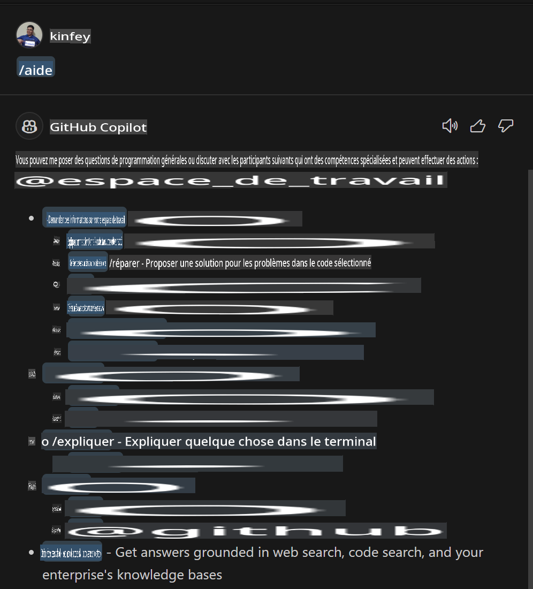
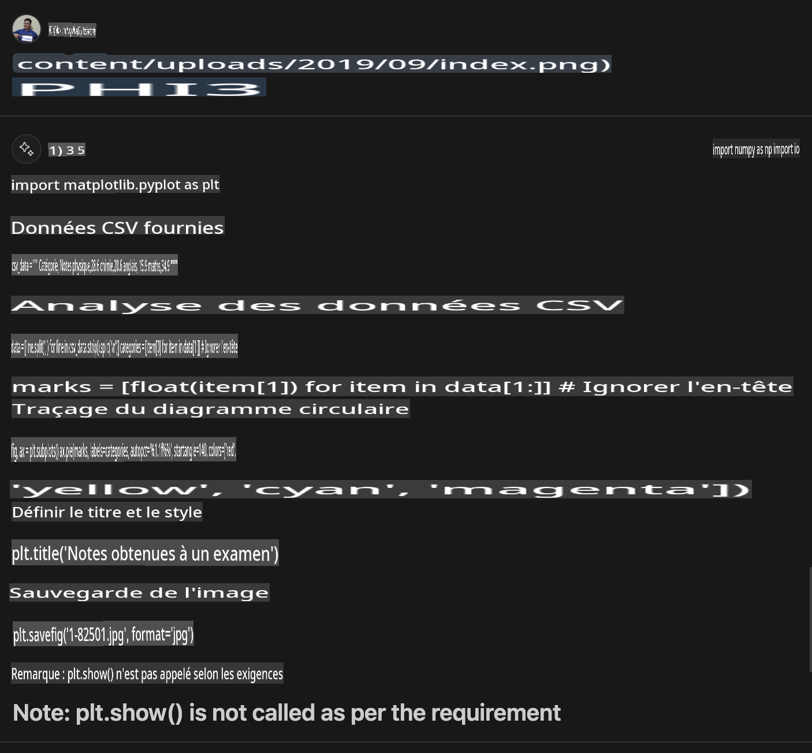

# **Lab 3 - Créer un agent @PHI3 dans GitHub Copilot Chat**

Dans Visual Studio Code Copilot Chat, vous pouvez gérer l'ensemble du projet via @workspace. Pour les scénarios d'entreprise, nous pouvons également personnaliser l'Agent de Copilot Chat de manière plus flexible.

Dans le dernier Lab, nous avons combiné NPU et cloud pour compléter une Extension Visual Studio Code pour l'Agent Phi3.



### **1. Créer une Extension de Développement VSCode**

Veuillez consulter ce lien [https://code.visualstudio.com/api/get-started/your-first-extension](https://code.visualstudio.com/api/get-started/your-first-extension) pour créer un projet d'Extension.

***NOTE:*** Veuillez utiliser Typescript, WebPack comme solution technique pour ce projet.

### **2. Ajouter vscode.d.ts**

L'API de Visual Studio Code Chat n'a pas encore été intégrée à l'API de code, mais est maintenant ajoutée via des extensions.

Téléchargez vscode.d.ts [https://github.com/microsoft/vscode/blob/main/src/vscode-dts/vscode.d.ts](https://github.com/microsoft/vscode/blob/main/src/vscode-dts/vscode.d.ts)

***NOTE:*** Veuillez l'exécuter dans Visual Studio Code Insiders 1.90+.

### **3. Mettre à jour package.json**

```json

{
  "name": "phi3ext",
  "displayName": "phi3ext",
  "description": "",
  "version": "0.0.1",
  "engines": {
    "vscode": "^1.90.0"
  },
  "categories": [
      "AI",
      "Chat"
  ],
  "activationEvents": [],
  "enabledApiProposals": [
      "chatVariableResolver"
  ],
  "main": "./dist/extension.js",
  "contributes": {
      "chatParticipants": [
          {
              "id": "chat.PHI3",
              "name": "PHI3",
              "description": "Hey! I am PHI3",
              "isSticky": true,
              "commands": [
                  {
                      "name": "gen",
                      "description": "I am PHI3, you can gen code with me"
                  },
                  {
                      "name": "img",
                      "description": "I am PHI3-vision, you can gen code from img with me"
                  }
              ]
          }
      ],
      "commands": [
          {
              "command": "PHI3.namesInEditor",
              "title": "Use PHI3 in Editor"
          }
      ]
  },  
  "scripts": {
    "vscode:prepublish": "npm run package",
    "compile": "webpack",
    "watch": "webpack --watch",
    "package": "webpack --mode production --devtool hidden-source-map",
    "compile-tests": "tsc -p . --outDir out",
    "watch-tests": "tsc -p . -w --outDir out",
    "pretest": "npm run compile-tests && npm run compile && npm run lint",
    "lint": "eslint src --ext ts",
    "test": "vscode-test"
  },
  "devDependencies": {
    "@types/vscode": "^1.90.0",
    "@types/mocha": "^10.0.6",
    "@types/node": "18.x",
    "@typescript-eslint/eslint-plugin": "^7.11.0",
    "@typescript-eslint/parser": "^7.11.0",
    "eslint": "^8.57.0",
    "typescript": "^5.4.5",
    "ts-loader": "^9.5.1",
    "webpack": "^5.91.0",
    "webpack-cli": "^5.1.4",
    "@vscode/test-cli": "^0.0.9",
    "@vscode/test-electron": "^2.4.0"
  },
  "dependencies": {
    "@types/node-fetch": "^2.6.11",
    "node-fetch": "^3.3.2"
  }
}

```

Vous pouvez exécuter **npm install** dans le terminal et déboguer votre extension pour tester.

***Télécharger le Code Exemple*** [Cliquez ici](../../../../../../../code/07.Lab/01/AIPC)

### **4. Modifier src/extension.ts**

```ts

// The module 'vscode' contains the VS Code extensibility API
// Import the module and reference it with the alias vscode in your code below
import * as vscode from 'vscode';


interface IPHI3ChatResult extends vscode.ChatResult {
    metadata: {
        command: string;
    }
}


// This method is called when your extension is activated
// Your extension is activated the very first time the command is executed
export function activate(extcontext: vscode.ExtensionContext) {


	// Define a SHEIN chat handler. 
	const phi3handler: vscode.ChatRequestHandler = async (request: vscode.ChatRequest, context: vscode.ChatContext, stream: vscode.ChatResponseStream, token: vscode.CancellationToken): Promise<IPHI3ChatResult> => {

		if (request.command == 'gen') {

			const content = "Welcome to Phi-3 to gen code";

			

			const result = await gen(request.prompt);

			const code = result;
			
			
			stream.progress("```txt"+"\n"+code+ +"\n"+"```")


            return { metadata: { command: 'gen' } };

		}
		if (request.command == 'img') {

			const content = "Welcome to Phi-3 vision to gen code in image";

			const prompt = request.prompt;

			if(prompt.indexOf("(IMG_URL:")>-1){

				const img_url = prompt.split("(IMG_URL:")[1].split(")")[0];
				const question = prompt.split("(IMG_URL:")[0];
				const tmp = question;

				const result = await genImage(question,img_url);
	
				const code = result;
				
				
				stream.progress(code)
	
	
				return { metadata: { command: 'img' } };
			}
			else
			{
				var result = "```txt"+"\n\n"+"Veuillez poser une question comme ceci Votre question (IMG_URL:https://example.com/image.jpg)"+"\n\n"++"```";
				stream.progress(result);

			}


            return { metadata: { command: 'img' } };

		}


		return { metadata: { command: '' } };

	}


	const xp = vscode.chat.createChatParticipant("chat.PHI3", phi3handler);

	xp.iconPath = new vscode.ThemeIcon('sparkle');


    xp.followupProvider = {
        provideFollowups(result: IPHI3ChatResult, context: vscode.ChatContext, token: vscode.CancellationToken) {
            return [{
                prompt: 'let us code with Phi-3 Family',
                label: vscode.l10n.t('Dev with Phi-3 Family'),
                command: 'help'
            } satisfies vscode.ChatFollowup];
        }
    };

	extcontext.subscriptions.push(xp);
}


interface GenCode {
	question: string;
}

interface ImgGenCodeResponse {
	output: string;
}


interface GenCodeResponse {
	answer: string;
}

async function gen(prompt: string) {

	const postData: GenCode = {
		question: prompt
	};
	const response = await fetch('http://localhost:8080/score', {
		method: 'POST',
		body: JSON.stringify(postData),
		headers: { 'Content-Type': 'application/json' }
	});
	const post = await response.json();
	const resultResponse = post as GenCodeResponse;
	return resultResponse.answer;
}

async function genImage(prompt: string, img_url: string) {

	const response = await fetch('Your Phi-3-Vision Endpoint', {
		method: 'POST',
		body: JSON.stringify({
			"input_data":{
			  "input_string":[
				{
				  "role":"user",
				  "content":[ 
					{
					  "type": "text",
					  "text": prompt
					},
					{
						"type": "image_url",
						"image_url": {
						  "url": img_url
						}
					}
				  ]
				}
			  ],
			  "parameters":{
					"temperature": 0.6,
					"top_p": 0.9,
					"do_sample": false,
					"max_new_tokens": 2048
			  }
			}
		}),
		headers: { 'Content-Type': 'application/json', 'Authorization' : 'Bearer Your Phi-3-Vision Endpoint Key', 'azureml-model-deployment': 'Your Phi-3-Vision Deployment name' }
	});
	const post = await response.json();
	const resultResponse = post as ImgGenCodeResponse;
	return resultResponse.output;
}

// This method is called when your extension is deactivated
export function deactivate() {}


```

Félicitations ! Vous avez terminé tous les labs. J'espère que cela vous aidera à comprendre la Famille Phi-3 et comment utiliser GitHub Copilot Chat.

Vous pouvez essayer ***@PHI3 /gen***


Vous pouvez essayer ***@PHI3 /img***



**Avertissement** :  
Ce document a été traduit en utilisant des services de traduction automatisée par intelligence artificielle. Bien que nous nous efforcions d'assurer l'exactitude, veuillez noter que les traductions automatisées peuvent contenir des erreurs ou des inexactitudes. Le document original dans sa langue d'origine doit être considéré comme la source faisant autorité. Pour des informations cruciales, il est recommandé de faire appel à une traduction humaine professionnelle. Nous ne sommes pas responsables des malentendus ou des interprétations erronées résultant de l'utilisation de cette traduction.