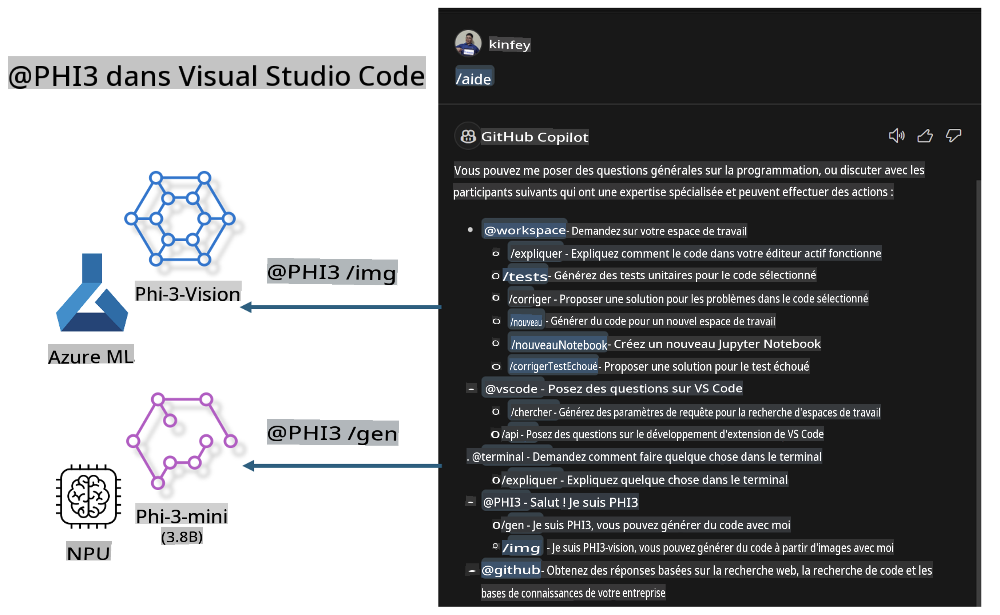

# **Construisez votre propre Chat GitHub Copilot pour Visual Studio Code avec la famille Microsoft Phi-3**

Avez-vous utilisé l'agent de l'espace de travail dans GitHub Copilot Chat ? Souhaitez-vous créer l'agent de code de votre propre équipe ? Ce laboratoire pratique vise à combiner le modèle open source pour construire un agent de code d'entreprise.

## **Fondation**

### **Pourquoi choisir Microsoft Phi-3**

Phi-3 est une série familiale, incluant phi-3-mini, phi-3-small et phi-3-medium, basée sur différents paramètres d'entraînement pour la génération de texte, la complétion de dialogue et la génération de code. Il y a aussi phi-3-vision basé sur Vision. Il est adapté aux entreprises ou aux différentes équipes pour créer des solutions d'IA génératives hors ligne.

Il est recommandé de lire ce lien [https://github.com/microsoft/Phi-3CookBook/blob/main/md/01.Introduce/Phi3Family.md](https://github.com/microsoft/Phi-3CookBook/blob/main/md/01.Introduce/Phi3Family.md)

### **Microsoft GitHub Copilot Chat**

L'extension GitHub Copilot Chat vous offre une interface de chat qui vous permet d'interagir avec GitHub Copilot et de recevoir des réponses à des questions liées au codage directement dans VS Code, sans avoir besoin de naviguer dans la documentation ou de chercher sur des forums en ligne.

Copilot Chat peut utiliser la coloration syntaxique, l'indentation et d'autres fonctionnalités de formatage pour ajouter de la clarté à la réponse générée. Selon le type de question de l'utilisateur, le résultat peut contenir des liens vers le contexte que Copilot a utilisé pour générer une réponse, comme des fichiers de code source ou de la documentation, ou des boutons pour accéder aux fonctionnalités de VS Code.

- Copilot Chat s'intègre dans votre flux de développement et vous assiste là où vous en avez besoin :

- Commencez une conversation de chat en ligne directement depuis l'éditeur ou le terminal pour obtenir de l'aide pendant que vous codez

- Utilisez la vue Chat pour avoir un assistant IA à vos côtés à tout moment

- Lancez Quick Chat pour poser une question rapide et revenir à ce que vous faisiez

Vous pouvez utiliser GitHub Copilot Chat dans divers scénarios, tels que :

- Répondre à des questions de codage sur la meilleure façon de résoudre un problème

- Expliquer le code de quelqu'un d'autre et suggérer des améliorations

- Proposer des corrections de code

- Générer des cas de test unitaires

- Générer de la documentation de code

Il est recommandé de lire ce lien [https://code.visualstudio.com/docs/copilot/copilot-chat](https://code.visualstudio.com/docs/copilot/copilot-chat?WT.mc_id=aiml-137032-kinfeylo)

### **Microsoft GitHub Copilot Chat @workspace**

Faire référence à **@workspace** dans Copilot Chat vous permet de poser des questions sur l'ensemble de votre base de code. En fonction de la question, Copilot récupère intelligemment les fichiers et symboles pertinents, qu'il référence ensuite dans sa réponse sous forme de liens et d'exemples de code.

Pour répondre à votre question, **@workspace** recherche dans les mêmes sources qu'un développeur utiliserait en naviguant dans une base de code dans VS Code :

- Tous les fichiers dans l'espace de travail, sauf ceux ignorés par un fichier .gitignore

- Structure de répertoires avec dossiers imbriqués et noms de fichiers

- L'index de recherche de code de GitHub, si l'espace de travail est un dépôt GitHub et indexé par la recherche de code

- Symboles et définitions dans l'espace de travail

- Texte actuellement sélectionné ou visible dans l'éditeur actif

Note : .gitignore est contourné si vous avez un fichier ouvert ou du texte sélectionné dans un fichier ignoré.

Il est recommandé de lire ce lien [[https://code.visualstudio.com/docs/copilot/copilot-chat](https://code.visualstudio.com/docs/copilot/workspace-context?WT.mc_id=aiml-137032-kinfeylo)]

## **En savoir plus sur ce Lab**

GitHub Copilot a grandement amélioré l'efficacité de la programmation des entreprises, et chaque entreprise espère personnaliser les fonctions pertinentes de GitHub Copilot. De nombreuses entreprises ont personnalisé des Extensions similaires à GitHub Copilot en fonction de leurs propres scénarios commerciaux et modèles open source. Pour les entreprises, les Extensions personnalisées sont plus faciles à contrôler, mais cela affecte également l'expérience utilisateur. Après tout, GitHub Copilot a des fonctions plus puissantes pour traiter des scénarios généraux et professionnels. Si l'expérience peut rester cohérente, il serait préférable de personnaliser l'Extension propre à l'entreprise. GitHub Copilot Chat fournit des API pertinentes pour que les entreprises puissent étendre l'expérience de Chat. Maintenir une expérience cohérente et avoir des fonctions personnalisées est une meilleure expérience utilisateur.

Ce laboratoire utilise principalement le modèle Phi-3 combiné avec le NPU local et Azure hybride pour créer un Agent personnalisé dans GitHub Copilot Chat ***@PHI3*** pour aider les développeurs d'entreprise à compléter la génération de code ***(@PHI3 /gen)*** et générer du code basé sur des images ***(@PHI3 /img)***.

### ***Remarque :***

Ce laboratoire est actuellement mis en œuvre dans l'AIPC du CPU Intel et Apple Silicon. Nous continuerons à mettre à jour la version Qualcomm du NPU.

## **Lab**

| Nom | Description | AIPC | Apple |
| ------------ | ----------- | -------- |-------- |
| Lab0 - Installations(✅) | Configurer et installer les environnements et outils d'installation associés | [Go](./HOL/AIPC/01.Installations.md) |[Go](./HOL/Apple/01.Installations.md) |
| Lab1 - Exécuter Prompt flow avec Phi-3-mini (✅) | Combiné avec AIPC / Apple Silicon, utiliser le NPU local pour créer la génération de code via Phi-3-mini | [Go](./HOL/AIPC/02.PromptflowWithNPU.md) |  [Go](./HOL/Apple/02.PromptflowWithMLX.md) |
| Lab2 - Déployer Phi-3-vision sur Azure Machine Learning Service(✅) | Générer du code en déployant l'image Phi-3-vision du catalogue de modèles d'Azure Machine Learning Service | [Go](./HOL/AIPC/03.DeployPhi3VisionOnAzure.md) |[Go](./HOL/Apple/03.DeployPhi3VisionOnAzure.md) |
| Lab3 - Créer un agent @phi-3 dans GitHub Copilot Chat(✅)  | Créer un agent Phi-3 personnalisé dans GitHub Copilot Chat pour compléter la génération de code, la génération de code graphique, RAG, etc. | [Go](./HOL/AIPC/04.CreatePhi3AgentInVSCode.md) | [Go](./HOL/Apple/04.CreatePhi3AgentInVSCode.md) |
| Code Exemple (✅)  | Télécharger le code exemple | [Go](../../../../../code/07.Lab/01/AIPC) | [Go](../../../../../code/07.Lab/01/Apple) |

## **Ressources**

1. Phi-3 Cookbook [https://github.com/microsoft/Phi-3CookBook](https://github.com/microsoft/Phi-3CookBook)

2. En savoir plus sur GitHub Copilot [https://learn.microsoft.com/training/paths/copilot/](https://learn.microsoft.com/training/paths/copilot/?WT.mc_id=aiml-137032-kinfeylo)

3. En savoir plus sur GitHub Copilot Chat [https://learn.microsoft.com/training/paths/accelerate-app-development-using-github-copilot/](https://learn.microsoft.com/training/paths/accelerate-app-development-using-github-copilot/?WT.mc_id=aiml-137032-kinfeylo)

4. En savoir plus sur l'API GitHub Copilot Chat [https://code.visualstudio.com/api/extension-guides/chat](https://code.visualstudio.com/api/extension-guides/chat?WT.mc_id=aiml-137032-kinfeylo)

5. En savoir plus sur Azure AI Studio [https://learn.microsoft.com/training/paths/create-custom-copilots-ai-studio/](https://learn.microsoft.com/training/paths/create-custom-copilots-ai-studio/?WT.mc_id=aiml-137032-kinfeylo)

6. En savoir plus sur le catalogue de modèles d'Azure AI Studio [https://learn.microsoft.com/azure/ai-studio/how-to/model-catalog-overview](https://learn.microsoft.com/azure/ai-studio/how-to/model-catalog-overview)

Avertissement : La traduction a été réalisée à partir de l'original par un modèle d'IA et peut ne pas être parfaite. Veuillez examiner le résultat et apporter les corrections nécessaires.