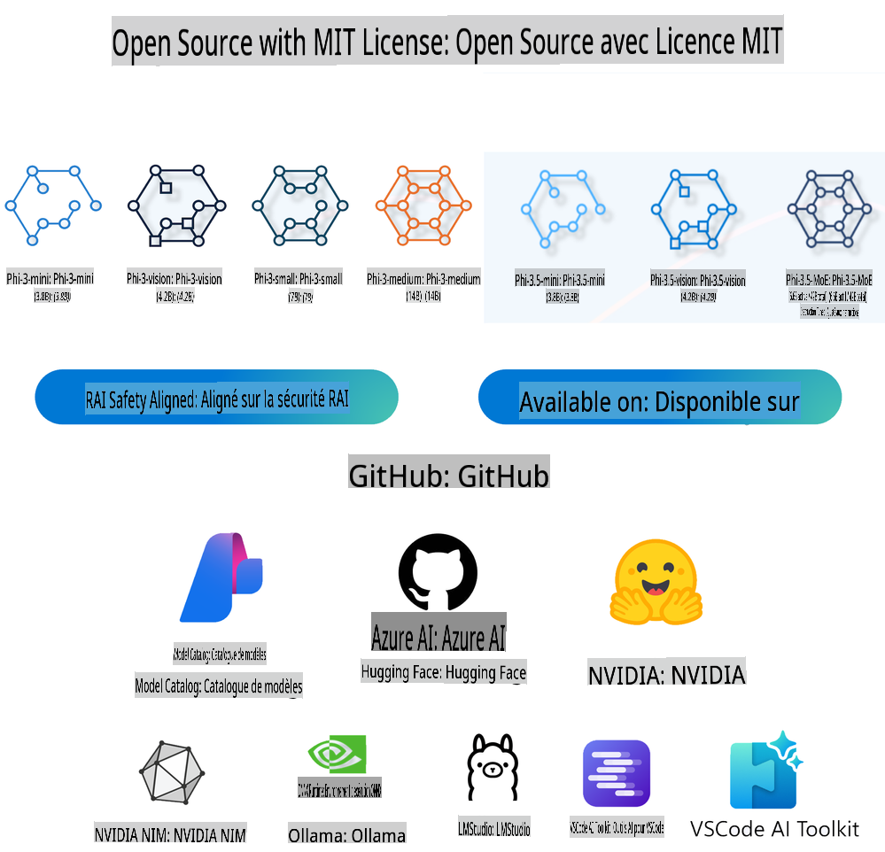
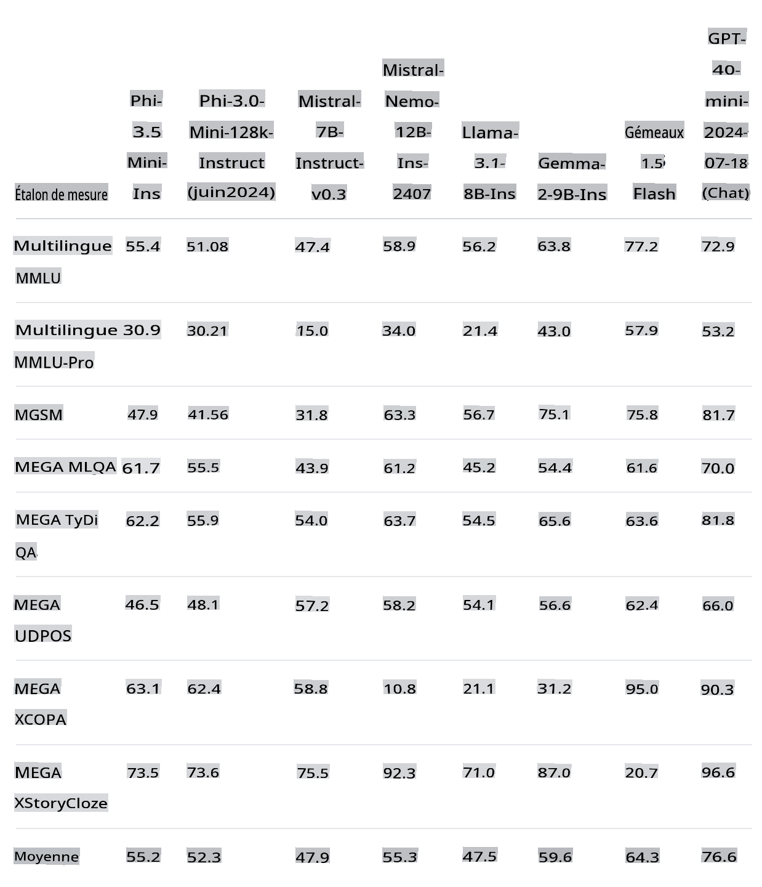
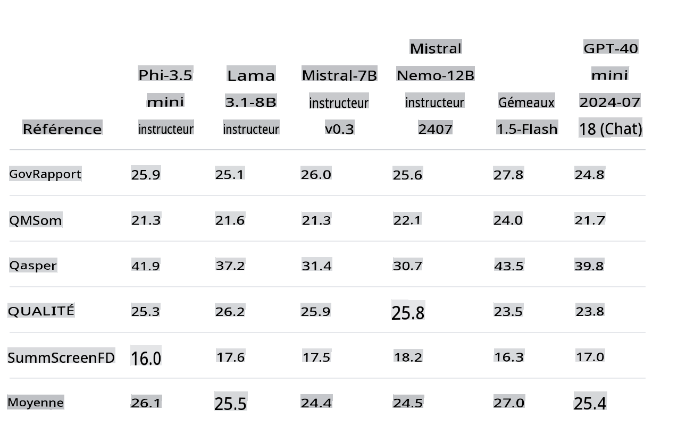
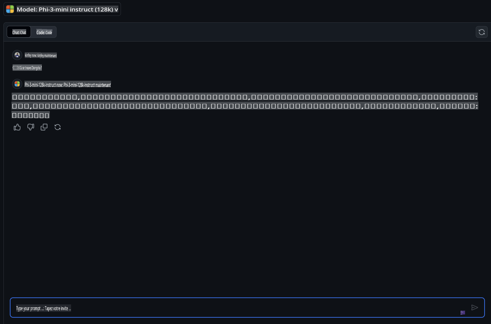
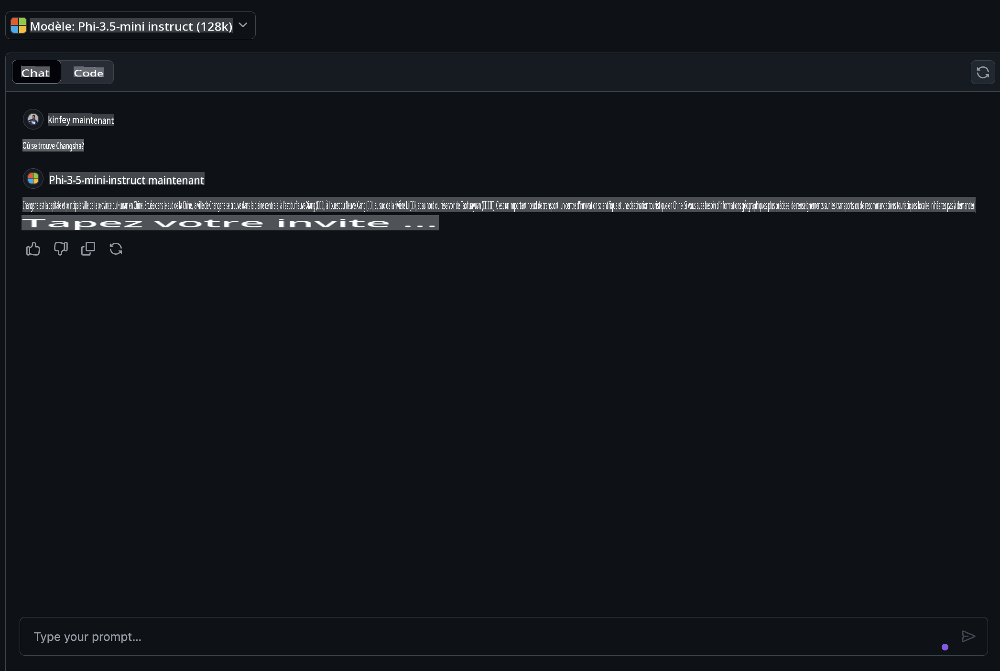
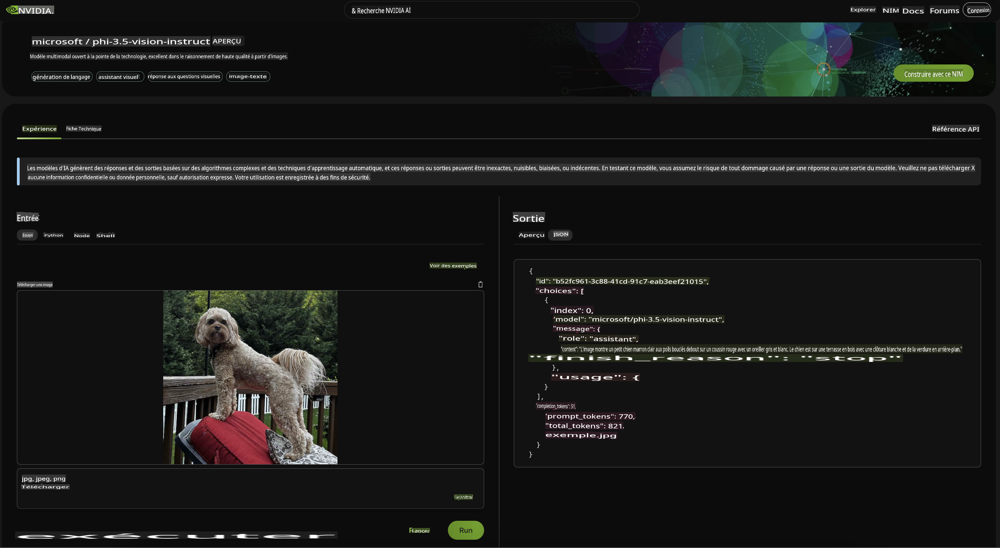
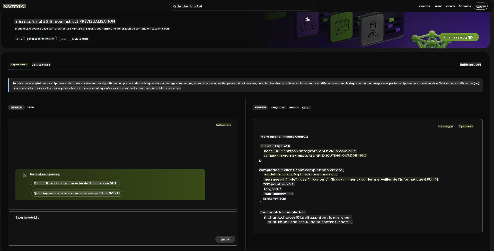

# **Quoi de neuf dans la famille Phi-3.5**

Utilisez-vous déjà la famille Phi-3 ? Quels sont vos scénarios ? Le 20 août 2024, Microsoft a lancé la nouvelle famille Phi-3.5, qui a été améliorée en multilingue, vision et Agent IA. Faisons une introduction plus détaillée en nous basant sur la Model Card sur Hugging Face.

## **Phi-3.5-mini-instruct**

Phi-3.5-mini est un modèle léger et à la pointe de la technologie, construit à partir de jeux de données utilisés pour Phi-3 - données synthétiques et sites web publics filtrés - avec un accent sur des données de très haute qualité et riches en raisonnement. Le modèle appartient à la famille des modèles Phi-3 et prend en charge une longueur de contexte de 128K tokens. Le modèle a subi un processus d'amélioration rigoureux, intégrant à la fois un ajustement supervisé, une optimisation de la politique proximale et une optimisation des préférences directes pour garantir une adhésion précise aux instructions et des mesures de sécurité robustes.

À travers les indicateurs du Benchmark, vous pouvez voir que Phi-3.5-mini a amélioré le support pour plusieurs langues et contenus textuels longs par rapport à Phi-3-mini, ce qui est utilisé pour améliorer les capacités linguistiques et textuelles de Phi-3.5 mini dans les applications en périphérie.

Nous pouvons comparer la capacité de connaissance en chinois via les modèles GitHub. Lorsque nous demandons "Où se trouve Changsha?" (长沙在哪里?), nous pouvons comparer les résultats de Phi-3-mini-128k-instruct et Phi-3.5-mini-128k-instruct.

Il n'est pas difficile de voir que l'amélioration des données sur le corpus chinois permet à Phi-3.5-mini d'obtenir de meilleurs résultats dans les scénarios de génération de texte de base (***Note:*** Veuillez noter que si Phi-3.5-mini nécessite une réponse plus précise, il est recommandé de l'affiner en fonction du scénario d'application).

## **Phi-3.5-vision-instruct**

Phi-3.5-vision est un modèle multimodal léger et à la pointe de la technologie, construit à partir de jeux de données comprenant des données synthétiques et des sites web publics filtrés, avec un accent sur des données de très haute qualité et riches en raisonnement, tant en texte qu'en vision. Le modèle appartient à la famille des modèles Phi-3, et la version multimodale prend en charge une longueur de contexte de 128K tokens. Le modèle a subi un processus d'amélioration rigoureux, intégrant à la fois un ajustement supervisé et une optimisation des préférences directes pour garantir une adhésion précise aux instructions et des mesures de sécurité robustes.

Grâce à Vision, nous avons ouvert les yeux de la famille Phi-3.x et avons pu compléter les scénarios suivants :

1. Environnements à mémoire/puissance de calcul limitée
2. Scénarios liés à la latence
3. Compréhension générale des images
4. Reconnaissance optique de caractères
5. Compréhension des graphiques et des tableaux
6. Comparaison de multiples images
7. Résumé de plusieurs images ou clips vidéo

Grâce à Vision, nous avons permis à la famille Phi d'ouvrir les yeux et de compléter les scénarios suivants.

Nous pouvons également utiliser le benchmark fourni par Hugging Face pour comprendre la comparaison dans différents scénarios visuels.

Si vous souhaitez essayer gratuitement Phi-3.5-vision-instruct, nous pouvons utiliser [Nivida NIM](https://build.nvidia.com/microsoft/phi-3_5-vision-instruct) pour compléter l'expérience.

Bien sûr, vous pouvez également compléter le déploiement via Azure AI Studio.

## **Phi-3.5-MoE-instruct**

Phi-3.5-MoE est un modèle léger et à la pointe de la technologie, construit à partir de jeux de données utilisés pour Phi-3 - données synthétiques et documents publics filtrés - avec un accent sur des données de très haute qualité et riches en raisonnement. Le modèle prend en charge le multilingue et dispose d'une longueur de contexte de 128K tokens. Le modèle a subi un processus d'amélioration rigoureux, intégrant un ajustement supervisé, une optimisation de la politique proximale et une optimisation des préférences directes pour garantir une adhésion précise aux instructions et des mesures de sécurité robustes.

Avec le développement de l'Agent IA, la demande pour les modèles MoE augmentera progressivement. MoE, dont le nom complet est Mixed Expert Models, est un nouveau modèle formé en mélangeant plusieurs modèles experts. MOE consiste à diviser d'abord le gros problème, puis à résoudre les petits problèmes un par un, puis à résumer les conclusions. Deuxièmement, l'échelle du modèle est l'un des facteurs clés pour améliorer les performances du modèle. Avec des ressources informatiques limitées, il est souvent préférable de former un modèle plus grand avec moins d'étapes de formation que de former un modèle plus petit avec plus d'étapes.

Le modèle Phi-3.5-MoE-Instruct nécessite plus de puissance de calcul que Phi-3.5-Vision et Phi-3.5-Instruct. Il est recommandé d'utiliser des méthodes basées sur le cloud telles que Azure AI Studio et Nvidia NIM pour l'expérience et l'utilisation.

### **🤖 Exemples pour Phi-3.5 avec Apple MLX**

| Labs    | Présentation | Aller |
| -------- | ------- |  ------- |
| 🚀 Lab-Présentation Phi-3.5 Instruct  | Apprenez à utiliser Phi-3.5 Instruct |  [Aller](../../../../../code/09.UpdateSamples/Aug/phi3-instruct-demo.ipynb)    |
| 🚀 Lab-Présentation Phi-3.5 Vision (image) | Apprenez à utiliser Phi-3.5 Vision pour analyser une image |  [Aller](../../../../../code/09.UpdateSamples/Aug/phi3-vision-demo.ipynb)    |
| 🚀 Lab-Présentation Phi-3.5 MoE   | Apprenez à utiliser Phi-3.5 Vision pour analyser une image |  [Aller](../../../../../code/09.UpdateSamples/Aug/phi3_moe_demo.ipynb)    |

## **Ressources**

1. Phi Family de Hugging Face [https://huggingface.co/collections/microsoft/phi-3-6626e15e9585a200d2d761e3](https://huggingface.co/collections/microsoft/phi-3-6626e15e9585a200d2d761e3)

2. À propos des modèles GitHub [https://gh.io/models](https://gh.io/models)

3. À propos d'Azure AI Studio [https://ai.azure.com/](https://ai.azure.com/)

4. À propos de Nvidia NIM [https://build.nvidia.com/explore/discover](https://build.nvidia.com/explore/discover)

Avertissement : La traduction a été réalisée à partir de l'original par un modèle d'IA et peut ne pas être parfaite. 
Veuillez vérifier le résultat et apporter les corrections nécessaires.