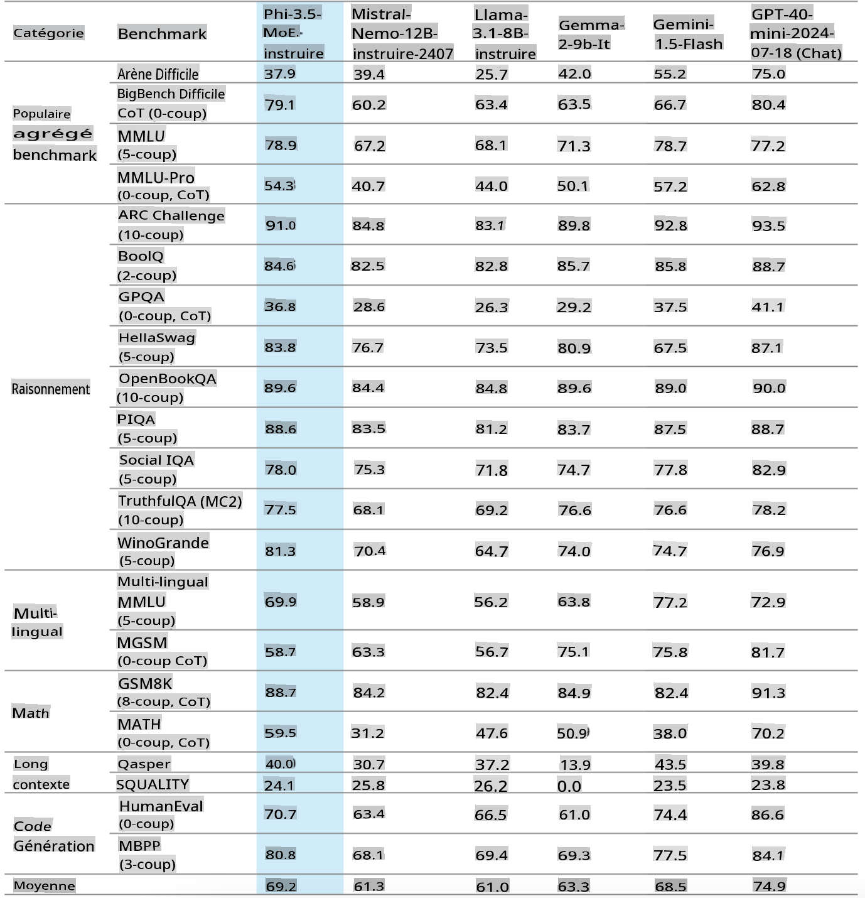
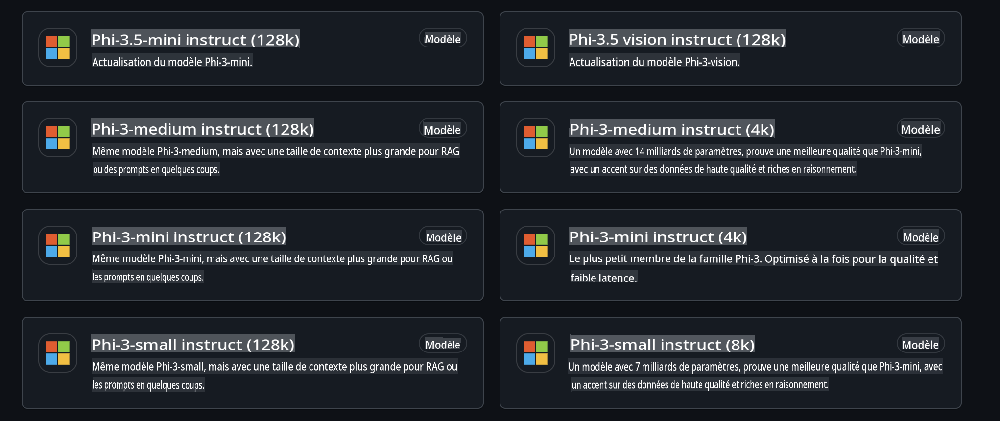
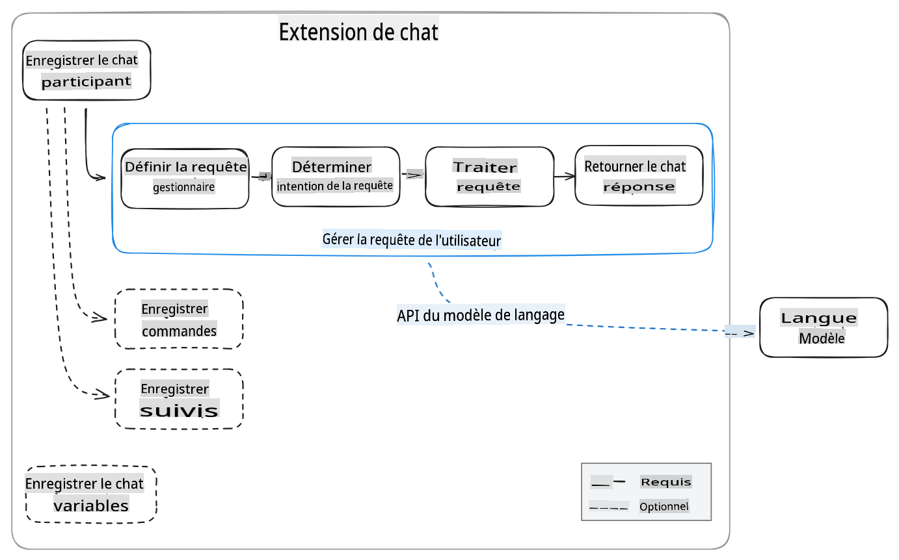
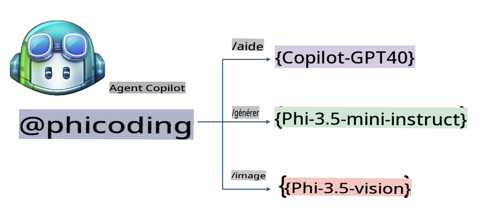
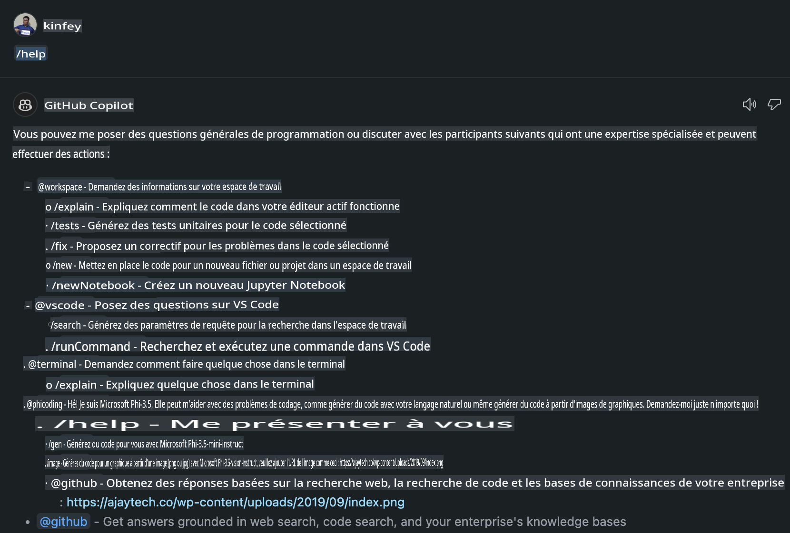
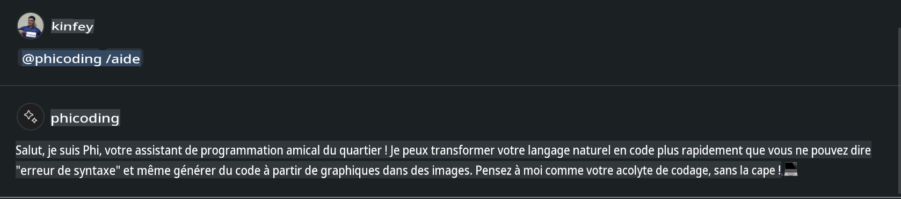
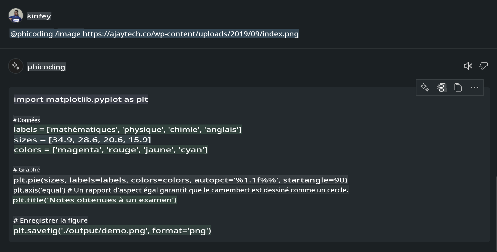

# **Créez votre propre agent Visual Studio Code Chat Copilot avec Phi-3.5 par GitHub Models**

Utilisez-vous Visual Studio Code Copilot ? Surtout dans le Chat, vous pouvez utiliser différents agents pour améliorer la capacité à créer, écrire et maintenir des projets dans Visual Studio Code. Visual Studio Code fournit une API qui permet aux entreprises et aux particuliers de créer différents agents basés sur leur activité pour étendre leurs capacités dans différents domaines propriétaires. Dans cet article, nous nous concentrerons sur **Phi-3.5-mini-instruct (128k)** et **Phi-3.5-vision-instruct (128k)** de GitHub Models pour créer votre propre agent Visual Studio Code.

## **À propos de Phi-3.5 sur GitHub Models**

Nous savons que Phi-3/3.5-mini-instruct dans la famille Phi-3/3.5 a de fortes capacités de compréhension et de génération de code, et a des avantages par rapport à Gemma-2-9b et Mistral-Nemo-12B-instruct-2407.



Les derniers GitHub Models fournissent déjà un accès aux modèles Phi-3.5-mini-instruct (128k) et Phi-3.5-vision-instruct (128k). Les développeurs peuvent y accéder via l'OpenAI SDK, l'Azure AI Inference SDK et l'API REST.



***Note: *** Il est recommandé d'utiliser l'Azure AI Inference SDK ici, car il peut mieux se connecter avec le catalogue de modèles Azure dans l'environnement de production.

Voici les résultats de **Phi-3.5-mini-instruct (128k)** et **Phi-3.5-vision-instruct (128k)** dans le scénario de génération de code après l'intégration avec GitHub Models, et aussi préparer les exemples suivants.

**Démo : GitHub Models Phi-3.5-mini-instruct (128k) génère du code à partir d'un prompt** ([cliquez sur ce lien](../../../../../code/09.UpdateSamples/Aug/ghmodel_phi35_instruct_demo.ipynb))

**Démo : GitHub Models Phi-3.5-vision-instruct (128k) génère du code à partir d'une image** ([cliquez sur ce lien](../../../../../code/09.UpdateSamples/Aug/ghmodel_phi35_vision_demo.ipynb))


## **À propos de GitHub Copilot Chat Agent**

GitHub Copilot Chat Agent peut accomplir différentes tâches dans différents scénarios de projet basés sur le code. Le système dispose de quatre agents : workspace, github, terminal, vscode.


En ajoutant le nom de l'agent avec ‘@’, vous pouvez rapidement accomplir le travail correspondant. Pour les entreprises, si vous ajoutez votre propre contenu lié à l'entreprise comme les exigences, le codage, les spécifications de test et la publication, vous pouvez avoir des fonctions privées d'entreprise plus puissantes basées sur GitHub Copilot.

Visual Studio Code Chat Agent a maintenant officiellement publié son API, permettant aux entreprises ou aux développeurs d'entreprise de développer des agents basés sur différents écosystèmes logiciels. Basé sur la méthode de développement de l'extension Visual Studio Code, vous pouvez facilement accéder à l'interface de l'API Visual Studio Code Chat Agent. Nous pouvons développer en suivant ce processus.



Le scénario de développement peut prendre en charge l'accès aux API de modèles tiers (comme GitHub Models, Azure Model Catalog, et les services auto-hébergés basés sur des modèles open source) et peut également utiliser les modèles gpt-35-turbo, gpt-4, et gpt-4o fournis par GitHub Copilot.

## **Ajouter un Agent @phicoding basé sur Phi-3.5**

Nous essayons d'intégrer les capacités de programmation de Phi-3.5 pour accomplir l'écriture de code, la génération de code d'image et d'autres tâches. Complétez un Agent construit autour de Phi-3.5 - @PHI, voici quelques fonctions :

1. Générer une auto-introduction basée sur GPT-4o fourni par GitHub Copilot via la commande **@phicoding /help**

2. Générer du code pour différents langages de programmation basé sur **Phi-3.5-mini-instruct (128k)** via la commande **@phicoding /gen**

3. Générer du code basé sur **Phi-3.5-vision-instruct (128k)** et l'achèvement de l'image via la commande **@phicoding /image**



## **Étapes associées**

1. Installer le support de développement d'extension Visual Studio Code en utilisant npm

```bash

npm install --global yo generator-code 

```
2. Créer un plugin d'extension Visual Studio Code (en utilisant le mode de développement Typescript, nommé phiext)

```bash

yo code 

```

3. Ouvrir le projet créé et modifier package.json. Voici les instructions et configurations associées, ainsi que la configuration de GitHub Models. Notez que vous devez ajouter votre jeton GitHub Models ici.

```json

{
  "name": "phiext",
  "displayName": "phiext",
  "description": "",
  "version": "0.0.1",
  "engines": {
    "vscode": "^1.93.0"
  },
  "categories": [
    "AI",
    "Chat"
  ],
  "activationEvents": [],
  "enabledApiProposals": [
      "chatVariableResolver"
  ],
  "main": "./dist/extension.js",
  "contributes": {
    "chatParticipants": [
        {
            "id": "chat.phicoding",
            "name": "phicoding",
            "description": "Hey! I am Microsoft Phi-3.5, She can help me with coding problems, such as generation code with your natural language, or even generation code about chart from images. Just ask me anything!",
            "isSticky": true,
            "commands": [
                {
                    "name": "help",
                    "description": "Introduce myself to you"
                },
                {
                    "name": "gen",
                    "description": "Generate code for you with Microsoft Phi-3.5-mini-instruct"
                },
                {
                    "name": "image",
                    "description": "Generate code for chart from image(png or jpg) with Microsoft Phi-3.5-vision-instruct, please add image url like this : https://ajaytech.co/wp-content/uploads/2019/09/index.png"
                }
            ]
        }
    ],
    "commands": [
        {
            "command": "phicoding.namesInEditor",
            "title": "Use Microsoft Phi 3.5 in Editor"
        }
    ],
    "configuration": {
      "type": "object",
      "title": "githubmodels",
      "properties": {
        "githubmodels.endpoint": {
          "type": "string",
          "default": "https://models.inference.ai.azure.com",
          "description": "Your GitHub Models Endpoint",
          "order": 0
        },
        "githubmodels.api_key": {
          "type": "string",
          "default": "Your GitHub Models Token",
          "description": "Your GitHub Models Token",
          "order": 1
        },
        "githubmodels.phi35instruct": {
          "type": "string",
          "default": "Phi-3.5-mini-instruct",
          "description": "Your Phi-35-Instruct Model",
          "order": 2
        },
        "githubmodels.phi35vision": {
          "type": "string",
          "default": "Phi-3.5-vision-instruct",
          "description": "Your Phi-35-Vision Model",
          "order": 3
        }
      }
    }
  },
  "scripts": {
    "vscode:prepublish": "npm run package",
    "compile": "webpack",
    "watch": "webpack --watch",
    "package": "webpack --mode production --devtool hidden-source-map",
    "compile-tests": "tsc -p . --outDir out",
    "watch-tests": "tsc -p . -w --outDir out",
    "pretest": "npm run compile-tests && npm run compile && npm run lint",
    "lint": "eslint src",
    "test": "vscode-test"
  },
  "devDependencies": {
    "@types/vscode": "^1.93.0",
    "@types/mocha": "^10.0.7",
    "@types/node": "20.x",
    "@typescript-eslint/eslint-plugin": "^8.3.0",
    "@typescript-eslint/parser": "^8.3.0",
    "eslint": "^9.9.1",
    "typescript": "^5.5.4",
    "ts-loader": "^9.5.1",
    "webpack": "^5.94.0",
    "webpack-cli": "^5.1.4",
    "@vscode/test-cli": "^0.0.10",
    "@vscode/test-electron": "^2.4.1"
  },
  "dependencies": {
    "@types/node-fetch": "^2.6.11",
    "node-fetch": "^3.3.2",
    "@azure-rest/ai-inference": "latest",
    "@azure/core-auth": "latest",
    "@azure/core-sse": "latest"
  }
}


```

4. Modifier src/extension.ts

```typescript

// The module 'vscode' contains the VS Code extensibility API
// Import the module and reference it with the alias vscode in your code below
import * as vscode from 'vscode';
import ModelClient from "@azure-rest/ai-inference";
import { AzureKeyCredential } from "@azure/core-auth";


interface IPhiChatResult extends vscode.ChatResult {
    metadata: {
        command: string;
    };
}


const MODEL_SELECTOR: vscode.LanguageModelChatSelector = { vendor: 'copilot', family: 'gpt-4o' };

function isValidImageUrl(url: string): boolean {
    const regex = /^(https?:\/\/.*\.(?:png|jpg))$/i;
    return regex.test(url);
}
  

// This method is called when your extension is activated
// Your extension is activated the very first time the command is executed
export function activate(context: vscode.ExtensionContext) {

    const codinghandler: vscode.ChatRequestHandler = async (request: vscode.ChatRequest, context: vscode.ChatContext, stream: vscode.ChatResponseStream, token: vscode.CancellationToken): Promise<IPhiChatResult> => {


        const config : any = vscode.workspace.getConfiguration('githubmodels');
        const endPoint: string = config.get('endpoint');
        const apiKey: string = config.get('api_key');
        const phi35instruct: string = config.get('phi35instruct');
        const phi35vision: string = config.get('phi35vision');
        
        if (request.command === 'help') {

            const content = "Welcome to Coding assistant with Microsoft Phi-3.5"; 
            stream.progress(content);


            try {
                const [model] = await vscode.lm.selectChatModels(MODEL_SELECTOR);
                if (model) {
                    const messages = [
                        vscode.LanguageModelChatMessage.User("Please help me express this content in a humorous way: I am a programming assistant who can help you convert natural language into code and generate code based on the charts in the images. output format like this : Hey I am Phi ......")
                    ];
                    const chatResponse = await model.sendRequest(messages, {}, token);
                    for await (const fragment of chatResponse.text) {
                        stream.markdown(fragment);
                    }
                }
            } catch(err) {
                console.log(err);
            }


            return { metadata: { command: 'help' } };

        }

        
        if (request.command === 'gen') {

            const content = "Welcome to use phi-3.5 to generate code";

            stream.progress(content);

            const client = new ModelClient(endPoint, new AzureKeyCredential(apiKey));

            const response = await client.path("/chat/completions").post({
              body: {
                messages: [
                  { role:"system", content: "You are a coding assistant.Help answer all code generation questions." },
                  { role:"user", content: request.prompt }
                ],
                model: phi35instruct,
                temperature: 0.4,
                max_tokens: 1000,
                top_p: 1.
              }
            });

            stream.markdown(response.body.choices[0].message.content);

            return { metadata: { command: 'gen' } };

        }


        
        if (request.command === 'image') {


            const content = "Welcome to use phi-3.5 to generate code from image(png or jpg),image url like this:https://ajaytech.co/wp-content/uploads/2019/09/index.png";

            stream.progress(content);

            if (!isValidImageUrl(request.prompt)) {
                stream.markdown('Please provide a valid image URL');
                return { metadata: { command: 'image' } };
            }
            else
            {

                const client = new ModelClient(endPoint, new AzureKeyCredential(apiKey));
    
                const response = await client.path("/chat/completions").post({
                    body: {
                      messages: [
                        { role: "system", content: "You are a helpful assistant that describes images in details." },
                        { role: "user", content: [
                            { type: "text", text: "Please generate code according to the chart in the picture according to the following requirements\n1. Keep all information in the chart, including data and text\n2. Do not generate additional information that is not included in the chart\n3. Please extract data from the picture, do not generate it from csv\n4. Please save the regenerated chart as a chart and save it to ./output/demo.png"},
                            { type: "image_url", image_url: {url: request.prompt}
                            }
                          ]
                        }
                      ],
                      model: phi35vision,
                      temperature: 0.4,
                      max_tokens: 2048,
                      top_p: 1.
                    }
                  });
    
                
                stream.markdown(response.body.choices[0].message.content);
    
                return { metadata: { command: 'image' } };
            }


        }


        return { metadata: { command: '' } };
    };


    const phi_ext = vscode.chat.createChatParticipant("chat.phicoding", codinghandler);

    phi_ext.iconPath = new vscode.ThemeIcon('sparkle');


    phi_ext.followupProvider = {
        provideFollowups(result: IPhiChatResult, context: vscode.ChatContext, token: vscode.CancellationToken) {
            return [{
                prompt: 'Let us coding with Phi-3.5 😋😋😋😋',
                label: vscode.l10n.t('Enjoy coding with Phi-3.5'),
                command: 'help'
            } satisfies vscode.ChatFollowup];
        }
    };

    context.subscriptions.push(phi_ext);
}

// This method is called when your extension is deactivated
export function deactivate() {}


```

6. Exécution

***/help***



***@phicoding /help***



***@phicoding /gen***


***@phicoding /image***




Vous pouvez télécharger le code d'exemple : [cliquez ici](../../../../../code/09.UpdateSamples/Aug/vscode)

## **Ressources**

1. Inscrivez-vous sur GitHub Models [https://gh.io/models](https://gh.io/models)

2. Apprenez le développement d'extension Visual Studio Code [https://code.visualstudio.com/api/get-started/your-first-extension](https://code.visualstudio.com/api/get-started/your-first-extension)

3. Apprenez à connaître l'API Visual Studio Code Coilot Chat [https://code.visualstudio.com/api/extension-guides/chat](https://code.visualstudio.com/api/extension-guides/chat)

**Avertissement**:
Ce document a été traduit à l'aide de services de traduction automatique basés sur l'IA. Bien que nous nous efforcions d'assurer l'exactitude, veuillez noter que les traductions automatisées peuvent contenir des erreurs ou des inexactitudes. Le document original dans sa langue d'origine doit être considéré comme la source faisant autorité. Pour des informations critiques, il est recommandé de faire appel à une traduction humaine professionnelle. Nous ne sommes pas responsables des malentendus ou des interprétations erronées résultant de l'utilisation de cette traduction.