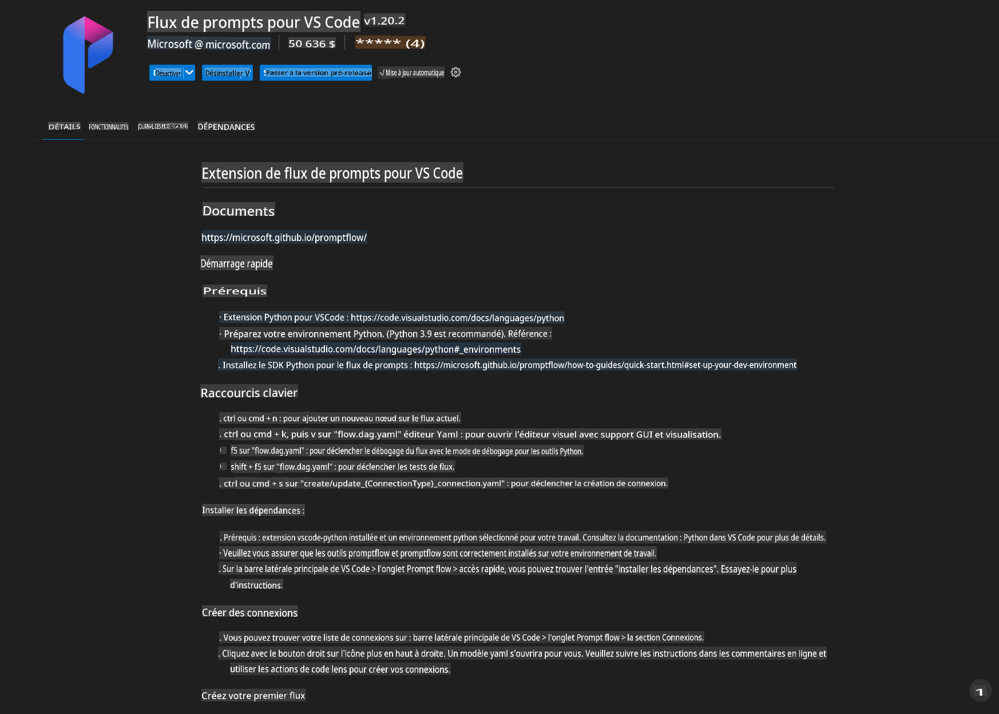
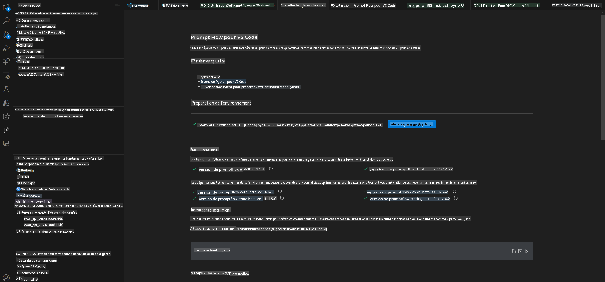
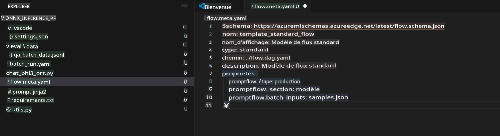
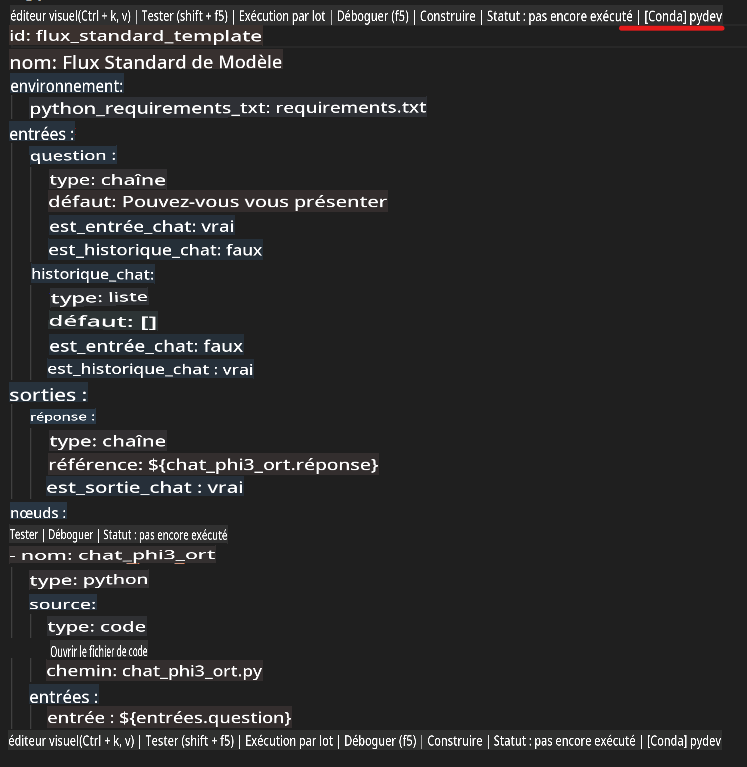
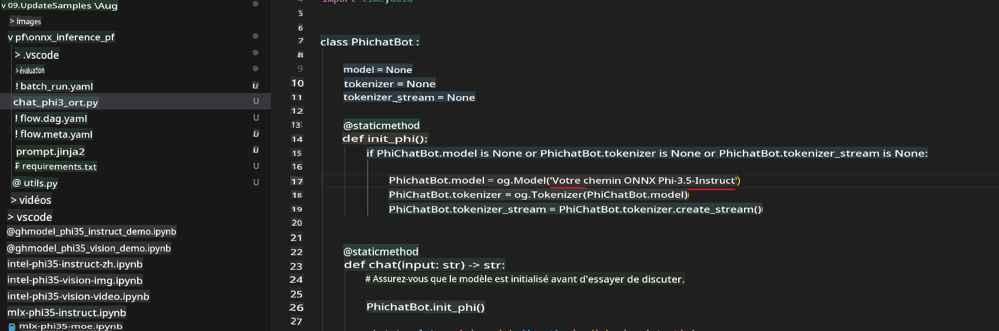
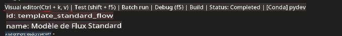
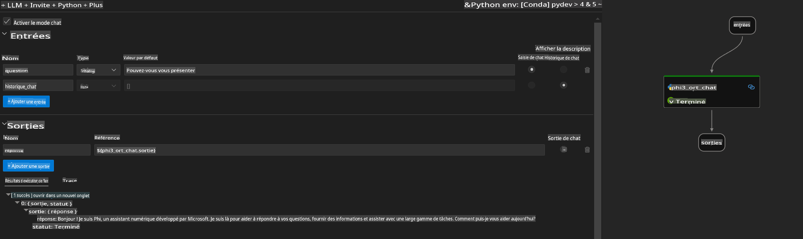
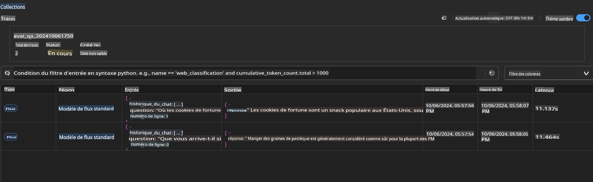

# Utilisation du GPU Windows pour créer une solution Prompt flow avec Phi-3.5-Instruct ONNX 

Le document suivant est un exemple de comment utiliser PromptFlow avec ONNX (Open Neural Network Exchange) pour développer des applications IA basées sur les modèles Phi-3.

PromptFlow est une suite d'outils de développement conçue pour rationaliser le cycle de développement complet des applications IA basées sur les LLM (Large Language Model), de l'idéation et du prototypage aux tests et à l'évaluation.

En intégrant PromptFlow avec ONNX, les développeurs peuvent :

- Optimiser les performances du modèle : Utilisez ONNX pour une inférence et un déploiement efficaces du modèle.
- Simplifier le développement : Utilisez PromptFlow pour gérer le flux de travail et automatiser les tâches répétitives.
- Améliorer la collaboration : Facilitez une meilleure collaboration entre les membres de l'équipe en fournissant un environnement de développement unifié.

**Prompt flow** est une suite d'outils de développement conçue pour rationaliser le cycle de développement complet des applications IA basées sur les LLM, de l'idéation, du prototypage, des tests, de l'évaluation au déploiement en production et à la surveillance. Il rend l'ingénierie des prompts beaucoup plus facile et vous permet de créer des applications LLM de qualité production.

Prompt flow peut se connecter à OpenAI, Azure OpenAI Service, et des modèles personnalisables (Huggingface, LLM/SLM locaux). Nous espérons déployer le modèle ONNX quantifié de Phi-3.5 dans des applications locales. Prompt flow peut nous aider à mieux planifier notre entreprise et à compléter des solutions locales basées sur Phi-3.5. Dans cet exemple, nous combinerons la bibliothèque ONNX Runtime GenAI pour compléter la solution Prompt flow basée sur le GPU Windows.

## **Installation**

### **ONNX Runtime GenAI pour GPU Windows**

Lisez cette directive pour configurer ONNX Runtime GenAI pour GPU Windows [cliquez ici](./041.ORTWindowGPUGuideline.md)

### **Configurer Prompt flow dans VSCode**

1. Installer l'extension VS Code Prompt flow



2. Après avoir installé l'extension VS Code Prompt flow, cliquez sur l'extension, et choisissez **Installation dependencies** suivez cette directive pour installer le SDK Prompt flow dans votre environnement



3. Téléchargez [Sample Code](../../../../../code/09.UpdateSamples/Aug/pf/onnx_inference_pf) et utilisez VS Code pour ouvrir cet exemple



4. Ouvrez **flow.dag.yaml** pour choisir votre environnement Python



   Ouvrez **chat_phi3_ort.py** pour changer l'emplacement de votre modèle Phi-3.5-instruct ONNX



5. Exécutez votre prompt flow pour tester

Ouvrez **flow.dag.yaml** cliquez sur l'éditeur visuel



après avoir cliqué dessus, et exécutez-le pour tester



6. Vous pouvez exécuter un batch dans le terminal pour vérifier plus de résultats


```bash

pf run create --file batch_run.yaml --stream --name 'Your eval qa name'    

```

Vous pouvez vérifier les résultats dans votre navigateur par défaut




**Avertissement** :
Ce document a été traduit à l'aide de services de traduction automatique basés sur l'IA. Bien que nous nous efforcions d'assurer l'exactitude, veuillez noter que les traductions automatisées peuvent contenir des erreurs ou des inexactitudes. Le document original dans sa langue d'origine doit être considéré comme la source faisant autorité. Pour des informations critiques, il est recommandé de recourir à une traduction humaine professionnelle. Nous ne sommes pas responsables des malentendus ou des interprétations erronées résultant de l'utilisation de cette traduction.