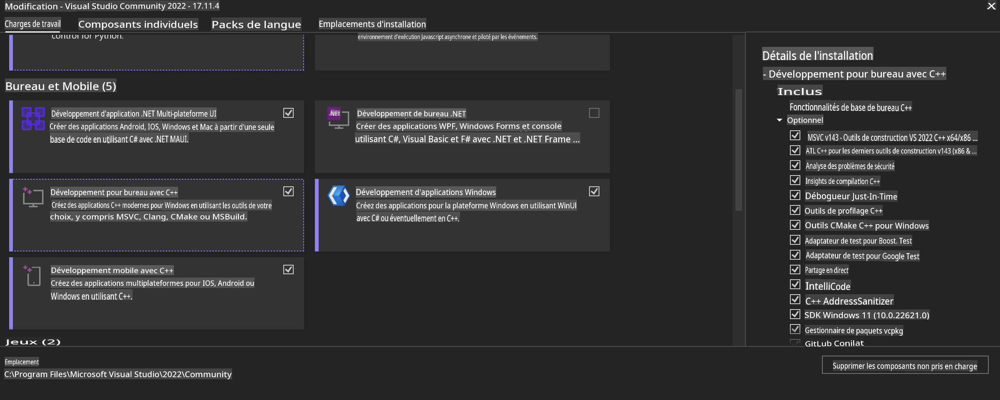
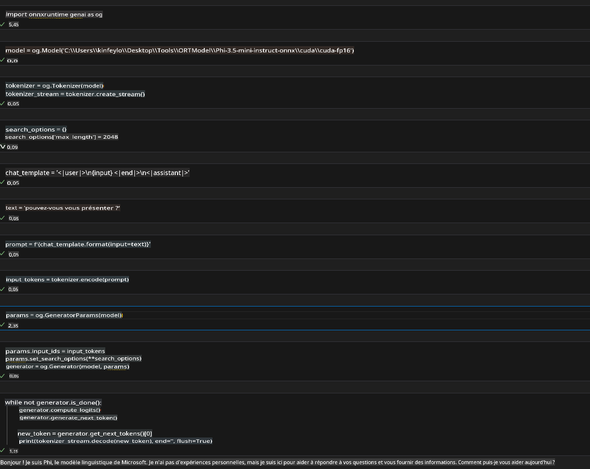
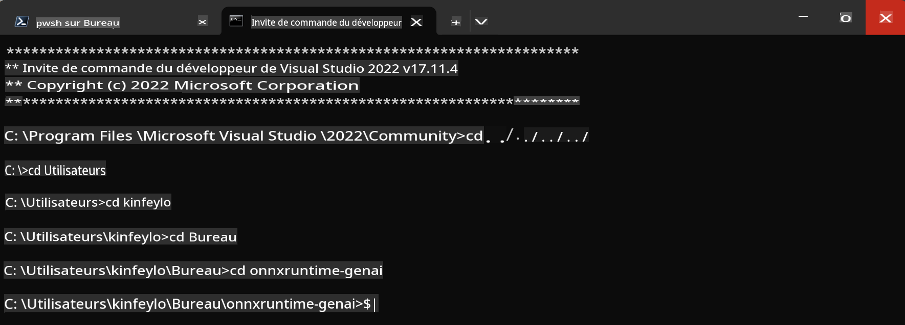

# **Guide pour OnnxRuntime GenAI Windows GPU**

Ce guide fournit les étapes pour configurer et utiliser ONNX Runtime (ORT) avec des GPU sur Windows. Il est conçu pour vous aider à tirer parti de l'accélération GPU pour vos modèles, améliorant ainsi les performances et l'efficacité.

Le document fournit des conseils sur :

- Configuration de l'environnement : Instructions pour installer les dépendances nécessaires comme CUDA, cuDNN et ONNX Runtime.
- Configuration : Comment configurer l'environnement et ONNX Runtime pour utiliser efficacement les ressources GPU.
- Conseils d'optimisation : Conseils pour peaufiner vos paramètres GPU pour des performances optimales.

### **1. Python 3.10.x /3.11.8**

   ***Note*** Il est suggéré d'utiliser [miniforge](https://github.com/conda-forge/miniforge/releases/latest/download/Miniforge3-Windows-x86_64.exe) comme environnement Python

   ```bash

   conda create -n pydev python==3.11.8

   conda activate pydev

   ```

   ***Rappel*** Si vous avez installé une bibliothèque ONNX pour Python, veuillez la désinstaller

### **2. Installer CMake avec winget**


   ```bash

   winget install -e --id Kitware.CMake

   ```

### **3. Installer Visual Studio 2022 - Développement Desktop avec C++**

   ***Note*** Si vous ne souhaitez pas compiler, vous pouvez passer cette étape




### **4. Installer le pilote NVIDIA**

1. **Pilote GPU NVIDIA**  [https://www.nvidia.com/en-us/drivers/](https://www.nvidia.com/en-us/drivers/)

2. **NVIDIA CUDA 12.4** [https://developer.nvidia.com/cuda-12-4-0-download-archive](https://developer.nvidia.com/cuda-12-4-0-download-archive)

3. **NVIDIA CUDNN 9.4**  [https://developer.nvidia.com/cudnn-downloads](https://developer.nvidia.com/cudnn-downloads)

***Rappel*** Veuillez utiliser les paramètres par défaut lors de l'installation

### **5. Configurer l'environnement NVIDIA**

Copiez les fichiers lib, bin, include de NVIDIA CUDNN 9.4 vers les dossiers lib, bin, include de NVIDIA CUDA 12.4

- copiez les fichiers de *'C:\Program Files\NVIDIA\CUDNN\v9.4\bin\12.6'* vers  *'C:\Program Files\NVIDIA GPU Computing Toolkit\CUDA\v12.4\bin*

- copiez les fichiers de *'C:\Program Files\NVIDIA\CUDNN\v9.4\include\12.6'* vers  *'C:\Program Files\NVIDIA GPU Computing Toolkit\CUDA\v12.4\include*

- copiez les fichiers de *'C:\Program Files\NVIDIA\CUDNN\v9.4\lib\12.6'* vers  *'C:\Program Files\NVIDIA GPU Computing Toolkit\CUDA\v12.4\lib\x64'*


### **6. Télécharger Phi-3.5-mini-instruct-onnx**


   ```bash

   winget install -e --id Git.Git

   winget install -e --id GitHub.GitLFS

   git lfs install

   git clone https://huggingface.co/microsoft/Phi-3.5-mini-instruct-onnx

   ```

### **7. Exécuter InferencePhi35Instruct.ipynb**

   Ouvrez [Notebook](../../../../../code/09.UpdateSamples/Aug/ortgpu-phi35-instruct.ipynb) et exécutez 





### **8. Compiler ORT GenAI GPU**


   ***Note*** 
   
   1. Veuillez désinstaller toutes les bibliothèques onnx, onnxruntime et onnxruntime-genai

   
   ```bash

   pip list 
   
   ```

   Ensuite, désinstallez toutes les bibliothèques onnxruntime, c'est-à-dire 


   ```bash

   pip uninstall onnxruntime

   pip uninstall onnxruntime-genai

   pip uninstall onnxruntume-genai-cuda
   
   ```

   2. Vérifiez le support de l'extension Visual Studio 

   Vérifiez C:\Program Files\NVIDIA GPU Computing Toolkit\CUDA\v12.4\extras pour vous assurer que C:\Program Files\NVIDIA GPU Computing Toolkit\CUDA\v12.4\extras\visual_studio_integration est trouvé. 
   
   Si ce n'est pas le cas, vérifiez les autres dossiers de pilotes du kit d'outils CUDA et copiez le dossier visual_studio_integration et son contenu vers C:\Program Files\NVIDIA GPU Computing Toolkit\CUDA\v12.4\extras\visual_studio_integration


   - Si vous ne souhaitez pas compiler, vous pouvez passer cette étape


   ```bash

   git clone https://github.com/microsoft/onnxruntime-genai

   ```

   - Téléchargez [https://github.com/microsoft/onnxruntime/releases/download/v1.19.2/onnxruntime-win-x64-gpu-1.19.2.zip](https://github.com/microsoft/onnxruntime/releases/download/v1.19.2/onnxruntime-win-x64-gpu-1.19.2.zip)

   - Décompressez onnxruntime-win-x64-gpu-1.19.2.zip, renommez-le en **ort**, et copiez le dossier ort dans onnxruntime-genai

   - Utilisez Windows Terminal, allez dans Developer Command Prompt pour VS 2022 et allez dans onnxruntime-genai 



   - Compilez-le avec votre environnement Python

   
   ```bash

   cd onnxruntime-genai

   python build.py --use_cuda  --cuda_home "C:\Program Files\NVIDIA GPU Computing Toolkit\CUDA\v12.4" --config Release
 

   cd build/Windows/Release/Wheel

   pip install .whl

   ```

**Avertissement**:
Ce document a été traduit en utilisant des services de traduction automatique basés sur l'intelligence artificielle. Bien que nous nous efforcions d'assurer l'exactitude, veuillez noter que les traductions automatisées peuvent contenir des erreurs ou des inexactitudes. Le document original dans sa langue d'origine doit être considéré comme la source faisant autorité. Pour des informations critiques, une traduction humaine professionnelle est recommandée. Nous ne sommes pas responsables des malentendus ou des interprétations erronées résultant de l'utilisation de cette traduction.