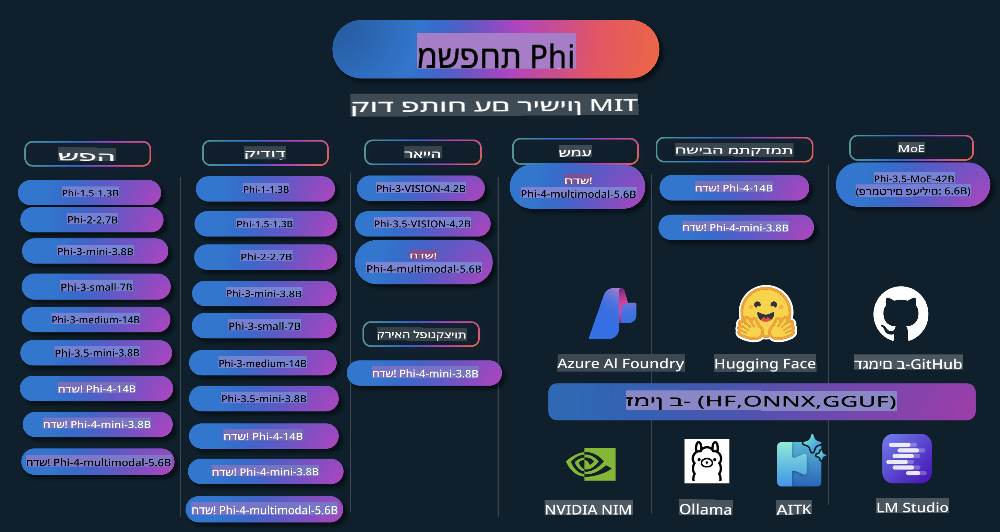

# Phi Cookbook: דוגמאות מעשיות עם המודלים של Phi מבית מיקרוסופט

  

  
  
  

  
  

Phi היא סדרת מודלים מבוססי AI בקוד פתוח שפותחו על ידי מיקרוסופט.

נכון להיום, Phi הוא מודל שפה קטן (SLM) עוצמתי במיוחד וחסכוני, עם ביצועים מעולים במבחנים של שפות מרובות, הסקת מסקנות, יצירת טקסטים/שיחות, קוד, תמונות, שמע ועוד.

ניתן לפרוס את Phi לענן או למכשירי קצה, ולפתח בקלות יישומים מבוססי AI גנרטיבי גם עם משאבי מחשוב מוגבלים.

בצעו את השלבים הבאים כדי להתחיל להשתמש במשאבים אלו:
1. **עשו פורק למאגר**: לחצו   
2. **שכפלו את המאגר**: `git clone https://github.com/microsoft/PhiCookBook.git`  
3. [**הצטרפו לקהילת ה-AI של מיקרוסופט בדיסקורד ופגשו מומחים ומפתחים נוספים**](https://discord.com/invite/ByRwuEEgH4?WT.mc_id=aiml-137032-kinfeylo)

## תוכן עניינים

- מבוא  
  - [ברוכים הבאים למשפחת Phi](./md/01.Introduction/01/01.PhiFamily.md)  
  - [הגדרת הסביבה שלכם](./md/01.Introduction/01/01.EnvironmentSetup.md)  
  - [הבנת טכנולוגיות מפתח](./md/01.Introduction/01/01.Understandingtech.md)  
  - [בטיחות AI עבור מודלים של Phi](./md/01.Introduction/01/01.AISafety.md)  
  - [תמיכת חומרה עבור Phi](./md/01.Introduction/01/01.Hardwaresupport.md)  
  - [מודלים של Phi וזמינותם בפלטפורמות שונות](./md/01.Introduction/01/01.Edgeandcloud.md)  
  - [שימוש ב-Guidance-ai וב-Phi](./md/01.Introduction/01/01.Guidance.md)  
  - [מודלים ב-GitHub Marketplace](https://github.com/marketplace/models)  
  - [קטלוג המודלים של Azure AI](https://ai.azure.com)

- ביצוע Inference ל-Phi בסביבות שונות  
    - [Hugging face](./md/01.Introduction/02/01.HF.md)  
    - [מודלים ב-GitHub](./md/01.Introduction/02/02.GitHubModel.md)  
    - [קטלוג המודלים של Azure AI Foundry](./md/01.Introduction/02/03.AzureAIFoundry.md)  
    - [Ollama](./md/01.Introduction/02/04.Ollama.md)  
    - [כלי AI ב-VSCode (AITK)](./md/01.Introduction/02/05.AITK.md)  
    - [NVIDIA NIM](./md/01.Introduction/02/06.NVIDIA.md)

- ביצוע Inference למשפחת Phi  
    - [Inference ל-Phi ב-iOS](./md/01.Introduction/03/iOS_Inference.md)  
    - [Inference ל-Phi באנדרואיד](./md/01.Introduction/03/Android_Inference.md)  
- [ביצוע Inference של Phi ב-Jetson](./md/01.Introduction/03/Jetson_Inference.md)  
    - [ביצוע Inference של Phi במחשב AI PC](./md/01.Introduction/03/AIPC_Inference.md)  
    - [ביצוע Inference של Phi עם Apple MLX Framework](./md/01.Introduction/03/MLX_Inference.md)  
    - [ביצוע Inference של Phi בשרת מקומי](./md/01.Introduction/03/Local_Server_Inference.md)  
    - [ביצוע Inference של Phi בשרת מרוחק באמצעות AI Toolkit](./md/01.Introduction/03/Remote_Interence.md)  
    - [ביצוע Inference של Phi עם Rust](./md/01.Introduction/03/Rust_Inference.md)  
    - [ביצוע Inference של Phi--Vision מקומית](./md/01.Introduction/03/Vision_Inference.md)  
    - [ביצוע Inference של Phi עם Kaito AKS, Azure Containers (תמיכה רשמית)](./md/01.Introduction/03/Kaito_Inference.md)  

- [כימות משפחת Phi](./md/01.Introduction/04/QuantifyingPhi.md)  
    - [כימות Phi-3.5 / 4 באמצעות llama.cpp](./md/01.Introduction/04/UsingLlamacppQuantifyingPhi.md)  
    - [כימות Phi-3.5 / 4 באמצעות הרחבות Generative AI ל-onnxruntime](./md/01.Introduction/04/UsingORTGenAIQuantifyingPhi.md)  
    - [כימות Phi-3.5 / 4 באמצעות Intel OpenVINO](./md/01.Introduction/04/UsingIntelOpenVINOQuantifyingPhi.md)  
    - [כימות Phi-3.5 / 4 באמצעות Apple MLX Framework](./md/01.Introduction/04/UsingAppleMLXQuantifyingPhi.md)  

- הערכת Phi  
    - [AI אחראי](./md/01.Introduction/05/ResponsibleAI.md)  
    - [Azure AI Foundry להערכה](./md/01.Introduction/05/AIFoundry.md)  
    - [שימוש ב-Promptflow להערכה](./md/01.Introduction/05/Promptflow.md)  

- RAG עם Azure AI Search  
    - [כיצד להשתמש ב-Phi-4-mini וב-Phi-4-multimodal (RAG) עם Azure AI Search](https://github.com/microsoft/PhiCookBook/blob/main/code/06.E2E/E2E_Phi-4-RAG-Azure-AI-Search.ipynb)  

- דוגמאות לפיתוח אפליקציות Phi  
  - אפליקציות טקסט וצ'אט  
    - דוגמאות Phi-4 🆕  
      - [📓] [צ'אט עם מודל Phi-4-mini ONNX](./md/02.Application/01.TextAndChat/Phi4/ChatWithPhi4ONNX/README.md)  
      - [צ'אט עם מודל Phi-4 מקומי ONNX באמצעות .NET](../../md/04.HOL/dotnet/src/LabsPhi4-Chat-01OnnxRuntime)  
      - [אפליקציית קונסול .NET לצ'אט עם Phi-4 ONNX באמצעות Semantic Kernel](../../md/04.HOL/dotnet/src/LabsPhi4-Chat-02SK)  
    - דוגמאות Phi-3 / 3.5  
      - [צ'אט מקומי בדפדפן באמצעות Phi3, ONNX Runtime Web ו-WebGPU](https://github.com/microsoft/onnxruntime-inference-examples/tree/main/js/chat)  
      - [צ'אט OpenVino](./md/02.Application/01.TextAndChat/Phi3/E2E_OpenVino_Chat.md)  
      - [מודל מרובה - אינטראקטיבי Phi-3-mini ו-OpenAI Whisper](./md/02.Application/01.TextAndChat/Phi3/E2E_Phi-3-mini_with_whisper.md)  
      - [MLFlow - בניית מעטפת ושימוש ב-Phi-3 עם MLFlow](./md//02.Application/01.TextAndChat/Phi3/E2E_Phi-3-MLflow.md)  
      - [אופטימיזציית מודל - כיצד לאופטם את המודל Phi-3-min עבור ONNX Runtime Web עם Olive](https://github.com/microsoft/Olive/tree/main/examples/phi3)  
      - [אפליקציית WinUI3 עם Phi-3 mini-4k-instruct-onnx](https://github.com/microsoft/Phi3-Chat-WinUI3-Sample/)  
      - [אפליקציית הערות AI מרובת מודלים ב-WinUI3](https://github.com/microsoft/ai-powered-notes-winui3-sample)  
      - [כיוונון והתאמה אישית של מודלי Phi-3 עם Prompt flow](./md/02.Application/01.TextAndChat/Phi3/E2E_Phi-3-FineTuning_PromptFlow_Integration.md)  
      - [כיוונון והתאמה אישית של מודלי Phi-3 עם Prompt flow ב-Azure AI Foundry](./md/02.Application/01.TextAndChat/Phi3/E2E_Phi-3-FineTuning_PromptFlow_Integration_AIFoundry.md)  
      - [הערכת מודל Phi-3 / Phi-3.5 מותאם אישית ב-Azure AI Foundry תוך התמקדות בעקרונות AI אחראי של Microsoft](./md/02.Application/01.TextAndChat/Phi3/E2E_Phi-3-Evaluation_AIFoundry.md)  
- [📓] [דוגמה לחיזוי שפה עם Phi-3.5-mini-instruct (סינית/אנגלית)](../../md/02.Application/01.TextAndChat/Phi3/phi3-instruct-demo.ipynb)
      - [צ'אטבוט RAG WebGPU עם Phi-3.5-Instruct](./md/02.Application/01.TextAndChat/Phi3/WebGPUWithPhi35Readme.md)
      - [שימוש ב-GPU של Windows ליצירת פתרון Prompt flow עם Phi-3.5-Instruct ONNX](./md/02.Application/01.TextAndChat/Phi3/UsingPromptFlowWithONNX.md)
      - [שימוש ב-Microsoft Phi-3.5 tflite ליצירת אפליקציית אנדרואיד](./md/02.Application/01.TextAndChat/Phi3/UsingPhi35TFLiteCreateAndroidApp.md)
      - [שאלות ותשובות .NET עם מודל מקומי ONNX Phi-3 באמצעות Microsoft.ML.OnnxRuntime](../../md/04.HOL/dotnet/src/LabsPhi301)
      - [אפליקציית צ'אט מסוף .NET עם Semantic Kernel ו-Phi-3](../../md/04.HOL/dotnet/src/LabsPhi302)

  - דוגמאות מבוססות קוד של Azure AI Inference SDK 
    - דוגמאות Phi-4 🆕
      - [📓] [יצירת קוד פרויקט באמצעות Phi-4-multimodal](./md/02.Application/02.Code/Phi4/GenProjectCode/README.md)
    - דוגמאות Phi-3 / 3.5
      - [בניית צ'אט GitHub Copilot משלך ב-Visual Studio Code עם משפחת Phi-3 של Microsoft](./md/02.Application/02.Code/Phi3/VSCodeExt/README.md)
      - [יצירת סוכן צ'אט Copilot משלך ב-Visual Studio Code עם Phi-3.5 באמצעות מודלים של GitHub](/md/02.Application/02.Code/Phi3/CreateVSCodeChatAgentWithGitHubModels.md)

  - דוגמאות לחשיבה מתקדמת
    - דוגמאות Phi-4 🆕
      - [📓] [דוגמאות חשיבה מתקדמות עם Phi-4-mini](./md/02.Application/03.AdvancedReasoning/Phi4/AdvancedResoningPhi4mini/README.md)
  
  - הדגמות
      - [הדגמות Phi-4-mini המתארחות ב-Hugging Face Spaces](https://huggingface.co/spaces/microsoft/phi-4-mini?WT.mc_id=aiml-137032-kinfeylo)
      - [הדגמות Phi-4-multimodal המתארחות ב-Hugging Face Spaces](https://huggingface.co/spaces/microsoft/phi-4-multimodal?WT.mc_id=aiml-137032-kinfeylo)
  - דוגמאות לראייה ממוחשבת
    - דוגמאות Phi-4 🆕
      - [📓] [שימוש ב-Phi-4-multimodal לקריאת תמונות ויצירת קוד](./md/02.Application/04.Vision/Phi4/CreateFrontend/README.md) 
    - דוגמאות Phi-3 / 3.5
      -  [📓][Phi-3-vision - המרת טקסט מתמונה לטקסט](../../md/02.Application/04.Vision/Phi3/E2E_Phi-3-vision-image-text-to-text-online-endpoint.ipynb)
      - [Phi-3-vision-ONNX](https://onnxruntime.ai/docs/genai/tutorials/phi3-v.html)
      - [📓][Phi-3-vision CLIP Embedding](../../md/02.Application/04.Vision/Phi3/E2E_Phi-3-vision-image-text-to-text-online-endpoint.ipynb)
      - [הדגמה: Phi-3 למיחזור](https://github.com/jennifermarsman/PhiRecycling/)
      - [Phi-3-vision - עוזר חזותי לשפה - עם Phi3-Vision ו-OpenVINO](https://docs.openvino.ai/nightly/notebooks/phi-3-vision-with-output.html)
      - [Phi-3 Vision Nvidia NIM](./md/02.Application/04.Vision/Phi3/E2E_Nvidia_NIM_Vision.md)
      - [Phi-3 Vision OpenVino](./md/02.Application/04.Vision/Phi3/E2E_OpenVino_Phi3Vision.md)
      - [📓][דוגמת Phi-3.5 Vision לתמונות מרובות או מסגרות מרובות](../../md/02.Application/04.Vision/Phi3/phi3-vision-demo.ipynb)
      - [מודל ONNX מקומי של Phi-3 Vision באמצעות Microsoft.ML.OnnxRuntime .NET](../../md/04.HOL/dotnet/src/LabsPhi303)
      - [מודל ONNX מקומי של Phi-3 Vision מבוסס תפריטים באמצעות Microsoft.ML.OnnxRuntime .NET](../../md/04.HOL/dotnet/src/LabsPhi304)

  - דוגמאות לאודיו
    - דוגמאות Phi-4 🆕
      - [📓] [חילוץ תמלילי אודיו באמצעות Phi-4-multimodal](./md/02.Application/05.Audio/Phi4/Transciption/README.md)
      - [📓] [דוגמת אודיו Phi-4-multimodal](../../md/02.Application/05.Audio/Phi4/Siri/demo.ipynb)
      - [📓] [דוגמת תרגום דיבור Phi-4-multimodal](../../md/02.Application/05.Audio/Phi4/Translate/demo.ipynb)
      - [אפליקציית מסוף .NET המשתמשת ב-Phi-4-multimodal Audio לניתוח קובץ אודיו ויצירת תמליל](../../md/04.HOL/dotnet/src/LabsPhi4-MultiModal-02Audio)

  - דוגמאות MOE
    - דוגמאות Phi-3 / 3.5
      - [📓] [מודלים של תערובת מומחים Phi-3.5 (MoEs) לדוגמת מדיה חברתית](../../md/02.Application/06.MoE/Phi3/phi3_moe_demo.ipynb)
      - [📓] [בניית צינור RAG (יצירת תוכן מבוססת אחזור) עם NVIDIA NIM Phi-3 MOE, Azure AI Search, ו-LlamaIndex](../../md/02.Application/06.MoE/Phi3/azure-ai-search-nvidia-rag.ipynb)
  - דוגמאות לקריאה לפונקציות
    - דוגמאות Phi-4 🆕
      -  [📓] [שימוש בקריאה לפונקציות עם Phi-4-mini](./md/02.Application/07.FunctionCalling/Phi4/FunctionCallingBasic/README.md)
  - דוגמאות לערבוב מולטימודלי
    - דוגמאות Phi-4 🆕
- [📓] [שימוש ב-Phi-4-multimodal כעיתונאי טכנולוגיה](../../md/02.Application/08.Multimodel/Phi4/TechJournalist/phi_4_mm_audio_text_publish_news.ipynb)  
  - [אפליקציית קונסולה ב-.NET שמשתמשת ב-Phi-4-multimodal לניתוח תמונות](../../md/04.HOL/dotnet/src/LabsPhi4-MultiModal-01Images)

- כיוונון עדין לדוגמאות Phi  
  - [תסריטי כיוונון עדין](./md/03.FineTuning/FineTuning_Scenarios.md)  
  - [כיוונון עדין לעומת RAG](./md/03.FineTuning/FineTuning_vs_RAG.md)  
  - [כיוונון עדין: להפוך את Phi-3 למומחה תעשייתי](./md/03.FineTuning/LetPhi3gotoIndustriy.md)  
  - [כיוונון עדין של Phi-3 עם ערכת כלים AI ל-VS Code](./md/03.FineTuning/Finetuning_VSCodeaitoolkit.md)  
  - [כיוונון עדין של Phi-3 עם Azure Machine Learning Service](./md/03.FineTuning/Introduce_AzureML.md)  
  - [כיוונון עדין של Phi-3 עם Lora](./md/03.FineTuning/FineTuning_Lora.md)  
  - [כיוונון עדין של Phi-3 עם QLora](./md/03.FineTuning/FineTuning_Qlora.md)  
  - [כיוונון עדין של Phi-3 עם Azure AI Foundry](./md/03.FineTuning/FineTuning_AIFoundry.md)  
  - [כיוונון עדין של Phi-3 עם Azure ML CLI/SDK](./md/03.FineTuning/FineTuning_MLSDK.md)  
  - [כיוונון עדין עם Microsoft Olive](./md/03.FineTuning/FineTuning_MicrosoftOlive.md)  
  - [כיוונון עדין עם מעבדה מעשית Microsoft Olive](./md/03.FineTuning/olive-lab/readme.md)  
  - [כיוונון עדין של Phi-3-vision עם Weights and Bias](./md/03.FineTuning/FineTuning_Phi-3-visionWandB.md)  
  - [כיוונון עדין של Phi-3 עם Apple MLX Framework](./md/03.FineTuning/FineTuning_MLX.md)  
  - [כיוונון עדין של Phi-3-vision (תמיכה רשמית)](./md/03.FineTuning/FineTuning_Vision.md)  
  - [כיוונון עדין של Phi-3 עם Kaito AKS , Azure Containers (תמיכה רשמית)](./md/03.FineTuning/FineTuning_Kaito.md)  
  - [כיוונון עדין של Phi-3 ו-3.5 Vision](https://github.com/2U1/Phi3-Vision-Finetune)  

- מעבדה מעשית  
  - [חקר מודלים מתקדמים: LLMs, SLMs, פיתוח מקומי ועוד](https://github.com/microsoft/aitour-exploring-cutting-edge-models)  
  - [שחרור הפוטנציאל של NLP: כיוונון עדין עם Microsoft Olive](https://github.com/azure/Ignite_FineTuning_workshop)  

- מאמרי מחקר אקדמיים ופרסומים  
  - [Textbooks Are All You Need II: דו"ח טכני של phi-1.5](https://arxiv.org/abs/2309.05463)  
  - [Phi-3 דו"ח טכני: מודל שפה בעל יכולות גבוהות על הטלפון שלך](https://arxiv.org/abs/2404.14219)  
  - [דו"ח טכני של Phi-4](https://arxiv.org/abs/2412.08905)  
  - [אופטימיזציה של מודלי שפה קטנים לשימוש ברכב](https://arxiv.org/abs/2501.02342)  
  - [(WhyPHI) כיוונון עדין של PHI-3 לשאלות רב-ברירה: מתודולוגיה, תוצאות ואתגרים](https://arxiv.org/abs/2501.01588)  

## שימוש במודלים של Phi  

### Phi על Azure AI Foundry  

ניתן ללמוד כיצד להשתמש ב-Microsoft Phi וכיצד לבנות פתרונות מקצה לקצה על גבי מכשירים שונים. כדי לחוות את Phi בעצמכם, התחילו לשחק עם המודלים והתאימו את Phi לתרחישים שלכם באמצעות [Azure AI Foundry Azure AI Model Catalog](https://aka.ms/phi3-azure-ai). למידע נוסף, התחילו עם [Azure AI Foundry](/md/02.QuickStart/AzureAIFoundry_QuickStart.md).  

**Playground**  
לכל מודל יש סביבת Playground ייעודית לבדיקת המודל [Azure AI Playground](https://aka.ms/try-phi3).  

### Phi על מודלים ב-GitHub  

ניתן ללמוד כיצד להשתמש ב-Microsoft Phi וכיצד לבנות פתרונות מקצה לקצה על גבי מכשירים שונים. כדי לחוות את Phi בעצמכם, התחילו לשחק עם המודל והתאימו את Phi לתרחישים שלכם באמצעות [GitHub Model Catalog](https://github.com/marketplace/models?WT.mc_id=aiml-137032-kinfeylo). למידע נוסף, התחילו עם [GitHub Model Catalog](/md/02.QuickStart/GitHubModel_QuickStart.md).  

**Playground**  
לכל מודל יש [סביבת ניסוי ייעודית לבדיקת המודל](/md/02.QuickStart/GitHubModel_QuickStart.md).

### Phi ב-Hugging Face

ניתן גם למצוא את המודל ב-[Hugging Face](https://huggingface.co/microsoft)

**סביבת ניסוי**  
[סביבת הניסוי של Hugging Chat](https://huggingface.co/chat/models/microsoft/Phi-3-mini-4k-instruct)

## AI אחראי

מיקרוסופט מחויבת לסייע ללקוחותיה להשתמש במוצרי ה-AI שלה באחריות, לשתף את הלמידות שלנו ולבנות שותפויות מבוססות אמון באמצעות כלים כמו Transparency Notes ו-Impact Assessments. משאבים רבים בנושא זה זמינים ב-[https://aka.ms/RAI](https://aka.ms/RAI).  
הגישה של מיקרוסופט ל-AI אחראי מבוססת על עקרונות ה-AI שלנו: הוגנות, אמינות ובטיחות, פרטיות ואבטחה, הכללה, שקיפות ואחריות.

מודלים רחבי היקף של שפה טבעית, תמונה ודיבור - כמו אלו המוצגים בדוגמה זו - עלולים להתנהג בדרכים לא הוגנות, לא אמינות או פוגעניות, ובכך לגרום לנזקים. מומלץ לעיין ב-[הערת השקיפות של שירות Azure OpenAI](https://learn.microsoft.com/legal/cognitive-services/openai/transparency-note?tabs=text) כדי להבין את הסיכונים והמגבלות.

הגישה המומלצת להפחתת סיכונים אלו היא לכלול מערכת בטיחות בארכיטקטורה שלכם שיכולה לזהות ולמנוע התנהגות מזיקה. [Azure AI Content Safety](https://learn.microsoft.com/azure/ai-services/content-safety/overview) מספקת שכבת הגנה עצמאית, שמסוגלת לזהות תוכן מזיק שנוצר על ידי משתמשים או על ידי AI באפליקציות ושירותים. Azure AI Content Safety כוללת APIs לטקסט ותמונה שמאפשרים לזהות חומרים מזיקים. בתוך Azure AI Foundry, שירות Content Safety מאפשר לכם לצפות, לחקור ולנסות קוד לדוגמה לזיהוי תוכן מזיק במודלים שונים. [תיעוד ההתחלה המהירה](https://learn.microsoft.com/azure/ai-services/content-safety/quickstart-text?tabs=visual-studio%2Clinux&pivots=programming-language-rest) מנחה אתכם כיצד לבצע בקשות לשירות.

היבט נוסף שיש לקחת בחשבון הוא ביצועי האפליקציה הכוללת. באפליקציות מולטי-מודליות ומולטי-מודלים, אנו מגדירים ביצועים כיכולת של המערכת לפעול בהתאם לציפיות שלכם ושל המשתמשים שלכם, כולל הימנעות מיצירת תוצרים מזיקים. חשוב להעריך את ביצועי האפליקציה הכוללת באמצעות [מדדי ביצועים ואיכות ומעריכי סיכונים ובטיחות](https://learn.microsoft.com/azure/ai-studio/concepts/evaluation-metrics-built-in). יש לכם גם אפשרות ליצור ולהעריך בעזרת [מעריכי מותאמים אישית](https://learn.microsoft.com/azure/ai-studio/how-to/develop/evaluate-sdk#custom-evaluators).

ניתן להעריך את אפליקציית ה-AI שלכם בסביבת הפיתוח באמצעות [Azure AI Evaluation SDK](https://microsoft.github.io/promptflow/index.html). בהתבסס על מאגר נתוני בדיקה או יעד, המדידות של אפליקציית ה-AI שלכם מתבצעות באופן כמותי עם מעריכי ברירת מחדל או מותאמים אישית לפי בחירתכם. כדי להתחיל עם Azure AI Evaluation SDK ולהעריך את המערכת שלכם, ניתן לעקוב אחר [מדריך ההתחלה המהירה](https://learn.microsoft.com/azure/ai-studio/how-to/develop/flow-evaluate-sdk). לאחר ביצוע הרצת הערכה, תוכלו [לצפות בתוצאות ב-Azure AI Foundry](https://learn.microsoft.com/azure/ai-studio/how-to/evaluate-flow-results).

## סימני מסחר

פרויקט זה עשוי לכלול סימני מסחר או לוגואים עבור פרויקטים, מוצרים או שירותים. שימוש מורשה בסימני המסחר או הלוגואים של מיקרוסופט כפוף ל-[הנחיות השימוש בסימני המסחר והמותג של מיקרוסופט](https://www.microsoft.com/legal/intellectualproperty/trademarks/usage/general).  
שימוש בסימני המסחר או הלוגואים של מיקרוסופט בגרסאות מותאמות של פרויקט זה אסור לגרום לבלבול או לרמוז על חסות של מיקרוסופט. כל שימוש בסימני מסחר או לוגואים של צד שלישי כפוף למדיניות של אותם צדדים שלישיים.

**הצהרת אחריות**:  
מסמך זה תורגם באמצעות שירותי תרגום מבוססי בינה מלאכותית. למרות שאנו שואפים לדיוק, יש לקחת בחשבון שתרגומים אוטומטיים עשויים להכיל שגיאות או אי-דיוקים. המסמך המקורי בשפתו המקורית צריך להיחשב כמקור הסמכותי. למידע קריטי, מומלץ להשתמש בתרגום מקצועי אנושי. איננו נושאים באחריות לכל אי-הבנה או פרשנות שגויה הנובעות משימוש בתרגום זה.