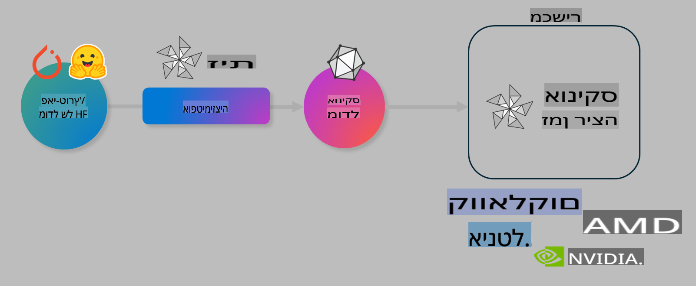

# מעבדה. אופטימיזציה של מודלים מבוססי AI להרצה על מכשירים

## הקדמה

> [!IMPORTANT]  
> מעבדה זו דורשת **Nvidia A10 או A100 GPU** עם דרייברים מתאימים וכלי CUDA (גרסה 12+) מותקנים.

> [!NOTE]  
> זוהי מעבדה של **35 דקות** שתעניק לכם היכרות מעשית עם עקרונות מרכזיים לאופטימיזציה של מודלים להרצה על מכשירים באמצעות OLIVE.

## מטרות למידה

בסיום מעבדה זו, תוכלו להשתמש ב-OLIVE כדי:

- לבצע כימות (Quantization) למודל AI באמצעות שיטת הכימות AWQ.
- לכוונן (Fine-tune) מודל AI למשימה מסוימת.
- לייצר מתאמי LoRA (מודלים מכווננים) להרצה יעילה על מכשירים באמצעות ONNX Runtime.

### מהו Olive

Olive (*O*NNX *live*) הוא כלי לאופטימיזציית מודלים עם ממשק שורת פקודה (CLI) שמאפשר לכם להפעיל מודלים על ONNX runtime +++https://onnxruntime.ai+++ באיכות וביצועים גבוהים.



הקלט עבור Olive הוא בדרך כלל מודל של PyTorch או Hugging Face, והתוצאה היא מודל ONNX אופטימלי שמורץ על מכשיר (יעד פריסה) עם ONNX runtime. Olive מבצע אופטימיזציה של המודל בהתאם למאיץ ה-AI של יעד הפריסה (NPU, GPU, CPU) המסופק על ידי יצרני חומרה כמו Qualcomm, AMD, Nvidia או Intel.

Olive מבצע *תהליך עבודה* (workflow), שהוא רצף מסודר של משימות אופטימיזציה למודל הנקראות *מעברים* (passes). דוגמאות למעברים כוללות: דחיסת מודלים, לכידת גרפים, כימות, ואופטימיזציית גרפים. לכל מעבר יש סט פרמטרים שניתן לכוון כדי להשיג את המדדים הטובים ביותר, כמו דיוק וזמן תגובה, שמוערכים על ידי המעריך המתאים. Olive משתמש באסטרטגיית חיפוש המבוססת על אלגוריתם חיפוש כדי לבצע כיוונון אוטומטי של כל מעבר בנפרד או של קבוצת מעברים יחד.

#### יתרונות של Olive

- **מפחית תסכול וזמן** של ניסוי וטעייה ידניים עם טכניקות שונות לאופטימיזציית גרפים, דחיסה וכימות. הגדירו את מגבלות האיכות והביצועים שלכם ותנו ל-Olive למצוא עבורכם את המודל הטוב ביותר באופן אוטומטי.
- **מעל 40 רכיבי אופטימיזציה מובנים** המשתמשים בטכניקות מתקדמות לכימות, דחיסה, אופטימיזציית גרפים וכיוונון.
- **CLI ידידותי למשתמש** למשימות אופטימיזציה נפוצות. לדוגמה, olive quantize, olive auto-opt, olive finetune.
- אפשרות לאריזת מודלים ופריסתם מובנית.
- תמיכה ביצירת מודלים ל-**Multi LoRA serving**.
- בניית תהליכי עבודה באמצעות YAML/JSON לניהול משימות אופטימיזציה ופריסה.
- אינטגרציה עם **Hugging Face** ו-**Azure AI**.
- מנגנון **מטמון מובנה** לחיסכון בעלויות.

## הוראות מעבדה

> [!NOTE]  
> ודאו שהגדרתם את Azure AI Hub והפרויקט שלכם, והכנתם את ה-A100 compute כפי שהוסבר במעבדה 1.

### שלב 0: התחברות ל-Azure AI Compute

תתחברו ל-Azure AI compute באמצעות הפיצ'ר המרוחק ב-**VS Code.**

1. פתחו את אפליקציית **VS Code** בשולחן העבודה שלכם.  
1. פתחו את **command palette** באמצעות **Shift+Ctrl+P**.  
1. בחלונית הפקודות חפשו **AzureML - remote: Connect to compute instance in New Window**.  
1. עקבו אחרי ההוראות על המסך כדי להתחבר ל-Compute. זה יכלול בחירת מנוי Azure, קבוצת משאבים, פרויקט ושם Compute שהגדרתם במעבדה 1.  
1. לאחר שהתחברתם ל-Azure ML Compute, החיבור יוצג ב-**פינה השמאלית התחתונה של Visual Code** `><Azure ML: Compute Name`.

### שלב 1: שיבטו את המאגר הזה

ב-VS Code, פתחו טרמינל חדש באמצעות **Ctrl+J** ושיבטו את המאגר הזה:

בטרמינל תראו את השורה:

```
azureuser@computername:~/cloudfiles/code$ 
```  
שיבטו את המאגר

```bash
cd ~/localfiles
git clone https://github.com/microsoft/phi-3cookbook.git
```  

### שלב 2: פתיחת תיקייה ב-VS Code

כדי לפתוח את VS Code בתיקייה הרלוונטית, הריצו את הפקודה הבאה בטרמינל, שתפתח חלון חדש:

```bash
code phi-3cookbook/code/04.Finetuning/Olive-lab
```  

לחילופין, תוכלו לפתוח את התיקייה על ידי בחירה ב-**File** > **Open Folder**.

### שלב 3: תלותים

פתחו חלון טרמינל ב-VS Code על ה-Azure AI Compute Instance שלכם (טיפ: **Ctrl+J**) והריצו את הפקודות הבאות כדי להתקין את התלותים:

```bash
conda create -n olive-ai python=3.11 -y
conda activate olive-ai
pip install -r requirements.txt
az extension remove -n azure-cli-ml
az extension add -n ml
```  

> [!NOTE]  
> ההתקנה תיקח כ-5 דקות.

במעבדה זו תורידו ותעלו מודלים לקטלוג המודלים של Azure AI. כדי שתוכלו לגשת לקטלוג המודלים, תצטרכו להתחבר ל-Azure באמצעות:

```bash
az login
```  

> [!NOTE]  
> בעת ההתחברות תתבקשו לבחור את המנוי שלכם. ודאו שאתם בוחרים את המנוי שסופק עבור מעבדה זו.

### שלב 4: הרצת פקודות Olive

פתחו חלון טרמינל ב-VS Code על ה-Azure AI Compute Instance שלכם (טיפ: **Ctrl+J**) וודאו שסביבת ה-conda של `olive-ai` מופעלת:

```bash
conda activate olive-ai
```  

לאחר מכן, הריצו את פקודות Olive הבאות בשורת הפקודה.

1. **בדיקת הנתונים:** בדוגמה זו, אתם עומדים לכוונן את מודל Phi-3.5-Mini כך שיתמחה במענה לשאלות הקשורות לנסיעות. הקוד הבא מציג את הרשומות הראשונות של מערך הנתונים, שהן בפורמט JSON lines:

    ```bash
    head data/data_sample_travel.jsonl
    ```  

1. **כימות המודל:** לפני אימון המודל, תחילה מבצעים כימות באמצעות הפקודה הבאה שמשתמשת בטכניקה שנקראת Active Aware Quantization (AWQ) +++https://arxiv.org/abs/2306.00978+++. AWQ מכמת את המשקלים של מודל תוך התחשבות באקטיבציות שנוצרות במהלך ההרצה. משמעות הדבר היא שתהליך הכימות לוקח בחשבון את התפלגות הנתונים בפועל באקטיבציות, מה שמוביל לשימור טוב יותר של דיוק המודל בהשוואה לשיטות כימות מסורתיות.

    ```bash
    olive quantize \
       --model_name_or_path microsoft/Phi-3.5-mini-instruct \
       --trust_remote_code \
       --algorithm awq \
       --output_path models/phi/awq \
       --log_level 1
    ```  

    הכימות לוקח **כ-8 דקות** ומקטין את גודל המודל מ-~7.5GB ל-~2.5GB.

    במעבדה זו, אנו מראים לכם כיצד להכניס מודלים מ-Hugging Face (לדוגמה: `microsoft/Phi-3.5-mini-instruct`). However, Olive also allows you to input models from the Azure AI catalog by updating the `model_name_or_path` argument to an Azure AI asset ID (for example:  `azureml://registries/azureml/models/Phi-3.5-mini-instruct/versions/4`). 

1. **Train the model:** Next, the `olive finetune` פקודה זו מכוונת את המודל המכומת. כימות המודל *לפני* הכיוונון במקום אחריו מספק דיוק טוב יותר, שכן תהליך הכיוונון מתקן חלק מהאובדן שנוצר בכימות.

    ```bash
    olive finetune \
        --method lora \
        --model_name_or_path models/phi/awq \
        --data_files "data/data_sample_travel.jsonl" \
        --data_name "json" \
        --text_template "<|user|>\n{prompt}<|end|>\n<|assistant|>\n{response}<|end|>" \
        --max_steps 100 \
        --output_path ./models/phi/ft \
        --log_level 1
    ```  

    הכיוונון לוקח **כ-6 דקות** (עם 100 צעדים).

1. **אופטימיזציה:** לאחר אימון המודל, כעת מבצעים אופטימיזציה באמצעות פקודת `auto-opt` command, which will capture the ONNX graph and automatically perform a number of optimizations to improve the model performance for CPU by compressing the model and doing fusions. It should be noted, that you can also optimize for other devices such as NPU or GPU by just updating the `--device` and `--provider` של Olive - אך לצורך מעבדה זו נשתמש ב-CPU.

    ```bash
    olive auto-opt \
       --model_name_or_path models/phi/ft/model \
       --adapter_path models/phi/ft/adapter \
       --device cpu \
       --provider CPUExecutionProvider \
       --use_ort_genai \
       --output_path models/phi/onnx-ao \
       --log_level 1
    ```  

    תהליך האופטימיזציה לוקח **כ-5 דקות**.

### שלב 5: בדיקת הרצת מודל מהירה

כדי לבדוק הרצת מודל, צרו קובץ Python בתיקייה שלכם בשם **app.py** והעתיקו את הקוד הבא:

```python
import onnxruntime_genai as og
import numpy as np

print("loading model and adapters...", end="", flush=True)
model = og.Model("models/phi/onnx-ao/model")
adapters = og.Adapters(model)
adapters.load("models/phi/onnx-ao/model/adapter_weights.onnx_adapter", "travel")
print("DONE!")

tokenizer = og.Tokenizer(model)
tokenizer_stream = tokenizer.create_stream()

params = og.GeneratorParams(model)
params.set_search_options(max_length=100, past_present_share_buffer=False)
user_input = "what is the best thing to see in chicago"
params.input_ids = tokenizer.encode(f"<|user|>\n{user_input}<|end|>\n<|assistant|>\n")

generator = og.Generator(model, params)

generator.set_active_adapter(adapters, "travel")

print(f"{user_input}")

while not generator.is_done():
    generator.compute_logits()
    generator.generate_next_token()

    new_token = generator.get_next_tokens()[0]
    print(tokenizer_stream.decode(new_token), end='', flush=True)

print("\n")
```  

הריצו את הקוד באמצעות:

```bash
python app.py
```  

### שלב 6: העלאת מודל ל-Azure AI

העלאת המודל למאגר מודלים של Azure AI מאפשרת שיתוף המודל עם חברי הצוות שלכם ומנהלת גם בקרת גרסאות של המודל. כדי להעלות את המודל, הריצו את הפקודה הבאה:

> [!NOTE]  
> עדכנו את `{}` placeholders with the name of your resource group and Azure AI Project Name. 

To find your resource group `"resourceGroup" ושם פרויקט Azure AI, והריצו את הפקודה הבאה

```
az ml workspace show
```  

או על ידי מעבר ל-+++ai.azure.com+++ ובחירה ב-**management center** **project** **overview**.

עדכנו את המקומות המסומנים `{}` בשם קבוצת המשאבים ושם פרויקט Azure AI שלכם.

```bash
az ml model create \
    --name ft-for-travel \
    --version 1 \
    --path ./models/phi/onnx-ao \
    --resource-group {RESOURCE_GROUP_NAME} \
    --workspace-name {PROJECT_NAME}
```  
לאחר מכן תוכלו לראות את המודל שהעליתם ולפרוס אותו בכתובת https://ml.azure.com/model/list

**כתב ויתור**:  
מסמך זה תורגם באמצעות שירותי תרגום מבוססי בינה מלאכותית. למרות שאנו שואפים לדיוק, יש לקחת בחשבון שתרגומים אוטומטיים עשויים להכיל טעויות או אי-דיוקים. המסמך המקורי בשפתו המקורית נחשב למקור הסמכותי. למידע קריטי, מומלץ להשתמש בתרגום מקצועי אנושי. איננו נושאים באחריות לכל אי-הבנה או פרשנות שגויה הנובעת משימוש בתרגום זה.