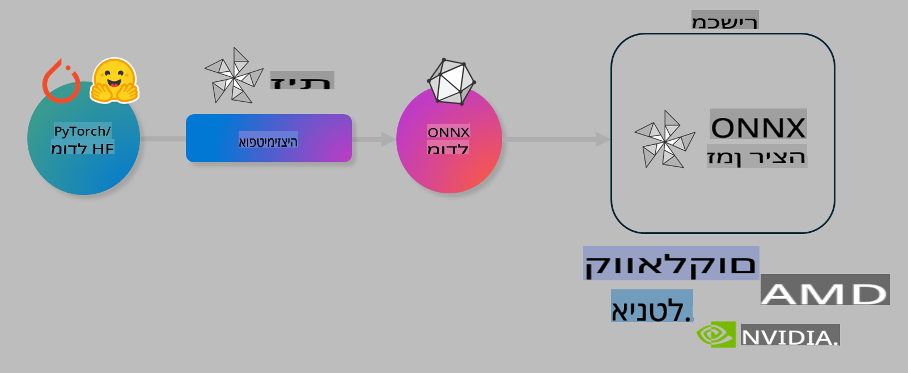

# מעבדה. אופטימיזציה של מודלים של AI להרצה במכשיר

## מבוא

> [!IMPORTANT]
> מעבדה זו דורשת **Nvidia A10 או A100 GPU** עם דרייברים מתאימים וכלי CUDA toolkit (גרסה 12+).

> [!NOTE]
> זוהי מעבדה שאורכה **35 דקות** ותספק לך היכרות מעשית עם עקרונות הליבה של אופטימיזציה של מודלים להרצה במכשיר באמצעות OLIVE.

## מטרות למידה

בסיום המעבדה, תוכל להשתמש ב-OLIVE כדי:

- לבצע כימות (Quantization) למודל AI באמצעות שיטת AWQ.
- לבצע Fine-tuning למודל AI למשימה מסוימת.
- ליצור LoRA adapters (מודל מותאם) להרצה יעילה במכשיר על ONNX Runtime.

### מה זה Olive

Olive (*O*NNX *live*) הוא כלי לאופטימיזציית מודלים עם CLI נלווה שמאפשר לך לשחרר מודלים עבור ONNX runtime +++https://onnxruntime.ai+++ עם איכות וביצועים משופרים.



הקלט ל-Olive הוא בדרך כלל מודל PyTorch או Hugging Face, והפלט הוא מודל ONNX אופטימלי שמבוצע במכשיר (יעד פריסה) עם ONNX runtime. Olive מבצע אופטימיזציה של המודל למאיץ ה-AI (NPU, GPU, CPU) של יעד הפריסה שסופק על ידי ספק חומרה כמו Qualcomm, AMD, Nvidia או Intel.

Olive מבצע *workflow*, שהוא סדרה מסודרת של משימות אופטימיזציה למודל הנקראות *passes* - דוגמאות למשימות כוללות: דחיסת מודל, לכידת גרפים, כימות ואופטימיזציית גרפים. לכל משימה יש סט פרמטרים שניתן לכוון כדי להשיג את המדדים הטובים ביותר, כמו דיוק וזמן תגובה, שנמדדים על ידי המעריך המתאים. Olive משתמש באסטרטגיית חיפוש עם אלגוריתם חיפוש כדי לכוון אוטומטית כל משימה בנפרד או קבוצה של משימות יחד.

#### יתרונות Olive

- **מפחית תסכול וזמן** של ניסוי וטעייה ידני עם טכניקות שונות לאופטימיזציית גרפים, דחיסה וכימות. הגדר את אילוצי האיכות והביצועים שלך ותן ל-Olive למצוא עבורך את המודל הטוב ביותר באופן אוטומטי.
- **מעל 40 רכיבי אופטימיזציה מובנים** המכסים טכניקות חדשניות בכימות, דחיסה, אופטימיזציית גרפים ו-Fine-tuning.
- **CLI קל לשימוש** למשימות אופטימיזציה נפוצות. לדוגמה, olive quantize, olive auto-opt, olive finetune.
- אריזת מודלים ופריסה מובנית.
- תמיכה ביצירת מודלים עבור **Multi LoRA serving**.
- יצירת workflows באמצעות YAML/JSON לארגון משימות אופטימיזציה ופריסה.
- אינטגרציה עם **Hugging Face** ו-**Azure AI**.
- מנגנון **caching** מובנה ל**חיסכון בעלויות**.

## הוראות מעבדה
> [!NOTE]
> יש לוודא שהגדרת את Azure AI Hub ואת הפרויקט שלך, והגדרת את מחשב ה-A100 שלך כפי שמפורט במעבדה 1.

### שלב 0: התחברות ל-Azure AI Compute

תתחבר ל-Azure AI Compute באמצעות הפיצ'ר מרחוק ב-**VS Code.** 

1. פתח את יישום **VS Code** בשולחן העבודה:
2. פתח את **command palette** באמצעות **Shift+Ctrl+P**.
3. ב-command palette חפש **AzureML - remote: Connect to compute instance in New Window**.
4. עקוב אחר ההוראות המופיעות על המסך כדי להתחבר ל-Compute. זה יכלול בחירת המנוי של Azure שלך, קבוצת המשאבים, הפרויקט ושם ה-Compute שהגדרת במעבדה 1.
5. לאחר החיבור ל-Azure ML Compute, זה יוצג ב-**פינה השמאלית התחתונה של VS Code** `><Azure ML: Compute Name`

### שלב 1: שכפול המאגר

ב-VS Code, תוכל לפתוח טרמינל חדש באמצעות **Ctrl+J** ולשכפל את המאגר:

בטרמינל תראה את ההנחיה הבאה:

```
azureuser@computername:~/cloudfiles/code$ 
```
שכפל את הפתרון:

```bash
cd ~/localfiles
git clone https://github.com/microsoft/phi-3cookbook.git
```

### שלב 2: פתיחת תיקייה ב-VS Code

כדי לפתוח את VS Code בתיקייה הרלוונטית, בצע את הפקודה הבאה בטרמינל, שתפתח חלון חדש:

```bash
code phi-3cookbook/code/04.Finetuning/Olive-lab
```

לחלופין, תוכל לפתוח את התיקייה על ידי בחירה ב-**File** > **Open Folder**.

### שלב 3: תלותים

פתח חלון טרמינל ב-VS Code ב-Azure AI Compute Instance שלך (טיפ: **Ctrl+J**) ובצע את הפקודות הבאות להתקנת התלותים:

```bash
conda create -n olive-ai python=3.11 -y
conda activate olive-ai
pip install -r requirements.txt
az extension remove -n azure-cli-ml
az extension add -n ml
```

> [!NOTE]
> התקנת כל התלותים תיקח כ-~5 דקות.

במעבדה זו תוריד ותעלה מודלים לקטלוג המודלים של Azure AI. כדי שתוכל לגשת לקטלוג המודלים, תצטרך להתחבר ל-Azure באמצעות:

```bash
az login
```

> [!NOTE]
> בזמן ההתחברות תתבקש לבחור את המנוי שלך. ודא שאתה בוחר את המנוי שסופק למעבדה זו.

### שלב 4: הרצת פקודות Olive 

פתח חלון טרמינל ב-VS Code ב-Azure AI Compute Instance שלך (טיפ: **Ctrl+J**) וודא שסביבת הקונדה `olive-ai` מופעלת:

```bash
conda activate olive-ai
```

כעת, בצע את פקודות Olive הבאות בשורת הפקודה.

1. **בדוק את הנתונים:** בדוגמה זו, תבצע Fine-tune למודל Phi-3.5-Mini כדי שיהיה מותאם למענה על שאלות הקשורות לנסיעות. הקוד הבא מציג את הרשומות הראשונות של מערך הנתונים, שהן בפורמט JSON lines:

    ```bash
    head data/data_sample_travel.jsonl
    ```
2. **כימות המודל:** לפני אימון המודל, תבצע כימות באמצעות הפקודה הבאה שמשתמשת בטכניקה שנקראת Active Aware Quantization (AWQ) +++https://arxiv.org/abs/2306.00978+++. AWQ מכמת את משקלי המודל על ידי התחשבות באקטיבציות שנוצרות במהלך ההרצה. זה מבטיח שכימות לוקח בחשבון את התפלגות הנתונים בפועל, מה שמשמר טוב יותר את דיוק המודל בהשוואה לשיטות כימות מסורתיות.

    ```bash
    olive quantize \
       --model_name_or_path microsoft/Phi-3.5-mini-instruct \
       --trust_remote_code \
       --algorithm awq \
       --output_path models/phi/awq \
       --log_level 1
    ```
    
    זה לוקח כ-**8 דקות** להשלים את הכימות AWQ, שיקטין את גודל המודל מ-~7.5GB ל-~2.5GB.
   
   במעבדה זו, נציג כיצד להזין מודלים מ-Hugging Face (לדוגמה: `microsoft/Phi-3.5-mini-instruct`). However, Olive also allows you to input models from the Azure AI catalog by updating the `model_name_or_path` argument to an Azure AI asset ID (for example:  `azureml://registries/azureml/models/Phi-3.5-mini-instruct/versions/4`). 

1. **Train the model:** Next, the `olive finetune` כמותג המודל. כימות המודל *לפני* Fine-tuning במקום לאחר מכן נותן דיוק טוב יותר מכיוון שתהליך ה-Fine-tuning משחזר חלק מהאובדן מהכימות.

    ```bash
    olive finetune \
        --method lora \
        --model_name_or_path models/phi/awq \
        --data_files "data/data_sample_travel.jsonl" \
        --data_name "json" \
        --text_template "<|user|>\n{prompt}<|end|>\n<|assistant|>\n{response}<|end|>" \
        --max_steps 100 \
        --output_path ./models/phi/ft \
        --log_level 1
    ```
    
    זה לוקח כ-**6 דקות** להשלים את ה-Fine-tuning (עם 100 צעדים).

3. **אופטימיזציה:** עם המודל שאומן, כעת תבצע אופטימיזציה למודל באמצעות הפקודה `auto-opt` command, which will capture the ONNX graph and automatically perform a number of optimizations to improve the model performance for CPU by compressing the model and doing fusions. It should be noted, that you can also optimize for other devices such as NPU or GPU by just updating the `--device` and `--provider` של Olive - אבל למטרות מעבדה זו נשתמש ב-CPU.

    ```bash
    olive auto-opt \
       --model_name_or_path models/phi/ft/model \
       --adapter_path models/phi/ft/adapter \
       --device cpu \
       --provider CPUExecutionProvider \
       --use_ort_genai \
       --output_path models/phi/onnx-ao \
       --log_level 1
    ```
    
    זה לוקח כ-**5 דקות** להשלים את האופטימיזציה.

### שלב 5: בדיקת הרצת מודל מהירה

כדי לבדוק את הרצת המודל, צור קובץ Python בתיקייה שלך בשם **app.py** והעתק-הדבק את הקוד הבא:

```python
import onnxruntime_genai as og
import numpy as np

print("loading model and adapters...", end="", flush=True)
model = og.Model("models/phi/onnx-ao/model")
adapters = og.Adapters(model)
adapters.load("models/phi/onnx-ao/model/adapter_weights.onnx_adapter", "travel")
print("DONE!")

tokenizer = og.Tokenizer(model)
tokenizer_stream = tokenizer.create_stream()

params = og.GeneratorParams(model)
params.set_search_options(max_length=100, past_present_share_buffer=False)
user_input = "what is the best thing to see in chicago"
params.input_ids = tokenizer.encode(f"<|user|>\n{user_input}<|end|>\n<|assistant|>\n")

generator = og.Generator(model, params)

generator.set_active_adapter(adapters, "travel")

print(f"{user_input}")

while not generator.is_done():
    generator.compute_logits()
    generator.generate_next_token()

    new_token = generator.get_next_tokens()[0]
    print(tokenizer_stream.decode(new_token), end='', flush=True)

print("\n")
```

הרץ את הקוד באמצעות:

```bash
python app.py
```

### שלב 6: העלאת מודל ל-Azure AI

העלאת המודל למאגר מודלים של Azure AI מאפשרת שיתוף המודל עם חברי הצוות שלך וגם מטפלת בניהול גרסאות המודל. כדי להעלות את המודל, הרץ את הפקודה הבאה:

> [!NOTE]
> עדכן את `{}` placeholders with the name of your resource group and Azure AI Project Name. 

To find your resource group `"resourceGroup" ושם פרויקט Azure AI, והרץ את הפקודה הבאה 

```
az ml workspace show
```

או על ידי מעבר ל-+++ai.azure.com+++ ובחירה ב-**management center** **project** **overview**.

עדכן את המקומות המסומנים `{}` עם שם קבוצת המשאבים שלך ושם פרויקט Azure AI.

```bash
az ml model create \
    --name ft-for-travel \
    --version 1 \
    --path ./models/phi/onnx-ao \
    --resource-group {RESOURCE_GROUP_NAME} \
    --workspace-name {PROJECT_NAME}
```
כעת תוכל לראות את המודל שהעלית ולפרוס אותו בכתובת https://ml.azure.com/model/list

**כתב ויתור**:  
מסמך זה תורגם באמצעות שירותי תרגום מבוססי בינה מלאכותית. למרות שאנו שואפים לדיוק, יש להיות מודעים לכך שתרגומים אוטומטיים עשויים להכיל שגיאות או אי-דיוקים. המסמך המקורי בשפתו המקורית צריך להיחשב כמקור הסמכותי. עבור מידע קריטי, מומלץ להשתמש בתרגום מקצועי על ידי בני אדם. איננו אחראים לכל אי-הבנה או פרשנות שגויה הנובעות משימוש בתרגום זה.