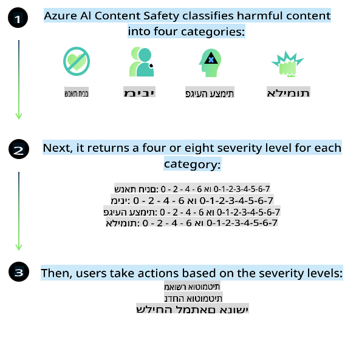
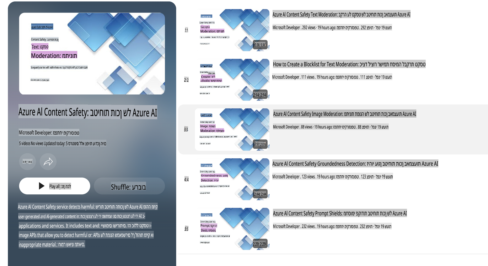

# בטיחות AI עבור מודלים מסוג Phi

משפחת המודלים Phi פותחה בהתאם ל-[Microsoft Responsible AI Standard](https://query.prod.cms.rt.microsoft.com/cms/api/am/binary/RE5cmFl), שהוא סט של דרישות כלל-חברתיות המבוססות על ששת העקרונות הבאים: אחריות, שקיפות, הוגנות, אמינות ובטיחות, פרטיות ואבטחה, ושילוביות, אשר מהווים את [עקרונות ה-AI האחראי של מיקרוסופט](https://www.microsoft.com/ai/responsible-ai).

כמו במודלים הקודמים של Phi, אומץ גישת הערכת בטיחות רב-ממדית ואימון בטיחות לאחר פיתוח, עם צעדים נוספים שננקטו להתחשב ביכולות רב-לשוניות של גרסה זו. הגישה שלנו לאימון והערכות בטיחות, כולל בדיקות בשפות שונות ובקטגוריות סיכון מגוונות, מפורטת ב-[Phi Safety Post-Training Paper](https://arxiv.org/abs/2407.13833). למרות שהמודלים מסוג Phi נהנים מגישה זו, על המפתחים ליישם את שיטות העבודה הטובות ביותר ב-AI אחראי, כולל מיפוי, מדידה והפחתת סיכונים הקשורים לשימוש הספציפי שלהם ולהקשר התרבותי והלשוני.

## שיטות עבודה מומלצות

כמו מודלים אחרים, משפחת המודלים Phi עשויה להתנהג בדרכים שעלולות להיות לא הוגנות, לא אמינות או פוגעניות.

כמה מהתנהגויות המגבלה של SLM ו-LLM שכדאי להיות מודעים אליהן כוללות:

- **איכות השירות:** מודלי Phi מאומנים בעיקר על טקסטים באנגלית. שפות שאינן אנגלית יפגינו ביצועים נמוכים יותר. ניבים באנגלית עם ייצוג נמוך יותר בנתוני האימון עשויים להציג ביצועים פחות טובים מאנגלית אמריקאית סטנדרטית.
- **ייצוג נזקים ושימור סטריאוטיפים:** מודלים אלה עשויים לייצג קבוצות אנשים בצורה מוגזמת או חסרה, למחוק ייצוג של קבוצות מסוימות, או לחזק סטריאוטיפים משפילים או שליליים. למרות אימון הבטיחות שלאחר הפיתוח, מגבלות אלו עשויות להמשיך להתקיים בשל רמות ייצוג שונות של קבוצות שונות או בשל שכיחות דוגמאות של סטריאוטיפים שליליים בנתוני האימון המשקפים דפוסים בעולם האמיתי והטיות חברתיות.
- **תוכן בלתי הולם או פוגעני:** מודלים אלו עשויים לייצר סוגים אחרים של תוכן בלתי הולם או פוגעני, מה שעשוי להפוך אותם ללא מתאימים לשימוש בהקשרים רגישים ללא הפחתות נוספות המתאימות למקרה השימוש.
- **אמינות המידע:** מודלים לשוניים יכולים לייצר תוכן חסר היגיון או להמציא תוכן שנשמע סביר אך אינו מדויק או מעודכן.
- **היקף מוגבל לקוד:** מרבית נתוני האימון של Phi-3 מבוססים על Python ומשתמשים בחבילות נפוצות כמו "typing, math, random, collections, datetime, itertools". אם המודל מייצר סקריפטים ב-Python המשתמשים בחבילות אחרות או סקריפטים בשפות אחרות, אנו ממליצים בחום למשתמשים לאמת ידנית את כל השימושים ב-API.

על המפתחים ליישם את שיטות העבודה הטובות ביותר ב-AI אחראי ולוודא שמקרה השימוש הספציפי שלהם תואם לחוקים ולתקנות הרלוונטיים (לדוגמה, פרטיות, מסחר וכו').

## שיקולים ל-AI אחראי

כמו מודלים לשוניים אחרים, מודלי סדרת Phi עשויים להתנהג בדרכים שעלולות להיות לא הוגנות, לא אמינות או פוגעניות. כמה מהתנהגויות המגבלה שכדאי להיות מודעים אליהן כוללות:

**איכות השירות:** מודלי Phi מאומנים בעיקר על טקסטים באנגלית. שפות שאינן אנגלית יפגינו ביצועים נמוכים יותר. ניבים באנגלית עם ייצוג נמוך יותר בנתוני האימון עשויים להציג ביצועים פחות טובים מאנגלית אמריקאית סטנדרטית.

**ייצוג נזקים ושימור סטריאוטיפים:** מודלים אלה עשויים לייצג קבוצות אנשים בצורה מוגזמת או חסרה, למחוק ייצוג של קבוצות מסוימות, או לחזק סטריאוטיפים משפילים או שליליים. למרות אימון הבטיחות שלאחר הפיתוח, מגבלות אלו עשויות להמשיך להתקיים בשל רמות ייצוג שונות של קבוצות שונות או בשל שכיחות דוגמאות של סטריאוטיפים שליליים בנתוני האימון המשקפים דפוסים בעולם האמיתי והטיות חברתיות.

**תוכן בלתי הולם או פוגעני:** מודלים אלו עשויים לייצר סוגים אחרים של תוכן בלתי הולם או פוגעני, מה שעשוי להפוך אותם ללא מתאימים לשימוש בהקשרים רגישים ללא הפחתות נוספות המתאימות למקרה השימוש.

**אמינות המידע:** מודלים לשוניים יכולים לייצר תוכן חסר היגיון או להמציא תוכן שנשמע סביר אך אינו מדויק או מעודכן.

**היקף מוגבל לקוד:** מרבית נתוני האימון של Phi-3 מבוססים על Python ומשתמשים בחבילות נפוצות כמו "typing, math, random, collections, datetime, itertools". אם המודל מייצר סקריפטים ב-Python המשתמשים בחבילות אחרות או סקריפטים בשפות אחרות, אנו ממליצים בחום למשתמשים לאמת ידנית את כל השימושים ב-API.

על המפתחים ליישם את שיטות העבודה הטובות ביותר ב-AI אחראי ולוודא שמקרה השימוש הספציפי שלהם תואם לחוקים ולתקנות הרלוונטיים (לדוגמה, פרטיות, מסחר וכו'). תחומים חשובים לשיקול כוללים:

**הקצאה:** מודלים עשויים שלא להתאים לתרחישים שעלולים להשפיע באופן משמעותי על סטטוס חוקי או על הקצאת משאבים או הזדמנויות חיים (לדוגמה: דיור, תעסוקה, אשראי וכו') ללא הערכות נוספות וטכניקות להפחתת הטיות.

**תרחישים בסיכון גבוה:** על המפתחים להעריך את התאמת השימוש במודלים בתרחישים בסיכון גבוה שבהם תוצרים לא הוגנים, לא אמינים או פוגעניים עשויים להיות יקרים במיוחד או לגרום לנזק. זה כולל מתן ייעוץ בתחומים רגישים או מקצועיים שבהם דיוק ואמינות הם קריטיים (לדוגמה: ייעוץ משפטי או רפואי). יש ליישם אמצעי הגנה נוספים ברמת האפליקציה בהתאם להקשר הפריסה.

**מידע שגוי:** מודלים עשויים לייצר מידע לא מדויק. על המפתחים לעקוב אחר שיטות עבודה מומלצות לשקיפות וליידע את המשתמשים שהם מתקשרים עם מערכת AI. ברמת האפליקציה, מפתחים יכולים לבנות מנגנוני משוב וצינורות לעיגון תגובות במידע קונטקסטואלי ומותאם למקרה השימוש, טכניקה הידועה בשם Retrieval Augmented Generation (RAG).

**יצירת תוכן מזיק:** על המפתחים להעריך תוצרים בהקשרם ולהשתמש במסווגי בטיחות זמינים או בפתרונות מותאמים למקרה השימוש שלהם.

**שימוש לרעה:** צורות אחרות של שימוש לרעה כמו הונאה, דואר זבל או יצירת תוכנות זדוניות עשויות להיות אפשריות, ועל המפתחים לוודא שהאפליקציות שלהם אינן מפרות חוקים ותקנות רלוונטיים.

### התאמה אישית ובטיחות תוכן ב-AI

לאחר התאמת מודל, אנו ממליצים בחום לנצל את [Azure AI Content Safety](https://learn.microsoft.com/azure/ai-services/content-safety/overview) כדי לעקוב אחר התוכן המיוצר על ידי המודלים, לזהות ולחסום סיכונים פוטנציאליים, איומים ובעיות איכות.

[Azure AI Content Safety](https://learn.microsoft.com/azure/ai-services/content-safety/overview) תומך הן בתוכן טקסטואלי והן בתוכן חזותי. ניתן לפרוס אותו בענן, במכולות מנותקות, ועל התקנים מוטמעים.

## סקירה כללית של Azure AI Content Safety

Azure AI Content Safety אינו פתרון אחיד לכל; ניתן להתאים אותו למדיניות הספציפית של עסקים. בנוסף, המודלים הרב-לשוניים שלו מאפשרים לו להבין שפות רבות בו-זמנית.

- **Azure AI Content Safety**
- **Microsoft Developer**
- **5 סרטונים**

שירות Azure AI Content Safety מזהה תוכן מזיק שנוצר על ידי משתמשים או AI באפליקציות ושירותים. הוא כולל APIs לטקסט ותמונה המאפשרים לזהות חומר מזיק או בלתי הולם.

[AI Content Safety Playlist](https://www.youtube.com/playlist?list=PLlrxD0HtieHjaQ9bJjyp1T7FeCbmVcPkQ)

**כתב ויתור**:  
מסמך זה תורגם באמצעות שירותי תרגום מבוססי בינה מלאכותית. למרות שאנו שואפים לדיוק, יש לקחת בחשבון שתרגומים אוטומטיים עשויים לכלול שגיאות או אי-דיוקים. המסמך המקורי בשפתו המקורית צריך להיחשב כמקור הסמכותי. עבור מידע קריטי, מומלץ להשתמש בתרגום מקצועי על ידי בני אדם. איננו נושאים באחריות לאי-הבנות או לפרשנויות שגויות הנובעות משימוש בתרגום זה.