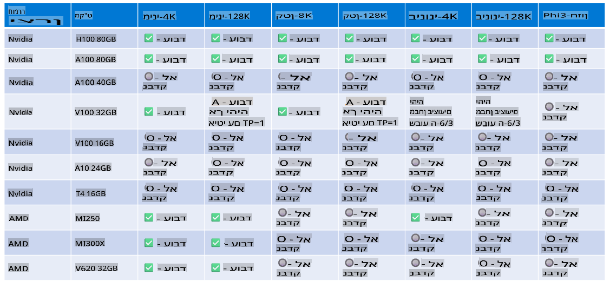

# תמיכה בחומרת Phi

Microsoft Phi מותאם ל-ONNX Runtime ותומך ב-Windows DirectML. הוא עובד היטב עם סוגים שונים של חומרה, כולל GPUs, CPUs ואפילו מכשירים ניידים.

## חומרת מכשירים  
באופן ספציפי, החומרה הנתמכת כוללת:

- GPU SKU: RTX 4090 (DirectML)  
- GPU SKU: 1 A100 80GB (CUDA)  
- CPU SKU: Standard F64s v2 (64 vCPUs, 128 GiB זיכרון)  

## מפרטי מכשירים ניידים  

- Android - Samsung Galaxy S21  
- Apple iPhone 14 ומעלה, מעבד A16/A17  

## מפרט חומרת Phi  

- דרישות מינימליות:  
  - Windows: GPU תואם DirectX 12 ומינימום של 4GB זיכרון כולל  

  - CUDA: GPU של NVIDIA עם Compute Capability >= 7.02  

  

## הרצת onnxruntime על מספר GPUs  

כרגע, דגמי Phi ONNX זמינים רק ל-GPU אחד. ניתן לתמוך במספר GPUs עבור דגם Phi, אך ORT עם 2 GPUs לא מבטיח שיספק יותר תפוקה בהשוואה ל-2 מופעים של ORT. אנא עיינו ב-[ONNX Runtime](https://onnxruntime.ai/) לעדכונים האחרונים.  

ב-[Build 2024 צוות GenAI ONNX](https://youtu.be/WLW4SE8M9i8?si=EtG04UwDvcjunyfC) הכריז שהם אפשרו שימוש במופעים מרובים במקום שימוש במספר GPUs עבור דגמי Phi.  

נכון לעכשיו, זה מאפשר להריץ מופע אחד של onnxruntime או onnxruntime-genai עם משתנה הסביבה CUDA_VISIBLE_DEVICES כמו בדוגמה הבאה:  

```Python
CUDA_VISIBLE_DEVICES=0 python infer.py
CUDA_VISIBLE_DEVICES=1 python infer.py
```  

מוזמנים לחקור עוד על Phi ב-[Azure AI Foundry](https://ai.azure.com)  

**כתב ויתור**:  
מסמך זה תורגם באמצעות שירותי תרגום מבוססי בינה מלאכותית. למרות שאנו שואפים לדיוק, יש להיות מודעים לכך שתרגומים אוטומטיים עשויים להכיל שגיאות או אי-דיוקים. המסמך המקורי בשפתו המקורית צריך להיחשב כמקור הסמכותי. עבור מידע קריטי, מומלץ להשתמש בתרגום מקצועי על ידי בני אדם. איננו נושאים באחריות לכל אי-הבנה או פירוש שגוי הנובעים משימוש בתרגום זה.