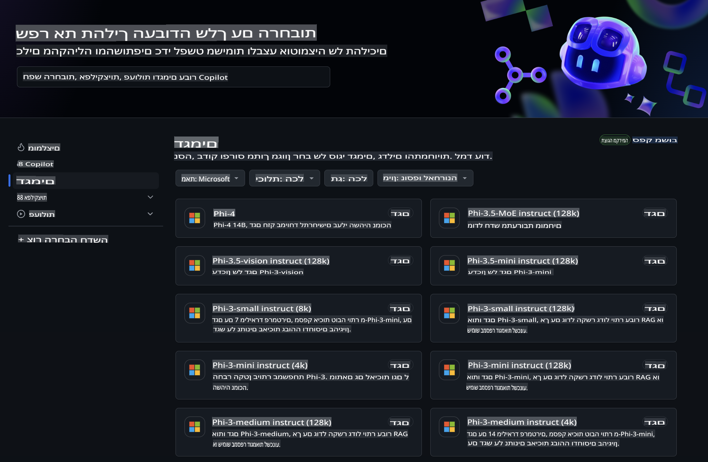
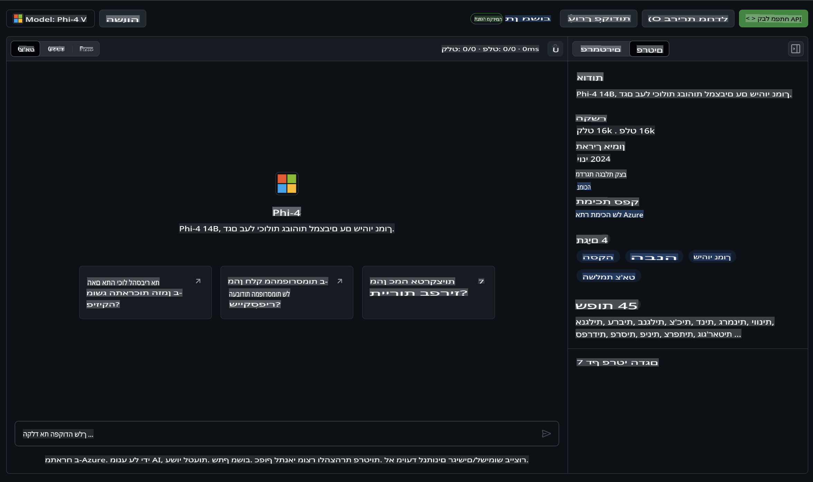
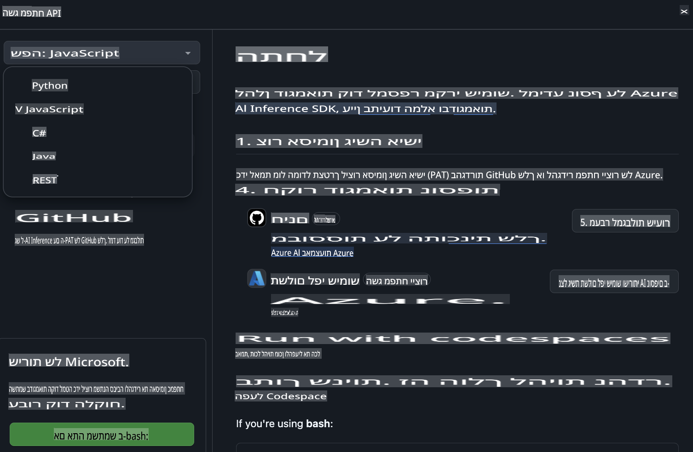
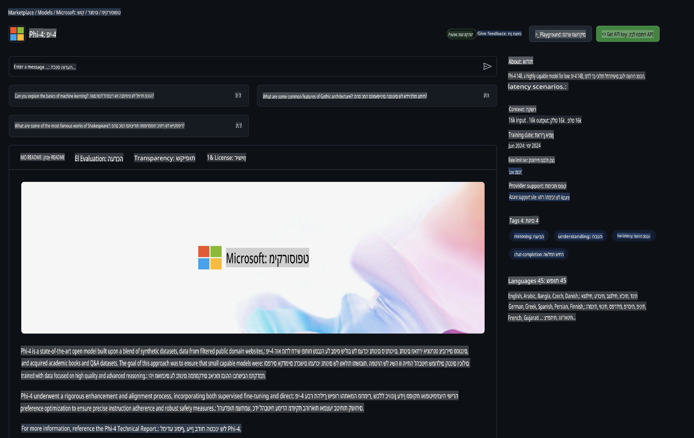

## משפחת Phi ב-GitHub Models

ברוכים הבאים ל-[GitHub Models](https://github.com/marketplace/models)! הכל מוכן עבורכם לחקור מודלים של AI שמתארחים ב-Azure AI.



למידע נוסף על המודלים הזמינים ב-GitHub Models, בקרו ב-[GitHub Model Marketplace](https://github.com/marketplace/models)

## מודלים זמינים

לכל מודל יש אזור ניסוי ייעודי ודוגמאות קוד.



### משפחת Phi בקטלוג המודלים של GitHub

- [Phi-4](https://github.com/marketplace/models/azureml/Phi-4)

- [Phi-3.5-MoE instruct (128k)](https://github.com/marketplace/models/azureml/Phi-3-5-MoE-instruct)

- [Phi-3.5-vision instruct (128k)](https://github.com/marketplace/models/azureml/Phi-3-5-vision-instruct)

- [Phi-3.5-mini instruct (128k)](https://github.com/marketplace/models/azureml/Phi-3-5-mini-instruct)

- [Phi-3-Medium-128k-Instruct](https://github.com/marketplace/models/azureml/Phi-3-medium-128k-instruct)

- [Phi-3-medium-4k-instruct](https://github.com/marketplace/models/azureml/Phi-3-medium-4k-instruct)

- [Phi-3-mini-128k-instruct](https://github.com/marketplace/models/azureml/Phi-3-mini-128k-instruct)

- [Phi-3-mini-4k-instruct](https://github.com/marketplace/models/azureml/Phi-3-mini-4k-instruct)

- [Phi-3-small-128k-instruct](https://github.com/marketplace/models/azureml/Phi-3-small-128k-instruct)

- [Phi-3-small-8k-instruct](https://github.com/marketplace/models/azureml/Phi-3-small-8k-instruct)

## התחלת עבודה

יש כמה דוגמאות בסיסיות שמוכנות להרצה. תוכלו למצוא אותן בתיקיית הדוגמאות. אם תרצו לעבור ישר לשפה המועדפת עליכם, תוכלו למצוא דוגמאות בשפות הבאות:

- Python  
- JavaScript  
- C#  
- Java  
- cURL  

בנוסף, ישנו סביבת Codespaces ייעודית להרצת הדוגמאות והמודלים.



## דוגמאות קוד

להלן קטעי קוד לדוגמא עבור מספר שימושים. למידע נוסף על Azure AI Inference SDK, עיינו בתיעוד המלא ובדוגמאות.

## הגדרות ראשוניות

1. יצירת אסימון גישה אישי  
אין צורך להעניק הרשאות לאסימון. שימו לב שהאסימון יישלח לשירות של Microsoft.

כדי להשתמש בקטעי הקוד הבאים, צרו משתנה סביבה כדי להגדיר את האסימון כמפתח עבור קוד הלקוח.

אם אתם משתמשים ב-bash:  
```
export GITHUB_TOKEN="<your-github-token-goes-here>"
```  
אם אתם משתמשים ב-powershell:  

```
$Env:GITHUB_TOKEN="<your-github-token-goes-here>"
```  

אם אתם משתמשים ב-Windows command prompt:  

```
set GITHUB_TOKEN=<your-github-token-goes-here>
```  

## דוגמאות Python

### התקנת תלותים  
התקינו את Azure AI Inference SDK באמצעות pip (דרישות: Python >=3.8):  

```
pip install azure-ai-inference
```  

### הרצת דוגמה בסיסית  
הדוגמה הזו מדגימה קריאה בסיסית ל-API של השלמת צ'אט. היא משתמשת בנקודת הקצה של GitHub AI Model Inference ובאסימון GitHub שלכם. הקריאה היא סינכרונית.  

```python
import os
from azure.ai.inference import ChatCompletionsClient
from azure.ai.inference.models import SystemMessage, UserMessage
from azure.core.credentials import AzureKeyCredential

endpoint = "https://models.inference.ai.azure.com"
model_name = "Phi-4"
token = os.environ["GITHUB_TOKEN"]

client = ChatCompletionsClient(
    endpoint=endpoint,
    credential=AzureKeyCredential(token),
)

response = client.complete(
    messages=[
        UserMessage(content="I have $20,000 in my savings account, where I receive a 4% profit per year and payments twice a year. Can you please tell me how long it will take for me to become a millionaire? Also, can you please explain the math step by step as if you were explaining it to an uneducated person?"),
    ],
    temperature=0.4,
    top_p=1.0,
    max_tokens=2048,
    model=model_name
)

print(response.choices[0].message.content)
```  

### הרצת שיחה מרובת פניות  
דוגמה זו מדגימה שיחה מרובת פניות עם ה-API של השלמת צ'אט. כאשר משתמשים במודל ליישום צ'אט, תצטרכו לנהל את ההיסטוריה של השיחה ולשלוח את ההודעות האחרונות למודל.  

```
import os
from azure.ai.inference import ChatCompletionsClient
from azure.ai.inference.models import AssistantMessage, SystemMessage, UserMessage
from azure.core.credentials import AzureKeyCredential

token = os.environ["GITHUB_TOKEN"]
endpoint = "https://models.inference.ai.azure.com"
# Replace Model_Name
model_name = "Phi-4"

client = ChatCompletionsClient(
    endpoint=endpoint,
    credential=AzureKeyCredential(token),
)

messages = [
    SystemMessage(content="You are a helpful assistant."),
    UserMessage(content="What is the capital of France?"),
    AssistantMessage(content="The capital of France is Paris."),
    UserMessage(content="What about Spain?"),
]

response = client.complete(messages=messages, model=model_name)

print(response.choices[0].message.content)
```  

### הזרמת הפלט  
כדי לשפר את חוויית המשתמש, כדאי להזרים את התגובה של המודל כך שהטוקן הראשון יופיע מוקדם ותימנעו מהמתנה לתגובות ארוכות.  

```
import os
from azure.ai.inference import ChatCompletionsClient
from azure.ai.inference.models import SystemMessage, UserMessage
from azure.core.credentials import AzureKeyCredential

token = os.environ["GITHUB_TOKEN"]
endpoint = "https://models.inference.ai.azure.com"
# Replace Model_Name
model_name = "Phi-4"

client = ChatCompletionsClient(
    endpoint=endpoint,
    credential=AzureKeyCredential(token),
)

response = client.complete(
    stream=True,
    messages=[
        SystemMessage(content="You are a helpful assistant."),
        UserMessage(content="Give me 5 good reasons why I should exercise every day."),
    ],
    model=model_name,
)

for update in response:
    if update.choices:
        print(update.choices[0].delta.content or "", end="")

client.close()
```  

## שימוש חינמי ומגבלות קצב עבור GitHub Models



[מגבלות הקצב עבור אזור הניסוי והשימוש החינמי ב-API](https://docs.github.com/en/github-models/prototyping-with-ai-models#rate-limits) נועדו לעזור לכם להתנסות במודלים ולבנות אב-טיפוס ליישום ה-AI שלכם. לשימוש מעבר למגבלות הללו, וכדי להביא את היישום שלכם לסקייל, תצטרכו להקצות משאבים מחשבון Azure ולהתחבר משם במקום להשתמש באסימון הגישה האישי של GitHub. אין צורך לשנות שום דבר נוסף בקוד שלכם. השתמשו בקישור זה כדי לגלות כיצד לעבור מעבר למגבלות השכבה החינמית ב-Azure AI.

### גילויים

זכרו שכאשר אתם מתקשרים עם מודל, אתם מתנסים עם AI, ולכן ייתכנו טעויות בתוכן.

הפיצ'ר כפוף למגבלות שונות (כולל בקשות לדקה, בקשות ליום, טוקנים לכל בקשה ובקשות בו-זמניות) ואינו מיועד לשימוש במקרי ייצור.

GitHub Models משתמש ב-Azure AI Content Safety. מסננים אלו אינם ניתנים לכיבוי כחלק מחוויית GitHub Models. אם תחליטו להשתמש במודלים דרך שירות בתשלום, תוכלו להגדיר את מסנני התוכן בהתאם לדרישות שלכם.

שירות זה כפוף לתנאי השחרור המוקדם של GitHub.

**כתב ויתור**:  
מסמך זה תורגם באמצעות שירותי תרגום מבוססי בינה מלאכותית. בעוד שאנו שואפים לדיוק, יש להיות מודעים לכך שתרגומים אוטומטיים עשויים לכלול שגיאות או אי-דיוקים. המסמך המקורי בשפתו המקורית נחשב למקור הסמכותי. למידע קריטי, מומלץ להשתמש בתרגום אנושי מקצועי. איננו נושאים באחריות לאי-הבנות או לפרשנויות שגויות הנובעות משימוש בתרגום זה.