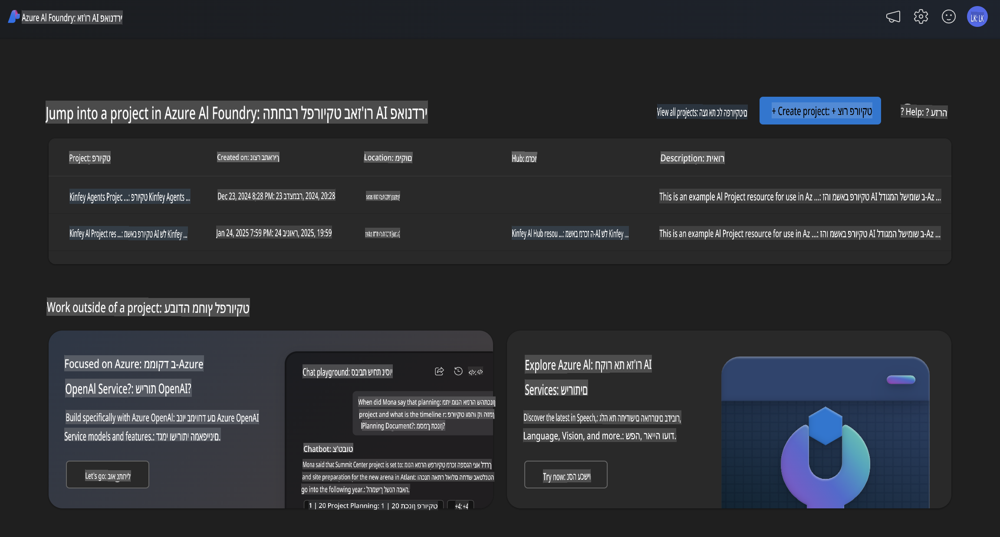
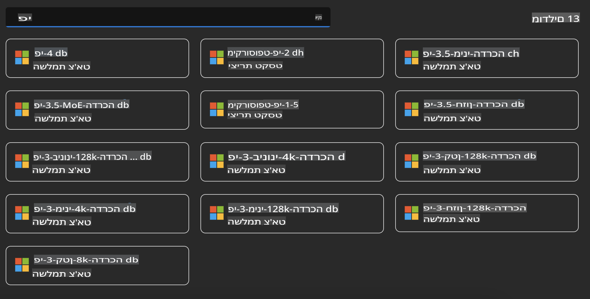
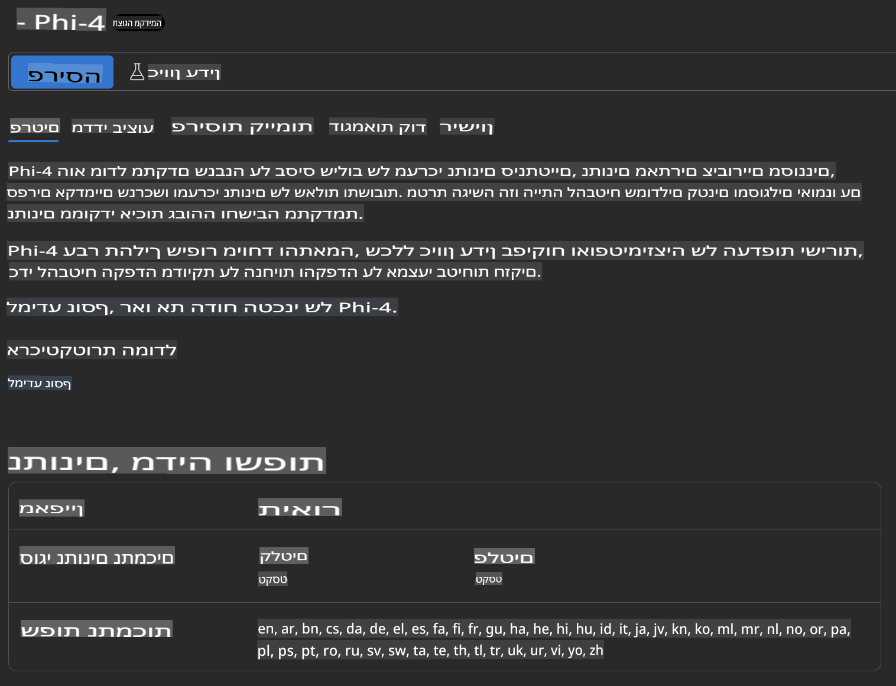
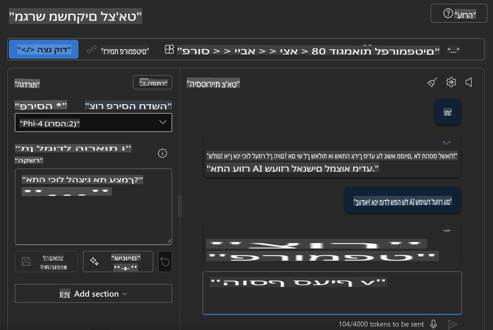

## משפחת Phi ב-Azure AI Foundry

[Azure AI Foundry](https://ai.azure.com) היא פלטפורמה אמינה שמעצימה מפתחים להוביל חדשנות ולעצב את העתיד עם AI בצורה בטוחה, מאובטחת ואחראית.

[Azure AI Foundry](https://ai.azure.com) נועדה עבור מפתחים כדי:

- לבנות יישומי AI גנרטיביים על פלטפורמה ברמה ארגונית.
- לחקור, לבנות, לבדוק ולפרוס באמצעות כלים מתקדמים של AI ומודלים של ML, תוך שמירה על עקרונות של AI אחראי.
- לשתף פעולה עם צוות לאורך כל מחזור החיים של פיתוח היישום.

עם Azure AI Foundry, תוכלו לחקור מגוון רחב של מודלים, שירותים ויכולות, ולהתחיל לבנות יישומי AI שמשרתים בצורה הטובה ביותר את המטרות שלכם. פלטפורמת Azure AI Foundry מאפשרת סקלאביליות שמסייעת להפוך הוכחות היתכנות ליישומים מוכנים לפרודקשן בקלות. ניטור ושיפור מתמשכים תומכים בהצלחה ארוכת טווח.



בנוסף לשימוש בשירות Azure AOAI בתוך Azure AI Foundry, ניתן גם להשתמש במודלים של צד שלישי מתוך Azure AI Foundry Model Catalog. זו אפשרות טובה אם ברצונכם להשתמש ב-Azure AI Foundry כפלטפורמת הפתרונות שלכם בתחום ה-AI.

ניתן לפרוס במהירות את מודלי משפחת Phi דרך ה-Model Catalog ב-Azure AI Foundry.



### **פריסת Phi-4 ב-Azure AI Foundry**



### **בדיקת Phi-4 ב-Azure AI Foundry Playground**



### **הרצת קוד Python לקריאה ל-Azure AI Foundry Phi-4**

```python

import os  
import base64
from openai import AzureOpenAI  
from azure.identity import DefaultAzureCredential, get_bearer_token_provider  
        
endpoint = os.getenv("ENDPOINT_URL", "Your Azure AOAI Service Endpoint")  
deployment = os.getenv("DEPLOYMENT_NAME", "Phi-4")  
      
token_provider = get_bearer_token_provider(  
    DefaultAzureCredential(),  
    "https://cognitiveservices.azure.com/.default"  
)  
  
client = AzureOpenAI(  
    azure_endpoint=endpoint,  
    azure_ad_token_provider=token_provider,  
    api_version="2024-05-01-preview",  
)  
  

chat_prompt = [
    {
        "role": "system",
        "content": "You are an AI assistant that helps people find information."
    },
    {
        "role": "user",
        "content": "can you introduce yourself"
    }
] 
    
# Include speech result if speech is enabled  
messages = chat_prompt 

completion = client.chat.completions.create(  
    model=deployment,  
    messages=messages,
    max_tokens=800,  
    temperature=0.7,  
    top_p=0.95,  
    frequency_penalty=0,  
    presence_penalty=0,
    stop=None,  
    stream=False  
)  
  
print(completion.to_json())  

```

**כתב ויתור**:  
מסמך זה תורגם באמצעות שירותי תרגום מבוססי בינה מלאכותית. למרות שאנו שואפים לדיוק, יש לקחת בחשבון שתרגומים אוטומטיים עלולים להכיל שגיאות או אי-דיוקים. המסמך המקורי בשפתו המקורית נחשב למקור הסמכותי. למידע קריטי, מומלץ להשתמש בתרגום מקצועי אנושי. אנו לא נושאים באחריות לכל אי-הבנה או פרשנות שגויה הנובעות משימוש בתרגום זה.