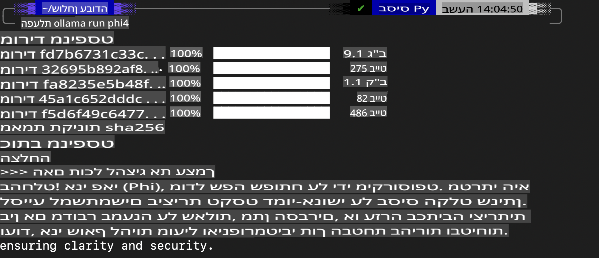
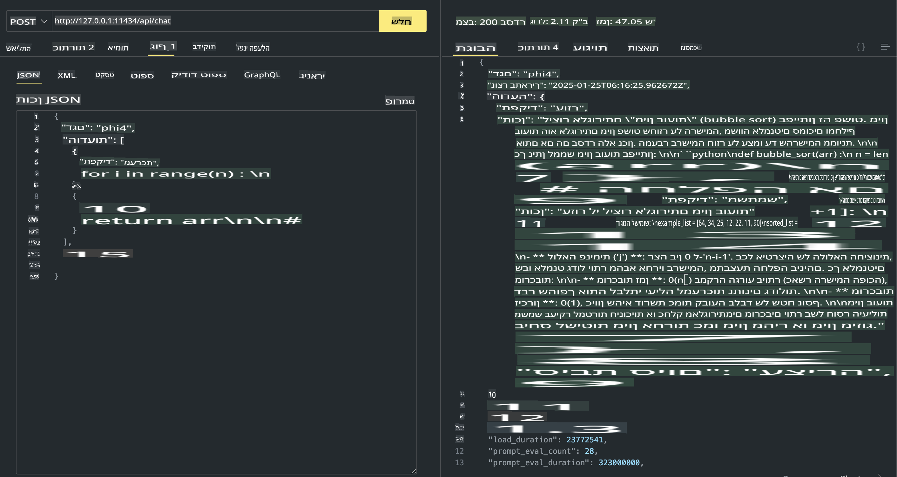

## משפחת Phi ב-Ollama

[Ollama](https://ollama.com) מאפשרת ליותר אנשים לפרוס מודלים פתוחים של LLM או SLM בצורה פשוטה באמצעות סקריפטים, וכן לבנות APIs כדי לתמוך בתרחישי שימוש של Copilot מקומי.

## **1. התקנה**

Ollama תומכת בהרצה על Windows, macOS ו-Linux. ניתן להתקין את Ollama דרך הקישור הזה ([https://ollama.com/download](https://ollama.com/download)). לאחר התקנה מוצלחת, תוכלו להשתמש בסקריפט של Ollama כדי לקרוא ל-Phi-3 ישירות מחלון הטרמינל. ניתן לראות את כל [הספריות הזמינות ב-Ollama](https://ollama.com/library). אם תפתחו את המאגר הזה ב-Codespace, Ollama כבר תהיה מותקנת.

```bash

ollama run phi4

```

> [!NOTE]
> המודל יורד לראשונה כשמריצים אותו בפעם הראשונה. כמובן, ניתן גם לציין מראש את מודל Phi-4 שהורדתם. ניקח את WSL כדוגמה להרצת הפקודה. לאחר שהמודל יורד בהצלחה, ניתן לתקשר איתו ישירות דרך הטרמינל.



## **2. קריאה ל-API של phi-4 מ-Ollama**

אם ברצונכם לקרוא ל-API של Phi-4 שנוצר על ידי Ollama, ניתן להשתמש בפקודה הבאה בטרמינל כדי להפעיל את שרת Ollama.

```bash

ollama serve

```

> [!NOTE]
> אם אתם משתמשים ב-macOS או Linux, שימו לב שאתם עשויים להיתקל בשגיאה הבאה: **"Error: listen tcp 127.0.0.1:11434: bind: address already in use"**. שגיאה זו עשויה להופיע בעת הפעלת הפקודה. ניתן להתעלם ממנה, מכיוון שהיא בדרך כלל מעידה שהשרת כבר פועל, או לחלופין לעצור ולהפעיל מחדש את Ollama:

**macOS**

```bash

brew services restart ollama

```

**Linux**

```bash

sudo systemctl stop ollama

```

Ollama תומכת בשני APIs: generate ו-chat. ניתן לקרוא ל-API של המודל שמסופק על ידי Ollama בהתאם לצרכים שלכם, על ידי שליחת בקשות לשירות המקומי שרץ על פורט 11434.

**Chat**

```bash

curl http://127.0.0.1:11434/api/chat -d '{
  "model": "phi3",
  "messages": [
    {
      "role": "system",
      "content": "Your are a python developer."
    },
    {
      "role": "user",
      "content": "Help me generate a bubble algorithm"
    }
  ],
  "stream": false
  
}'

This is the result in Postman



## Additional Resources

Check the list of available models in Ollama in [their library](https://ollama.com/library).

Pull your model from the Ollama server using this command

```bash
ollama pull phi4
```

Run the model using this command

```bash
ollama run phi4
```

***Note:*** Visit this link [https://github.com/ollama/ollama/blob/main/docs/api.md](https://github.com/ollama/ollama/blob/main/docs/api.md) to learn more

## Calling Ollama from Python

You can use `requests` or `urllib3` to make requests to the local server endpoints used above. However, a popular way to use Ollama in Python is via the [openai](https://pypi.org/project/openai/) SDK, since Ollama provides OpenAI-compatible server endpoints as well.

Here is an example for phi3-mini:

```python
import openai

client = openai.OpenAI(
    base_url="http://localhost:11434/v1",
    api_key="nokeyneeded",
)

response = client.chat.completions.create(
    model="phi4",
    temperature=0.7,
    n=1,
    messages=[
        {"role": "system", "content": "You are a helpful assistant."},
        {"role": "user", "content": "Write a haiku about a hungry cat"},
    ],
)

print("Response:")
print(response.choices[0].message.content)
```

## Calling Ollama from JavaScript 

```javascript
// דוגמה לסיכום קובץ עם Phi-4
script({
    model: "ollama:phi4",
    title: "Summarize with Phi-4",
    system: ["system"],
})

// דוגמה לסיכום
const file = def("FILE", env.files)
$`Summarize ${file} in a single paragraph.`
```

## Calling Ollama from C#

Create a new C# Console application and add the following NuGet package:

```bash
dotnet add package Microsoft.SemanticKernel --version 1.34.0
```

Then replace this code in the `Program.cs` file

```csharp
using Microsoft.SemanticKernel;
using Microsoft.SemanticKernel.ChatCompletion;

// הוספת שירות השלמת שיחה באמצעות נקודת הקצה של שרת Ollama המקומי
#pragma warning disable SKEXP0001, SKEXP0003, SKEXP0010, SKEXP0011, SKEXP0050, SKEXP0052
builder.AddOpenAIChatCompletion(
    modelId: "phi4",
    endpoint: new Uri("http://localhost:11434/"),
    apiKey: "non required");

// הפעלת פרומפט פשוט לשירות השיחה
string prompt = "Write a joke about kittens";
var response = await kernel.InvokePromptAsync(prompt);
Console.WriteLine(response.GetValue<string>());
```

Run the app with the command:

```bash
dotnet run
```

**כתב ויתור**:  
מסמך זה תורגם באמצעות שירותי תרגום מבוססי בינה מלאכותית. למרות שאנו שואפים לדיוק, יש לקחת בחשבון שתרגומים אוטומטיים עשויים להכיל טעויות או אי-דיוקים. המסמך המקורי בשפתו המקורית צריך להיחשב כמקור הסמכותי. עבור מידע קריטי, מומלץ להשתמש בשירותי תרגום מקצועיים על ידי בני אדם. איננו נושאים באחריות לאי-הבנות או לפרשנויות שגויות הנובעות מהשימוש בתרגום זה.