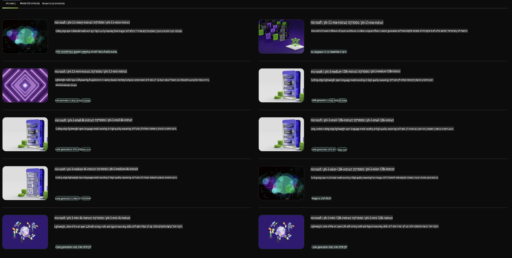

## משפחת Phi ב-NVIDIA NIM

NVIDIA NIM הוא סט של מיקרו-שירותים קלים לשימוש שנועדו להאיץ את הפריסה של מודלים של בינה מלאכותית גנרטיבית בענן, במרכזי נתונים ובתחנות עבודה. ה-NIM מסווגים לפי משפחות מודלים ובסיס מודל פרטני. לדוגמה, NVIDIA NIM עבור מודלים גדולים של שפה (LLMs) מביא את הכוח של מודלים מתקדמים אלה ליישומים ארגוניים, ומספק יכולות עיבוד והבנה של שפה טבעית שאין להן מתחרים.

NIM מקל על צוותי IT ו-DevOps לארח בעצמם מודלים גדולים של שפה (LLMs) בסביבות מנוהלות משלהם, תוך שהוא מספק למפתחים APIs בתקן תעשייתי המאפשרים להם לבנות עוזרים חכמים, צ'טבוטים ואסיסטנטים מבוססי AI שיכולים לשנות את העסק שלהם. תוך שימוש בהאצת GPU מתקדמת של NVIDIA ופריסה בקנה מידה, NIM מציע את הדרך המהירה ביותר להסקה עם ביצועים שאין להם תחרות.

אתם יכולים להשתמש ב-NVIDIA NIM להסקה עם מודלים ממשפחת Phi.



### **דוגמאות - Phi-3-Vision ב-NVIDIA NIM**

דמיינו שיש לכם תמונה (`demo.png`) ואתם רוצים ליצור קוד Python שמעבד את התמונה ושומר גרסה חדשה שלה (`phi-3-vision.jpg`). 

הקוד למעלה מבצע אוטומציה של התהליך על ידי:

1. הגדרת הסביבה והקונפיגורציות הנדרשות.
2. יצירת פרומפט שמנחה את המודל לייצר את קוד ה-Python הדרוש.
3. שליחת הפרומפט למודל ואיסוף הקוד שנוצר.
4. חילוץ והרצת הקוד שנוצר.
5. הצגת התמונה המקורית והתמונה המעובדת.

גישה זו מנצלת את הכוח של AI לאוטומציה של משימות עיבוד תמונה, מה שהופך את התהליך למהיר וקל יותר להשגת המטרות שלכם.

[פתרון קוד לדוגמה](../../../../../code/06.E2E/E2E_Nvidia_NIM_Phi3_Vision.ipynb)

בואו נפרק את הקוד כולו שלב אחר שלב:

1. **התקנת חבילה נדרשת**:
    ```python
    !pip install langchain_nvidia_ai_endpoints -U
    ```
    פקודה זו מתקינה את החבילה `langchain_nvidia_ai_endpoints`, ומבטיחה שהיא בגרסה העדכנית ביותר.

2. **ייבוא מודולים נדרשים**:
    ```python
    from langchain_nvidia_ai_endpoints import ChatNVIDIA
    import getpass
    import os
    import base64
    ```
    ייבוא זה מביא את המודולים הנדרשים לאינטראקציה עם נקודות הקצה של NVIDIA AI, לטיפול מאובטח בסיסמאות, לאינטראקציה עם מערכת ההפעלה, ולביצוע קידוד/פענוח נתונים בפורמט base64.

3. **הגדרת מפתח API**:
    ```python
    if not os.getenv("NVIDIA_API_KEY"):
        os.environ["NVIDIA_API_KEY"] = getpass.getpass("Enter your NVIDIA API key: ")
    ```
    קוד זה בודק אם משתנה הסביבה `NVIDIA_API_KEY` מוגדר. אם לא, הוא מבקש מהמשתמש להזין את מפתח ה-API בצורה מאובטחת.

4. **הגדרת מודל ונתיב לתמונה**:
    ```python
    model = 'microsoft/phi-3-vision-128k-instruct'
    chat = ChatNVIDIA(model=model)
    img_path = './imgs/demo.png'
    ```
    קוד זה מגדיר את המודל לשימוש, יוצר מופע של `ChatNVIDIA` עם המודל שהוגדר, ומגדיר את הנתיב לקובץ התמונה.

5. **יצירת פרומפט טקסטואלי**:
    ```python
    text = "Please create Python code for image, and use plt to save the new picture under imgs/ and name it phi-3-vision.jpg."
    ```
    כאן מוגדר פרומפט טקסט שמנחה את המודל לייצר קוד Python לעיבוד תמונה.

6. **קידוד התמונה ב-base64**:
    ```python
    with open(img_path, "rb") as f:
        image_b64 = base64.b64encode(f.read()).decode()
    image = f''
    ```
    קוד זה קורא את קובץ התמונה, מקודד אותו ב-base64, ויוצר תגית HTML של תמונה עם הנתונים המקודדים.

7. **שילוב טקסט ותמונה בפרומפט**:
    ```python
    prompt = f"{text} {image}"
    ```
    כאן משולבים הפרומפט הטקסטואלי ותגית ה-HTML של התמונה למחרוזת אחת.

8. **יצירת קוד באמצעות ChatNVIDIA**:
    ```python
    code = ""
    for chunk in chat.stream(prompt):
        print(chunk.content, end="")
        code += chunk.content
    ```
    קוד זה שולח את הפרומפט ל-`ChatNVIDIA` ואוסף את התוכן שנוצר לקובץ מחרוזת `code`.

9. **חילוץ קוד Python מתוך התוכן שנוצר**:
    ```python
    begin = code.index('```python') + 9
    code = code[begin:]
    end = code.index('```')
    code = code[:end]
    ```
    כאן מתבצע חילוץ של קוד ה-Python מתוך התוכן שנוצר על ידי הסרת הפורמט של Markdown.

10. **הרצת הקוד שנוצר**:
    ```python
    import subprocess
    result = subprocess.run(["python", "-c", code], capture_output=True)
    ```
    קוד זה מריץ את קוד ה-Python שחולץ כתהליך משנה ולוכד את הפלט שלו.

11. **הצגת התמונות**:
    ```python
    from IPython.display import Image, display
    display(Image(filename='./imgs/phi-3-vision.jpg'))
    display(Image(filename='./imgs/demo.png'))
    ```
    שורות אלה מציגות את התמונות באמצעות המודול `IPython.display`.

**כתב ויתור**:  
מסמך זה תורגם באמצעות שירותי תרגום מבוססי בינה מלאכותית. למרות שאנו שואפים לדיוק, יש לקחת בחשבון שתרגומים אוטומטיים עשויים להכיל שגיאות או אי-דיוקים. המסמך המקורי בשפתו המקורית צריך להיחשב כמקור הסמכותי. עבור מידע קריטי, מומלץ להשתמש בתרגום מקצועי על ידי אדם. איננו נושאים באחריות לאי-הבנות או לפרשנויות שגויות הנובעות משימוש בתרגום זה.