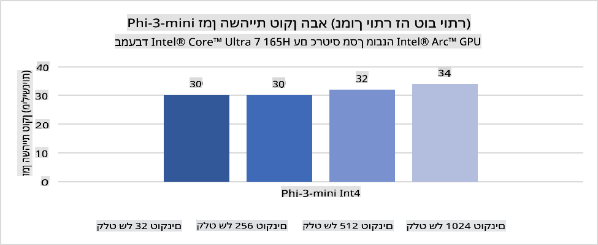
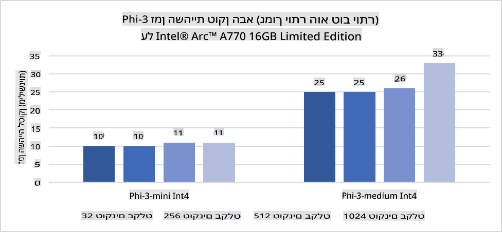
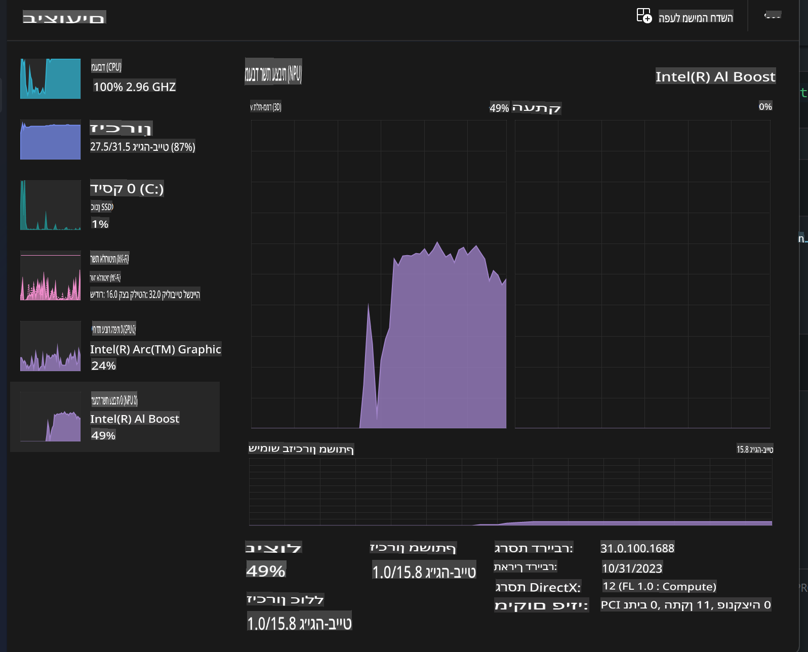
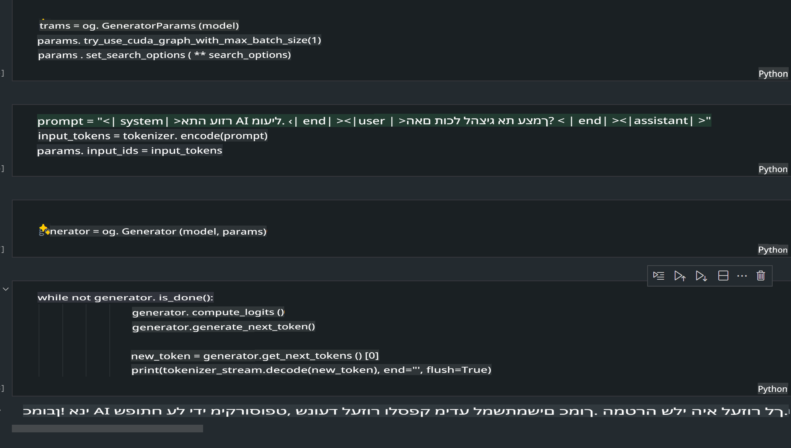
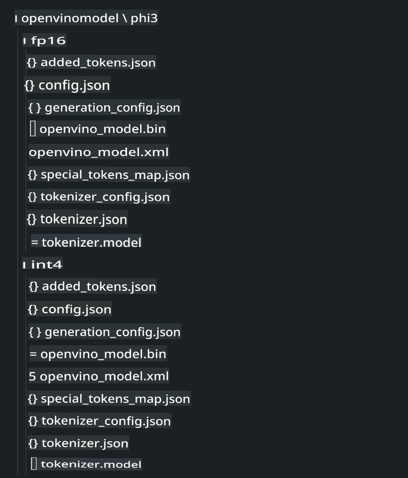
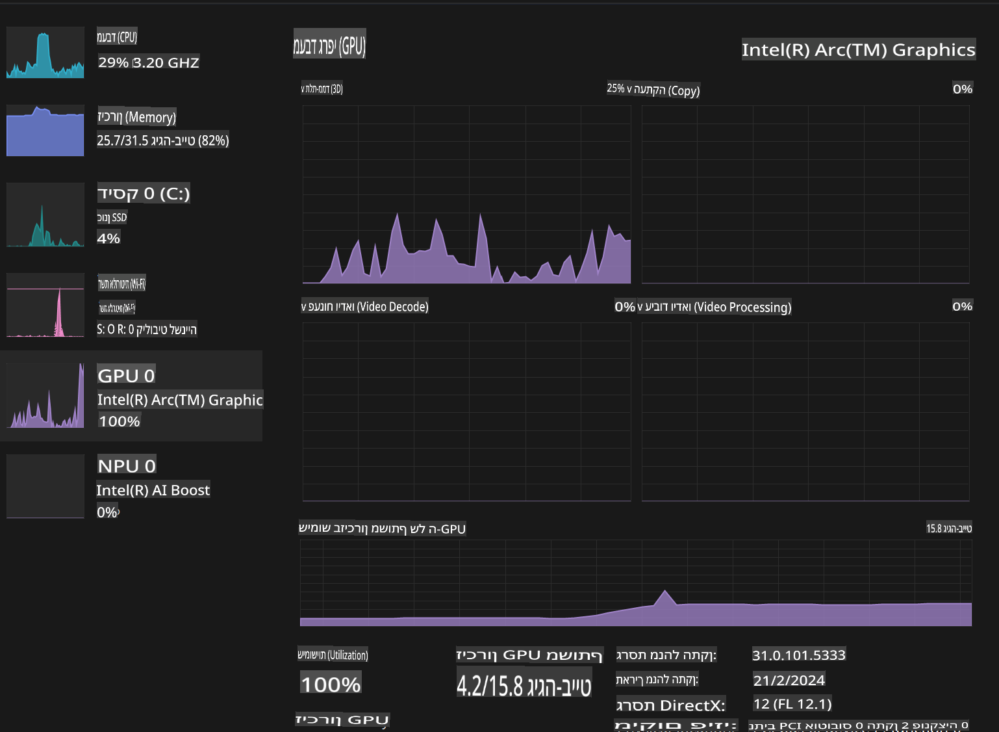

# **Inference Phi-3 במחשב AI**

עם ההתקדמות בבינה מלאכותית יוצרת ושיפור יכולות החומרה במכשירי קצה, יותר ויותר מודלים של בינה מלאכותית יוצרת ניתנים לשילוב במכשירי Bring Your Own Device (BYOD) של המשתמשים. מחשבי AI הם בין המכשירים הללו. החל משנת 2024, אינטל, AMD וקוואלקום משתפות פעולה עם יצרני מחשבים כדי להציג מחשבי AI המאפשרים פריסה של מודלים מקומיים של בינה מלאכותית יוצרת באמצעות התאמות חומרה. בדיון זה נתמקד במחשבי AI של אינטל ונחקור כיצד לפרוס את Phi-3 על מחשב AI של אינטל.

### מה זה NPU

NPU (Neural Processing Unit) הוא מעבד ייעודי או יחידת עיבוד בתוך SoC רחב יותר, שתוכנן במיוחד להאצת פעולות רשתות עצביות ומשימות בינה מלאכותית. בניגוד ל-CPU ו-GPU כללים, ה-NPU מותאם לחישוב מקבילי מבוסס נתונים, מה שהופך אותו ליעיל מאוד בעיבוד נתוני מולטימדיה מאסיביים כמו וידאו ותמונות, וכן בעיבוד נתונים עבור רשתות עצביות. הוא מצטיין במיוחד במשימות הקשורות לבינה מלאכותית, כמו זיהוי דיבור, טשטוש רקע בשיחות וידאו ותהליכי עריכת תמונות או וידאו כמו זיהוי עצמים.

## NPU לעומת GPU

בעוד שמשימות רבות של בינה מלאכותית ולמידת מכונה פועלות על GPUs, יש הבדל מהותי בין GPUs ל-NPUs.  
GPUs ידועים ביכולות החישוב המקבילי שלהם, אך לא כל ה-GPUs יעילים באותה מידה מעבר לעיבוד גרפי. מנגד, NPUs נבנו במיוחד עבור חישובים מורכבים הקשורים לפעולות רשתות עצביות, מה שהופך אותם ליעילים במיוחד במשימות בינה מלאכותית.

לסיכום, ה-NPUs הם "המתמטיקאים" שמאיצים את החישובים של הבינה המלאכותית ומשחקים תפקיד מרכזי בעידן המתפתח של מחשבי AI!

***דוגמה זו מבוססת על המעבד החדש ביותר של אינטל, Intel Core Ultra Processor***

## **1. שימוש ב-NPU להרצת מודל Phi-3**

מכשיר ה-NPU של אינטל הוא מאיץ אינפרנס של בינה מלאכותית המוטמע במעבדי הלקוח של אינטל, החל מהדור Intel® Core™ Ultra (בעבר נקרא Meteor Lake). הוא מאפשר ביצוע יעיל אנרגטית של משימות רשתות עצביות מלאכותיות.





**ספריית ההאצה של Intel NPU**

ספריית ההאצה של Intel NPU [https://github.com/intel/intel-npu-acceleration-library](https://github.com/intel/intel-npu-acceleration-library) היא ספריית Python שנועדה לשפר את יעילות היישומים שלכם על ידי שימוש בכוח של ה-NPU של אינטל לביצוע חישובים מהירים על חומרה תואמת.

דוגמה ל-Phi-3-mini על מחשב AI המופעל על ידי מעבדי Intel® Core™ Ultra.


התקנת ספריית Python באמצעות pip

```bash

   pip install intel-npu-acceleration-library

```

***הערה*** הפרויקט עדיין בפיתוח, אך מודל הייחוס כבר שלם מאוד.

### **הרצת Phi-3 עם ספריית ההאצה של Intel NPU**

באמצעות ההאצה של Intel NPU, ספרייה זו אינה משפיעה על תהליך הקידוד המסורתי. רק צריך להשתמש בספרייה הזו כדי לבצע כימות של מודל Phi-3 המקורי, לדוגמה FP16, INT8, INT4, כמו:

```python
from transformers import AutoTokenizer, pipeline,TextStreamer
from intel_npu_acceleration_library import NPUModelForCausalLM, int4
from intel_npu_acceleration_library.compiler import CompilerConfig
import warnings

model_id = "microsoft/Phi-3-mini-4k-instruct"

compiler_conf = CompilerConfig(dtype=int4)
model = NPUModelForCausalLM.from_pretrained(
    model_id, use_cache=True, config=compiler_conf, attn_implementation="sdpa"
).eval()

tokenizer = AutoTokenizer.from_pretrained(model_id)

text_streamer = TextStreamer(tokenizer, skip_prompt=True)
```

לאחר שהכימות מצליח, ממשיכים בביצוע כדי לקרוא ל-NPU להריץ את מודל Phi-3.

```python
generation_args = {
   "max_new_tokens": 1024,
   "return_full_text": False,
   "temperature": 0.3,
   "do_sample": False,
   "streamer": text_streamer,
}

pipe = pipeline(
   "text-generation",
   model=model,
   tokenizer=tokenizer,
)

query = "<|system|>You are a helpful AI assistant.<|end|><|user|>Can you introduce yourself?<|end|><|assistant|>"

with warnings.catch_warnings():
    warnings.simplefilter("ignore")
    pipe(query, **generation_args)
```

בעת הרצת הקוד, ניתן לצפות במצב הפעולה של ה-NPU באמצעות מנהל המשימות.



***דוגמאות***: [AIPC_NPU_DEMO.ipynb](../../../../../code/03.Inference/AIPC/AIPC_NPU_DEMO.ipynb)

## **2. שימוש ב-DirectML + ONNX Runtime להרצת מודל Phi-3**

### **מה זה DirectML**

[DirectML](https://github.com/microsoft/DirectML) היא ספריית DirectX 12 לביצועים גבוהים ולמידת מכונה מואצת חומרה. DirectML מספקת האצה באמצעות GPU למשימות למידת מכונה נפוצות על מגוון רחב של חומרות ודרייברים תומכים, כולל כל ה-GPU התומכים ב-DirectX 12 מיצרנים כמו AMD, אינטל, NVIDIA וקוואלקום.

כאשר משתמשים בה בנפרד, ה-API של DirectML היא ספריית DirectX 12 ברמת נמוכה, המתאימה ליישומים עתירי ביצועים כמו משחקים ויישומי זמן אמת. האינטראופרטיביות החלקה של DirectML עם Direct3D 12, כמו גם העלות הנמוכה והתאימות שלה על פני חומרות, הופכים אותה לאידיאלית להאצת למידת מכונה כאשר יש צורך בביצועים גבוהים ובתוצאות אמינות על פני חומרות שונות.

***הערה***: הגרסה האחרונה של DirectML כבר תומכת ב-NPU (https://devblogs.microsoft.com/directx/introducing-neural-processor-unit-npu-support-in-directml-developer-preview/)

### DirectML ו-CUDA מבחינת יכולות וביצועים:

**DirectML** היא ספריית למידת מכונה שפותחה על ידי מיקרוסופט. היא נועדה להאיץ משימות למידת מכונה במכשירי Windows.
- מבוססת DX12: DirectML נבנתה על גבי DirectX 12, המספקת תמיכה רחבה על פני GPUs שונים.
- תמיכה רחבה: בזכות DX12, DirectML יכולה לעבוד עם כל GPU התומך ב-DX12, כולל GPUs משולבים.
- עיבוד תמונה: DirectML מתאימה למשימות כמו זיהוי תמונה, זיהוי עצמים ועוד.
- קלות התקנה: ההתקנה פשוטה ואינה דורשת SDKs מיוחדים.
- ביצועים: במקרים מסוימים, DirectML מהירה ויעילה.
- מגבלות: במקרים מסוימים, היא עשויה להיות איטית יותר, במיוחד ב-batch sizes גדולים.

**CUDA** היא פלטפורמת חישוב מקבילי של NVIDIA.
- ייעודית ל-NVIDIA: מותאמת במיוחד ל-GPUs של NVIDIA.
- אופטימיזציה גבוהה: מספקת ביצועים מצוינים למשימות מואצות GPU.
- נפוצה מאוד: נתמכת על ידי מסגרות למידת מכונה רבות.
- התאמה אישית: מאפשרת כוונון לפרטים.
- מגבלות: תלויה בחומרת NVIDIA בלבד.

### בחירה בין DirectML ל-CUDA

הבחירה תלויה בצרכים, בחומרה הזמינה ובהעדפות. אם יש צורך בתמיכה רחבה והתקנה פשוטה, DirectML עשויה להתאים. אם יש חומרת NVIDIA וצורך בביצועים אופטימליים, CUDA היא הבחירה.

### **בינה מלאכותית יוצרת עם ONNX Runtime**

בעידן הבינה המלאכותית, ניידות המודלים חשובה מאוד. ONNX Runtime מאפשרת פריסה קלה של מודלים מאומנים למכשירים שונים. בעזרת ONNX Runtime, ניתן לבצע אינפרנס של מודלים באמצעות Python, C#, C / C++.  
למשל, ניתן לפרוס על iPhone באמצעות C++ API.

[Sample Code](https://github.com/Azure-Samples/Phi-3MiniSamples/tree/main/onnx)

***קומפילציה של ספריית ONNX Runtime***

```bash

winget install --id=Kitware.CMake  -e

git clone https://github.com/microsoft/onnxruntime.git

cd .\onnxruntime\

./build.bat --build_shared_lib --skip_tests --parallel --use_dml --config Release

cd ../

git clone https://github.com/microsoft/onnxruntime-genai.git

cd .\onnxruntime-genai\

mkdir ort

cd ort

mkdir include

mkdir lib

copy ..\onnxruntime\include\onnxruntime\core\providers\dml\dml_provider_factory.h ort\include

copy ..\onnxruntime\include\onnxruntime\core\session\onnxruntime_c_api.h ort\include

copy ..\onnxruntime\build\Windows\Release\Release\*.dll ort\lib

copy ..\onnxruntime\build\Windows\Release\Release\onnxruntime.lib ort\lib

python build.py --use_dml


```

**התקנת הספרייה**

```bash

pip install .\onnxruntime_genai_directml-0.3.0.dev0-cp310-cp310-win_amd64.whl

```

זו תוצאת ההרצה:



***דוגמאות***: [AIPC_DirectML_DEMO.ipynb](../../../../../code/03.Inference/AIPC/AIPC_DirectML_DEMO.ipynb)

## **3. שימוש ב-Intel OpenVino להרצת מודל Phi-3**

### **מה זה OpenVINO**

[OpenVINO](https://github.com/openvinotoolkit/openvino) הוא כלי קוד פתוח לאופטימיזציה ופריסה של מודלים ללמידה עמוקה. הוא משפר ביצועים למודלים של ראייה, שמע ושפה ממסגרות פופולריות כמו TensorFlow ו-PyTorch.  
OpenVINO ניתן לשימוש בשילוב עם CPU ו-GPU להרצת מודל Phi-3.

***הערה***: נכון לעכשיו, OpenVINO אינו תומך ב-NPU.

### **התקנת ספריית OpenVINO**

```bash

 pip install git+https://github.com/huggingface/optimum-intel.git

 pip install git+https://github.com/openvinotoolkit/nncf.git

 pip install openvino-nightly

```

### **הרצת Phi-3 עם OpenVINO**

בדומה ל-NPU, OpenVINO מבצע קריאה למודלים באמצעות מודלים כמותיים. יש לבצע כימות למודל Phi-3 תחילה באמצעות כלי שורת הפקודה optimum-cli.

**INT4**

```bash

optimum-cli export openvino --model "microsoft/Phi-3-mini-4k-instruct" --task text-generation-with-past --weight-format int4 --group-size 128 --ratio 0.6  --sym  --trust-remote-code ./openvinomodel/phi3/int4

```

**FP16**

```bash

optimum-cli export openvino --model "microsoft/Phi-3-mini-4k-instruct" --task text-generation-with-past --weight-format fp16 --trust-remote-code ./openvinomodel/phi3/fp16

```

התוצאה המומרת נראית כך:



טעינת נתיבי המודל (model_dir), קונפיגורציות (ov_config = {"PERFORMANCE_HINT": "LATENCY", "NUM_STREAMS": "1", "CACHE_DIR": ""}), ומכשירי האצת חומרה (GPU.0) דרך OVModelForCausalLM.

```python

ov_model = OVModelForCausalLM.from_pretrained(
     model_dir,
     device='GPU.0',
     ov_config=ov_config,
     config=AutoConfig.from_pretrained(model_dir, trust_remote_code=True),
     trust_remote_code=True,
)

```

בעת הרצת הקוד, ניתן לצפות במצב הפעולה של ה-GPU באמצעות מנהל המשימות.



***דוגמאות***: [AIPC_OpenVino_Demo.ipynb](../../../../../code/03.Inference/AIPC/AIPC_OpenVino_Demo.ipynb)

### ***הערה***: שלוש השיטות לעיל כולן בעלות יתרונות משלהן, אך מומלץ להשתמש בהאצת NPU לאינפרנס במחשבי AI.

**כתב ויתור**:  
מסמך זה תורגם באמצעות שירותי תרגום מבוססי בינה מלאכותית. למרות שאנו שואפים לדיוק, יש להיות מודעים לכך שתרגומים אוטומטיים עשויים להכיל שגיאות או אי-דיוקים. המסמך המקורי בשפתו המקורית צריך להיחשב כמקור הסמכותי. למידע קריטי, מומלץ להשתמש בתרגום מקצועי על ידי אדם. אנו לא נושאים באחריות לאי-הבנות או לפרשנויות שגויות הנובעות משימוש בתרגום זה.