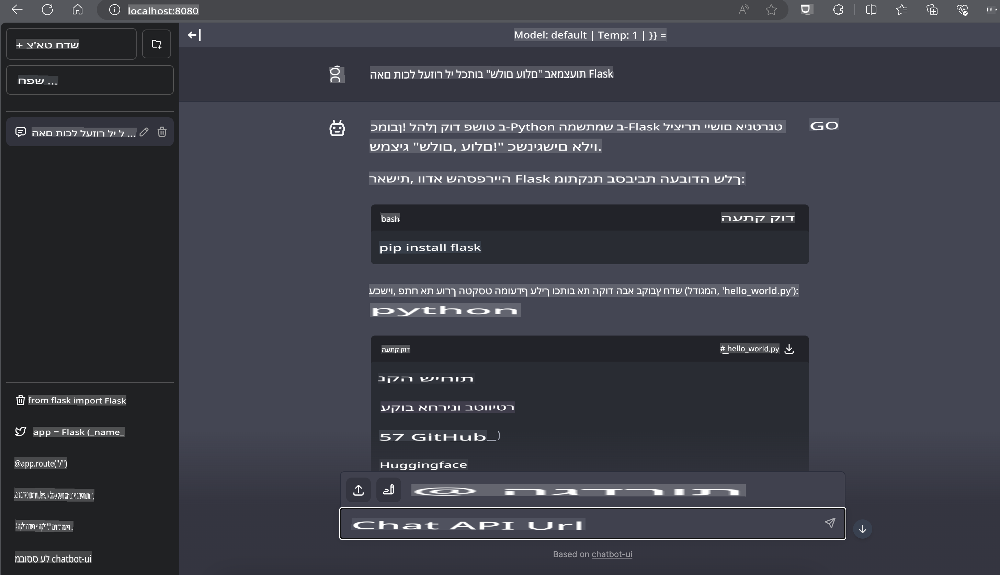

# **Inference Phi-3 ב-Nvidia Jetson**

Nvidia Jetson היא סדרת לוחות מחשוב משובצים של חברת Nvidia. הדגמים Jetson TK1, TX1 ו-TX2 כוללים מעבד Tegra (או SoC) של Nvidia, שמשלב יחידת עיבוד מרכזית (CPU) בארכיטקטורת ARM. Jetson היא מערכת חסכונית באנרגיה, שתוכננה להאיץ יישומי למידת מכונה. Nvidia Jetson משמשת מפתחים מקצועיים ליצירת מוצרים פורצי דרך בתחום הבינה המלאכותית בכל התעשיות, וכן סטודנטים וחובבים ללמידה מעשית של AI ולבנייה של פרויקטים מרשימים. SLM מיושמת במכשירי קצה כמו Jetson, מה שמאפשר יישום טוב יותר של תרחישים תעשייתיים של יישומי Generative AI.

## פריסה על NVIDIA Jetson:
מפתחים שעובדים על רובוטיקה אוטונומית ומכשירים משובצים יכולים לנצל את Phi-3 Mini. הגודל הקטן יחסית של Phi-3 הופך אותו לאידיאלי לפריסה במכשירי קצה. הפרמטרים כוונו בקפידה במהלך האימון, מה שמבטיח דיוק גבוה בתגובות.

### אופטימיזציית TensorRT-LLM:
ספריית [TensorRT-LLM של NVIDIA](https://github.com/NVIDIA/TensorRT-LLM?WT.mc_id=aiml-138114-kinfeylo) מבצעת אופטימיזציה להסקת מודלים גדולים של שפה. היא תומכת בחלון ההקשר הארוך של Phi-3 Mini, ומשפרת גם את התפוקה וגם את זמן התגובה. האופטימיזציות כוללות טכניקות כמו LongRoPE, FP8 ו-inflight batching.

### זמינות ופריסה:
מפתחים יכולים לחקור את Phi-3 Mini עם חלון הקשר של 128K ב-[NVIDIA's AI](https://www.nvidia.com/en-us/ai-data-science/generative-ai/). הוא ארוז כ-NIM של NVIDIA, מיקרו-שירות עם API סטנדרטי שניתן לפרוס בכל מקום. בנוסף, ניתן למצוא את [מימושי TensorRT-LLM ב-GitHub](https://github.com/NVIDIA/TensorRT-LLM).

## **1. הכנה**

a. Jetson Orin NX / Jetson NX

b. JetPack 5.1.2+
   
c. Cuda 11.8
   
d. Python 3.8+

## **2. הרצת Phi-3 על Jetson**

ניתן לבחור ב-[Ollama](https://ollama.com) או [LlamaEdge](https://llamaedge.com).

אם ברצונכם להשתמש ב-gguf בענן ובמכשירי קצה בו-זמנית, ניתן להבין את LlamaEdge כ-WasmEdge (WasmEdge הוא runtime קל משקל, בעל ביצועים גבוהים וניתן להרחבה עבור WebAssembly, שמתאים ליישומים בענן, בקצה ובסביבות מבוזרות. הוא תומך ביישומים serverless, פונקציות משובצות, מיקרו-שירותים, חוזים חכמים ומכשירי IoT). ניתן לפרוס את המודל הכמותי של gguf למכשירי קצה ולענן דרך LlamaEdge.


להלן השלבים לשימוש:

1. התקינו והורידו ספריות וקבצים רלוונטיים:

```bash

curl -sSf https://raw.githubusercontent.com/WasmEdge/WasmEdge/master/utils/install.sh | bash -s -- --plugin wasi_nn-ggml

curl -LO https://github.com/LlamaEdge/LlamaEdge/releases/latest/download/llama-api-server.wasm

curl -LO https://github.com/LlamaEdge/chatbot-ui/releases/latest/download/chatbot-ui.tar.gz

tar xzf chatbot-ui.tar.gz

```

**הערה**: הקבצים llama-api-server.wasm ו-chatbot-ui צריכים להיות באותה תיקייה.

2. הריצו סקריפטים בטרמינל:

```bash

wasmedge --dir .:. --nn-preload default:GGML:AUTO:{Your gguf path} llama-api-server.wasm -p phi-3-chat

```

להלן תוצאת ההרצה:



***דוגמת קוד*** [מחברת WASM לדוגמת Phi-3 Mini](https://github.com/Azure-Samples/Phi-3MiniSamples/tree/main/wasm)

לסיכום, Phi-3 Mini מייצג קפיצת מדרגה במידול שפה, תוך שילוב יעילות, מודעות להקשר ויכולות אופטימיזציה של NVIDIA. בין אם אתם בונים רובוטים או יישומי קצה, Phi-3 Mini הוא כלי עוצמתי שכדאי להכיר.

**כתב ויתור**:  
מסמך זה תורגם באמצעות שירותי תרגום מבוססי בינה מלאכותית. למרות שאנו שואפים לדיוק, יש לקחת בחשבון שתרגומים אוטומטיים עשויים לכלול שגיאות או אי-דיוקים. המסמך המקורי בשפתו המקורית צריך להיחשב כמקור הסמכותי. למידע קריטי, מומלץ להשתמש בשירותי תרגום מקצועיים על ידי בני אדם. איננו נושאים באחריות לאי-הבנות או לפרשנויות שגויות הנובעות משימוש בתרגום זה.