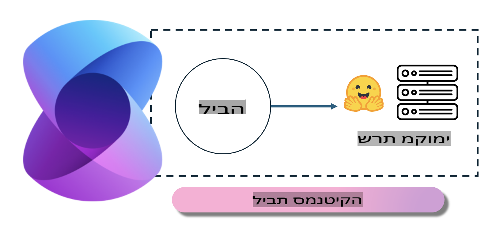
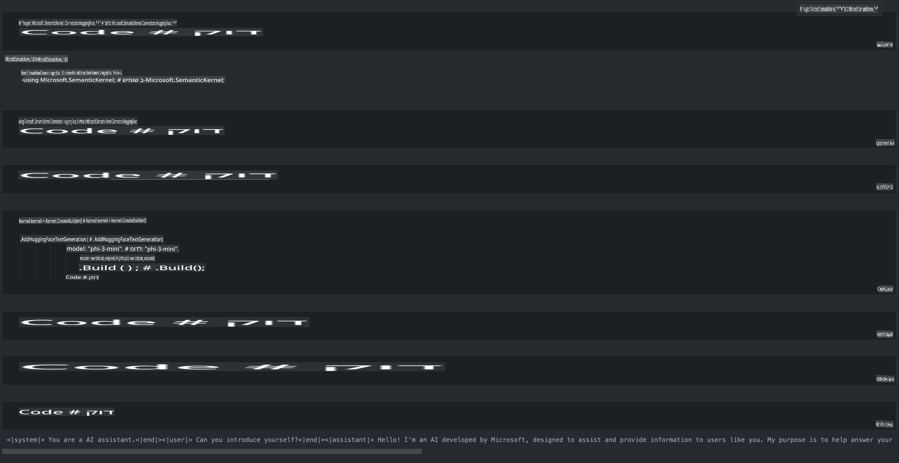

# **הפעלת Phi-3 בשרת מקומי**

ניתן לפרוס את Phi-3 על שרת מקומי. משתמשים יכולים לבחור ב-[Ollama](https://ollama.com) או ב-[LM Studio](https://llamaedge.com), או לכתוב קוד משלהם. ניתן להתחבר לשירותים המקומיים של Phi-3 דרך [Semantic Kernel](https://github.com/microsoft/semantic-kernel?WT.mc_id=aiml-138114-kinfeylo) או [Langchain](https://www.langchain.com/) כדי לבנות אפליקציות Copilot.

## **שימוש ב-Semantic Kernel לגישה ל-Phi-3-mini**

באפליקציית Copilot, אנו יוצרים אפליקציות דרך Semantic Kernel / LangChain. מסגרת אפליקציות מסוג זה בדרך כלל תואמת ל-Azure OpenAI Service / OpenAI models, וגם יכולה לתמוך במודלים בקוד פתוח מ-Hugging Face ומודלים מקומיים. מה עושים אם רוצים להשתמש ב-Semantic Kernel כדי לגשת ל-Phi-3-mini? באמצעות .NET כדוגמה, ניתן לשלב את זה עם Hugging Face Connector ב-Semantic Kernel. כברירת מחדל, זה יכול להתאים ל-id של המודל ב-Hugging Face (בפעם הראשונה שמשתמשים בו, המודל יורד מ-Hugging Face, וזה לוקח זמן רב). ניתן גם להתחבר לשירות מקומי שנבנה מראש. בהשוואה בין השניים, אנו ממליצים על האפשרות השנייה, מכיוון שהיא מספקת יותר אוטונומיה, במיוחד באפליקציות ארגוניות.

מהתרשים ניתן לראות כי גישה לשירותים מקומיים דרך Semantic Kernel מאפשרת חיבור קל לשרת המודל העצמאי של Phi-3-mini. הנה תוצאת הרצה:

***קוד לדוגמה*** https://github.com/kinfey/Phi3MiniSamples/tree/main/semantickernel

**כתב ויתור**:  
מסמך זה תורגם באמצעות שירותי תרגום מבוססי בינה מלאכותית. למרות שאנו שואפים לדיוק, יש להיות מודעים לכך שתרגומים אוטומטיים עלולים להכיל שגיאות או אי-דיוקים. המסמך המקורי בשפתו המקורית יש להחשיב כמקור הסמכותי. עבור מידע קריטי, מומלץ להשתמש בתרגום מקצועי על ידי אדם. איננו נושאים באחריות לאי-הבנות או לפרשנויות שגויות הנובעות משימוש בתרגום זה.