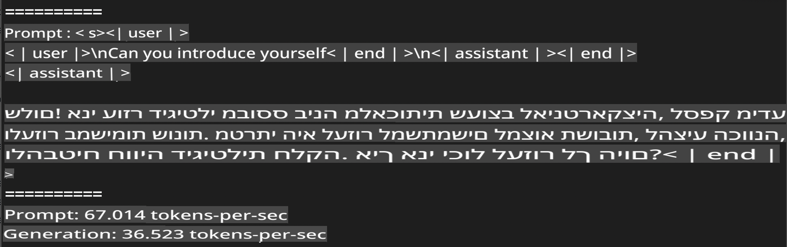
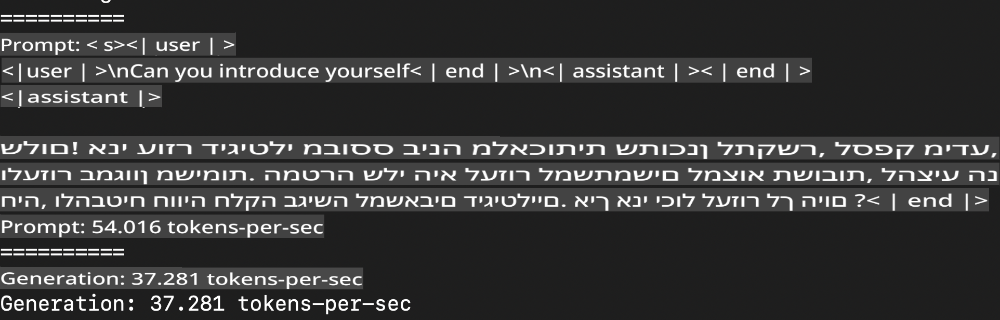
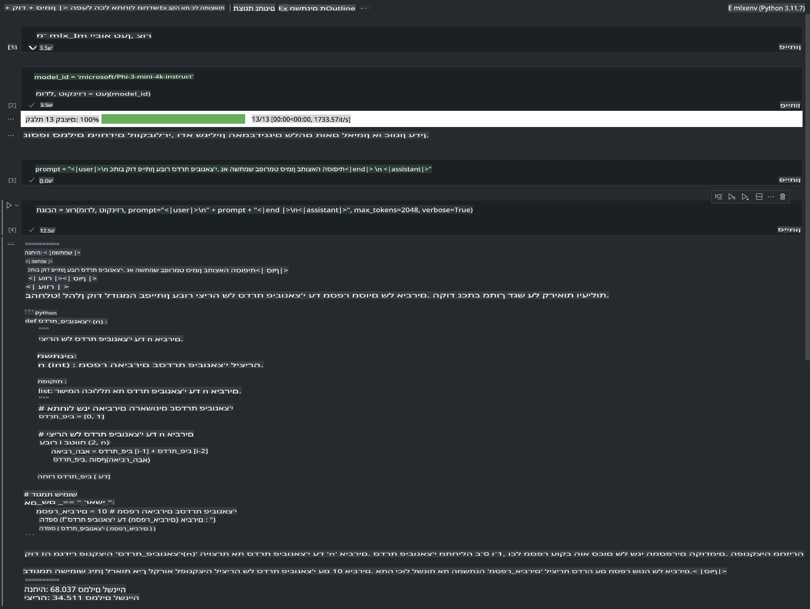

# **הסקת מסקנות עם Phi-3 באמצעות Apple MLX Framework**

## **מהו MLX Framework**

MLX הוא מסגרת עבודה למחקר למידת מכונה המיועדת לשימוש במעבדי Apple Silicon, פרי פיתוח של צוות מחקר למידת מכונה של אפל.

MLX תוכנן על ידי חוקרי למידת מכונה עבור חוקרי למידת מכונה. המסגרת מיועדת להיות ידידותית למשתמש אך יעילה לאימון ופריסת מודלים. בנוסף, התכנון של המסגרת פשוט מבחינה רעיונית, במטרה להקל על החוקרים להרחיב ולשפר את MLX ולאפשר חקר מהיר של רעיונות חדשים.

ניתן להאיץ מודלים של LLMs במכשירים מבוססי Apple Silicon באמצעות MLX, והרצת המודלים מקומית מתבצעת בנוחות רבה.

## **שימוש ב-MLX להסקת מסקנות עם Phi-3-mini**

### **1. הגדרת סביבת MLX**

1. Python 3.11.x  
2. התקנת ספריית MLX  

```bash

pip install mlx-lm

```

### **2. הרצת Phi-3-mini בטרמינל באמצעות MLX**

```bash

python -m mlx_lm.generate --model microsoft/Phi-3-mini-4k-instruct --max-token 2048 --prompt  "<|user|>\nCan you introduce yourself<|end|>\n<|assistant|>"

```

התוצאה (הסביבה שלי היא Apple M1 Max, זיכרון 64GB) היא:



### **3. כיווץ Phi-3-mini ל-INT4 באמצעות MLX בטרמינל**

```bash

python -m mlx_lm.convert --hf-path microsoft/Phi-3-mini-4k-instruct

```

***הערה:*** ניתן לכווץ את המודל באמצעות הפונקציה mlx_lm.convert, והכיווץ המוגדר כברירת מחדל הוא INT4. בדוגמה זו, המודל Phi-3-mini מכווץ ל-INT4.

לאחר הכיווץ, המודל יישמר בספרייה המוגדרת כברירת מחדל ./mlx_model.  
ניתן לבדוק את המודל המכווץ באמצעות MLX מהטרמינל:

```bash

python -m mlx_lm.generate --model ./mlx_model/ --max-token 2048 --prompt  "<|user|>\nCan you introduce yourself<|end|>\n<|assistant|>"

```

התוצאה היא:



### **4. הרצת Phi-3-mini באמצעות MLX ב-Jupyter Notebook**



***הערה:*** ניתן לקרוא את הדוגמה הזו [לחצו על הקישור](../../../../../code/03.Inference/MLX/MLX_DEMO.ipynb)

## **משאבים**

1. למידע נוסף על Apple MLX Framework [https://ml-explore.github.io](https://ml-explore.github.io/mlx/build/html/index.html)

2. מאגר GitHub של Apple MLX [https://github.com/ml-explore](https://github.com/ml-explore)

**כתב ויתור**:  
מסמך זה תורגם באמצעות שירותי תרגום מבוססי בינה מלאכותית. למרות שאנו שואפים לדיוק, יש לקחת בחשבון שתרגומים אוטומטיים עשויים להכיל שגיאות או אי-דיוקים. המסמך המקורי בשפתו המקורית צריך להיחשב כמקור הסמכותי. עבור מידע קריטי, מומלץ להשתמש בתרגום מקצועי על ידי בני אדם. איננו נושאים באחריות לאי-הבנות או לפרשנויות שגויות הנובעות משימוש בתרגום זה.