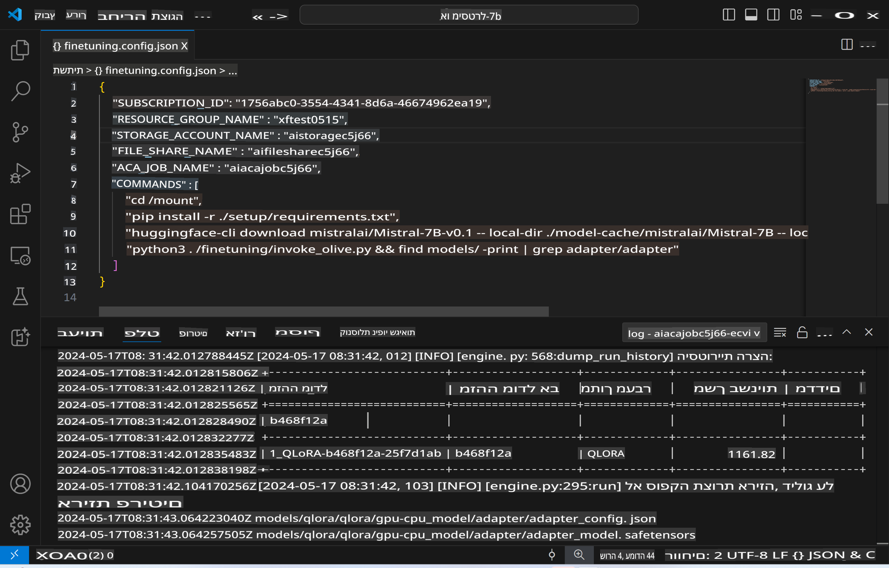
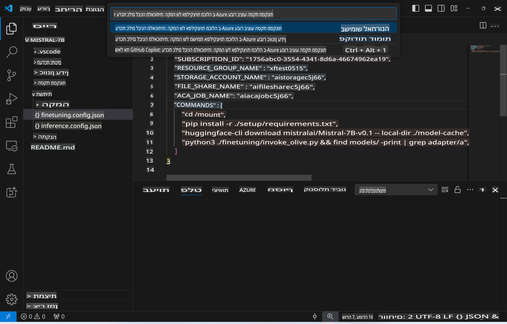
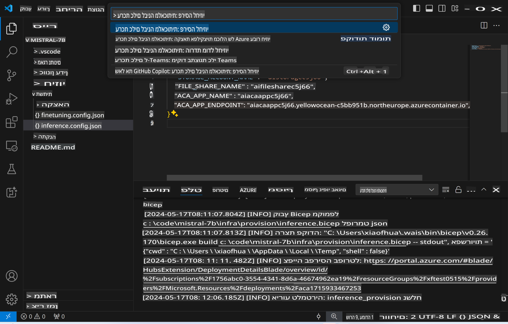
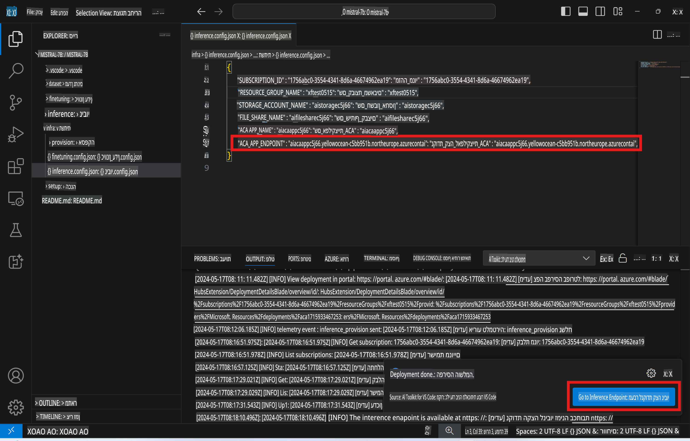

# ביצוע הסקה מרחוק עם המודל שעבר כיוונון עדין

לאחר שהמתאמים אומנו בסביבה מרוחקת, השתמשו באפליקציה פשוטה של Gradio כדי ליצור אינטראקציה עם המודל.



### הקצאת משאבי Azure
יש להגדיר את משאבי Azure להסקה מרחוק על ידי ביצוע `AI Toolkit: Provision Azure Container Apps for inference` מתוך תפריט הפקודות. במהלך ההגדרה תתבקשו לבחור את מנוי ה-Azure ואת קבוצת המשאבים שלכם.  

   
ברירת המחדל היא שהמנוי וקבוצת המשאבים עבור ההסקה יתאימו לאלו ששימשו לכיוונון העדין. ההסקה תשתמש באותה סביבה של Azure Container App ותיגש למודל ולמתאם המודל המאוחסנים ב-Azure Files, שנוצרו במהלך שלב הכיוונון העדין.

## שימוש ב-AI Toolkit 

### פריסה לצורך הסקה  
אם ברצונכם לעדכן את קוד ההסקה או לטעון מחדש את מודל ההסקה, יש לבצע את הפקודה `AI Toolkit: Deploy for inference`. פעולה זו תסנכרן את הקוד העדכני ביותר שלכם עם ACA ותפעיל מחדש את הרפליקה.  



לאחר השלמת הפריסה בהצלחה, המודל מוכן כעת להערכה באמצעות נקודת הקצה הזו.

### גישה ל-API של ההסקה

ניתן לגשת ל-API של ההסקה על ידי לחיצה על כפתור "*Go to Inference Endpoint*" שמוצג בהתראה של VSCode. לחלופין, ניתן למצוא את כתובת ה-API תחת `ACA_APP_ENDPOINT` ב-`./infra/inference.config.json` וגם בלוח הפלט.



> **Note:** ייתכן שייקח מספר דקות עד שנקודת הקצה של ההסקה תהיה פעילה לחלוטין.

## רכיבי הסקה הכלולים בתבנית
 
| תיקייה | תכולה |
| ------ |--------- |
| `infra` | מכילה את כל ההגדרות הדרושות לפעולות מרוחקות. |
| `infra/provision/inference.parameters.json` | כוללת פרמטרים לתבניות ה-bicep, המשמשות להקצאת משאבי Azure להסקה. |
| `infra/provision/inference.bicep` | מכילה תבניות להקצאת משאבי Azure להסקה. |
| `infra/inference.config.json` | קובץ ההגדרות שנוצר על ידי הפקודה `AI Toolkit: Provision Azure Container Apps for inference`. הוא משמש כקלט לפקודות אחרות בתפריט הפקודות המרוחק. |

### שימוש ב-AI Toolkit להגדרת הקצאת משאבי Azure
הגדירו את [AI Toolkit](https://marketplace.visualstudio.com/items?itemName=ms-windows-ai-studio.windows-ai-studio)

הקצו את Azure Container Apps להסקה ` command.

You can find configuration parameters in `./infra/provision/inference.parameters.json` file. Here are the details:
| Parameter | Description |
| --------- |------------ |
| `defaultCommands` | This is the commands to initiate a web API. |
| `maximumInstanceCount` | This parameter sets the maximum capacity of GPU instances. |
| `location` | This is the location where Azure resources are provisioned. The default value is the same as the chosen resource group's location. |
| `storageAccountName`, `fileShareName` `acaEnvironmentName`, `acaEnvironmentStorageName`, `acaAppName`,  `acaLogAnalyticsName` | These parameters are used to name the Azure resources for provision. By default, they will be same to the fine-tuning resource name. You can input a new, unused resource name to create your own custom-named resources, or you can input the name of an already existing Azure resource if you'd prefer to use that. For details, refer to the section [Using existing Azure Resources](../../../../../md/01.Introduction/03). |

### Using Existing Azure Resources

By default, the inference provision use the same Azure Container App Environment, Storage Account, Azure File Share, and Azure Log Analytics that were used for fine-tuning. A separate Azure Container App is created solely for the inference API. 

If you have customized the Azure resources during the fine-tuning step or want to use your own existing Azure resources for inference, specify their names in the `./infra/inference.parameters.json` file. לאחר מכן, הריצו את הפקודה `AI Toolkit: Provision Azure Container Apps for inference` מתוך תפריט הפקודות. פעולה זו תעדכן כל משאב שצוין ותיצור משאבים חסרים.

לדוגמה, אם יש לכם סביבה קיימת של Azure Container, הקובץ `./infra/finetuning.parameters.json` שלכם ייראה כך:

```json
{
    "$schema": "https://schema.management.azure.com/schemas/2019-04-01/deploymentParameters.json#",
    "contentVersion": "1.0.0.0",
    "parameters": {
      ...
      "acaEnvironmentName": {
        "value": "<your-aca-env-name>"
      },
      "acaEnvironmentStorageName": {
        "value": null
      },
      ...
    }
  }
```

### הקצאה ידנית  
אם אתם מעדיפים להגדיר את משאבי Azure באופן ידני, תוכלו להשתמש בקבצי ה-bicep המסופקים בתיקייה `./infra/provision` folders. If you have already set up and configured all the Azure resources without using the AI Toolkit command palette, you can simply enter the resource names in the `inference.config.json` file.

לדוגמה:

```json
{
  "SUBSCRIPTION_ID": "<your-subscription-id>",
  "RESOURCE_GROUP_NAME": "<your-resource-group-name>",
  "STORAGE_ACCOUNT_NAME": "<your-storage-account-name>",
  "FILE_SHARE_NAME": "<your-file-share-name>",
  "ACA_APP_NAME": "<your-aca-name>",
  "ACA_APP_ENDPOINT": "<your-aca-endpoint>"
}
```

**כתב ויתור**:  
מסמך זה תורגם באמצעות שירותי תרגום מבוססי בינה מלאכותית. למרות שאנו שואפים לדיוק, יש לקחת בחשבון שתרגומים אוטומטיים עשויים להכיל שגיאות או אי-דיוקים. המסמך המקורי בשפתו המקורית ייחשב כמקור הסמכותי. למידע קריטי, מומלץ להשתמש בתרגום מקצועי אנושי. אנו לא נושאים באחריות לאי-הבנות או לפרשנויות שגויות הנובעות משימוש בתרגום זה.