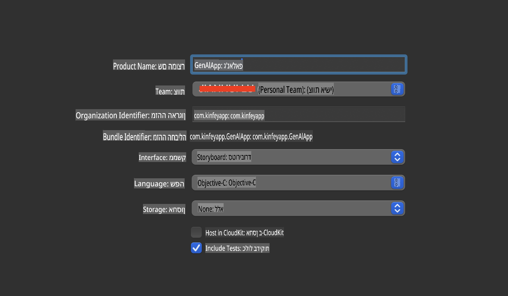
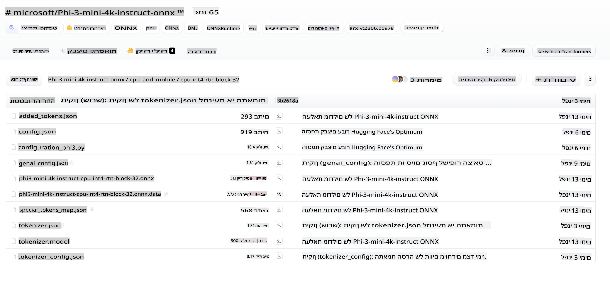
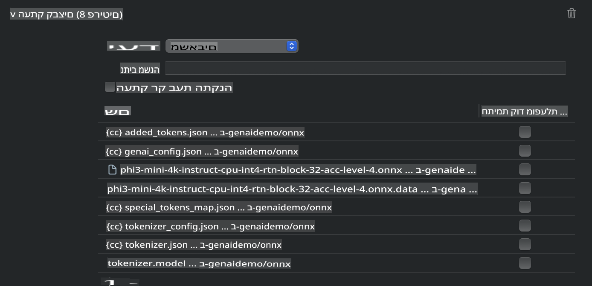
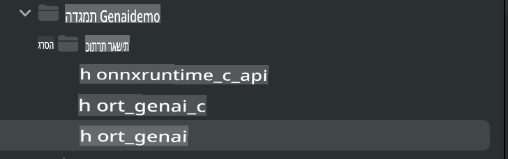
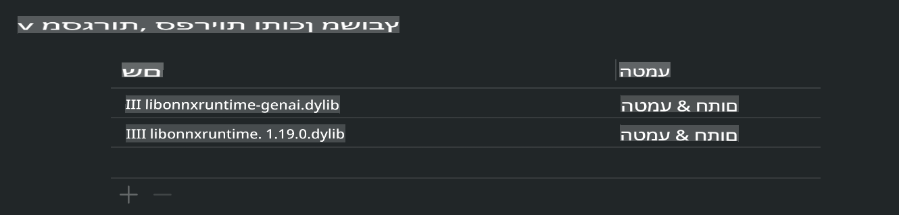
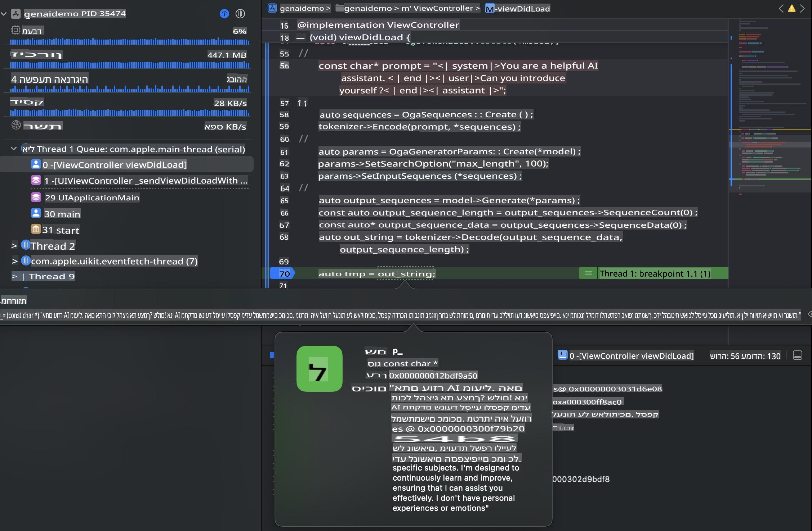

# **פריסת Phi-3 ב-iOS**

Phi-3-mini הוא סדרת מודלים חדשה מבית מיקרוסופט שמאפשרת פריסה של מודלים שפתיים גדולים (LLMs) במכשירי קצה ובמכשירי IoT. Phi-3-mini זמין לפריסה ב-iOS, Android, ומכשירי קצה, ומאפשר ליישם בינה מלאכותית גנרטיבית בסביבות BYOD. הדוגמה הבאה מדגימה כיצד לפרוס את Phi-3-mini ב-iOS.

## **1. הכנה**

- **א.** macOS 14 ומעלה  
- **ב.** Xcode 15 ומעלה  
- **ג.** iOS SDK 17.x (iPhone 14 עם מעבד A16 או חדש יותר)  
- **ד.** התקנת Python 3.10 ומעלה (מומלץ להשתמש ב-Conda)  
- **ה.** התקנת ספריית הפייתון: `python-flatbuffers`  
- **ו.** התקנת CMake  

### Semantic Kernel ואינפרנס

Semantic Kernel הוא מסגרת אפליקציות שמאפשרת יצירת יישומים תואמים ל-Azure OpenAI Service, מודלים של OpenAI, ואפילו מודלים מקומיים. גישה לשירותים מקומיים דרך Semantic Kernel מאפשרת אינטגרציה קלה עם שרת המודלים Phi-3-mini שאתם מארחים בעצמכם.

### קריאה למודלים מקוונטטים עם Ollama או LlamaEdge

משתמשים רבים מעדיפים להשתמש במודלים מקוונטטים כדי להריץ מודלים באופן מקומי. [Ollama](https://ollama.com) ו-[LlamaEdge](https://llamaedge.com) מאפשרים למשתמשים לקרוא למודלים מקוונטטים שונים:

#### **Ollama**

ניתן להריץ `ollama run phi3` ישירות או להגדיר אותו במצב לא מקוון. צרו Modelfile עם הנתיב לקובץ `gguf` שלכם. דוגמת קוד להרצת מודל Phi-3-mini מקוונטט:

```gguf
FROM {Add your gguf file path}
TEMPLATE \"\"\"<|user|> .Prompt<|end|> <|assistant|>\"\"\"
PARAMETER stop <|end|>
PARAMETER num_ctx 4096
```

#### **LlamaEdge**

אם ברצונכם להשתמש ב-`gguf` גם בענן וגם במכשירי קצה בו-זמנית, LlamaEdge היא אפשרות מצוינת.

## **2. קומפילציה של ONNX Runtime עבור iOS**

```bash

git clone https://github.com/microsoft/onnxruntime.git

cd onnxruntime

./build.sh --build_shared_lib --ios --skip_tests --parallel --build_dir ./build_ios --ios --apple_sysroot iphoneos --osx_arch arm64 --apple_deploy_target 17.5 --cmake_generator Xcode --config Release

cd ../

```

### **שימו לב**

- **א.** לפני הקומפילציה, ודאו ש-Xcode מוגדר כראוי והגדירו אותו כספריית המפתחים הפעילה בטרמינל:

    ```bash
    sudo xcode-select -switch /Applications/Xcode.app/Contents/Developer
    ```

- **ב.** יש לקמפל את ONNX Runtime לפלטפורמות שונות. עבור iOS, ניתן לקמפל עבור `arm64` or `x86_64`.

- **ג.** מומלץ להשתמש ב-SDK העדכני ביותר של iOS לקומפילציה. עם זאת, ניתן גם להשתמש בגרסה ישנה יותר אם נדרשת תאימות ל-SDKים קודמים.

## **3. קומפילציה של בינה מלאכותית גנרטיבית עם ONNX Runtime עבור iOS**

> **שימו לב:** מכיוון שבינה מלאכותית גנרטיבית עם ONNX Runtime נמצאת בשלב תצוגה מקדימה, יש לקחת בחשבון שינויים אפשריים.

```bash

git clone https://github.com/microsoft/onnxruntime-genai
 
cd onnxruntime-genai
 
mkdir ort
 
cd ort
 
mkdir include
 
mkdir lib
 
cd ../
 
cp ../onnxruntime/include/onnxruntime/core/session/onnxruntime_c_api.h ort/include
 
cp ../onnxruntime/build_ios/Release/Release-iphoneos/libonnxruntime*.dylib* ort/lib
 
export OPENCV_SKIP_XCODEBUILD_FORCE_TRYCOMPILE_DEBUG=1
 
python3 build.py --parallel --build_dir ./build_ios --ios --ios_sysroot iphoneos --ios_arch arm64 --ios_deployment_target 17.5 --cmake_generator Xcode --cmake_extra_defines CMAKE_XCODE_ATTRIBUTE_CODE_SIGNING_ALLOWED=NO

```

## **4. יצירת אפליקציה ב-Xcode**

בחרתי ב-Objective-C כשיטת הפיתוח של האפליקציה, מכיוון שבעת שימוש בבינה מלאכותית גנרטיבית עם ONNX Runtime C++ API, Objective-C מספקת תאימות טובה יותר. כמובן, ניתן גם לבצע קריאות רלוונטיות דרך Swift bridging.



## **5. העתקת מודל INT4 מקוונטט של ONNX לפרויקט האפליקציה**

יש לייבא את מודל ה-INT4 המקוונטט בפורמט ONNX, אשר יש להוריד תחילה.



לאחר ההורדה, יש להוסיף אותו לתיקיית Resources של הפרויקט ב-Xcode.



## **6. הוספת ה-C++ API ב-ViewControllers**

> **שימו לב:**

- **א.** הוסיפו את קובצי הכותרות (Header Files) המתאימים לפרויקט.

  

- **ב.** כללו את `onnxruntime-genai` dynamic library in Xcode.

  

- **c.** Use the C Samples code for testing. You can also add additional features like ChatUI for more functionality.

- **d.** Since you need to use C++ in your project, rename `ViewController.m` to `ViewController.mm` כדי לאפשר תמיכה ב-Objective-C++.

```objc

    NSString *llmPath = [[NSBundle mainBundle] resourcePath];
    char const *modelPath = llmPath.cString;

    auto model =  OgaModel::Create(modelPath);

    auto tokenizer = OgaTokenizer::Create(*model);

    const char* prompt = "<|system|>You are a helpful AI assistant.<|end|><|user|>Can you introduce yourself?<|end|><|assistant|>";

    auto sequences = OgaSequences::Create();
    tokenizer->Encode(prompt, *sequences);

    auto params = OgaGeneratorParams::Create(*model);
    params->SetSearchOption("max_length", 100);
    params->SetInputSequences(*sequences);

    auto output_sequences = model->Generate(*params);
    const auto output_sequence_length = output_sequences->SequenceCount(0);
    const auto* output_sequence_data = output_sequences->SequenceData(0);
    auto out_string = tokenizer->Decode(output_sequence_data, output_sequence_length);
    
    auto tmp = out_string;

```

## **7. הרצת האפליקציה**

לאחר שההגדרה הושלמה, ניתן להריץ את האפליקציה ולראות את תוצאות האינפרנס של מודל Phi-3-mini.



לקבלת דוגמאות קוד נוספות והוראות מפורטות, בקרו ב-[מאגר הדוגמאות של Phi-3 Mini](https://github.com/Azure-Samples/Phi-3MiniSamples/tree/main/ios).

**כתב ויתור**:  
מסמך זה תורגם באמצעות שירותי תרגום מבוססי בינה מלאכותית. למרות שאנו שואפים לדיוק, יש לקחת בחשבון שתרגומים אוטומטיים עשויים לכלול שגיאות או אי-דיוקים. המסמך המקורי בשפתו המקורית נחשב כמקור הסמכותי. עבור מידע קריטי, מומלץ להשתמש בתרגום אנושי מקצועי. איננו נושאים באחריות לאי-הבנות או לפרשנויות שגויות הנובעות משימוש בתרגום זה.