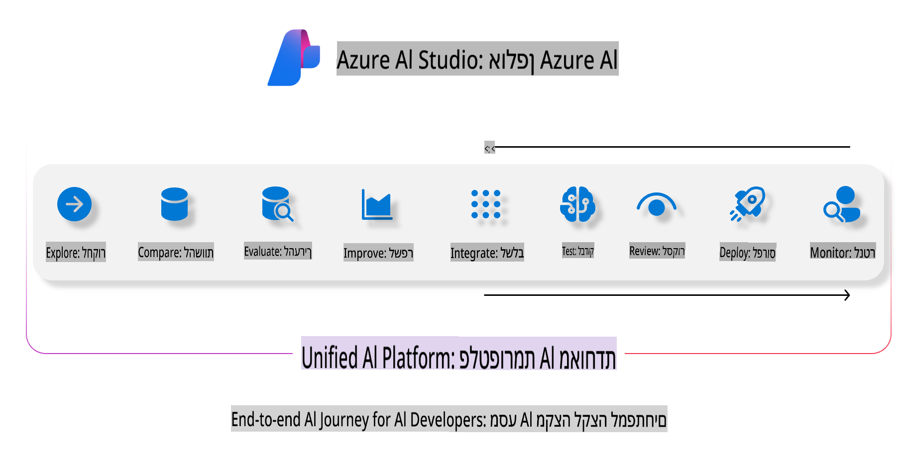
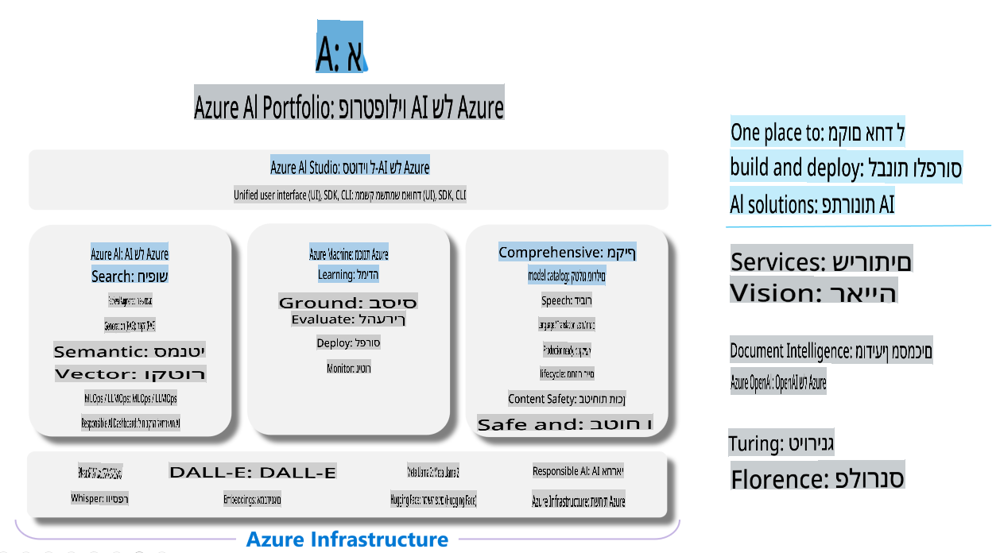

# **שימוש ב-Azure AI Foundry להערכה**

כיצד להעריך את האפליקציה שלך המבוססת על בינה מלאכותית גנרטיבית באמצעות [Azure AI Foundry](https://ai.azure.com?WT.mc_id=aiml-138114-kinfeylo). בין אם אתה מעריך שיחות חד-שלביות או רב-שלביות, Azure AI Foundry מספק כלים להערכת ביצועי המודל והבטיחות שלו.

## כיצד להעריך אפליקציות בינה מלאכותית גנרטיבית עם Azure AI Foundry
להוראות מפורטות יותר, עיין ב-[תיעוד Azure AI Foundry](https://learn.microsoft.com/azure/ai-studio/how-to/evaluate-generative-ai-app?WT.mc_id=aiml-138114-kinfeylo).

להלן השלבים להתחלת העבודה:

## הערכת מודלים של בינה מלאכותית גנרטיבית ב-Azure AI Foundry

**דרישות מוקדמות**

- סט נתונים לבדיקה בפורמט CSV או JSON.
- מודל בינה מלאכותית גנרטיבית שפורסם (כגון Phi-3, GPT 3.5, GPT 4, או Davinci models).
- סביבה עם משאב חישוב להרצת ההערכה.

## מדדי הערכה מובנים

Azure AI Foundry מאפשר לך להעריך שיחות חד-שלביות ושיחות מורכבות רב-שלביות.
לתרחישים של Retrieval Augmented Generation (RAG), שבהם המודל מתבסס על נתונים ספציפיים, ניתן להעריך ביצועים באמצעות מדדי הערכה מובנים.
בנוסף, ניתן להעריך תרחישי שאלות ותשובות חד-שלביים כלליים (לא RAG).

## יצירת ריצת הערכה

מממשק המשתמש של Azure AI Foundry, נווט לעמוד Evaluate או Prompt Flow.
עקוב אחר אשף יצירת ההערכה כדי להגדיר ריצת הערכה. ניתן לספק שם אופציונלי להערכה שלך.
בחר את התרחיש שמתאים למטרות האפליקציה שלך.
בחר מדד הערכה אחד או יותר כדי להעריך את תוצאות המודל.

## תהליך הערכה מותאם אישית (אופציונלי)

לגמישות רבה יותר, ניתן להקים תהליך הערכה מותאם אישית. התאם את תהליך ההערכה בהתאם לדרישות הספציפיות שלך.

## צפייה בתוצאות

לאחר הרצת ההערכה, תוכל לרשום, לצפות ולנתח מדדי הערכה מפורטים ב-Azure AI Foundry. כך תוכל לקבל תובנות על היכולות והמגבלות של האפליקציה שלך.

**Note** Azure AI Foundry נמצא כרגע בתצוגה מקדימה ציבורית, ולכן מומלץ להשתמש בו למטרות ניסוי ופיתוח. למשימות ייצור, שקול אפשרויות אחרות. עיין ב-[תיעוד הרשמי של AI Foundry](https://learn.microsoft.com/azure/ai-studio/?WT.mc_id=aiml-138114-kinfeylo) למידע נוסף והוראות מפורטות.

**כתב ויתור**:  
מסמך זה תורגם באמצעות שירותי תרגום מבוססי בינה מלאכותית. בעוד שאנו שואפים לדיוק, יש להיות מודעים לכך שתרגומים אוטומטיים עשויים להכיל שגיאות או אי-דיוקים. המסמך המקורי בשפתו המקורית יש להחשיב כמקור הסמכותי. למידע קריטי, מומלץ להשתמש בתרגום מקצועי על ידי בני אדם. אנו לא נושאים באחריות לאי-הבנות או פרשנויות שגויות הנובעות משימוש בתרגום זה.