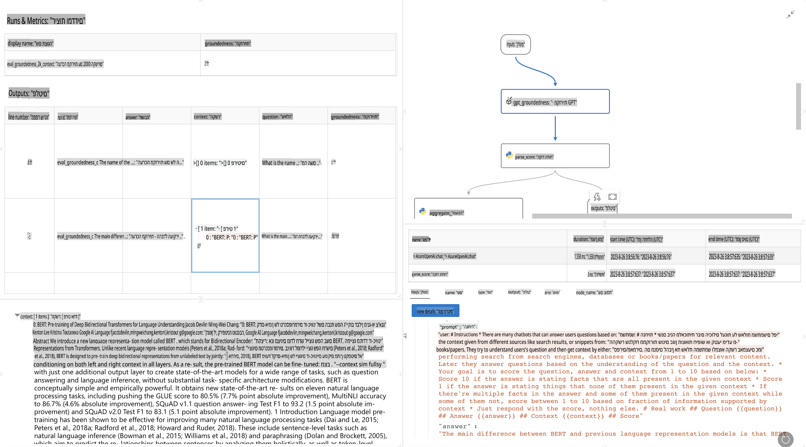

# **היכרות עם Promptflow**

[Microsoft Prompt Flow](https://microsoft.github.io/promptflow/index.html?WT.mc_id=aiml-138114-kinfeylo) הוא כלי ויזואלי לאוטומציה של תהליכים, המאפשר למשתמשים ליצור תהליכים אוטומטיים באמצעות תבניות מוכנות מראש ומחברים מותאמים אישית. הכלי נועד לאפשר למפתחים ואנליסטים עסקיים לבנות במהירות תהליכים אוטומטיים למשימות כמו ניהול נתונים, שיתוף פעולה ואופטימיזציה של תהליכים. עם Prompt Flow, ניתן בקלות לחבר בין שירותים, יישומים ומערכות שונות, ולאוטומט תהליכים עסקיים מורכבים.

Microsoft Prompt Flow נועד לייעל את מחזור הפיתוח מקצה לקצה של יישומי AI המבוססים על מודלים גדולים לשפה (LLMs). בין אם אתם בתהליך של רעיונאות, אבטיפוס, בדיקות, הערכה או פריסה של יישומים מבוססי LLM, Prompt Flow מפשט את התהליך ומאפשר לכם לבנות יישומי LLM באיכות הפקה.

## אלו התכונות והיתרונות המרכזיים של השימוש ב-Microsoft Prompt Flow:

**חוויית יצירה אינטראקטיבית**

Prompt Flow מספק ייצוג ויזואלי של מבנה הזרימה שלכם, מה שמקל על הבנת הפרויקטים וניווט בהם.  
הוא מציע חוויית קידוד דמוית מחברת לפיתוח וניפוי שגיאות יעילים של הזרימות.

**וריאציות והתאמות של פרומפטים**

צרו והשוו בין וריאציות שונות של פרומפטים כדי להקל על תהליך השיפור האיטרטיבי.  
העריכו את הביצועים של פרומפטים שונים ובחרו את היעילים ביותר.

**זרימות הערכה מובנות**

העריכו את האיכות והאפקטיביות של הפרומפטים והזרימות שלכם באמצעות כלים מובנים להערכה.  
הבינו עד כמה היישומים שלכם המבוססים על LLM מבצעים.

**משאבים מקיפים**

Prompt Flow כולל ספרייה של כלים מובנים, דוגמאות ותבניות. משאבים אלו מהווים נקודת התחלה לפיתוח, מעוררים יצירתיות ומאיצים את התהליך.

**שיתוף פעולה והתאמה לארגונים**

תמכו בשיתוף פעולה צוותי על ידי מתן אפשרות למשתמשים מרובים לעבוד יחד על פרויקטים של הנדסת פרומפטים.  
שמרו על בקרת גרסאות ושתפו ידע בצורה יעילה. ייעלו את כל תהליך הנדסת הפרומפטים, מפיתוח והערכה ועד פריסה ומעקב.

## הערכה ב-Prompt Flow

ב-Microsoft Prompt Flow, הערכה משחקת תפקיד קריטי בבדיקת הביצועים של מודלי ה-AI שלכם. בואו נחקור כיצד ניתן להתאים אישית זרימות הערכה ומדדים בתוך Prompt Flow:

**הבנת ההערכה ב-Prompt Flow**

ב-Prompt Flow, זרימה מייצגת רצף של צמתים שמעבדים קלט ומייצרים פלט. זרימות הערכה הן סוג מיוחד של זרימות שנועדו להעריך את הביצועים של הרצה על פי קריטריונים ומטרות מסוימים.

**תכונות עיקריות של זרימות הערכה**

- הן בדרך כלל רצות לאחר הזרימה הנבדקת, תוך שימוש בפלטים שלה.  
- הן מחשבות ציונים או מדדים למדידת ביצועי הזרימה הנבדקת.  
- מדדים יכולים לכלול דיוק, ציוני רלוונטיות או כל מדד רלוונטי אחר.

### התאמה אישית של זרימות הערכה

**הגדרת קלטים**

זרימות הערכה צריכות לקבל את הפלטים של ההרצה הנבדקת. הגדירו קלטים באופן דומה לזרימות סטנדרטיות.  
לדוגמה, אם אתם מעריכים זרימת שאלות ותשובות (QnA), קראו לקלט "תשובה". אם אתם מעריכים זרימת סיווג, קראו לקלט "קטגוריה". ייתכן שתצטרכו גם קלטי אמת מידה (למשל, תוויות בפועל).

**פלטים ומדדים**

זרימות הערכה מייצרות תוצאות שמודדות את ביצועי הזרימה הנבדקת.  
ניתן לחשב מדדים באמצעות Python או LLM (מודלים גדולים לשפה). השתמשו בפונקציה log_metric() כדי לתעד מדדים רלוונטיים.

**שימוש בזרימות הערכה מותאמות אישית**

פיתחו זרימת הערכה משלכם, המותאמת למשימות ולמטרות שלכם.  
התאימו מדדים בהתאם ליעדי ההערכה שלכם.  
השתמשו בזרימת הערכה מותאמת זו להרצות קבוצתיות לצורך בדיקות רחבות היקף.

## שיטות הערכה מובנות

Prompt Flow מספק גם שיטות הערכה מובנות.  
ניתן להגיש הרצות קבוצתיות ולהשתמש בשיטות אלו להערכת ביצועי הזרימה שלכם עם מערכי נתונים גדולים.  
צפו בתוצאות ההערכה, השוו מדדים ובצעו התאמות לפי הצורך.  
זכרו, הערכה חיונית כדי לוודא שמודלי ה-AI שלכם עומדים בקריטריונים ובמטרות הרצויים. חקרו את התיעוד הרשמי לקבלת הנחיות מפורטות על פיתוח ושימוש בזרימות הערכה ב-Microsoft Prompt Flow.

לסיכום, Microsoft Prompt Flow מאפשר למפתחים ליצור יישומי LLM באיכות גבוהה על ידי פישוט הנדסת פרומפטים ומתן סביבה חזקה לפיתוח. אם אתם עובדים עם LLMs, Prompt Flow הוא כלי שכדאי לחקור. חקרו את [מסמכי ההערכה של Prompt Flow](https://learn.microsoft.com/azure/machine-learning/prompt-flow/how-to-develop-an-evaluation-flow?view=azureml-api-2?WT.mc_id=aiml-138114-kinfeylo) לקבלת הנחיות מפורטות על פיתוח ושימוש בזרימות הערכה ב-Microsoft Prompt Flow.

**כתב ויתור**:  
מסמך זה תורגם באמצעות שירותי תרגום מבוססי בינה מלאכותית. למרות שאנו שואפים לדיוק, יש לקחת בחשבון שתרגומים אוטומטיים עשויים להכיל שגיאות או אי-דיוקים. המסמך המקורי בשפתו המקורית צריך להיחשב כמקור הסמכותי. למידע קריטי, מומלץ להשתמש בתרגום מקצועי על ידי בני אדם. אנו לא נושאים באחריות לאי-הבנות או לפרשנויות שגויות הנובעות משימוש בתרגום זה.