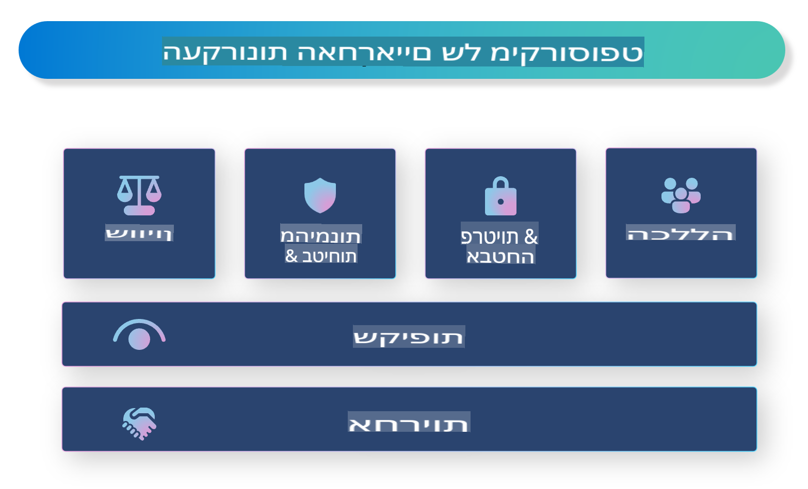

# **היכרות עם AI אחראי**

[Microsoft Responsible AI](https://www.microsoft.com/ai/responsible-ai?WT.mc_id=aiml-138114-kinfeylo) היא יוזמה שמטרתה לעזור למפתחים ולארגונים לבנות מערכות AI שקופות, אמינות ואחראיות. היוזמה מספקת הנחיות ומשאבים לפיתוח פתרונות AI אחראיים התואמים עקרונות אתיים, כמו פרטיות, הוגנות ושקיפות. נבחן גם חלק מהאתגרים והפרקטיקות הטובות ביותר הקשורות לבניית מערכות AI אחראיות.

## סקירה כללית של Microsoft Responsible AI 

**עקרונות אתיים** 

Microsoft Responsible AI מונחית על ידי סט של עקרונות אתיים, כמו פרטיות, הוגנות, שקיפות, אחריות ובטיחות. עקרונות אלו נועדו להבטיח שמערכות AI מפותחות באופן אתי ואחראי.

**AI שקוף**

Microsoft Responsible AI מדגישה את החשיבות של שקיפות במערכות AI. זה כולל מתן הסברים ברורים על אופן פעולת המודלים של AI, וכן הבטחת זמינותם הפומבית של מקורות נתונים ואלגוריתמים.

**AI אחראי** 

[Microsoft Responsible AI](https://www.microsoft.com/ai/responsible-ai?WT.mc_id=aiml-138114-kinfeylo) מקדמת פיתוח של מערכות AI אחראיות, שיכולות לספק תובנות על האופן שבו מודלי AI מקבלים החלטות. זה יכול לעזור למשתמשים להבין ולסמוך על התוצרים של מערכות AI.

**הכלה** 

מערכות AI צריכות להיות מתוכננות כדי להועיל לכולם. Microsoft שואפת ליצור AI כולל שמתחשב בפרספקטיבות מגוונות ונמנע מהטיות או אפליה.

**אמינות ובטיחות**

הבטחת אמינות ובטיחות של מערכות AI היא קריטית. Microsoft מתמקדת בבניית מודלים חזקים שמתפקדים בעקביות ונמנעים מתוצאות מזיקות.

**הוגנות ב-AI** 

Microsoft Responsible AI מכירה בכך שמערכות AI יכולות לשמר הטיות אם הן מאומנות על נתונים או אלגוריתמים מוטים. היוזמה מספקת הנחיות לפיתוח מערכות AI הוגנות שאינן מפלות על בסיס גורמים כמו גזע, מגדר או גיל.

**פרטיות ואבטחה** 

Microsoft Responsible AI מדגישה את החשיבות של הגנה על פרטיות המשתמשים ואבטחת הנתונים במערכות AI. זה כולל יישום הצפנת נתונים חזקה ובקרות גישה, וכן ביצוע בדיקות אבטחה שוטפות למערכות AI.

**אחריות ואחראיות** 

Microsoft Responsible AI מקדמת אחריות ואחראיות בפיתוח ופריסת AI. זה כולל הבטחת מודעות של מפתחים וארגונים לסיכונים הפוטנציאליים הקשורים למערכות AI, ונקיטת צעדים לצמצום הסיכונים הללו.

## פרקטיקות טובות לבניית מערכות AI אחראיות

**פיתוח מודלים עם מערכי נתונים מגוונים** 

כדי להימנע מהטיות במערכות AI, חשוב להשתמש במערכי נתונים מגוונים שמייצגים מגוון פרספקטיבות וחוויות.

**שימוש בטכניקות AI מוסברות** 

טכניקות AI מוסברות יכולות לעזור למשתמשים להבין כיצד מודלי AI מקבלים החלטות, מה שיכול להגדיל את האמון במערכת.

**ביצוע בדיקות שוטפות למערכות AI לאיתור פגיעויות** 

בדיקות שוטפות למערכות AI יכולות לעזור לזהות סיכונים ופגיעויות שצריך לטפל בהם.

**יישום הצפנת נתונים חזקה ובקרות גישה** 

הצפנת נתונים ובקרות גישה יכולות לעזור להגן על פרטיות ואבטחת המשתמשים במערכות AI.

**שמירה על עקרונות אתיים בפיתוח AI** 

שמירה על עקרונות אתיים, כמו הוגנות, שקיפות ואחריות, יכולה לעזור לבנות אמון במערכות AI ולהבטיח שהן מפותחות באופן אחראי.

## שימוש ב-AI Foundry ל-AI אחראי 

[Azure AI Foundry](https://ai.azure.com?WT.mc_id=aiml-138114-kinfeylo) היא פלטפורמה עוצמתית שמאפשרת למפתחים ולארגונים ליצור במהירות יישומים חכמים, חדשניים, מוכנים לשוק ואחראיים. להלן כמה תכונות ויכולות מרכזיות של Azure AI Foundry:

**APIs ומודלים מוכנים מראש** 

Azure AI Foundry מספקת APIs ומודלים מוכנים מראש או מותאמים אישית. אלו מכסים מגוון רחב של משימות AI, כולל AI גנרטיבי, עיבוד שפה טבעית לשיחות, חיפוש, ניטור, תרגום, דיבור, ראייה וקבלת החלטות.

**Prompt Flow** 

Prompt flow ב-Azure AI Foundry מאפשר ליצור חוויות AI שיחתיות. הוא מאפשר לעצב ולנהל זרימות שיחה, מה שמקל על בניית צ'אטבוטים, עוזרים וירטואליים ויישומים אינטראקטיביים אחרים.

**Retrieval Augmented Generation (RAG)** 

RAG היא טכניקה שמשלבת גישות מבוססות שליפה וגנרציה. היא משפרת את איכות התגובות הגנרטיביות על ידי שימוש בידע קיים (שליפה) ויצירתיות (גנרציה).

**מדדי הערכה וניטור ל-AI גנרטיבי** 

Azure AI Foundry מספקת כלים להערכת וניטור מודלי AI גנרטיביים. ניתן להעריך את הביצועים, ההוגנות ומדדים חשובים אחרים כדי להבטיח פריסה אחראית. בנוסף, אם יצרתם לוח מחוונים, תוכלו להשתמש בממשק ללא קוד ב-Azure Machine Learning Studio כדי להתאים אישית וליצור לוח מחוונים אחראי וסקורקארד בהתבסס על [Responsible AI Toolbox](https://responsibleaitoolbox.ai/?WT.mc_id=aiml-138114-kinfeylo) ספריות Python. סקורקארד זה עוזר לשתף תובנות מרכזיות הקשורות להוגנות, חשיבות מאפיינים ושיקולים אחרים עם בעלי עניין טכניים ולא טכניים.

כדי להשתמש ב-AI Foundry עם AI אחראי, ניתן לעקוב אחרי הפרקטיקות הטובות הבאות:

**הגדרת הבעיה והמטרות של מערכת ה-AI**

לפני תחילת תהליך הפיתוח, חשוב להגדיר בבירור את הבעיה או המטרה שהמערכת שואפת לפתור. זה יעזור לזהות את הנתונים, האלגוריתמים והמשאבים הדרושים לבניית מודל אפקטיבי.

**איסוף ועיבוד נתונים רלוונטיים** 

איכות וכמות הנתונים המשמשים לאימון מערכת AI יכולה להשפיע משמעותית על הביצועים שלה. לכן, חשוב לאסוף נתונים רלוונטיים, לנקות אותם, לעבד אותם ולהבטיח שהם מייצגים את האוכלוסייה או הבעיה שאתם מנסים לפתור.

**בחירת הערכה מתאימה** 

ישנם אלגוריתמים שונים להערכה. חשוב לבחור את האלגוריתם המתאים ביותר בהתבסס על הנתונים והבעיה שלכם.

**הערכת ופירוש המודל** 

לאחר בניית מודל AI, חשוב להעריך את ביצועיו באמצעות מדדים מתאימים ולפרש את התוצאות באופן שקוף. זה יעזור לזהות הטיות או מגבלות במודל ולבצע שיפורים במידת הצורך.

**הבטחת שקיפות והסבריות** 

מערכות AI צריכות להיות שקופות ומוסברות כך שמשתמשים יוכלו להבין כיצד הן פועלות וכיצד מתקבלות ההחלטות. זה חשוב במיוחד ליישומים עם השפעה משמעותית על חיי אדם, כמו בריאות, פיננסים ומערכות משפט.

**ניטור ועדכון המודל** 

יש לנטר ולעדכן מערכות AI באופן שוטף כדי להבטיח שהן יישארו מדויקות ואפקטיביות לאורך זמן. זה דורש תחזוקה שוטפת, בדיקות ואימון מחדש של המודל.

לסיכום, Microsoft Responsible AI היא יוזמה שמטרתה לעזור למפתחים ולארגונים לבנות מערכות AI שקופות, אמינות ואחראיות. זכרו כי יישום AI אחראי הוא קריטי, ו-Azure AI Foundry שואפת להפוך אותו למעשי עבור ארגונים. על ידי שמירה על עקרונות אתיים ופרקטיקות טובות, נוכל להבטיח שמערכות AI מפותחות ומופעלות באופן אחראי שמועיל לחברה כולה.

**כתב ויתור**:  
מסמך זה תורגם באמצעות שירותי תרגום מבוססי בינה מלאכותית. למרות שאנו שואפים לדיוק, יש להיות מודעים לכך שתרגומים אוטומטיים עשויים לכלול שגיאות או אי-דיוקים. המסמך המקורי בשפתו המקורית צריך להיחשב כמקור הסמכותי. עבור מידע קריטי, מומלץ להשתמש בתרגום מקצועי על ידי אדם. איננו נושאים באחריות לאי-הבנות או לפרשנויות שגויות הנובעות מהשימוש בתרגום זה.