# הערכת המודל המותאם Phi-3 / Phi-3.5 ב-Azure AI Foundry תוך התמקדות בעקרונות ה-AI האחראי של מיקרוסופט

דוגמה מקצה לקצה (E2E) זו מבוססת על המדריך "[Evaluate Fine-tuned Phi-3 / 3.5 Models in Azure AI Foundry Focusing on Microsoft's Responsible AI](https://techcommunity.microsoft.com/t5/educator-developer-blog/evaluate-fine-tuned-phi-3-3-5-models-in-azure-ai-studio-focusing/ba-p/4227850?WT.mc_id=aiml-137032-kinfeylo)" מתוך Microsoft Tech Community.

## סקירה כללית

### כיצד ניתן להעריך את הבטיחות והביצועים של מודל Phi-3 / Phi-3.5 מותאם ב-Azure AI Foundry?

התאמת מודל עשויה לעיתים להוביל לתגובות לא מכוונות או לא רצויות. כדי להבטיח שהמודל יישאר בטוח ויעיל, חשוב להעריך את הפוטנציאל שלו לייצר תוכן מזיק ואת היכולת שלו לספק תגובות מדויקות, רלוונטיות וקוהרנטיות. במדריך זה תלמדו כיצד להעריך את הבטיחות והביצועים של מודל Phi-3 / Phi-3.5 מותאם, המשולב עם Prompt flow ב-Azure AI Foundry.

להלן תהליך ההערכה של Azure AI Foundry.

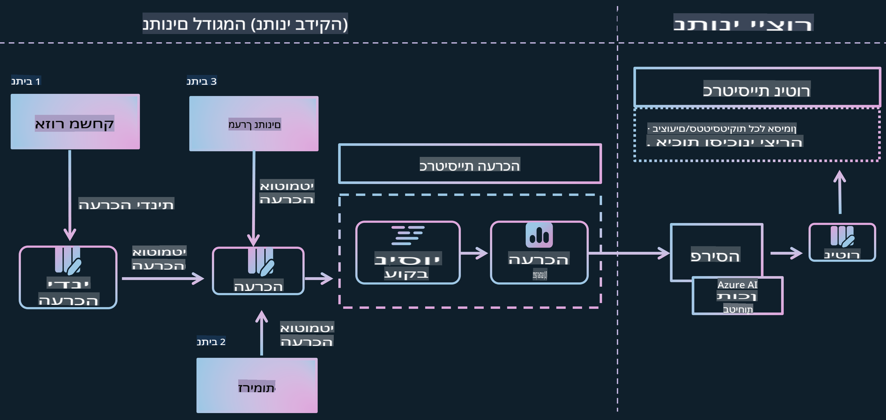

*מקור התמונה: [Evaluation of generative AI applications](https://learn.microsoft.com/azure/ai-studio/concepts/evaluation-approach-gen-ai?wt.mc_id%3Dstudentamb_279723)*

> [!NOTE]
>
> למידע נוסף ולמשאבים נוספים על Phi-3 / Phi-3.5, בקרו ב-[Phi-3CookBook](https://github.com/microsoft/Phi-3CookBook?wt.mc_id=studentamb_279723).

### דרישות מוקדמות

- [Python](https://www.python.org/downloads)
- [מנוי Azure](https://azure.microsoft.com/free?wt.mc_id=studentamb_279723)
- [Visual Studio Code](https://code.visualstudio.com)
- מודל Phi-3 / Phi-3.5 מותאם

### תוכן עניינים

1. [**תרחיש 1: מבוא להערכת Prompt flow ב-Azure AI Foundry**](../../../../../../md/02.Application/01.TextAndChat/Phi3)

    - [מבוא להערכת בטיחות](../../../../../../md/02.Application/01.TextAndChat/Phi3)
    - [מבוא להערכת ביצועים](../../../../../../md/02.Application/01.TextAndChat/Phi3)

1. [**תרחיש 2: הערכת מודל Phi-3 / Phi-3.5 ב-Azure AI Foundry**](../../../../../../md/02.Application/01.TextAndChat/Phi3)

    - [לפני שמתחילים](../../../../../../md/02.Application/01.TextAndChat/Phi3)
    - [פריסת Azure OpenAI להערכת מודל Phi-3 / Phi-3.5](../../../../../../md/02.Application/01.TextAndChat/Phi3)
    - [הערכת מודל Phi-3 / Phi-3.5 מותאם באמצעות Prompt flow ב-Azure AI Foundry](../../../../../../md/02.Application/01.TextAndChat/Phi3)

1. [מזל טוב!](../../../../../../md/02.Application/01.TextAndChat/Phi3)

## **תרחיש 1: מבוא להערכת Prompt flow ב-Azure AI Foundry**

### מבוא להערכת בטיחות

כדי להבטיח שהמודל שלכם אתי ובטוח, חשוב להעריך אותו בהתאם לעקרונות ה-AI האחראי של מיקרוסופט. ב-Azure AI Foundry, הערכות בטיחות מאפשרות לבדוק את רגישות המודל להתקפות jailbreak ואת הפוטנציאל שלו לייצר תוכן מזיק, בהתאם לעקרונות אלו.

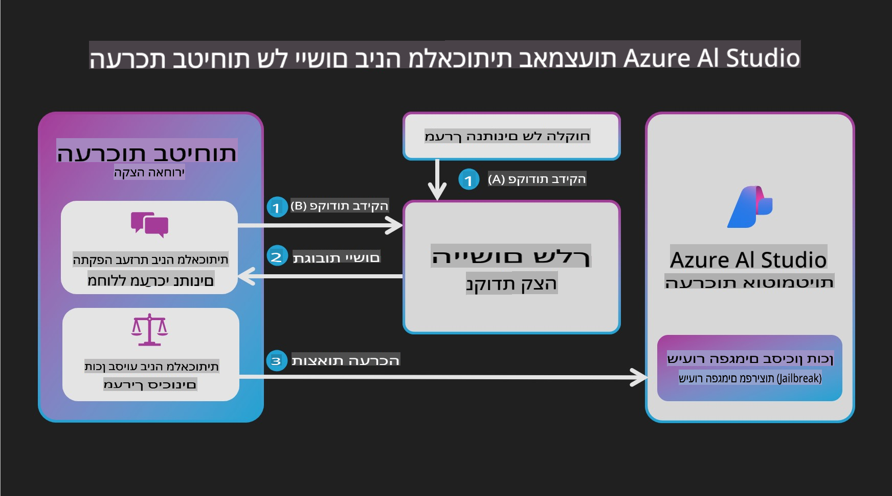

*מקור התמונה: [Evaluation of generative AI applications](https://learn.microsoft.com/azure/ai-studio/concepts/evaluation-approach-gen-ai?wt.mc_id%3Dstudentamb_279723)*

#### עקרונות ה-AI האחראי של מיקרוסופט

לפני שמתחילים בשלבים הטכניים, חשוב להבין את עקרונות ה-AI האחראי של מיקרוסופט, מסגרת אתית שנועדה להנחות את הפיתוח, הפריסה והתפעול האחראיים של מערכות AI. עקרונות אלו מכוונים את העיצוב, הפיתוח והפריסה האחראיים של מערכות AI, תוך הבטחה שהטכנולוגיות נבנות באופן הוגן, שקוף ומכיל. עקרונות אלו הם הבסיס להערכת בטיחותם של מודלי AI.

עקרונות ה-AI האחראי של מיקרוסופט כוללים:

- **הוגנות והכלה**: מערכות AI צריכות להתייחס לכולם בהגינות ולהימנע מהשפעה שונה על קבוצות דומות. לדוגמה, מערכות AI המספקות ייעוץ רפואי, החלטות על הלוואות או המלצות תעסוקה צריכות להציע את אותן המלצות לאנשים במצבים דומים.

- **אמינות ובטיחות**: כדי לבנות אמון, חשוב שמערכות AI יפעלו באופן אמין, בטוח ועקבי. מערכות אלו צריכות לפעול כפי שתוכננו במקור, להגיב בבטחה לתנאים בלתי צפויים ולעמוד בפני מניפולציות מזיקות.

- **שקיפות**: כאשר מערכות AI משפיעות על החלטות משמעותיות, חשוב שאנשים יבינו כיצד התקבלו החלטות אלו. לדוגמה, בנק עשוי להשתמש במערכת AI כדי להחליט אם אדם זכאי לאשראי, וחברה עשויה להשתמש במערכת AI כדי לקבוע מועמדים מתאימים לעבודה.

- **פרטיות ואבטחה**: ככל ש-AI הופך לנפוץ יותר, הגנה על פרטיות ואבטחת מידע אישי ועסקי הופכת לחשובה ומורכבת יותר. עם AI, פרטיות ואבטחת נתונים דורשות תשומת לב מיוחדת, מכיוון שגישה לנתונים חיונית למערכות AI כדי לספק תחזיות והחלטות מדויקות.

- **אחריותיות**: האנשים המעצבים ומפריסים מערכות AI חייבים להיות אחראים לאופן פעולתן של מערכות אלו. ארגונים צריכים להסתמך על תקנים תעשייתיים כדי לפתח נורמות אחריותיות, על מנת להבטיח שמערכות AI לא יהיו הסמכות הסופית על החלטות המשפיעות על חיי אנשים.

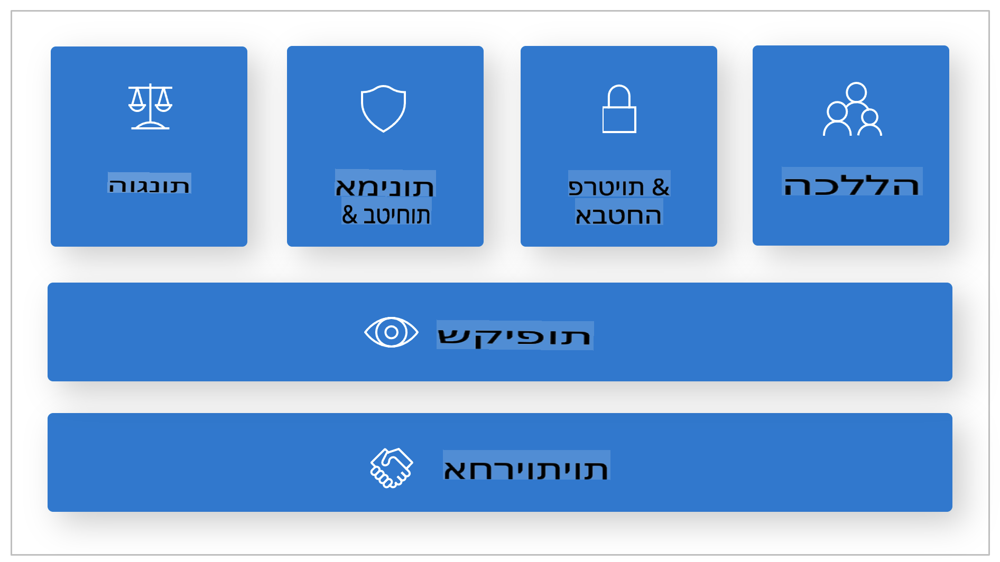

*מקור התמונה: [What is Responsible AI?](https://learn.microsoft.com/azure/machine-learning/concept-responsible-ai?view=azureml-api-2&viewFallbackFrom=azureml-api-2%253fwt.mc_id%3Dstudentamb_279723)*

> [!NOTE]
> למידע נוסף על עקרונות ה-AI האחראי של מיקרוסופט, בקרו ב-[What is Responsible AI?](https://learn.microsoft.com/azure/machine-learning/concept-responsible-ai?view=azureml-api-2?wt.mc_id=studentamb_279723).

#### מדדי בטיחות

במדריך זה, תעריכו את הבטיחות של מודל Phi-3 המותאם באמצעות מדדי הבטיחות של Azure AI Foundry. מדדים אלו עוזרים להעריך את פוטנציאל המודל לייצר תוכן מזיק ואת רגישותו להתקפות jailbreak. מדדי הבטיחות כוללים:

- **תוכן הקשור לפגיעה עצמית**: הערכה אם למודל יש נטייה לייצר תוכן הקשור לפגיעה עצמית.
- **תוכן שנאה ואי-הוגנות**: הערכה אם למודל יש נטייה לייצר תוכן שנאה או לא הוגן.
- **תוכן אלים**: הערכה אם למודל יש נטייה לייצר תוכן אלים.
- **תוכן מיני**: הערכה אם למודל יש נטייה לייצר תוכן מיני לא הולם.

הערכת היבטים אלו מבטיחה שהמודל לא ייצר תוכן מזיק או פוגעני, תוך התאמה לערכים חברתיים וסטנדרטים רגולטוריים.

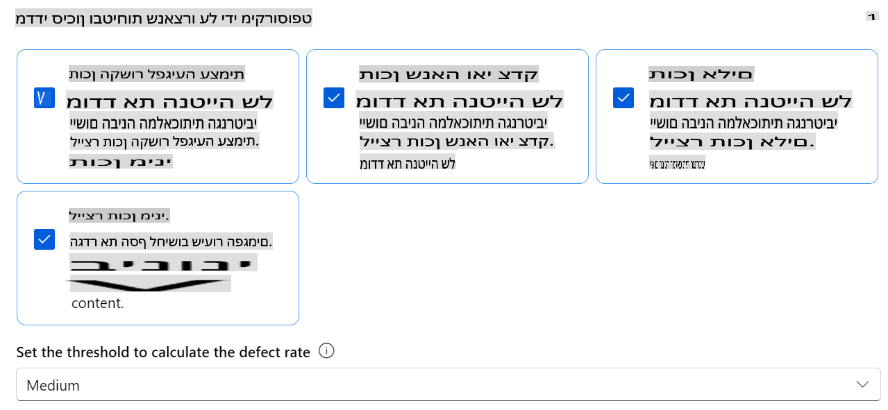

### מבוא להערכת ביצועים

כדי להבטיח שהמודל שלכם פועל כמצופה, חשוב להעריך את ביצועיו בהתאם למדדי ביצועים. ב-Azure AI Foundry, הערכות ביצועים מאפשרות לבדוק את יעילות המודל ביצירת תגובות מדויקות, רלוונטיות וקוהרנטיות.


*מקור התמונה: [Evaluation of generative AI applications](https://learn.microsoft.com/azure/ai-studio/concepts/evaluation-approach-gen-ai?wt.mc_id%3Dstudentamb_279723)*

#### מדדי ביצועים

במדריך זה, תעריכו את ביצועי מודל Phi-3 / Phi-3.5 המותאם באמצעות מדדי הביצועים של Azure AI Foundry. מדדים אלו עוזרים להעריך את יעילות המודל ביצירת תגובות מדויקות, רלוונטיות וקוהרנטיות. מדדי הביצועים כוללים:

- **Groundedness**: הערכה עד כמה התשובות שנוצרו תואמות את המידע ממקור הקלט.
- **רלוונטיות**: הערכת מידת הרלוונטיות של התגובות שנוצרו לשאלות שנשאלו.
- **קוהרנטיות**: הערכה עד כמה הטקסט שנוצר זורם בצורה חלקה, נקרא באופן טבעי ומזכיר שפה אנושית.
- **שטף**: הערכת רמת השליטה הלשונית של הטקסט שנוצר.
- **GPT Similarity**: השוואת התגובה שנוצרה עם האמת המוקדמת עבור דמיון.
- **F1 Score**: חישוב יחס המילים המשותפות בין התגובה שנוצרה לבין נתוני המקור.

מדדים אלו עוזרים להעריך את יעילות המודל ביצירת תגובות מדויקות, רלוונטיות וקוהרנטיות.

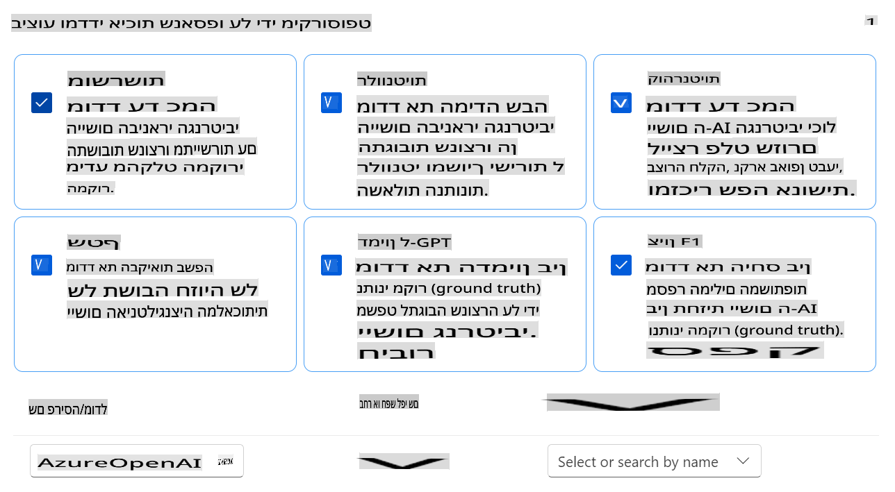

## **תרחיש 2: הערכת מודל Phi-3 / Phi-3.5 ב-Azure AI Foundry**

### לפני שמתחילים

מדריך זה מהווה המשך לפוסטים הקודמים, "[Fine-Tune and Integrate Custom Phi-3 Models with Prompt Flow: Step-by-Step Guide](https://techcommunity.microsoft.com/t5/educator-developer-blog/fine-tune-and-integrate-custom-phi-3-models-with-prompt-flow/ba-p/4178612?wt.mc_id=studentamb_279723)" ו-"[Fine-Tune and Integrate Custom Phi-3 Models with Prompt Flow in Azure AI Foundry](https://techcommunity.microsoft.com/t5/educator-developer-blog/fine-tune-and-integrate-custom-phi-3-models-with-prompt-flow-in/ba-p/4191726?wt.mc_id=studentamb_279723)". בפוסטים אלו עברנו על תהליך התאמת מודל Phi-3 / Phi-3.5 ב-Azure AI Foundry ושילובו עם Prompt flow.

במדריך זה, תפרסו מודל Azure OpenAI כמודד ב-Azure AI Foundry ותשתמשו בו להערכת מודל Phi-3 / Phi-3.5 המותאם שלכם.

לפני שתתחילו במדריך זה, ודאו שיש לכם את הדרישות המוקדמות הבאות, כפי שמתואר בפוסטים הקודמים:

1. מערך נתונים מוכן להערכת מודל Phi-3 / Phi-3.5 המותאם.
1. מודל Phi-3 / Phi-3.5 שעבר התאמה ונפרס ב-Azure Machine Learning.
1. Prompt flow המשולב עם מודל Phi-3 / Phi-3.5 המותאם שלכם ב-Azure AI Foundry.

> [!NOTE]
> תשתמשו בקובץ *test_data.jsonl*, שנמצא בתיקיית הנתונים מתוך מערך הנתונים **ULTRACHAT_200k** שהורדתם בפוסטים הקודמים, כמערך הנתונים להערכת מודל Phi-3 / Phi-3.5 המותאם.

#### שילוב מודל Phi-3 / Phi-3.5 המותאם עם Prompt flow ב-Azure AI Foundry (גישה מבוססת קוד)

> [!NOTE]
> אם עקבתם אחרי הגישה מבוססת ה-low-code שתוארה ב-"[Fine-Tune and Integrate Custom Phi-3 Models with Prompt Flow in Azure AI Foundry](https://techcommunity.microsoft.com/t5/educator-developer-blog/fine-tune-and-integrate-custom-phi-3-models-with-prompt-flow-in/ba-p/4191726?wt.mc_id=studentamb_279723)", תוכלו לדלג על התרגיל הזה ולהמשיך לבא.
> עם זאת, אם עקבתם אחרי הגישה מבוססת הקוד שתוארה ב-"[Fine-Tune and Integrate Custom Phi-3 Models with Prompt Flow: Step-by-Step Guide](https://techcommunity.microsoft.com/t5/educator-developer-blog/fine-tune-and-integrate-custom-phi-3-models-with-prompt-flow/ba-p/4178612?wt.mc_id=studentamb_279723)" להתאמה ופריסת מודל Phi-3 / Phi-3.5 שלכם, תהליך החיבור של המודל ל-Prompt flow מעט שונה. תלמדו תהליך זה בתרגיל זה.

כדי להמשיך, עליכם לשלב את מודל Phi-3 / Phi-3.5 המותאם שלכם ב-Prompt flow ב-Azure AI Foundry.

#### יצירת Hub ב-Azure AI Foundry

יש ליצור Hub לפני יצירת הפרויקט. Hub משמש כקבוצת משאבים, ומאפשר לכם לארגן ולנהל מספר פרויקטים ב-Azure AI Foundry.

1. התחברו ל-[Azure AI Foundry](https://ai.azure.com/?wt.mc_id=studentamb_279723).

1. בחרו **All hubs** מהלשונית בצד שמאל.

1. בחרו **+ New hub** מהתפריט הניווט.

    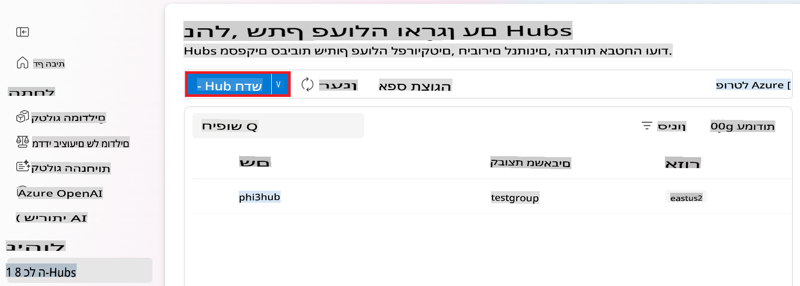

1. בצעו את המשימות הבאות:

    - הזינו **שם Hub**. חייב להיות ערך ייחודי.
    - בחרו את **מנוי Azure** שלכם.
    - בחרו את **קבוצת המשאבים** לשימוש (צרו חדשה אם צריך).
    - בחרו את **מיקום** השימוש.
    - בחרו את **Connect Azure AI Services** לשימוש (צרו חדש אם צריך).
    - בחרו **Connect Azure AI Search** ל-**Skip connecting**.
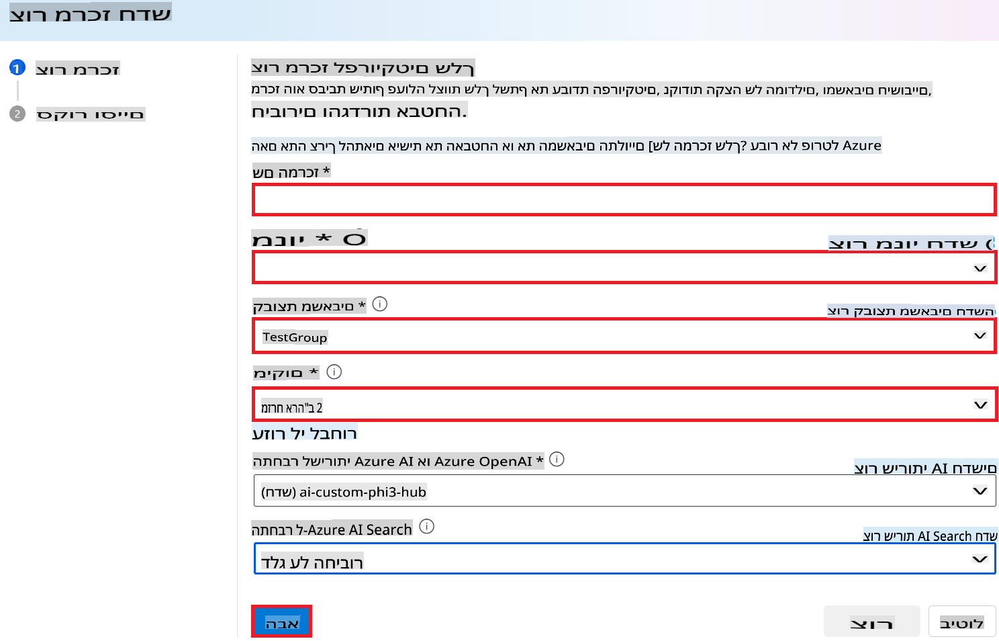

1. בחרו **Next**.

#### יצירת פרויקט Azure AI Foundry

1. ב-Hub שיצרתם, בחרו **All projects** מהתפריט בצד שמאל.

1. בחרו **+ New project** מתפריט הניווט.

    

1. הזינו **Project name**. חייב להיות ערך ייחודי.

    

1. בחרו **Create a project**.

#### הוספת חיבור מותאם אישית למודל Phi-3 / Phi-3.5 שעבר כוונון

כדי לשלב את מודל Phi-3 / Phi-3.5 המותאם אישית שלכם עם Prompt flow, עליכם לשמור את ה-endpoint והמפתח של המודל בחיבור מותאם אישית. הגדרה זו מבטיחה גישה למודל המותאם שלכם ב-Prompt flow.

#### הגדרת מפתח API ו-Endpoint URI למודל Phi-3 / Phi-3.5 שעבר כוונון

1. בקרו ב-[Azure ML Studio](https://ml.azure.com/home?wt.mc_id=studentamb_279723).

1. עברו ל-Azure Machine learning workspace שיצרתם.

1. בחרו **Endpoints** מהתפריט בצד שמאל.

    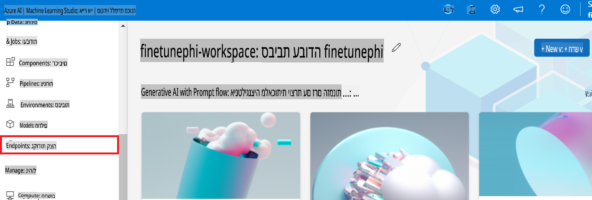

1. בחרו את ה-Endpoint שיצרתם.

    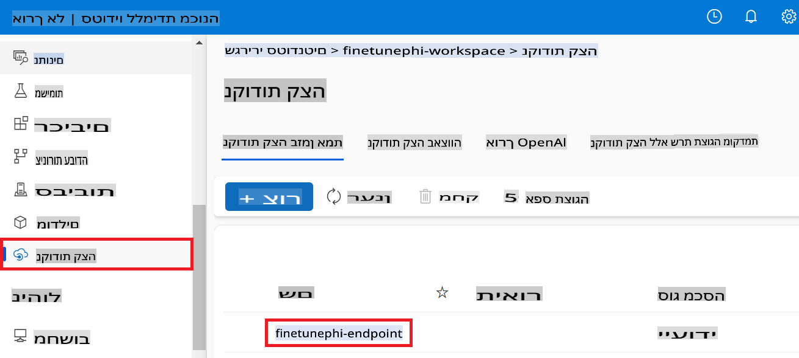

1. בחרו **Consume** מתפריט הניווט.

1. העתיקו את ה-**REST endpoint** ואת ה-**Primary key**.

    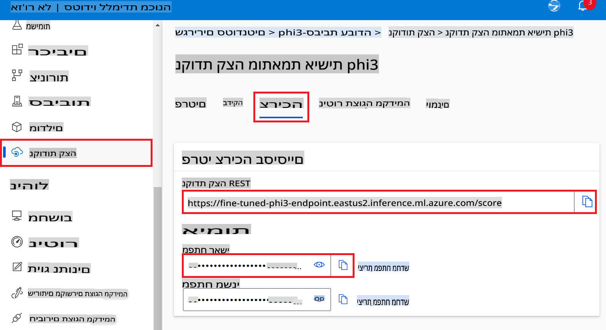

#### הוספת החיבור המותאם אישית

1. בקרו ב-[Azure AI Foundry](https://ai.azure.com/?wt.mc_id=studentamb_279723).

1. עברו לפרויקט Azure AI Foundry שיצרתם.

1. בפרויקט שיצרתם, בחרו **Settings** מהתפריט בצד שמאל.

1. בחרו **+ New connection**.

    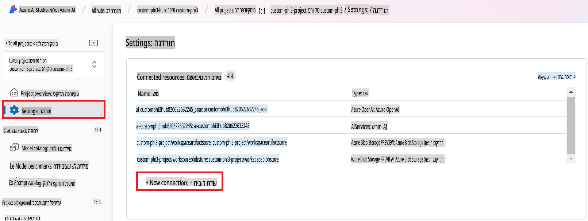

1. בחרו **Custom keys** מתפריט הניווט.

    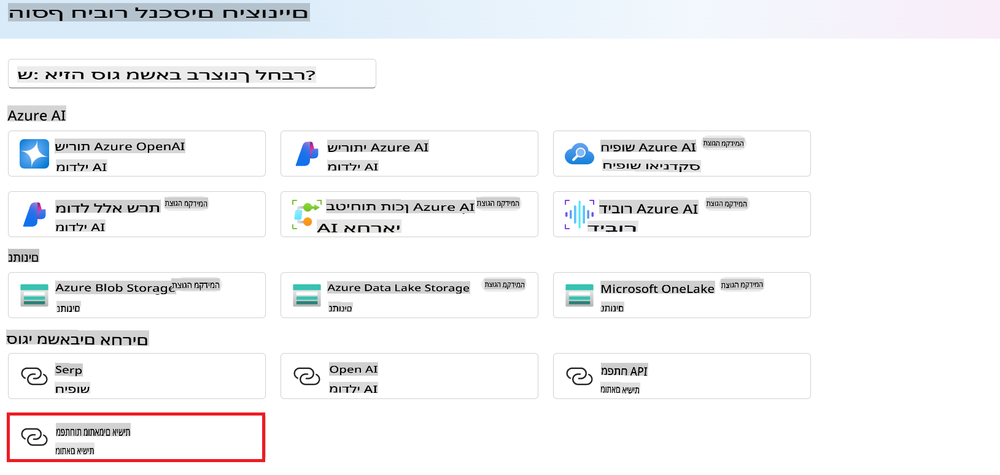

1. בצעו את המשימות הבאות:

    - בחרו **+ Add key value pairs**.
    - לשם המפתח, הזינו **endpoint** והדביקו את ה-endpoint שהעתקתם מ-Azure ML Studio בשדה הערך.
    - בחרו שוב **+ Add key value pairs**.
    - לשם המפתח, הזינו **key** והדביקו את המפתח שהעתקתם מ-Azure ML Studio בשדה הערך.
    - לאחר הוספת המפתחות, בחרו **is secret** כדי למנוע חשיפת המפתח.

    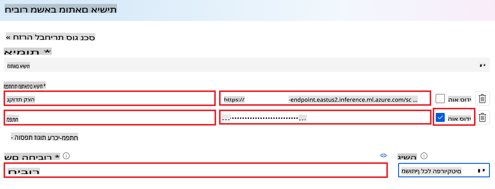

1. בחרו **Add connection**.

#### יצירת Prompt flow

הוספתם חיבור מותאם אישית ב-Azure AI Foundry. כעת, בואו ניצור Prompt flow באמצעות השלבים הבאים. לאחר מכן, תחברו את ה-Prompt flow לחיבור המותאם כדי להשתמש במודל שעבר כוונון בתוך ה-Prompt flow.

1. עברו לפרויקט Azure AI Foundry שיצרתם.

1. בחרו **Prompt flow** מהתפריט בצד שמאל.

1. בחרו **+ Create** מתפריט הניווט.

    

1. בחרו **Chat flow** מתפריט הניווט.

    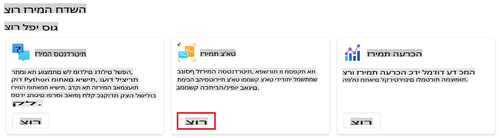

1. הזינו **Folder name** לשימוש.

    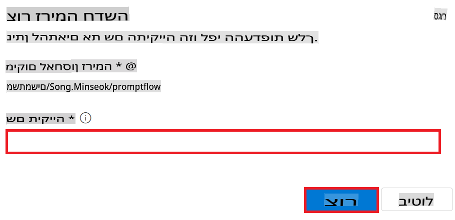

1. בחרו **Create**.

#### הגדרת Prompt flow לשיחה עם מודל Phi-3 / Phi-3.5 המותאם אישית שלכם

עליכם לשלב את מודל Phi-3 / Phi-3.5 שעבר כוונון ב-Prompt flow. עם זאת, ה-Prompt flow הקיים אינו מותאם למטרה זו. לכן, עליכם לעצב מחדש את ה-Prompt flow כדי לאפשר שילוב של המודל המותאם.

1. ב-Prompt flow, בצעו את המשימות הבאות כדי לבנות מחדש את הזרימה הקיימת:

    - בחרו **Raw file mode**.
    - מחקו את כל הקוד הקיים בקובץ *flow.dag.yml*.
    - הוסיפו את הקוד הבא ל-*flow.dag.yml*.

        ```yml
        inputs:
          input_data:
            type: string
            default: "Who founded Microsoft?"

        outputs:
          answer:
            type: string
            reference: ${integrate_with_promptflow.output}

        nodes:
        - name: integrate_with_promptflow
          type: python
          source:
            type: code
            path: integrate_with_promptflow.py
          inputs:
            input_data: ${inputs.input_data}
        ```

    - בחרו **Save**.

    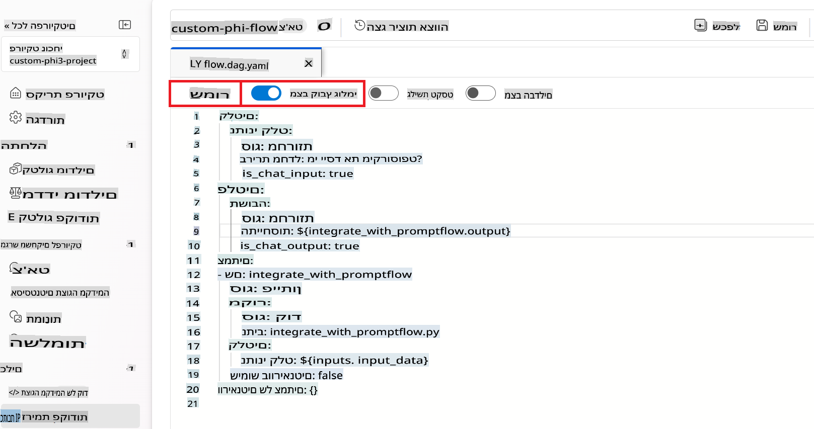

1. הוסיפו את הקוד הבא ל-*integrate_with_promptflow.py* כדי להשתמש במודל Phi-3 / Phi-3.5 המותאם אישית ב-Prompt flow.

    ```python
    import logging
    import requests
    from promptflow import tool
    from promptflow.connections import CustomConnection

    # Logging setup
    logging.basicConfig(
        format="%(asctime)s - %(levelname)s - %(name)s - %(message)s",
        datefmt="%Y-%m-%d %H:%M:%S",
        level=logging.DEBUG
    )
    logger = logging.getLogger(__name__)

    def query_phi3_model(input_data: str, connection: CustomConnection) -> str:
        """
        Send a request to the Phi-3 / Phi-3.5 model endpoint with the given input data using Custom Connection.
        """

        # "connection" is the name of the Custom Connection, "endpoint", "key" are the keys in the Custom Connection
        endpoint_url = connection.endpoint
        api_key = connection.key

        headers = {
            "Content-Type": "application/json",
            "Authorization": f"Bearer {api_key}"
        }
    data = {
        "input_data": [input_data],
        "params": {
            "temperature": 0.7,
            "max_new_tokens": 128,
            "do_sample": True,
            "return_full_text": True
            }
        }
        try:
            response = requests.post(endpoint_url, json=data, headers=headers)
            response.raise_for_status()
            
            # Log the full JSON response
            logger.debug(f"Full JSON response: {response.json()}")

            result = response.json()["output"]
            logger.info("Successfully received response from Azure ML Endpoint.")
            return result
        except requests.exceptions.RequestException as e:
            logger.error(f"Error querying Azure ML Endpoint: {e}")
            raise

    @tool
    def my_python_tool(input_data: str, connection: CustomConnection) -> str:
        """
        Tool function to process input data and query the Phi-3 / Phi-3.5 model.
        """
        return query_phi3_model(input_data, connection)

    ```

    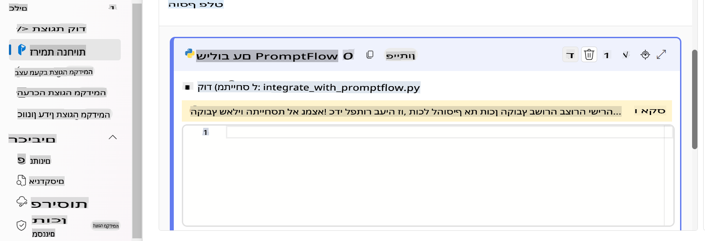

> [!NOTE]
> למידע מפורט יותר על שימוש ב-Prompt flow ב-Azure AI Foundry, ניתן לעיין ב-[Prompt flow in Azure AI Foundry](https://learn.microsoft.com/azure/ai-studio/how-to/prompt-flow).

1. בחרו **Chat input**, **Chat output** כדי לאפשר שיחה עם המודל שלכם.

    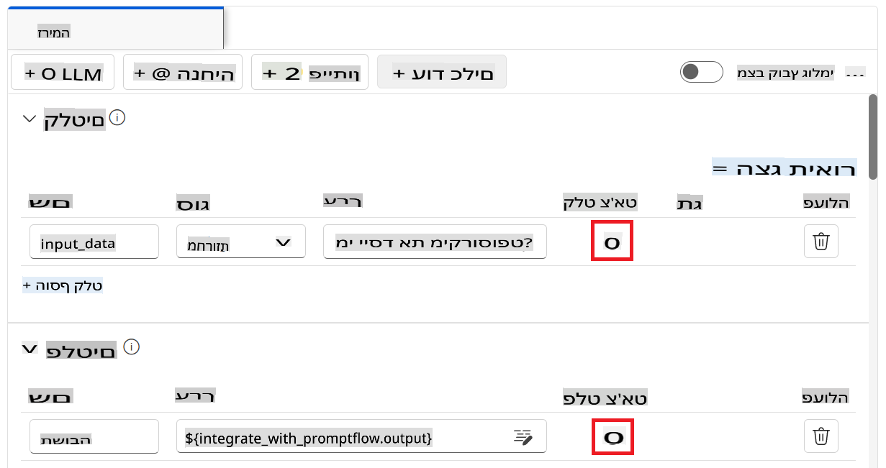

1. כעת אתם מוכנים לשוחח עם מודל Phi-3 / Phi-3.5 המותאם אישית שלכם. בתרגיל הבא תלמדו כיצד להתחיל Prompt flow ולהשתמש בו לשיחה עם המודל שעבר כוונון.

> [!NOTE]
>
> הזרימה שבניתם מחדש אמורה להיראות כמו בתמונה למטה:
>
> 
>

#### התחלת Prompt flow

1. בחרו **Start compute sessions** כדי להתחיל את ה-Prompt flow.

    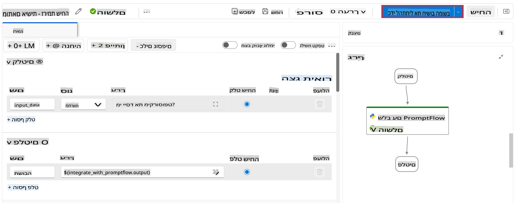

1. בחרו **Validate and parse input** כדי לחדש פרמטרים.

    

1. בחרו את **Value** של ה-**connection** לחיבור המותאם שיצרתם. לדוגמה, *connection*.

    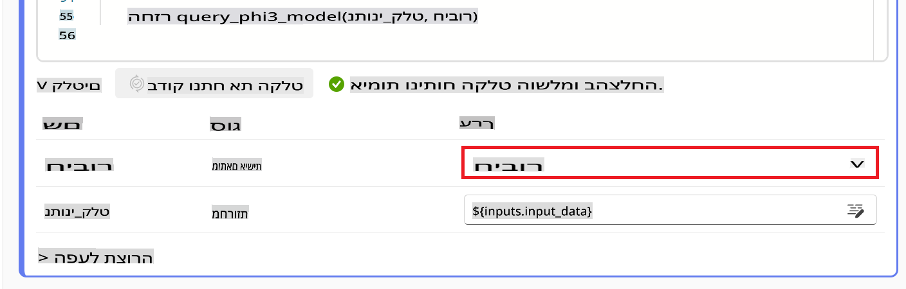

#### שיחה עם מודל Phi-3 / Phi-3.5 המותאם אישית שלכם

1. בחרו **Chat**.

    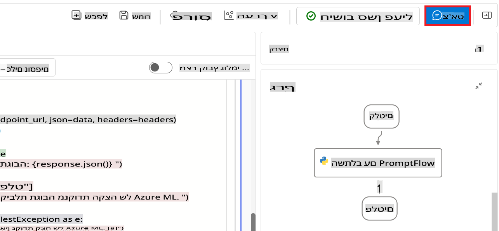

1. דוגמה לתוצאות: כעת תוכלו לשוחח עם מודל Phi-3 / Phi-3.5 המותאם אישית שלכם. מומלץ לשאול שאלות המבוססות על הנתונים ששימשו לכוונון.

    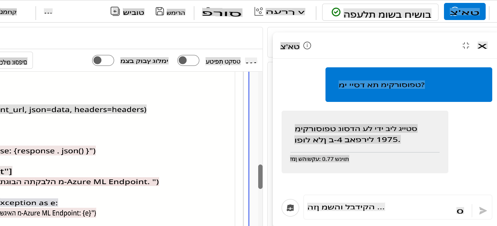

### פריסת Azure OpenAI להערכת מודל Phi-3 / Phi-3.5

כדי להעריך את מודל Phi-3 / Phi-3.5 ב-Azure AI Foundry, עליכם לפרוס מודל Azure OpenAI. מודל זה ישמש להערכת הביצועים של מודל Phi-3 / Phi-3.5.

#### פריסת Azure OpenAI

1. התחברו ל-[Azure AI Foundry](https://ai.azure.com/?wt.mc_id=studentamb_279723).

1. עברו לפרויקט Azure AI Foundry שיצרתם.

    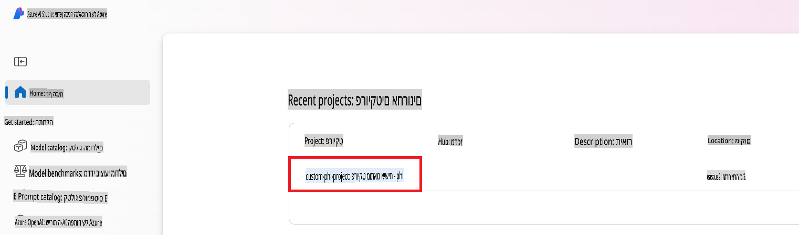

1. בפרויקט שיצרתם, בחרו **Deployments** מהתפריט בצד שמאל.

1. בחרו **+ Deploy model** מתפריט הניווט.

1. בחרו **Deploy base model**.

    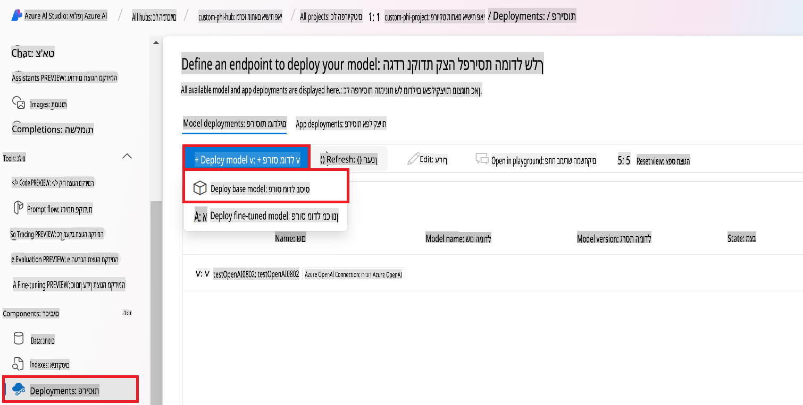

1. בחרו מודל Azure OpenAI שבו תרצו להשתמש. לדוגמה, **gpt-4o**.

    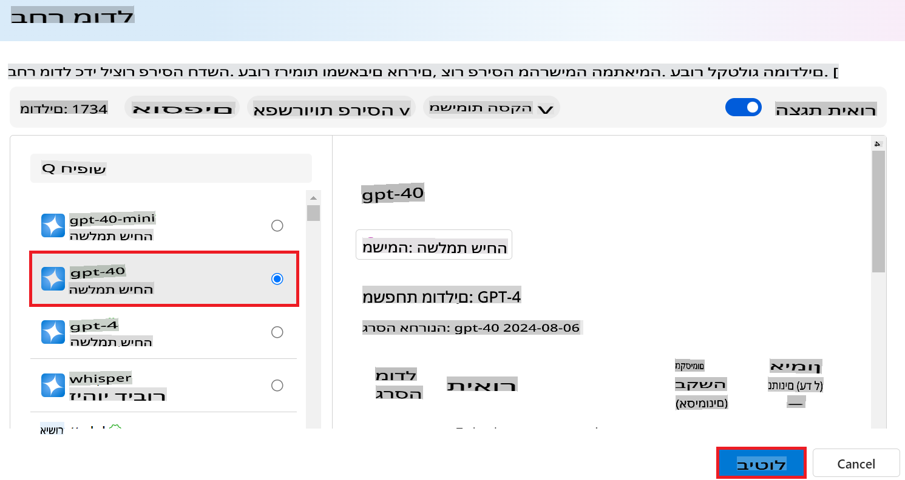

1. בחרו **Confirm**.

### הערכת מודל Phi-3 / Phi-3.5 שעבר כוונון באמצעות Prompt flow של Azure AI Foundry

### התחלת הערכה חדשה

1. בקרו ב-[Azure AI Foundry](https://ai.azure.com/?wt.mc_id=studentamb_279723).

1. עברו לפרויקט Azure AI Foundry שיצרתם.

    

1. בפרויקט שיצרתם, בחרו **Evaluation** מהתפריט בצד שמאל.

1. בחרו **+ New evaluation** מתפריט הניווט.
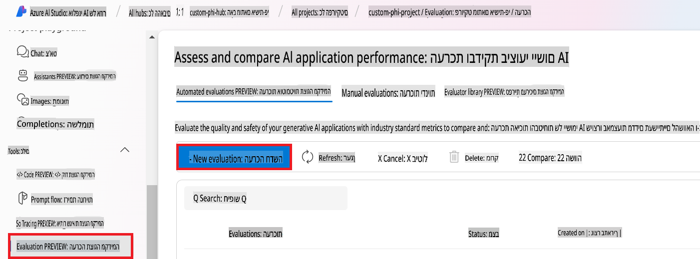

1. בחר **Prompt flow** להערכה.

    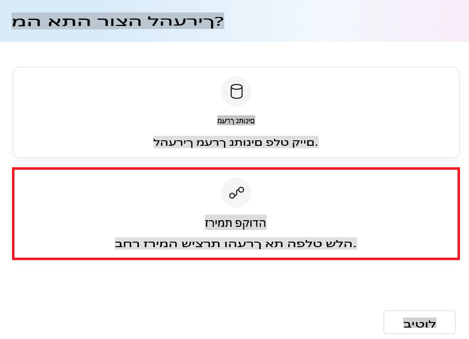

1. בצע את המשימות הבאות:

    - הזן שם להערכה. עליו להיות ייחודי.
    - בחר **שאלה ותשובה ללא הקשר** כסוג המשימה. הסיבה לכך היא שמאגר הנתונים **UlTRACHAT_200k** המשמש במדריך זה אינו מכיל הקשר.
    - בחר את ה-Prompt flow שברצונך להעריך.

    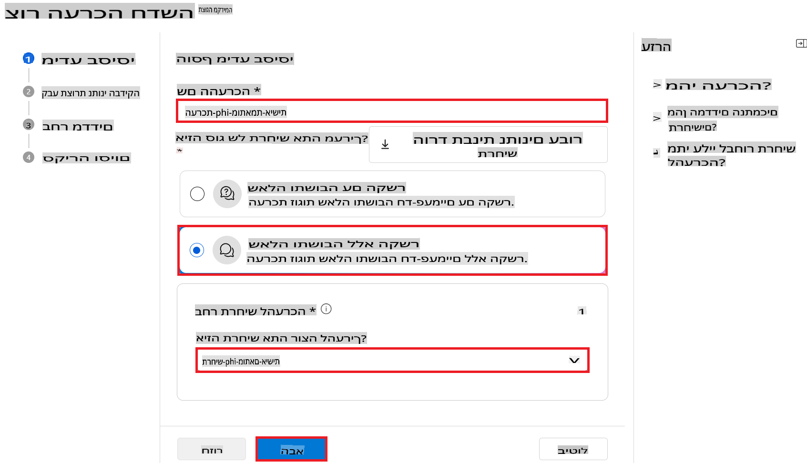

1. בחר **Next**.

1. בצע את המשימות הבאות:

    - בחר **Add your dataset** כדי להעלות את מאגר הנתונים. לדוגמה, תוכל להעלות את קובץ מאגר הנתונים לבדיקה, כמו *test_data.json1*, הכלול בעת הורדת מאגר הנתונים **ULTRACHAT_200k**.
    - בחר את **Dataset column** המתאים שמתאים למאגר הנתונים שלך. לדוגמה, אם אתה משתמש במאגר הנתונים **ULTRACHAT_200k**, בחר **${data.prompt}** כעמודת מאגר הנתונים.

    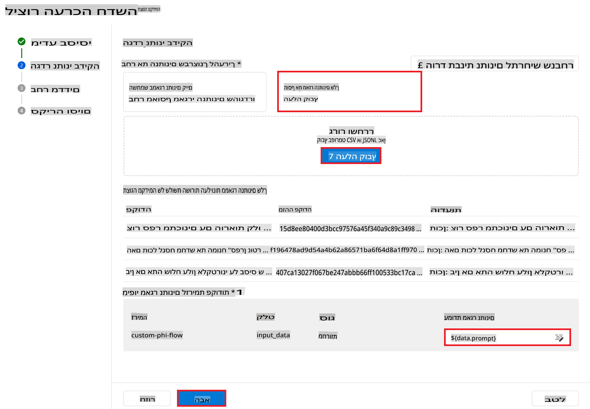

1. בחר **Next**.

1. בצע את המשימות הבאות כדי להגדיר את מדדי הביצועים והאיכות:

    - בחר את מדדי הביצועים והאיכות שברצונך להשתמש בהם.
    - בחר את מודל Azure OpenAI שיצרת להערכה. לדוגמה, בחר **gpt-4o**.

    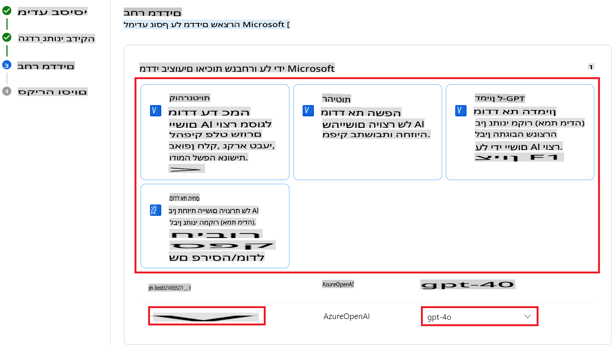

1. בצע את המשימות הבאות כדי להגדיר את מדדי הסיכון והבטיחות:

    - בחר את מדדי הסיכון והבטיחות שברצונך להשתמש בהם.
    - בחר את הסף לחישוב שיעור הפגמים שברצונך להשתמש בו. לדוגמה, בחר **Medium**.
    - עבור **שאלה**, בחר **Data source** ל-**{$data.prompt}**.
    - עבור **תשובה**, בחר **Data source** ל-**{$run.outputs.answer}**.
    - עבור **ground_truth**, בחר **Data source** ל-**{$data.message}**.

    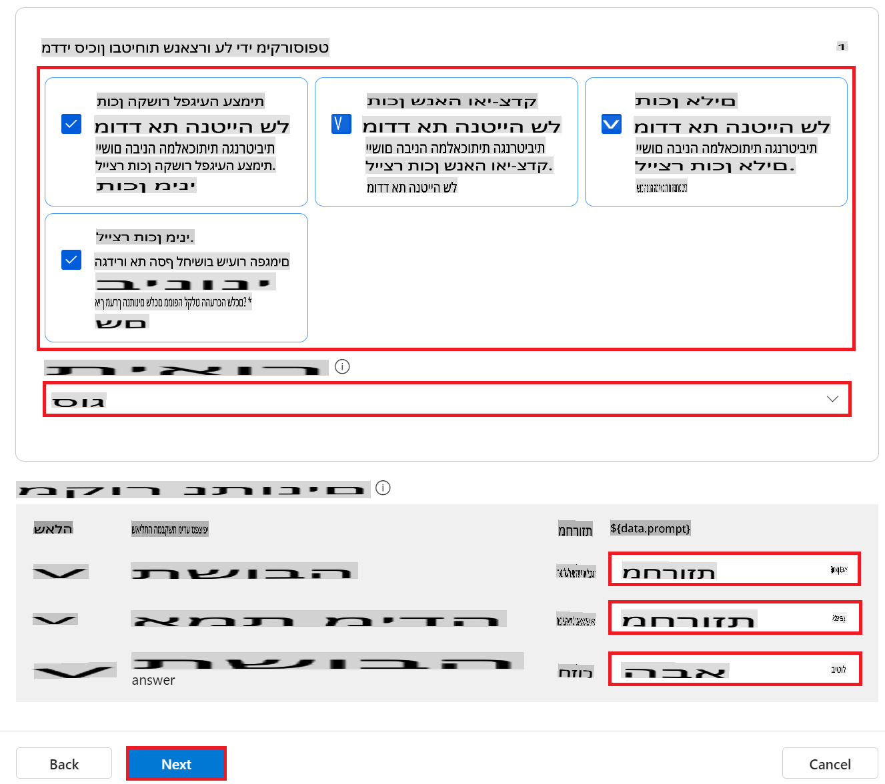

1. בחר **Next**.

1. בחר **Submit** כדי להתחיל את ההערכה.

1. ההערכה תיקח זמן מה להסתיים. תוכל לעקוב אחרי ההתקדמות בכרטיסיית **Evaluation**.

### סקירת תוצאות ההערכה

> [!NOTE]
> התוצאות המוצגות להלן נועדו להמחיש את תהליך ההערכה. במדריך זה, השתמשנו במודל שעבר התאמה אישית על מאגר נתונים קטן יחסית, מה שעשוי להוביל לתוצאות שאינן מיטביות. התוצאות בפועל עשויות להשתנות באופן משמעותי בהתאם לגודל, איכות ומגוון מאגר הנתונים, וכן בהתאם לקונפיגורציה הספציפית של המודל.

לאחר השלמת ההערכה, תוכל לסקור את התוצאות הן עבור מדדי הביצועים והן עבור מדדי הבטיחות.

1. מדדי ביצועים ואיכות:

    - הערכת האפקטיביות של המודל ביצירת תגובות קוהרנטיות, שוטפות ורלוונטיות.

    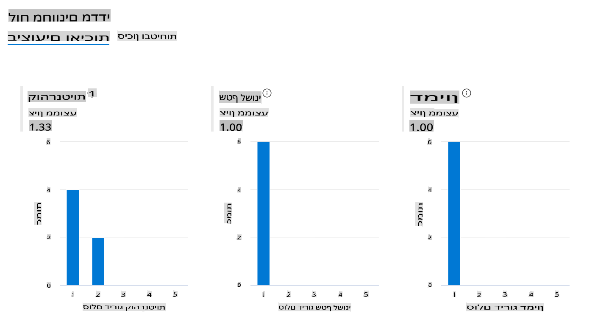

1. מדדי סיכון ובטיחות:

    - הבטחה שהתוצרים של המודל בטוחים ומתיישבים עם עקרונות AI אחראי, תוך הימנעות מתוכן מזיק או פוגעני.

    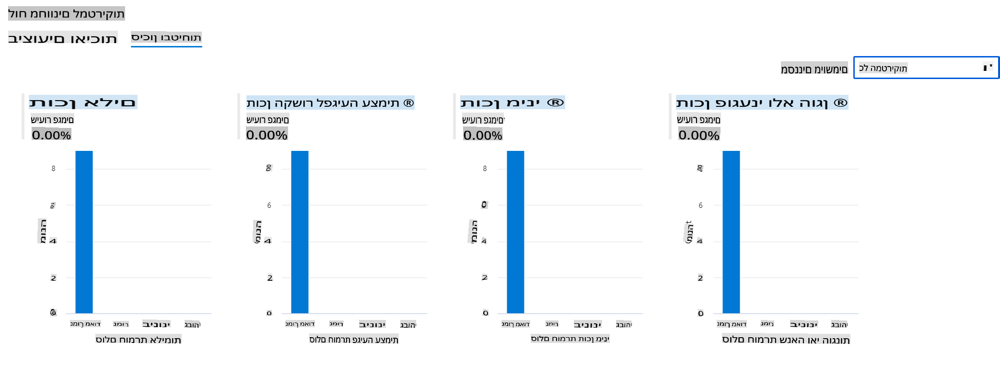

1. ניתן לגלול למטה כדי לצפות ב-**Detailed metrics result**.

    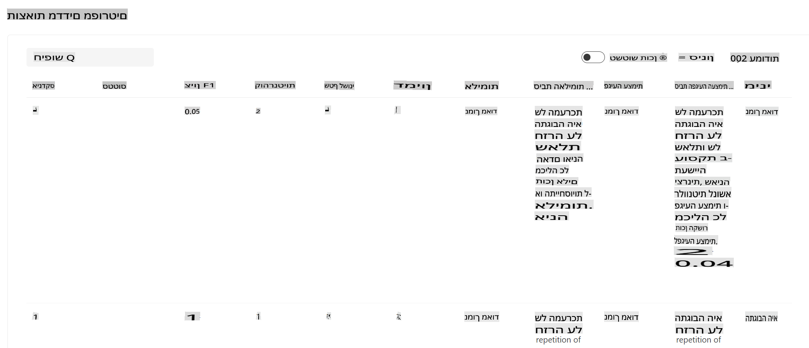

1. על ידי הערכת המודל המותאם אישית Phi-3 / Phi-3.5 שלך אל מול מדדי ביצועים ובטיחות, תוכל לוודא שהמודל לא רק יעיל, אלא גם פועל בהתאם לעקרונות AI אחראי, מה שהופך אותו למוכן לשימוש בעולם האמיתי.

## כל הכבוד!

### השלמת את המדריך

הערכת בהצלחה את מודל Phi-3 המותאם אישית המשולב עם Prompt flow ב-Azure AI Foundry. זהו שלב חשוב כדי להבטיח שהמודלים שלך לא רק מבצעים היטב, אלא גם עומדים בעקרונות AI אחראי של Microsoft, ועוזרים לך לבנות יישומי AI אמינים ואחראיים.


## ניקוי משאבי Azure

נקה את משאבי Azure שלך כדי להימנע מחיובים נוספים לחשבונך. עבור לפורטל Azure ומחק את המשאבים הבאים:

- משאב Azure Machine learning.
- נקודת הקצה של מודל Azure Machine learning.
- משאב פרויקט Azure AI Foundry.
- משאב Prompt flow של Azure AI Foundry.

### צעדים הבאים

#### תיעוד

- [הערכת מערכות AI באמצעות לוח המחוונים של AI אחראי](https://learn.microsoft.com/azure/machine-learning/concept-responsible-ai-dashboard?view=azureml-api-2&source=recommendations?wt.mc_id=studentamb_279723)  
- [מדדי הערכה וניטור עבור AI גנרטיבי](https://learn.microsoft.com/azure/ai-studio/concepts/evaluation-metrics-built-in?tabs=definition?wt.mc_id=studentamb_279723)  
- [תיעוד Azure AI Foundry](https://learn.microsoft.com/azure/ai-studio/?wt.mc_id=studentamb_279723)  
- [תיעוד Prompt flow](https://microsoft.github.io/promptflow/?wt.mc_id=studentamb_279723)  

#### תוכן הדרכה

- [מבוא לגישת AI אחראי של Microsoft](https://learn.microsoft.com/training/modules/introduction-to-microsofts-responsible-ai-approach/?source=recommendations?wt.mc_id=studentamb_279723)  
- [מבוא ל-Azure AI Foundry](https://learn.microsoft.com/training/modules/introduction-to-azure-ai-studio/?wt.mc_id=studentamb_279723)  

### עיון נוסף

- [מהו AI אחראי?](https://learn.microsoft.com/azure/machine-learning/concept-responsible-ai?view=azureml-api-2?wt.mc_id=studentamb_279723)  
- [הכרזה על כלים חדשים ב-Azure AI כדי לעזור לך לבנות יישומי AI גנרטיבי בטוחים ואמינים יותר](https://azure.microsoft.com/blog/announcing-new-tools-in-azure-ai-to-help-you-build-more-secure-and-trustworthy-generative-ai-applications/?wt.mc_id=studentamb_279723)  
- [הערכת יישומי AI גנרטיבי](https://learn.microsoft.com/azure/ai-studio/concepts/evaluation-approach-gen-ai?wt.mc_id%3Dstudentamb_279723)  

**כתב ויתור**:  
מסמך זה תורגם באמצעות שירותי תרגום מבוססי בינה מלאכותית. למרות שאנו שואפים לדיוק, יש להיות מודעים לכך שתרגומים אוטומטיים עשויים להכיל שגיאות או אי-דיוקים. המסמך המקורי בשפתו המקורית צריך להיחשב כמקור הסמכותי. למידע קריטי, מומלץ להשתמש בתרגום מקצועי על ידי אדם. אנו לא נושאים באחריות לכל אי-הבנה או פירוש שגוי הנובעים משימוש בתרגום זה.