# כוונון ושילוב מודלים מותאמים אישית של Phi-3 עם Prompt flow

דוגמה זו מקצה לקצה (E2E) מבוססת על המדריך "[Fine-Tune and Integrate Custom Phi-3 Models with Prompt Flow: Step-by-Step Guide](https://techcommunity.microsoft.com/t5/educator-developer-blog/fine-tune-and-integrate-custom-phi-3-models-with-prompt-flow/ba-p/4178612?WT.mc_id=aiml-137032-kinfeylo)" מקהילת הטכנולוגיה של Microsoft. היא מציגה את התהליכים של כוונון, פריסה ושילוב מודלים מותאמים אישית של Phi-3 עם Prompt flow.

## סקירה כללית

בדוגמה זו מקצה לקצה, תלמדו כיצד לכוונן את מודל Phi-3 ולשלב אותו עם Prompt flow. על ידי ניצול Azure Machine Learning ו-Prompt flow, תיצרו תהליך עבודה לפריסה ושימוש במודלים מותאמים אישית של בינה מלאכותית. דוגמה זו מחולקת לשלושה תרחישים:

**תרחיש 1: הגדרת משאבי Azure והכנה לכוונון**

**תרחיש 2: כוונון מודל Phi-3 ופריסתו ב-Azure Machine Learning Studio**

**תרחיש 3: שילוב עם Prompt flow ושיחה עם המודל המותאם שלכם**

הנה סקירה כללית של דוגמה זו.

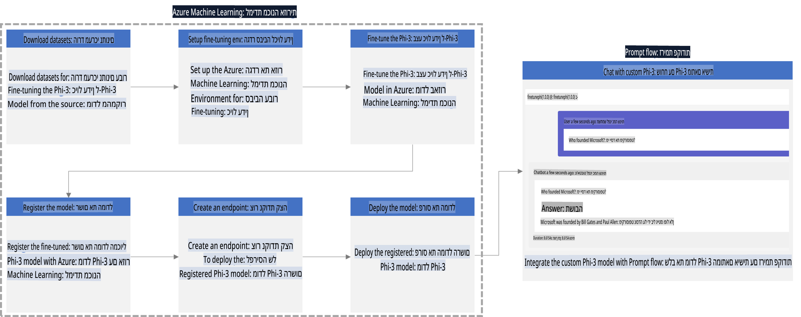

### תוכן עניינים

1. **[תרחיש 1: הגדרת משאבי Azure והכנה לכוונון](../../../../../../md/02.Application/01.TextAndChat/Phi3)**
    - [יצירת Azure Machine Learning Workspace](../../../../../../md/02.Application/01.TextAndChat/Phi3)
    - [בקשת מכסות GPU במנוי Azure](../../../../../../md/02.Application/01.TextAndChat/Phi3)
    - [הוספת הרשאות תפקיד](../../../../../../md/02.Application/01.TextAndChat/Phi3)
    - [הגדרת פרויקט](../../../../../../md/02.Application/01.TextAndChat/Phi3)
    - [הכנת סט נתונים לכוונון](../../../../../../md/02.Application/01.TextAndChat/Phi3)

1. **[תרחיש 2: כוונון מודל Phi-3 ופריסתו ב-Azure Machine Learning Studio](../../../../../../md/02.Application/01.TextAndChat/Phi3)**
    - [הגדרת Azure CLI](../../../../../../md/02.Application/01.TextAndChat/Phi3)
    - [כוונון מודל Phi-3](../../../../../../md/02.Application/01.TextAndChat/Phi3)
    - [פריסת המודל המכוונן](../../../../../../md/02.Application/01.TextAndChat/Phi3)

1. **[תרחיש 3: שילוב עם Prompt flow ושיחה עם המודל המותאם שלכם](../../../../../../md/02.Application/01.TextAndChat/Phi3)**
    - [שילוב מודל Phi-3 מותאם עם Prompt flow](../../../../../../md/02.Application/01.TextAndChat/Phi3)
    - [שיחה עם המודל המותאם שלכם](../../../../../../md/02.Application/01.TextAndChat/Phi3)

## תרחיש 1: הגדרת משאבי Azure והכנה לכוונון

### יצירת Azure Machine Learning Workspace

1. הקלידו *azure machine learning* בשורת החיפוש בראש דף הפורטל ובחרו **Azure Machine Learning** מתוך האפשרויות שמופיעות.

    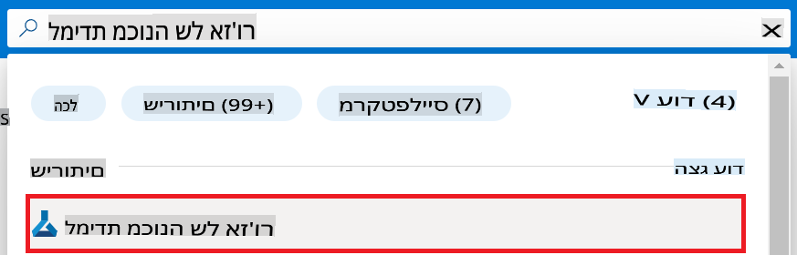

1. בחרו **+ Create** מתוך תפריט הניווט.

1. בחרו **New workspace** מתוך תפריט הניווט.

    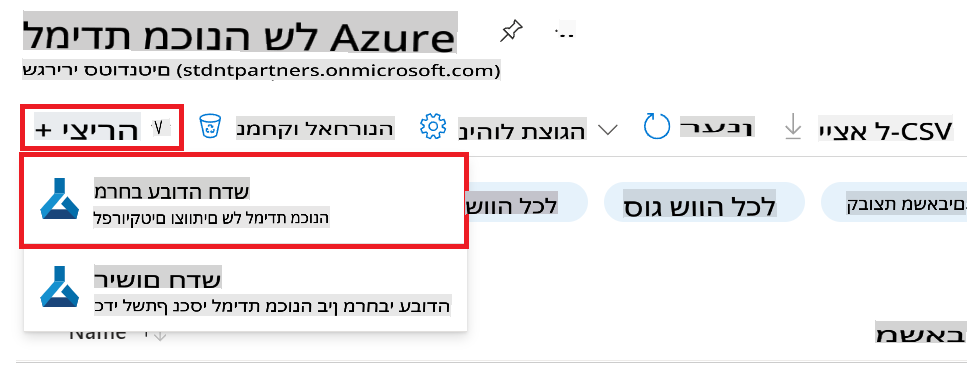

1. בצעו את המשימות הבאות:

    - בחרו את **Subscription** של Azure שלכם.
    - בחרו את **Resource group** לשימוש (צרו חדש אם נדרש).
    - הזינו **Workspace Name**. חייב להיות ערך ייחודי.
    - בחרו את **Region** בו תרצו להשתמש.
    - בחרו את **Storage account** לשימוש (צרו חדש אם נדרש).
    - בחרו את **Key vault** לשימוש (צרו חדש אם נדרש).
    - בחרו את **Application insights** לשימוש (צרו חדש אם נדרש).
    - בחרו את **Container registry** לשימוש (צרו חדש אם נדרש).

    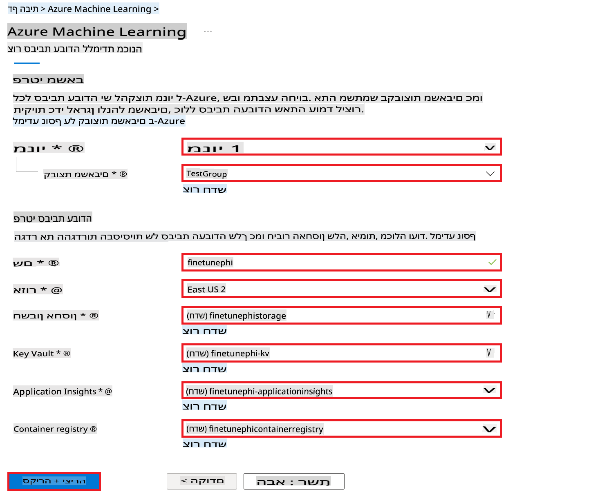

1. בחרו **Review + Create**.

1. בחרו **Create**.

### בקשת מכסות GPU במנוי Azure

בדוגמה זו, תשתמשו ב-*Standard_NC24ads_A100_v4 GPU* לכוונון, הדורש בקשת מכסה, וב-*Standard_E4s_v3* CPU לפריסה, שאינו דורש בקשת מכסה.

> [!NOTE]
>
> רק מנויים מסוג Pay-As-You-Go (סוג המנוי הסטנדרטי) זכאים להקצאת GPU; מנויי הטבה אינם נתמכים כרגע.
>
> למשתמשים במנויי הטבה (כגון Visual Studio Enterprise Subscription) או למי שרוצה לבדוק במהירות את תהליך הכוונון והפריסה, מדריך זה מספק גם הוראות לכוונון עם סט נתונים מינימלי באמצעות CPU. עם זאת, חשוב לציין שתוצאות הכוונון טובות משמעותית בשימוש ב-GPU עם סטי נתונים גדולים.

1. בקרו ב-[Azure ML Studio](https://ml.azure.com/home?wt.mc_id=studentamb_279723).

1. בצעו את המשימות הבאות כדי לבקש מכסת *Standard NCADSA100v4 Family*:

    - בחרו **Quota** מתפריט הצד השמאלי.
    - בחרו את **Virtual machine family** לשימוש. לדוגמה, בחרו **Standard NCADSA100v4 Family Cluster Dedicated vCPUs**, הכולל את *Standard_NC24ads_A100_v4* GPU.
    - בחרו **Request quota** מתוך תפריט הניווט.

        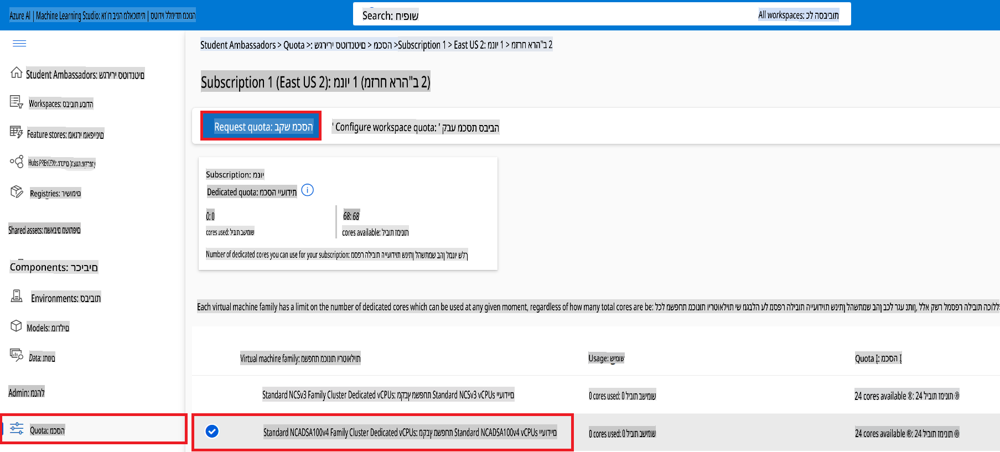

    - בדף בקשת מכסה, הזינו את **New cores limit** שתרצו להשתמש בו. לדוגמה, 24.
    - בדף בקשת מכסה, בחרו **Submit** כדי לבקש את מכסת ה-GPU.

> [!NOTE]
> ניתן לבחור את ה-GPU או ה-CPU המתאימים לצרכים שלכם באמצעות הפניה למסמך [Sizes for Virtual Machines in Azure](https://learn.microsoft.com/azure/virtual-machines/sizes/overview?tabs=breakdownseries%2Cgeneralsizelist%2Ccomputesizelist%2Cmemorysizelist%2Cstoragesizelist%2Cgpusizelist%2Cfpgasizelist%2Chpcsizelist).

### הוספת הרשאות תפקיד

כדי לכוונן ולפרוס את המודלים שלכם, תחילה עליכם ליצור User Assigned Managed Identity (UAI) ולהקצות לו את ההרשאות המתאימות. ה-UAI ישמש לאימות במהלך הפריסה.

#### יצירת User Assigned Managed Identity (UAI)

1. הקלידו *managed identities* בשורת החיפוש בראש דף הפורטל ובחרו **Managed Identities** מתוך האפשרויות שמופיעות.

    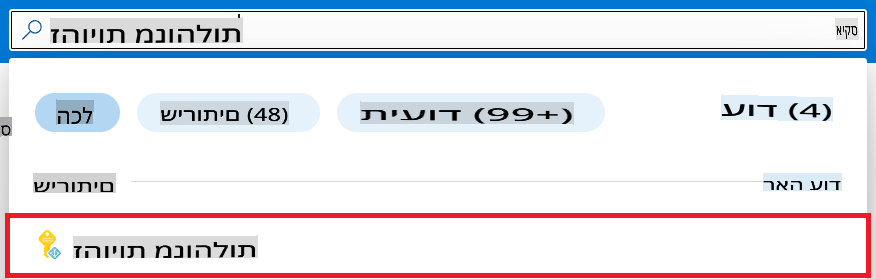

1. בחרו **+ Create**.

    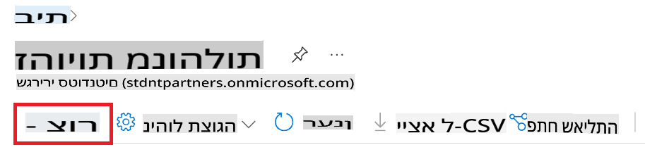

1. בצעו את המשימות הבאות:

    - בחרו את **Subscription** של Azure שלכם.
    - בחרו את **Resource group** לשימוש (צרו חדש אם נדרש).
    - בחרו את **Region** בו תרצו להשתמש.
    - הזינו **Name**. חייב להיות ערך ייחודי.

1. בחרו **Review + create**.

1. בחרו **+ Create**.

#### הוספת הרשאת תפקיד Contributor ל-Managed Identity

1. נווטו למשאב ה-Managed Identity שיצרתם.

1. בחרו **Azure role assignments** מתפריט הצד השמאלי.

1. בחרו **+Add role assignment** מתוך תפריט הניווט.

1. בדף הוספת הרשאת תפקיד, בצעו את המשימות הבאות:
    - בחרו את **Scope** ל-**Resource group**.
    - בחרו את **Subscription** של Azure שלכם.
    - בחרו את **Resource group** לשימוש.
    - בחרו את **Role** ל-**Contributor**.

    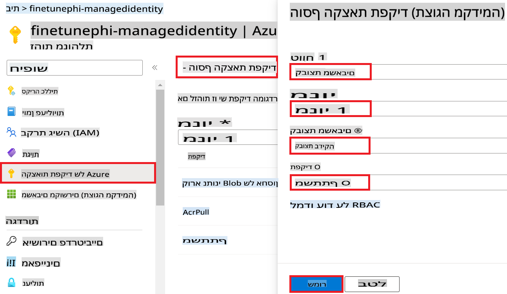

1. בחרו **Save**.

#### הוספת הרשאת תפקיד Storage Blob Data Reader ל-Managed Identity

1. הקלידו *storage accounts* בשורת החיפוש בראש דף הפורטל ובחרו **Storage accounts** מתוך האפשרויות שמופיעות.

    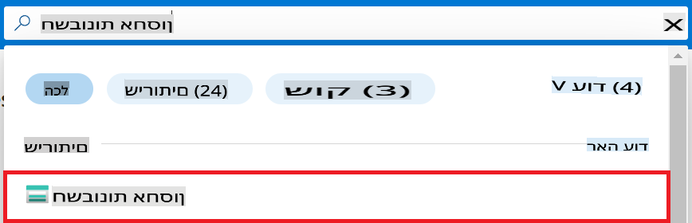

1. בחרו את חשבון האחסון המשויך ל-Azure Machine Learning workspace שיצרתם. לדוגמה, *finetunephistorage*.

1. בצעו את המשימות הבאות כדי לנווט לדף הוספת הרשאת תפקיד:

    - נווטו לחשבון האחסון של Azure שיצרתם.
    - בחרו **Access Control (IAM)** מתפריט הצד השמאלי.
    - בחרו **+ Add** מתוך תפריט הניווט.
    - בחרו **Add role assignment** מתוך תפריט הניווט.

    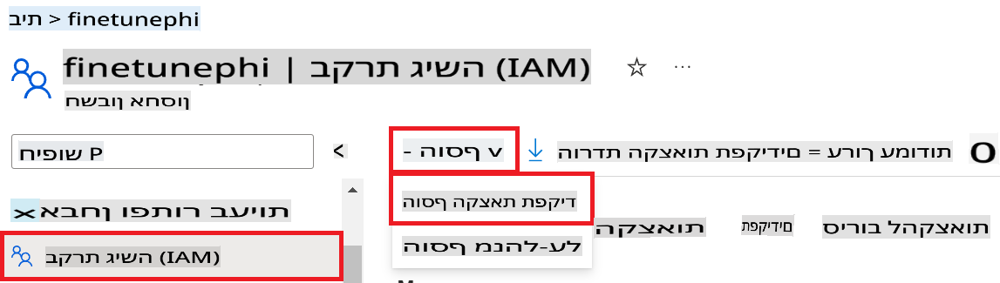

1. בדף הוספת הרשאת תפקיד, בצעו את המשימות הבאות:

    - בדף Role, הקלידו *Storage Blob Data Reader* בשורת החיפוש ובחרו **Storage Blob Data Reader** מתוך האפשרויות שמופיעות.
    - בדף Role, בחרו **Next**.
    - בדף Members, בחרו **Assign access to** **Managed identity**.
    - בדף Members, בחרו **+ Select members**.
    - בדף Select managed identities, בחרו את **Subscription** של Azure שלכם.
    - בדף Select managed identities, בחרו את **Managed identity** ל-**Manage Identity**.
    - בדף Select managed identities, בחרו את Manage Identity שיצרתם. לדוגמה, *finetunephi-managedidentity*.
    - בדף Select managed identities, בחרו **Select**.

    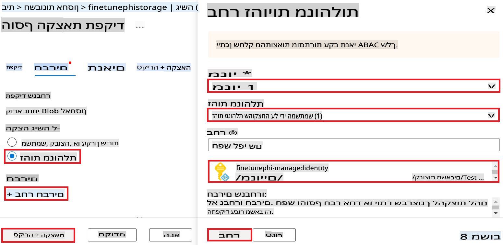

1. בחרו **Review + assign**.

#### הוספת הרשאת תפקיד AcrPull ל-Managed Identity

1. הקלידו *container registries* בשורת החיפוש בראש דף הפורטל ובחרו **Container registries** מתוך האפשרויות שמופיעות.

    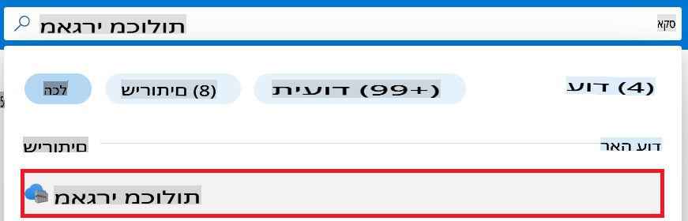

1. בחרו את רישום המכולות המשויך ל-Azure Machine Learning workspace. לדוגמה, *finetunephicontainerregistries*

1. בצעו את המשימות הבאות כדי לנווט לדף הוספת הרשאת תפקיד:

    - בחרו **Access Control (IAM)** מתפריט הצד השמאלי.
    - בחרו **+ Add** מתוך תפריט הניווט.
    - בחרו **Add role assignment** מתוך תפריט הניווט.

1. בדף הוספת הרשאת תפקיד, בצעו את המשימות הבאות:

    - בדף Role, הקלידו *AcrPull* בשורת החיפוש ובחרו **AcrPull** מתוך האפשרויות שמופיעות.
    - בדף Role, בחרו **Next**.
    - בדף Members, בחרו **Assign access to** **Managed identity**.
    - בדף Members, בחרו **+ Select members**.
    - בדף Select managed identities, בחרו את **Subscription** של Azure שלכם.
    - בדף Select managed identities, בחרו את **Managed identity** ל-**Manage Identity**.
    - בדף Select managed identities, בחרו את Manage Identity שיצרתם. לדוגמה, *finetunephi-managedidentity*.
    - בדף Select managed identities, בחרו **Select**.
    - בחרו **Review + assign**.

### הגדרת פרויקט

כעת תיצרו תיקייה לעבודה ותגדירו סביבה וירטואלית לפיתוח תוכנית שמתקשרת עם משתמשים ומשתמשת בהיסטוריית שיחות מאוחסנת מ-Azure Cosmos DB כדי להעשיר את התשובות שלה.

#### יצירת תיקייה לעבודה

1. פתחו חלון טרמינל והקלידו את הפקודה הבאה כדי ליצור תיקייה בשם *finetune-phi* בנתיב ברירת המחדל.

    ```console
    mkdir finetune-phi
    ```

1. הקלידו את הפקודה הבאה בטרמינל כדי לנווט לתיקייה *finetune-phi* שיצרתם.

    ```console
    cd finetune-phi
    ```

#### יצירת סביבה וירטואלית

1. הקלידו את הפקודה הבאה בטרמינל כדי ליצור סביבה וירטואלית בשם *.venv*.

    ```console
    python -m venv .venv
    ```

1. הקלידו את הפקודה הבאה בטרמינל כדי להפעיל את הסביבה הווירטואלית.

    ```console
    .venv\Scripts\activate.bat
    ```

> [!NOTE]
>
> אם זה עבד, תראו *(.venv)* לפני שורת הפקודה.

#### התקנת חבילות נדרשות

1. הקלידו את הפקודות הבאות בטרמינל כדי להתקין את החבילות הנדרשות.

    ```console
    pip install datasets==2.19.1
    pip install transformers==4.41.1
    pip install azure-ai-ml==1.16.0
    pip install torch==2.3.1
    pip install trl==0.9.4
    pip install promptflow==1.12.0
    ```

#### יצירת קבצי פרויקט

בתרגיל זה תיצרו את הקבצים החיוניים לפרויקט. קבצים אלו כוללים סקריפטים להורדת סט הנתונים, הגדרת סביבת Azure Machine Learning, כוונון מודל Phi-3 ופריסת המודל המכוונן. בנוסף, תיצרו קובץ *conda.yml* להגדרת סביבת הכוונון.

בתרגיל זה תבצעו:

- יצירת קובץ *download_dataset.py* להורדת סט הנתונים.
- יצירת קובץ *setup_ml.py* להגדרת סביבת Azure Machine Learning.
- יצירת קובץ *fine_tune.py* בתיקייה *finetuning_dir* לכוונון מודל Phi-3 באמצעות סט הנתונים.
- יצירת קובץ *conda.yml* להגדרת סביבת הכוונון.
- יצירת קובץ *deploy_model.py* לפריסת המודל המכוונן.
- יצירת קובץ *integrate_with_promptflow.py* לשילוב המודל המכוונן והפעלתו באמצעות Prompt flow.
- יצירת קובץ *flow.dag.yml* להגדרת מבנה תהליך העבודה עבור Prompt flow.
- יצירת קובץ *config.py* להזנת מידע Azure.

> [!NOTE]
>
> מבנה תיקיות מלא:
>
> ```text
> └── YourUserName
> .    └── finetune-phi
> .        ├── finetuning_dir
> .        │      └── fine_tune.py
> .        ├── conda.yml
> .        ├── config.py
> .        ├── deploy_model.py
> .        ├── download_dataset.py
> .        ├── flow.dag.yml
> .        ├── integrate_with_promptflow.py
> .        └── setup_ml.py
> ```

1. פתחו את **Visual Studio Code**.

1. בחרו **File** משורת התפריטים.

1. בחרו **Open Folder**.

1. בחרו את התיקייה *finetune-phi* שיצרתם, הממוקמת ב-*C:\Users\yourUserName\finetune-phi*.

    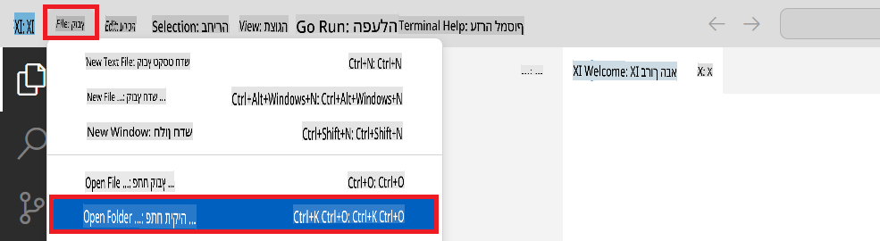

1. בחלונית השמאלית של Visual Studio Code, לחצו לחיצה ימנית ובחרו **New File** ליצירת קובץ חדש בשם *download_dataset.py*.

1. בחלונית השמאלית של Visual Studio Code, לחצו לחיצה ימנית ובחרו **New File** ליצירת קובץ חדש בשם *setup_ml.py*.

1. בחלונית השמאלית של Visual Studio Code, לחצו לחיצה ימנית ובחרו **New File** ליצירת קובץ חדש בשם *deploy_model.py*.

    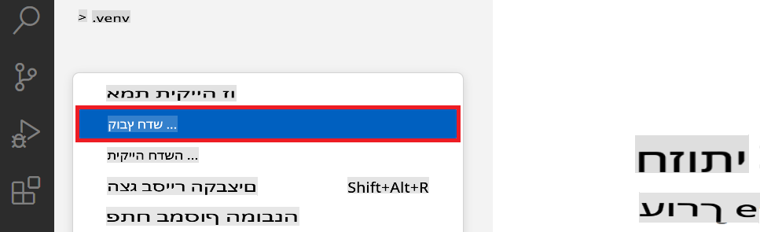

1. בחלונית השמאלית של Visual Studio Code, לחצו לחיצה ימנית ובחרו **New Folder** ליצירת תיקייה חדשה בשם *finetuning_dir*.

1. בתיקייה *finetuning_dir*, צרו קובץ חדש בשם *fine_tune.py*.

#### יצירת והגדרת קובץ *conda.yml*

1. בחלונית השמאלית של Visual Studio Code, לחצו לחיצה ימנית ובחרו **New File** ליצירת קובץ חדש בשם *conda.yml*.

1. הוסיפו את הקוד הבא לקובץ *conda.yml* כדי להגדיר את סביבת הכוונון למודל Phi-3.

    ```yml
    name: phi-3-training-env
    channels:
      - defaults
      - conda-forge
    dependencies:
      - python=3.10
      - pip
      - numpy<2.0
      - pip:
          - torch==2.4.0
          - torchvision==0.19.0
          - trl==0.8.6
          - transformers==4.41
          - datasets==2.21.0
          - azureml-core==1.57.0
          - azure-storage-blob==12.19.0
          - azure-ai-ml==1.16
          - azure-identity==1.17.1
          - accelerate==0.33.0
          - mlflow==2.15.1
          - azureml-mlflow==1.57.0
    ```

#### יצירת והגדרת קובץ *config.py*

1. בחלונית השמאלית של Visual Studio Code, לחצו לחיצה ימנית ובחרו **New File** ליצירת קובץ חדש בשם *config.py*.

1. הוסיפו את הקוד הבא לקובץ *config.py* כדי לכלול את המידע של Azure.

    ```python
    # Azure settings
    AZURE_SUBSCRIPTION_ID = "your_subscription_id"
    AZURE_RESOURCE_GROUP_NAME = "your_resource_group_name" # "TestGroup"

    # Azure Machine Learning settings
    AZURE_ML_WORKSPACE_NAME = "your_workspace_name" # "finetunephi-workspace"

    # Azure Managed Identity settings
    AZURE_MANAGED_IDENTITY_CLIENT_ID = "your_azure_managed_identity_client_id"
    AZURE_MANAGED_IDENTITY_NAME = "your_azure_managed_identity_name" # "finetunephi-mangedidentity"
    AZURE_MANAGED_IDENTITY_RESOURCE_ID = f"/subscriptions/{AZURE_SUBSCRIPTION_ID}/resourceGroups/{AZURE_RESOURCE_GROUP_NAME}/providers/Microsoft.ManagedIdentity/userAssignedIdentities/{AZURE_MANAGED_IDENTITY_NAME}"

    # Dataset file paths
    TRAIN_DATA_PATH = "data/train_data.jsonl"
    TEST_DATA_PATH = "data/test_data.jsonl"

    # Fine-tuned model settings
    AZURE_MODEL_NAME = "your_fine_tuned_model_name" # "finetune-phi-model"
    AZURE_ENDPOINT_NAME = "your_fine_tuned_model_endpoint_name" # "finetune-phi-endpoint"
    AZURE_DEPLOYMENT_NAME = "your_fine_tuned_model_deployment_name" # "finetune-phi-deployment"

    AZURE_ML_API_KEY = "your_fine_tuned_model_api_key"
    AZURE_ML_ENDPOINT = "your_fine_tuned_model_endpoint_uri" # "https://{your-endpoint-name}.{your-region}.inference.ml.azure.com/score"
    ```

#### הוספת משתני סביבה של Azure


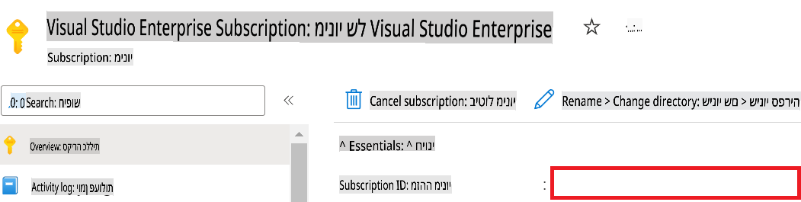

1. בצע את המשימות הבאות כדי להוסיף את שם ה-Azure Workspace:

    - נווט למשאב Azure Machine Learning שיצרת.
    - העתק והדבק את שם החשבון שלך לקובץ *config.py*.

    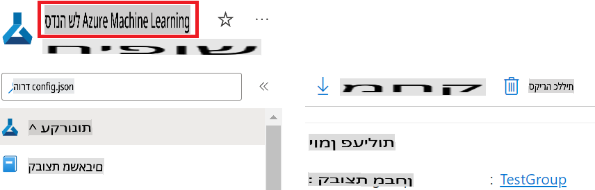

1. בצע את המשימות הבאות כדי להוסיף את שם קבוצת המשאבים של Azure:

    - נווט למשאב Azure Machine Learning שיצרת.
    - העתק והדבק את שם קבוצת המשאבים שלך לקובץ *config.py*.

    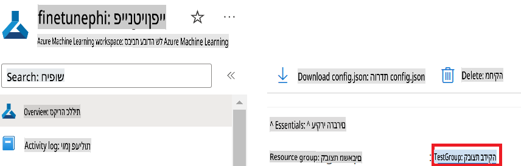

2. בצע את המשימות הבאות כדי להוסיף את שם הזהות המנוהלת של Azure:

    - נווט למשאב Managed Identities שיצרת.
    - העתק והדבק את שם הזהות המנוהלת של Azure לקובץ *config.py*.

    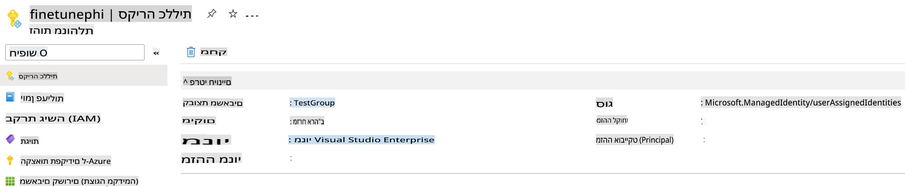

### הכנת מערך נתונים לכיוונון עדין

בתרגיל זה, תפעיל את קובץ *download_dataset.py* כדי להוריד את מערכי הנתונים *ULTRACHAT_200k* לסביבת העבודה המקומית שלך. לאחר מכן תשתמש במערכי נתונים אלו כדי לבצע כיוונון עדין למודל Phi-3 ב-Azure Machine Learning.

#### הורדת מערך הנתונים באמצעות *download_dataset.py*

1. פתח את קובץ *download_dataset.py* ב-Visual Studio Code.

1. הוסף את הקוד הבא לקובץ *download_dataset.py*.

    ```python
    import json
    import os
    from datasets import load_dataset
    from config import (
        TRAIN_DATA_PATH,
        TEST_DATA_PATH)

    def load_and_split_dataset(dataset_name, config_name, split_ratio):
        """
        Load and split a dataset.
        """
        # Load the dataset with the specified name, configuration, and split ratio
        dataset = load_dataset(dataset_name, config_name, split=split_ratio)
        print(f"Original dataset size: {len(dataset)}")
        
        # Split the dataset into train and test sets (80% train, 20% test)
        split_dataset = dataset.train_test_split(test_size=0.2)
        print(f"Train dataset size: {len(split_dataset['train'])}")
        print(f"Test dataset size: {len(split_dataset['test'])}")
        
        return split_dataset

    def save_dataset_to_jsonl(dataset, filepath):
        """
        Save a dataset to a JSONL file.
        """
        # Create the directory if it does not exist
        os.makedirs(os.path.dirname(filepath), exist_ok=True)
        
        # Open the file in write mode
        with open(filepath, 'w', encoding='utf-8') as f:
            # Iterate over each record in the dataset
            for record in dataset:
                # Dump the record as a JSON object and write it to the file
                json.dump(record, f)
                # Write a newline character to separate records
                f.write('\n')
        
        print(f"Dataset saved to {filepath}")

    def main():
        """
        Main function to load, split, and save the dataset.
        """
        # Load and split the ULTRACHAT_200k dataset with a specific configuration and split ratio
        dataset = load_and_split_dataset("HuggingFaceH4/ultrachat_200k", 'default', 'train_sft[:1%]')
        
        # Extract the train and test datasets from the split
        train_dataset = dataset['train']
        test_dataset = dataset['test']

        # Save the train dataset to a JSONL file
        save_dataset_to_jsonl(train_dataset, TRAIN_DATA_PATH)
        
        # Save the test dataset to a separate JSONL file
        save_dataset_to_jsonl(test_dataset, TEST_DATA_PATH)

    if __name__ == "__main__":
        main()

    ```

> [!TIP]
>
> **הנחיות לכיוונון עדין עם מערך נתונים מינימלי באמצעות CPU**
>
> אם ברצונך להשתמש ב-CPU לכיוונון עדין, גישה זו אידיאלית עבור בעלי מנויים עם הטבות (כגון Visual Studio Enterprise Subscription) או לבדיקת מהירה של תהליך הכיוונון והפריסה.
>
> החלף `dataset = load_and_split_dataset("HuggingFaceH4/ultrachat_200k", 'default', 'train_sft[:1%]')` with `dataset = load_and_split_dataset("HuggingFaceH4/ultrachat_200k", 'default', 'train_sft[:10]')`
>

1. הקלד את הפקודה הבאה בטרמינל שלך כדי להפעיל את הסקריפט ולהוריד את מערך הנתונים לסביבה המקומית שלך.

    ```console
    python download_data.py
    ```

1. ודא שמערכי הנתונים נשמרו בהצלחה בספריית *finetune-phi/data* המקומית שלך.

> [!NOTE]
>
> **גודל מערך הנתונים וזמן הכיוונון העדין**
>
> בדוגמה זו, אתה משתמש רק ב-1% ממערך הנתונים (`train_sft[:1%]`). זה מפחית משמעותית את כמות הנתונים, ומאיץ את תהליכי ההעלאה והכיוונון. ניתן להתאים את האחוז כדי למצוא את האיזון הנכון בין זמן האימון לביצועי המודל. שימוש בתת-קבוצה קטנה של מערך הנתונים מקצר את זמן הכיוונון, מה שהופך את התהליך לנוח יותר לדוגמה זו.

## תרחיש 2: כיוונון עדין למודל Phi-3 ופריסתו ב-Azure Machine Learning Studio

### הגדרת Azure CLI

עליך להגדיר את Azure CLI כדי לאמת את סביבת העבודה שלך. Azure CLI מאפשר לך לנהל משאבים ישירות מהשורת הפקודה ומספק אישורים הדרושים ל-Azure Machine Learning לגשת למשאבים אלה. להתחלה, התקן [Azure CLI](https://learn.microsoft.com/cli/azure/install-azure-cli)

1. פתח חלון טרמינל והקלד את הפקודה הבאה כדי להיכנס לחשבון Azure שלך.

    ```console
    az login
    ```

1. בחר את חשבון Azure שברצונך להשתמש בו.

1. בחר את המנוי של Azure שברצונך להשתמש בו.

    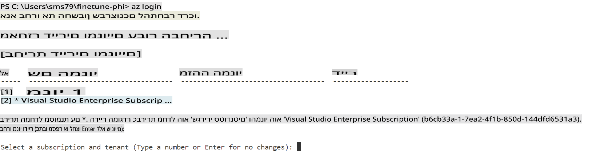

> [!TIP]
>
> אם יש לך בעיות בהתחברות ל-Azure, נסה להשתמש בקוד מכשיר. פתח חלון טרמינל והקלד את הפקודה הבאה כדי להתחבר לחשבון Azure שלך:
>
> ```console
> az login --use-device-code
> ```
>

### כיוונון עדין למודל Phi-3

בתרגיל זה, תבצע כיוונון עדין למודל Phi-3 באמצעות מערך הנתונים שסופק. תחילה תגדיר את תהליך הכיוונון בקובץ *fine_tune.py*. לאחר מכן, תגדיר את סביבת העבודה של Azure Machine Learning ותתחיל את תהליך הכיוונון על ידי הפעלת קובץ *setup_ml.py*. סקריפט זה מבטיח שתהליך הכיוונון יתקיים בסביבת Azure Machine Learning.

על ידי הפעלת *setup_ml.py*, תפעיל את תהליך הכיוונון בסביבת Azure Machine Learning.

#### הוספת קוד לקובץ *fine_tune.py*

1. נווט לתיקיית *finetuning_dir* ופתח את קובץ *fine_tune.py* ב-Visual Studio Code.

1. הוסף את הקוד הבא לקובץ *fine_tune.py*.

    ```python
    import argparse
    import sys
    import logging
    import os
    from datasets import load_dataset
    import torch
    import mlflow
    from transformers import AutoModelForCausalLM, AutoTokenizer, TrainingArguments
    from trl import SFTTrainer

    # To avoid the INVALID_PARAMETER_VALUE error in MLflow, disable MLflow integration
    os.environ["DISABLE_MLFLOW_INTEGRATION"] = "True"

    # Logging setup
    logging.basicConfig(
        format="%(asctime)s - %(levelname)s - %(name)s - %(message)s",
        datefmt="%Y-%m-%d %H:%M:%S",
        handlers=[logging.StreamHandler(sys.stdout)],
        level=logging.WARNING
    )
    logger = logging.getLogger(__name__)

    def initialize_model_and_tokenizer(model_name, model_kwargs):
        """
        Initialize the model and tokenizer with the given pretrained model name and arguments.
        """
        model = AutoModelForCausalLM.from_pretrained(model_name, **model_kwargs)
        tokenizer = AutoTokenizer.from_pretrained(model_name)
        tokenizer.model_max_length = 2048
        tokenizer.pad_token = tokenizer.unk_token
        tokenizer.pad_token_id = tokenizer.convert_tokens_to_ids(tokenizer.pad_token)
        tokenizer.padding_side = 'right'
        return model, tokenizer

    def apply_chat_template(example, tokenizer):
        """
        Apply a chat template to tokenize messages in the example.
        """
        messages = example["messages"]
        if messages[0]["role"] != "system":
            messages.insert(0, {"role": "system", "content": ""})
        example["text"] = tokenizer.apply_chat_template(
            messages, tokenize=False, add_generation_prompt=False
        )
        return example

    def load_and_preprocess_data(train_filepath, test_filepath, tokenizer):
        """
        Load and preprocess the dataset.
        """
        train_dataset = load_dataset('json', data_files=train_filepath, split='train')
        test_dataset = load_dataset('json', data_files=test_filepath, split='train')
        column_names = list(train_dataset.features)

        train_dataset = train_dataset.map(
            apply_chat_template,
            fn_kwargs={"tokenizer": tokenizer},
            num_proc=10,
            remove_columns=column_names,
            desc="Applying chat template to train dataset",
        )

        test_dataset = test_dataset.map(
            apply_chat_template,
            fn_kwargs={"tokenizer": tokenizer},
            num_proc=10,
            remove_columns=column_names,
            desc="Applying chat template to test dataset",
        )

        return train_dataset, test_dataset

    def train_and_evaluate_model(train_dataset, test_dataset, model, tokenizer, output_dir):
        """
        Train and evaluate the model.
        """
        training_args = TrainingArguments(
            bf16=True,
            do_eval=True,
            output_dir=output_dir,
            eval_strategy="epoch",
            learning_rate=5.0e-06,
            logging_steps=20,
            lr_scheduler_type="cosine",
            num_train_epochs=3,
            overwrite_output_dir=True,
            per_device_eval_batch_size=4,
            per_device_train_batch_size=4,
            remove_unused_columns=True,
            save_steps=500,
            seed=0,
            gradient_checkpointing=True,
            gradient_accumulation_steps=1,
            warmup_ratio=0.2,
        )

        trainer = SFTTrainer(
            model=model,
            args=training_args,
            train_dataset=train_dataset,
            eval_dataset=test_dataset,
            max_seq_length=2048,
            dataset_text_field="text",
            tokenizer=tokenizer,
            packing=True
        )

        train_result = trainer.train()
        trainer.log_metrics("train", train_result.metrics)

        mlflow.transformers.log_model(
            transformers_model={"model": trainer.model, "tokenizer": tokenizer},
            artifact_path=output_dir,
        )

        tokenizer.padding_side = 'left'
        eval_metrics = trainer.evaluate()
        eval_metrics["eval_samples"] = len(test_dataset)
        trainer.log_metrics("eval", eval_metrics)

    def main(train_file, eval_file, model_output_dir):
        """
        Main function to fine-tune the model.
        """
        model_kwargs = {
            "use_cache": False,
            "trust_remote_code": True,
            "torch_dtype": torch.bfloat16,
            "device_map": None,
            "attn_implementation": "eager"
        }

        # pretrained_model_name = "microsoft/Phi-3-mini-4k-instruct"
        pretrained_model_name = "microsoft/Phi-3.5-mini-instruct"

        with mlflow.start_run():
            model, tokenizer = initialize_model_and_tokenizer(pretrained_model_name, model_kwargs)
            train_dataset, test_dataset = load_and_preprocess_data(train_file, eval_file, tokenizer)
            train_and_evaluate_model(train_dataset, test_dataset, model, tokenizer, model_output_dir)

    if __name__ == "__main__":
        parser = argparse.ArgumentParser()
        parser.add_argument("--train-file", type=str, required=True, help="Path to the training data")
        parser.add_argument("--eval-file", type=str, required=True, help="Path to the evaluation data")
        parser.add_argument("--model_output_dir", type=str, required=True, help="Directory to save the fine-tuned model")
        args = parser.parse_args()
        main(args.train_file, args.eval_file, args.model_output_dir)

    ```

1. שמור וסגור את קובץ *fine_tune.py*.

> [!TIP]
> **ניתן לכוונן את מודל Phi-3.5**
>
> בקובץ *fine_tune.py*, ניתן לשנות את השדה `pretrained_model_name` from `"microsoft/Phi-3-mini-4k-instruct"` to any model you want to fine-tune. For example, if you change it to `"microsoft/Phi-3.5-mini-instruct"`, you'll be using the Phi-3.5-mini-instruct model for fine-tuning. To find and use the model name you prefer, visit [Hugging Face](https://huggingface.co/), search for the model you're interested in, and then copy and paste its name into the `pretrained_model_name` בסקריפט שלך.
>
> :::image type="content" source="../../imgs/03/FineTuning-PromptFlow/finetunephi3.5.png" alt-text="כיוונון Phi-3.5.":::
>

#### הוספת קוד לקובץ *setup_ml.py*

1. פתח את קובץ *setup_ml.py* ב-Visual Studio Code.

1. הוסף את הקוד הבא לקובץ *setup_ml.py*.

    ```python
    import logging
    from azure.ai.ml import MLClient, command, Input
    from azure.ai.ml.entities import Environment, AmlCompute
    from azure.identity import AzureCliCredential
    from config import (
        AZURE_SUBSCRIPTION_ID,
        AZURE_RESOURCE_GROUP_NAME,
        AZURE_ML_WORKSPACE_NAME,
        TRAIN_DATA_PATH,
        TEST_DATA_PATH
    )

    # Constants

    # Uncomment the following lines to use a CPU instance for training
    # COMPUTE_INSTANCE_TYPE = "Standard_E16s_v3" # cpu
    # COMPUTE_NAME = "cpu-e16s-v3"
    # DOCKER_IMAGE_NAME = "mcr.microsoft.com/azureml/openmpi4.1.0-ubuntu20.04:latest"

    # Uncomment the following lines to use a GPU instance for training
    COMPUTE_INSTANCE_TYPE = "Standard_NC24ads_A100_v4"
    COMPUTE_NAME = "gpu-nc24s-a100-v4"
    DOCKER_IMAGE_NAME = "mcr.microsoft.com/azureml/curated/acft-hf-nlp-gpu:59"

    CONDA_FILE = "conda.yml"
    LOCATION = "eastus2" # Replace with the location of your compute cluster
    FINETUNING_DIR = "./finetuning_dir" # Path to the fine-tuning script
    TRAINING_ENV_NAME = "phi-3-training-environment" # Name of the training environment
    MODEL_OUTPUT_DIR = "./model_output" # Path to the model output directory in azure ml

    # Logging setup to track the process
    logger = logging.getLogger(__name__)
    logging.basicConfig(
        format="%(asctime)s - %(levelname)s - %(name)s - %(message)s",
        datefmt="%Y-%m-%d %H:%M:%S",
        level=logging.WARNING
    )

    def get_ml_client():
        """
        Initialize the ML Client using Azure CLI credentials.
        """
        credential = AzureCliCredential()
        return MLClient(credential, AZURE_SUBSCRIPTION_ID, AZURE_RESOURCE_GROUP_NAME, AZURE_ML_WORKSPACE_NAME)

    def create_or_get_environment(ml_client):
        """
        Create or update the training environment in Azure ML.
        """
        env = Environment(
            image=DOCKER_IMAGE_NAME,  # Docker image for the environment
            conda_file=CONDA_FILE,  # Conda environment file
            name=TRAINING_ENV_NAME,  # Name of the environment
        )
        return ml_client.environments.create_or_update(env)

    def create_or_get_compute_cluster(ml_client, compute_name, COMPUTE_INSTANCE_TYPE, location):
        """
        Create or update the compute cluster in Azure ML.
        """
        try:
            compute_cluster = ml_client.compute.get(compute_name)
            logger.info(f"Compute cluster '{compute_name}' already exists. Reusing it for the current run.")
        except Exception:
            logger.info(f"Compute cluster '{compute_name}' does not exist. Creating a new one with size {COMPUTE_INSTANCE_TYPE}.")
            compute_cluster = AmlCompute(
                name=compute_name,
                size=COMPUTE_INSTANCE_TYPE,
                location=location,
                tier="Dedicated",  # Tier of the compute cluster
                min_instances=0,  # Minimum number of instances
                max_instances=1  # Maximum number of instances
            )
            ml_client.compute.begin_create_or_update(compute_cluster).wait()  # Wait for the cluster to be created
        return compute_cluster

    def create_fine_tuning_job(env, compute_name):
        """
        Set up the fine-tuning job in Azure ML.
        """
        return command(
            code=FINETUNING_DIR,  # Path to fine_tune.py
            command=(
                "python fine_tune.py "
                "--train-file ${{inputs.train_file}} "
                "--eval-file ${{inputs.eval_file}} "
                "--model_output_dir ${{inputs.model_output}}"
            ),
            environment=env,  # Training environment
            compute=compute_name,  # Compute cluster to use
            inputs={
                "train_file": Input(type="uri_file", path=TRAIN_DATA_PATH),  # Path to the training data file
                "eval_file": Input(type="uri_file", path=TEST_DATA_PATH),  # Path to the evaluation data file
                "model_output": MODEL_OUTPUT_DIR
            }
        )

    def main():
        """
        Main function to set up and run the fine-tuning job in Azure ML.
        """
        # Initialize ML Client
        ml_client = get_ml_client()

        # Create Environment
        env = create_or_get_environment(ml_client)
        
        # Create or get existing compute cluster
        create_or_get_compute_cluster(ml_client, COMPUTE_NAME, COMPUTE_INSTANCE_TYPE, LOCATION)

        # Create and Submit Fine-Tuning Job
        job = create_fine_tuning_job(env, COMPUTE_NAME)
        returned_job = ml_client.jobs.create_or_update(job)  # Submit the job
        ml_client.jobs.stream(returned_job.name)  # Stream the job logs
        
        # Capture the job name
        job_name = returned_job.name
        print(f"Job name: {job_name}")

    if __name__ == "__main__":
        main()

    ```

1. החלף `COMPUTE_INSTANCE_TYPE`, `COMPUTE_NAME`, and `LOCATION` בפרטים הספציפיים שלך.

    ```python
   # Uncomment the following lines to use a GPU instance for training
    COMPUTE_INSTANCE_TYPE = "Standard_NC24ads_A100_v4"
    COMPUTE_NAME = "gpu-nc24s-a100-v4"
    ...
    LOCATION = "eastus2" # Replace with the location of your compute cluster
    ```

> [!TIP]
>
> **הנחיות לכיוונון עדין עם מערך נתונים מינימלי באמצעות CPU**
>
> אם ברצונך להשתמש ב-CPU לכיוונון עדין, גישה זו אידיאלית עבור בעלי מנויים עם הטבות (כגון Visual Studio Enterprise Subscription) או לבדיקת מהירה של תהליך הכיוונון והפריסה.
>
> 1. פתח את קובץ *setup_ml*.
> 1. החלף `COMPUTE_INSTANCE_TYPE`, `COMPUTE_NAME`, and `DOCKER_IMAGE_NAME` with the following. If you do not have access to *Standard_E16s_v3*, you can use an equivalent CPU instance or request a new quota.
> 1. Replace `LOCATION` בפרטים הספציפיים שלך.
>
>    ```python
>    # Uncomment the following lines to use a CPU instance for training
>    COMPUTE_INSTANCE_TYPE = "Standard_E16s_v3" # cpu
>    COMPUTE_NAME = "cpu-e16s-v3"
>    DOCKER_IMAGE_NAME = "mcr.microsoft.com/azureml/openmpi4.1.0-ubuntu20.04:latest"
>    LOCATION = "eastus2" # Replace with the location of your compute cluster
>    ```
>

1. הקלד את הפקודה הבאה כדי להפעיל את הסקריפט *setup_ml.py* ולהתחיל את תהליך הכיוונון ב-Azure Machine Learning.

    ```python
    python setup_ml.py
    ```

1. בתרגיל זה, ביצעת בהצלחה כיוונון עדין למודל Phi-3 באמצעות Azure Machine Learning. על ידי הפעלת הסקריפט *setup_ml.py*, הגדרת את סביבת העבודה של Azure Machine Learning והתחלת את תהליך הכיוונון שהוגדר בקובץ *fine_tune.py*. שים לב שתהליך הכיוונון עשוי לקחת זמן רב. לאחר הפעלת `python setup_ml.py` command, you need to wait for the process to complete. You can monitor the status of the fine-tuning job by following the link provided in the terminal to the Azure Machine Learning portal.

    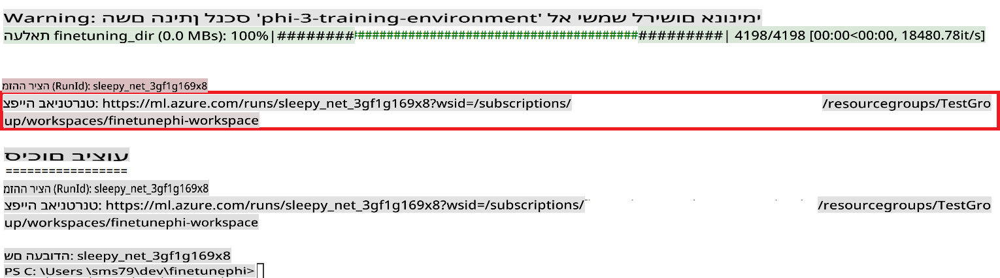

### Deploy the fine-tuned model

To integrate the fine-tuned Phi-3 model with Prompt Flow, you need to deploy the model to make it accessible for real-time inference. This process involves registering the model, creating an online endpoint, and deploying the model.

#### Set the model name, endpoint name, and deployment name for deployment

1. Open *config.py* file.

1. Replace `AZURE_MODEL_NAME = "your_fine_tuned_model_name"` with the desired name for your model.

1. Replace `AZURE_ENDPOINT_NAME = "your_fine_tuned_model_endpoint_name"` with the desired name for your endpoint.

1. Replace `AZURE_DEPLOYMENT_NAME = "your_fine_tuned_model_deployment_name"` עם השם הרצוי לפריסתך.

#### הוספת קוד לקובץ *deploy_model.py*

הפעלת קובץ *deploy_model.py* מבצעת אוטומציה לכל תהליך הפריסה. היא רושמת את המודל, יוצרת נקודת קצה ומבצעת את הפריסה בהתאם להגדרות שצוינו בקובץ config.py, הכוללות את שם המודל, שם נקודת הקצה ושם הפריסה.

1. פתח את קובץ *deploy_model.py* ב-Visual Studio Code.

1. הוסף את הקוד הבא לקובץ *deploy_model.py*.

    ```python
    import logging
    from azure.identity import AzureCliCredential
    from azure.ai.ml import MLClient
    from azure.ai.ml.entities import Model, ProbeSettings, ManagedOnlineEndpoint, ManagedOnlineDeployment, IdentityConfiguration, ManagedIdentityConfiguration, OnlineRequestSettings
    from azure.ai.ml.constants import AssetTypes

    # Configuration imports
    from config import (
        AZURE_SUBSCRIPTION_ID,
        AZURE_RESOURCE_GROUP_NAME,
        AZURE_ML_WORKSPACE_NAME,
        AZURE_MANAGED_IDENTITY_RESOURCE_ID,
        AZURE_MANAGED_IDENTITY_CLIENT_ID,
        AZURE_MODEL_NAME,
        AZURE_ENDPOINT_NAME,
        AZURE_DEPLOYMENT_NAME
    )

    # Constants
    JOB_NAME = "your-job-name"
    COMPUTE_INSTANCE_TYPE = "Standard_E4s_v3"

    deployment_env_vars = {
        "SUBSCRIPTION_ID": AZURE_SUBSCRIPTION_ID,
        "RESOURCE_GROUP_NAME": AZURE_RESOURCE_GROUP_NAME,
        "UAI_CLIENT_ID": AZURE_MANAGED_IDENTITY_CLIENT_ID,
    }

    # Logging setup
    logging.basicConfig(
        format="%(asctime)s - %(levelname)s - %(name)s - %(message)s",
        datefmt="%Y-%m-%d %H:%M:%S",
        level=logging.DEBUG
    )
    logger = logging.getLogger(__name__)

    def get_ml_client():
        """Initialize and return the ML Client."""
        credential = AzureCliCredential()
        return MLClient(credential, AZURE_SUBSCRIPTION_ID, AZURE_RESOURCE_GROUP_NAME, AZURE_ML_WORKSPACE_NAME)

    def register_model(ml_client, model_name, job_name):
        """Register a new model."""
        model_path = f"azureml://jobs/{job_name}/outputs/artifacts/paths/model_output"
        logger.info(f"Registering model {model_name} from job {job_name} at path {model_path}.")
        run_model = Model(
            path=model_path,
            name=model_name,
            description="Model created from run.",
            type=AssetTypes.MLFLOW_MODEL,
        )
        model = ml_client.models.create_or_update(run_model)
        logger.info(f"Registered model ID: {model.id}")
        return model

    def delete_existing_endpoint(ml_client, endpoint_name):
        """Delete existing endpoint if it exists."""
        try:
            endpoint_result = ml_client.online_endpoints.get(name=endpoint_name)
            logger.info(f"Deleting existing endpoint {endpoint_name}.")
            ml_client.online_endpoints.begin_delete(name=endpoint_name).result()
            logger.info(f"Deleted existing endpoint {endpoint_name}.")
        except Exception as e:
            logger.info(f"No existing endpoint {endpoint_name} found to delete: {e}")

    def create_or_update_endpoint(ml_client, endpoint_name, description=""):
        """Create or update an endpoint."""
        delete_existing_endpoint(ml_client, endpoint_name)
        logger.info(f"Creating new endpoint {endpoint_name}.")
        endpoint = ManagedOnlineEndpoint(
            name=endpoint_name,
            description=description,
            identity=IdentityConfiguration(
                type="user_assigned",
                user_assigned_identities=[ManagedIdentityConfiguration(resource_id=AZURE_MANAGED_IDENTITY_RESOURCE_ID)]
            )
        )
        endpoint_result = ml_client.online_endpoints.begin_create_or_update(endpoint).result()
        logger.info(f"Created new endpoint {endpoint_name}.")
        return endpoint_result

    def create_or_update_deployment(ml_client, endpoint_name, deployment_name, model):
        """Create or update a deployment."""

        logger.info(f"Creating deployment {deployment_name} for endpoint {endpoint_name}.")
        deployment = ManagedOnlineDeployment(
            name=deployment_name,
            endpoint_name=endpoint_name,
            model=model.id,
            instance_type=COMPUTE_INSTANCE_TYPE,
            instance_count=1,
            environment_variables=deployment_env_vars,
            request_settings=OnlineRequestSettings(
                max_concurrent_requests_per_instance=3,
                request_timeout_ms=180000,
                max_queue_wait_ms=120000
            ),
            liveness_probe=ProbeSettings(
                failure_threshold=30,
                success_threshold=1,
                period=100,
                initial_delay=500,
            ),
            readiness_probe=ProbeSettings(
                failure_threshold=30,
                success_threshold=1,
                period=100,
                initial_delay=500,
            ),
        )
        deployment_result = ml_client.online_deployments.begin_create_or_update(deployment).result()
        logger.info(f"Created deployment {deployment.name} for endpoint {endpoint_name}.")
        return deployment_result

    def set_traffic_to_deployment(ml_client, endpoint_name, deployment_name):
        """Set traffic to the specified deployment."""
        try:
            # Fetch the current endpoint details
            endpoint = ml_client.online_endpoints.get(name=endpoint_name)
            
            # Log the current traffic allocation for debugging
            logger.info(f"Current traffic allocation: {endpoint.traffic}")
            
            # Set the traffic allocation for the deployment
            endpoint.traffic = {deployment_name: 100}
            
            # Update the endpoint with the new traffic allocation
            endpoint_poller = ml_client.online_endpoints.begin_create_or_update(endpoint)
            updated_endpoint = endpoint_poller.result()
            
            # Log the updated traffic allocation for debugging
            logger.info(f"Updated traffic allocation: {updated_endpoint.traffic}")
            logger.info(f"Set traffic to deployment {deployment_name} at endpoint {endpoint_name}.")
            return updated_endpoint
        except Exception as e:
            # Log any errors that occur during the process
            logger.error(f"Failed to set traffic to deployment: {e}")
            raise


    def main():
        ml_client = get_ml_client()

        registered_model = register_model(ml_client, AZURE_MODEL_NAME, JOB_NAME)
        logger.info(f"Registered model ID: {registered_model.id}")

        endpoint = create_or_update_endpoint(ml_client, AZURE_ENDPOINT_NAME, "Endpoint for finetuned Phi-3 model")
        logger.info(f"Endpoint {AZURE_ENDPOINT_NAME} is ready.")

        try:
            deployment = create_or_update_deployment(ml_client, AZURE_ENDPOINT_NAME, AZURE_DEPLOYMENT_NAME, registered_model)
            logger.info(f"Deployment {AZURE_DEPLOYMENT_NAME} is created for endpoint {AZURE_ENDPOINT_NAME}.")

            set_traffic_to_deployment(ml_client, AZURE_ENDPOINT_NAME, AZURE_DEPLOYMENT_NAME)
            logger.info(f"Traffic is set to deployment {AZURE_DEPLOYMENT_NAME} at endpoint {AZURE_ENDPOINT_NAME}.")
        except Exception as e:
            logger.error(f"Failed to create or update deployment: {e}")

    if __name__ == "__main__":
        main()

    ```

1. בצע את המשימות הבאות כדי להשיג את `JOB_NAME`:

    - Navigate to Azure Machine Learning resource that you created.
    - Select **Studio web URL** to open the Azure Machine Learning workspace.
    - Select **Jobs** from the left side tab.
    - Select the experiment for fine-tuning. For example, *finetunephi*.
    - Select the job that you created.
    - Copy and paste your job Name into the `JOB_NAME = "your-job-name"` in *deploy_model.py* file.

1. Replace `COMPUTE_INSTANCE_TYPE` עם הפרטים הספציפיים שלך.

1. הקלד את הפקודה הבאה כדי להפעיל את הסקריפט *deploy_model.py* ולהתחיל את תהליך הפריסה ב-Azure Machine Learning.

    ```python
    python deploy_model.py
    ```

> [!WARNING]
> כדי להימנע מחיובים נוספים בחשבונך, ודא שאתה מוחק את נקודת הקצה שיצרת ב-Azure Machine Learning workspace.
>

#### בדיקת מצב הפריסה ב-Azure Machine Learning Workspace

1. בקר ב-[Azure ML Studio](https://ml.azure.com/home?wt.mc_id=studentamb_279723).

1. נווט ל-Azure Machine Learning workspace שיצרת.

1. בחר **Studio web URL** כדי לפתוח את סביבת העבודה של Azure Machine Learning.

1. בחר **Endpoints** מהתפריט בצד שמאל.

    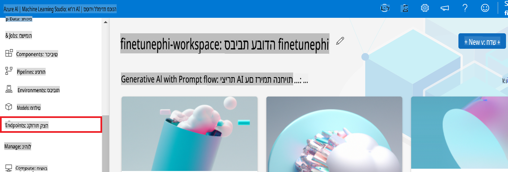

2. בחר את נקודת הקצה שיצרת.

    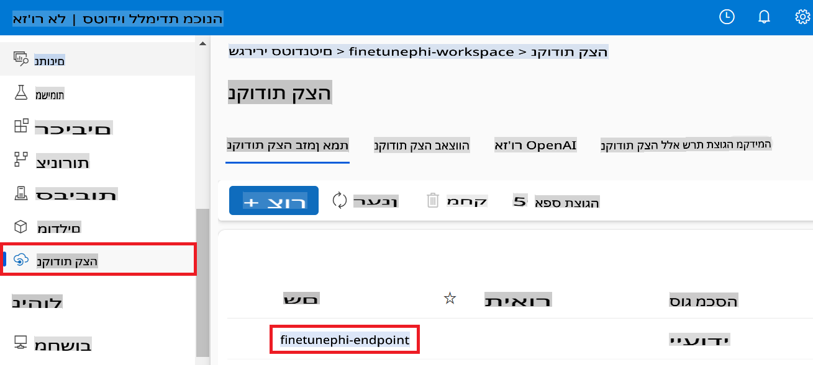

3. בעמוד זה, תוכל לנהל את נקודות הקצה שנוצרו במהלך תהליך הפריסה.

## תרחיש 3: אינטגרציה עם Prompt Flow ושיחה עם המודל המותאם אישית שלך

### אינטגרציה של מודל Phi-3 המותאם אישית עם Prompt Flow

לאחר שהפרסת בהצלחה את המודל המותאם אישית שלך, תוכל כעת לשלב אותו עם Prompt Flow כדי להשתמש בו ביישומים בזמן אמת, ולאפשר מגוון משימות אינטראקטיביות עם מודל Phi-3 המותאם אישית שלך.

#### הגדרת מפתח API וכתובת URI של נקודת הקצה של מודל Phi-3 המותאם אישית

1. נווט לסביבת העבודה של Azure Machine Learning שיצרת.
1. בחר **Endpoints** מהתפריט בצד שמאל.
1. בחר את נקודת הקצה שיצרת.
1. בחר **Consume** מהתפריט.
1. העתק והדבק את **REST endpoint** שלך לקובץ *config.py*, והחלף `AZURE_ML_ENDPOINT = "your_fine_tuned_model_endpoint_uri"` with your **REST endpoint**.
1. Copy and paste your **Primary key** into the *config.py* file, replacing `AZURE_ML_API_KEY = "your_fine_tuned_model_api_key"` עם **Primary key** שלך.

    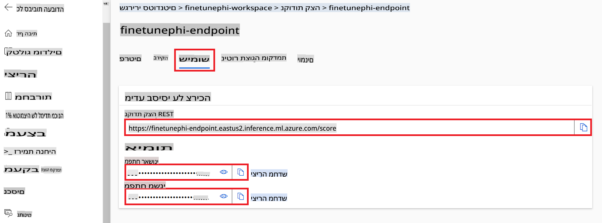

#### הוספת קוד לקובץ *flow.dag.yml*

1. פתח את קובץ *flow.dag.yml* ב-Visual Studio Code.

1. הוסף את הקוד הבא לקובץ *flow.dag.yml*.

    ```yml
    inputs:
      input_data:
        type: string
        default: "Who founded Microsoft?"

    outputs:
      answer:
        type: string
        reference: ${integrate_with_promptflow.output}

    nodes:
    - name: integrate_with_promptflow
      type: python
      source:
        type: code
        path: integrate_with_promptflow.py
      inputs:
        input_data: ${inputs.input_data}
    ```

#### הוספת קוד לקובץ *integrate_with_promptflow.py*

1. פתח את קובץ *integrate_with_promptflow.py* ב-Visual Studio Code.

1. הוסף את הקוד הבא לקובץ *integrate_with_promptflow.py*.

    ```python
    import logging
    import requests
    from promptflow.core import tool
    import asyncio
    import platform
    from config import (
        AZURE_ML_ENDPOINT,
        AZURE_ML_API_KEY
    )

    # Logging setup
    logging.basicConfig(
        format="%(asctime)s - %(levelname)s - %(name)s - %(message)s",
        datefmt="%Y-%m-%d %H:%M:%S",
        level=logging.DEBUG
    )
    logger = logging.getLogger(__name__)

    def query_azml_endpoint(input_data: list, endpoint_url: str, api_key: str) -> str:
        """
        Send a request to the Azure ML endpoint with the given input data.
        """
        headers = {
            "Content-Type": "application/json",
            "Authorization": f"Bearer {api_key}"
        }
        data = {
            "input_data": [input_data],
            "params": {
                "temperature": 0.7,
                "max_new_tokens": 128,
                "do_sample": True,
                "return_full_text": True
            }
        }
        try:
            response = requests.post(endpoint_url, json=data, headers=headers)
            response.raise_for_status()
            result = response.json()[0]
            logger.info("Successfully received response from Azure ML Endpoint.")
            return result
        except requests.exceptions.RequestException as e:
            logger.error(f"Error querying Azure ML Endpoint: {e}")
            raise

    def setup_asyncio_policy():
        """
        Setup asyncio event loop policy for Windows.
        """
        if platform.system() == 'Windows':
            asyncio.set_event_loop_policy(asyncio.WindowsSelectorEventLoopPolicy())
            logger.info("Set Windows asyncio event loop policy.")

    @tool
    def my_python_tool(input_data: str) -> str:
        """
        Tool function to process input data and query the Azure ML endpoint.
        """
        setup_asyncio_policy()
        return query_azml_endpoint(input_data, AZURE_ML_ENDPOINT, AZURE_ML_API_KEY)

    ```

### שיחה עם המודל המותאם אישית שלך

1. הקלד את הפקודה הבאה כדי להפעיל את הסקריפט *deploy_model.py* ולהתחיל את תהליך הפריסה ב-Azure Machine Learning.

    ```python
    pf flow serve --source ./ --port 8080 --host localhost
    ```

1. הנה דוגמה לתוצאות: כעת תוכל לשוחח עם מודל Phi-3 המותאם אישית שלך. מומלץ לשאול שאלות המבוססות על הנתונים ששימשו לכיוונון עדין.

    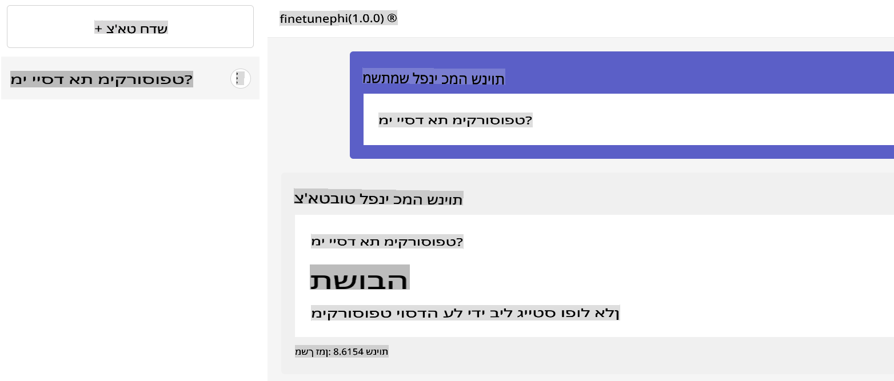

**כתב ויתור**:  
מסמך זה תורגם באמצעות שירותי תרגום מבוססי בינה מלאכותית. למרות שאנו שואפים לדיוק, יש להיות מודעים לכך שתרגומים אוטומטיים עשויים להכיל שגיאות או אי-דיוקים. המסמך המקורי בשפתו המקורית צריך להיחשב כמקור הסמכותי. עבור מידע קריטי, מומלץ להשתמש בתרגום מקצועי על ידי בני אדם. איננו נושאים באחריות לכל אי-הבנה או פרשנות שגויה הנובעת משימוש בתרגום זה.