# כוונון והתממשקות של מודלים מותאמים אישית Phi-3 עם Prompt flow ב-Azure AI Foundry

המדריך המלא הזה מבוסס על המאמר "[Fine-Tune and Integrate Custom Phi-3 Models with Prompt Flow in Azure AI Foundry](https://techcommunity.microsoft.com/t5/educator-developer-blog/fine-tune-and-integrate-custom-phi-3-models-with-prompt-flow-in/ba-p/4191726?WT.mc_id=aiml-137032-kinfeylo)" מקהילת הטכנולוגיה של Microsoft. הוא מציג את התהליכים של כוונון, פריסה והתממשקות של מודלים מותאמים אישית Phi-3 עם Prompt flow ב-Azure AI Foundry.  
בניגוד לדוגמת E2E "[Fine-Tune and Integrate Custom Phi-3 Models with Prompt Flow](./E2E_Phi-3-FineTuning_PromptFlow_Integration.md)", אשר כללה הרצת קוד מקומית, מדריך זה מתמקד לחלוטין בכוונון והתממשקות של המודל בתוך Azure AI / ML Studio.

## סקירה כללית

בדוגמת E2E זו, תלמדו כיצד לכוון את מודל Phi-3 ולהתממשק איתו באמצעות Prompt flow ב-Azure AI Foundry. על ידי שימוש ב-Azure AI / ML Studio, תבנו תהליך עבודה לפריסה ושימוש במודלים מותאמים אישית של AI. דוגמת E2E זו מחולקת לשלושה תרחישים:

**תרחיש 1: הקמת משאבי Azure והכנה לכוונון**

**תרחיש 2: כוונון מודל Phi-3 ופריסתו ב-Azure Machine Learning Studio**

**תרחיש 3: התממשקות עם Prompt flow ושיחה עם המודל המותאם שלכם ב-Azure AI Foundry**

להלן סקירה כללית של דוגמת E2E זו.

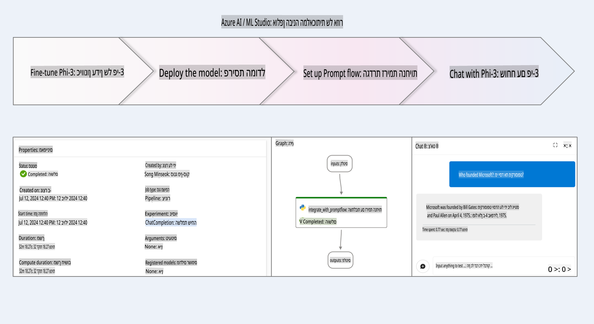

### תוכן עניינים

1. **[תרחיש 1: הקמת משאבי Azure והכנה לכוונון](../../../../../../md/02.Application/01.TextAndChat/Phi3)**  
    - [יצירת Azure Machine Learning Workspace](../../../../../../md/02.Application/01.TextAndChat/Phi3)  
    - [בקשת מכסות GPU במנוי Azure](../../../../../../md/02.Application/01.TextAndChat/Phi3)  
    - [הוספת הרשאות תפקיד](../../../../../../md/02.Application/01.TextAndChat/Phi3)  
    - [הגדרת פרויקט](../../../../../../md/02.Application/01.TextAndChat/Phi3)  
    - [הכנת מערכי נתונים לכוונון](../../../../../../md/02.Application/01.TextAndChat/Phi3)  

1. **[תרחיש 2: כוונון מודל Phi-3 ופריסתו ב-Azure Machine Learning Studio](../../../../../../md/02.Application/01.TextAndChat/Phi3)**  
    - [כוונון מודל Phi-3](../../../../../../md/02.Application/01.TextAndChat/Phi3)  
    - [פריסת מודל Phi-3 המכוונן](../../../../../../md/02.Application/01.TextAndChat/Phi3)  

1. **[תרחיש 3: התממשקות עם Prompt flow ושיחה עם המודל המותאם שלכם ב-Azure AI Foundry](../../../../../../md/02.Application/01.TextAndChat/Phi3)**  
    - [התממשקות של מודל Phi-3 המותאם עם Prompt flow](../../../../../../md/02.Application/01.TextAndChat/Phi3)  
    - [שיחה עם מודל Phi-3 המותאם שלכם](../../../../../../md/02.Application/01.TextAndChat/Phi3)  

## תרחיש 1: הקמת משאבי Azure והכנה לכוונון

### יצירת Azure Machine Learning Workspace

1. הקלידו *azure machine learning* בשורת החיפוש בראש דף הפורטל ובחרו **Azure Machine Learning** מתוך האפשרויות המופיעות.

    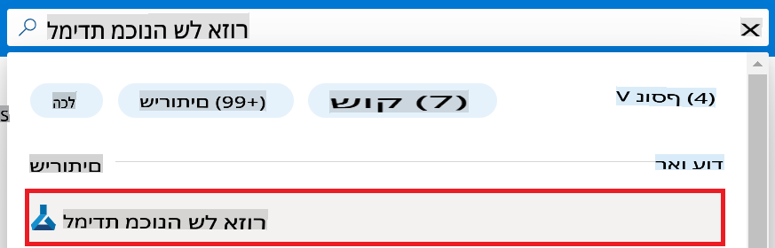

2. בחרו **+ Create** מתוך תפריט הניווט.

3. בחרו **New workspace** מתוך תפריט הניווט.

    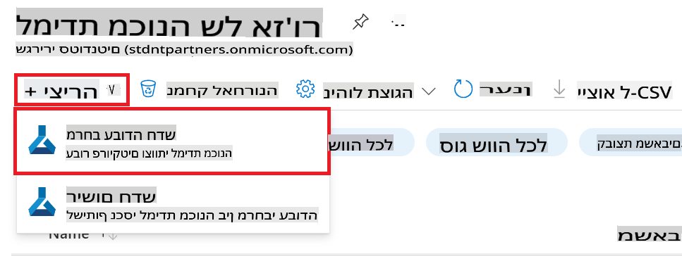

4. בצעו את הפעולות הבאות:

    - בחרו את **מנוי Azure** שלכם.  
    - בחרו את **קבוצת המשאבים** לשימוש (צרו אחת חדשה אם צריך).  
    - הזינו **שם סביבת עבודה**. עליו להיות ייחודי.  
    - בחרו את **האזור** בו תרצו להשתמש.  
    - בחרו את **חשבון האחסון** לשימוש (צרו אחד חדש אם צריך).  
    - בחרו את **Key vault** לשימוש (צרו אחד חדש אם צריך).  
    - בחרו את **Application insights** לשימוש (צרו אחד חדש אם צריך).  
    - בחרו את **Container registry** לשימוש (צרו אחד חדש אם צריך).  

    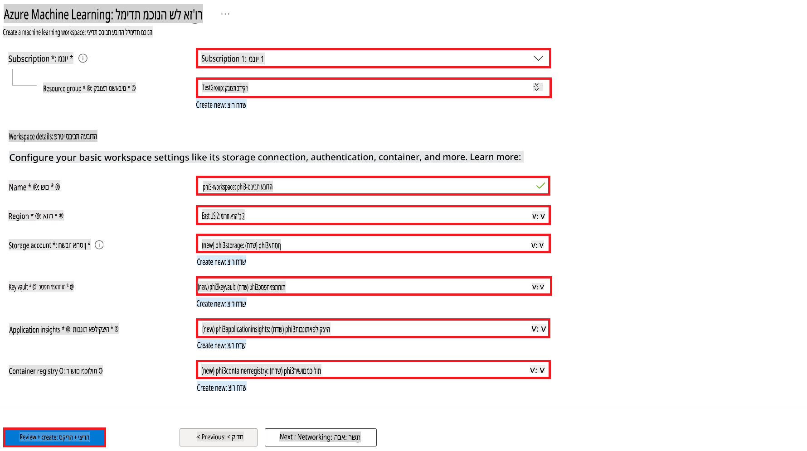

5. בחרו **Review + Create**.

6. בחרו **Create**.

### בקשת מכסות GPU במנוי Azure

במדריך זה תלמדו כיצד לכוון ולפרוס מודל Phi-3 תוך שימוש ב-GPU. לצורך כוונון, תשתמשו ב-*Standard_NC24ads_A100_v4* GPU, הדורש בקשת מכסה. לצורך פריסה, תשתמשו ב-*Standard_NC6s_v3* GPU, שגם הוא דורש בקשת מכסה.

> [!NOTE]
>
> רק מנויים מסוג Pay-As-You-Go (המנוי הסטנדרטי) זכאים להקצאת GPU; מנויי הטבה אינם נתמכים כרגע.

1. בקרו ב-[Azure ML Studio](https://ml.azure.com/home?wt.mc_id=studentamb_279723).

1. בצעו את הפעולות הבאות כדי לבקש מכסת *Standard NCADSA100v4 Family*:

    - בחרו **Quota** מתפריט הצד השמאלי.  
    - בחרו את **Virtual machine family** לשימוש. לדוגמה, בחרו **Standard NCADSA100v4 Family Cluster Dedicated vCPUs**, הכולל את ה-*Standard_NC24ads_A100_v4* GPU.  
    - בחרו **Request quota** מתפריט הניווט.  

        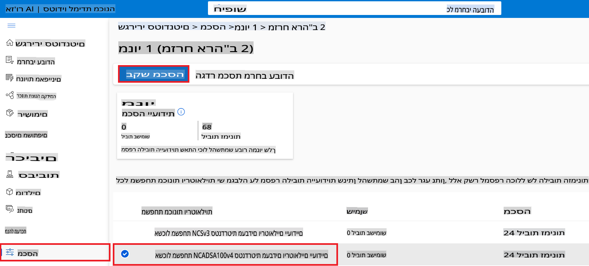

    - בתוך דף בקשת המכסה, הזינו את **New cores limit** הרצוי. לדוגמה, 24.  
    - בתוך דף בקשת המכסה, בחרו **Submit** כדי לבקש את מכסת ה-GPU.

1. בצעו את הפעולות הבאות כדי לבקש מכסת *Standard NCSv3 Family*:

    - בחרו **Quota** מתפריט הצד השמאלי.  
    - בחרו את **Virtual machine family** לשימוש. לדוגמה, בחרו **Standard NCSv3 Family Cluster Dedicated vCPUs**, הכולל את ה-*Standard_NC6s_v3* GPU.  
    - בחרו **Request quota** מתפריט הניווט.  
    - בתוך דף בקשת המכסה, הזינו את **New cores limit** הרצוי. לדוגמה, 24.  
    - בתוך דף בקשת המכסה, בחרו **Submit** כדי לבקש את מכסת ה-GPU.

### הוספת הרשאות תפקיד

כדי לכוון ולפרוס את המודלים שלכם, עליכם תחילה ליצור Managed Identity ייעודי (UAI) ולהקצות לו הרשאות מתאימות. זה ישמש לאימות במהלך הפריסה.

#### יצירת Managed Identity (UAI)

1. הקלידו *managed identities* בשורת החיפוש בראש דף הפורטל ובחרו **Managed Identities** מתוך האפשרויות המופיעות.

    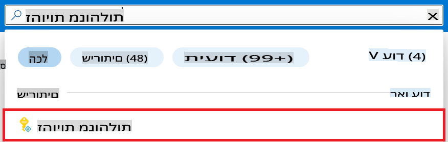

1. בחרו **+ Create**.

    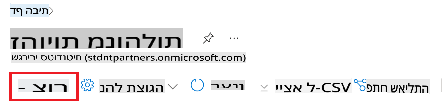

1. בצעו את הפעולות הבאות:

    - בחרו את **מנוי Azure** שלכם.  
    - בחרו את **קבוצת המשאבים** לשימוש (צרו אחת חדשה אם צריך).  
    - בחרו את **האזור** בו תרצו להשתמש.  
    - הזינו **שם** ייחודי.  

    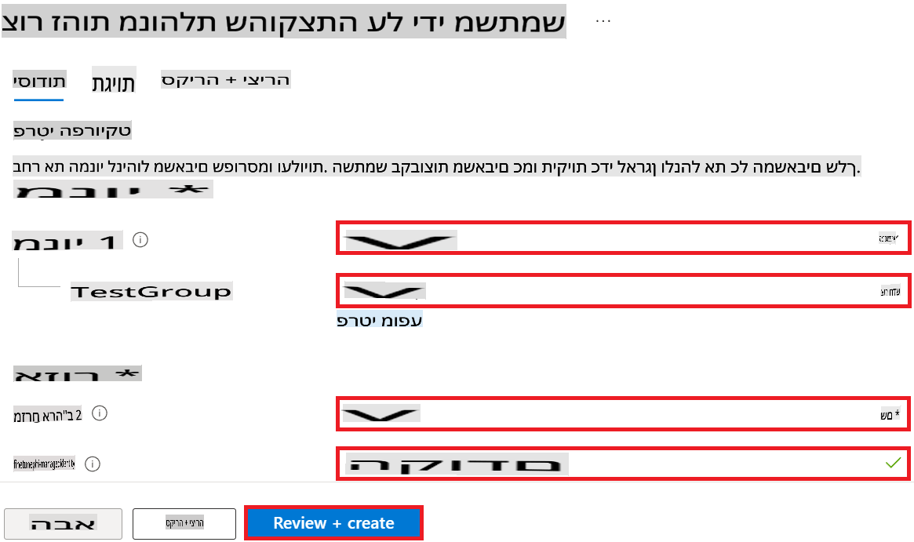

1. בחרו **Review + create**.

1. בחרו **+ Create**.

#### הוספת הרשאת Contributor ל-Managed Identity

1. נווטו למשאב Managed Identity שיצרתם.

1. בחרו **Azure role assignments** מתפריט הצד השמאלי.

1. בחרו **+Add role assignment** מתפריט הניווט.

1. בתוך דף Add role assignment, בצעו את הפעולות הבאות:
    - בחרו **Scope** ל-**Resource group**.  
    - בחרו את **מנוי Azure** שלכם.  
    - בחרו את **קבוצת המשאבים** לשימוש.  
    - בחרו **Role** ל-**Contributor**.  

    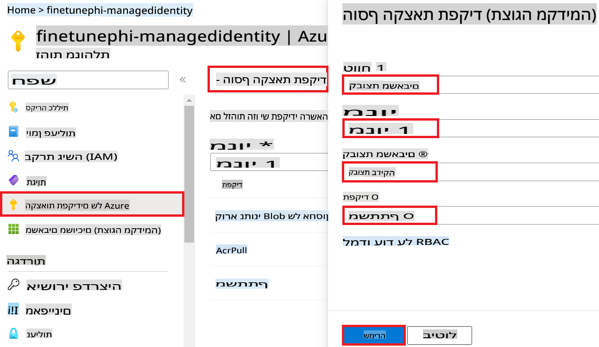

2. בחרו **Save**.

#### הוספת הרשאת Storage Blob Data Reader ל-Managed Identity

1. הקלידו *storage accounts* בשורת החיפוש בראש דף הפורטל ובחרו **Storage accounts** מתוך האפשרויות המופיעות.

    

1. בחרו את חשבון האחסון המשויך ל-Azure Machine Learning workspace שיצרתם. לדוגמה, *finetunephistorage*.  

1. בצעו את הפעולות הבאות כדי לנווט לדף Add role assignment:

    - נווטו לחשבון האחסון שיצרתם.  
    - בחרו **Access Control (IAM)** מתפריט הצד השמאלי.  
    - בחרו **+ Add** מתפריט הניווט.  
    - בחרו **Add role assignment** מתפריט הניווט.  

    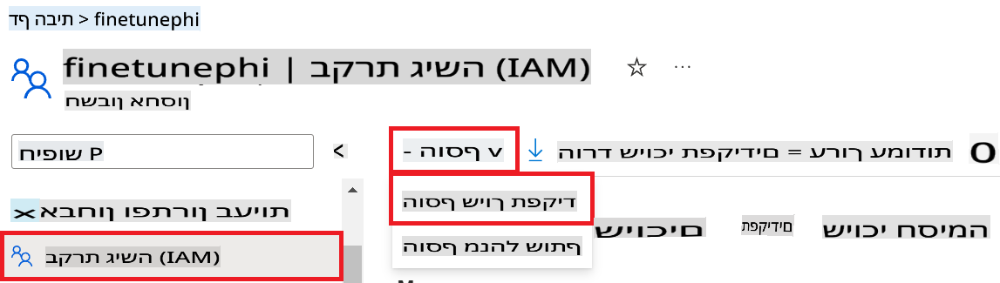

1. בתוך דף Add role assignment, בצעו את הפעולות הבאות:

    - הקלידו *Storage Blob Data Reader* בשורת החיפוש ובחרו **Storage Blob Data Reader** מתוך האפשרויות המופיעות.  
    - בחרו **Next**.  
    - בחרו **Assign access to** ל-**Managed identity**.  
    - בחרו **+ Select members**.  
    - בחרו את **מנוי Azure** שלכם.  
    - בחרו את **Managed identity** שיצרתם. לדוגמה, *finetunephi-managedidentity*.  
    - בחרו **Select**.  

    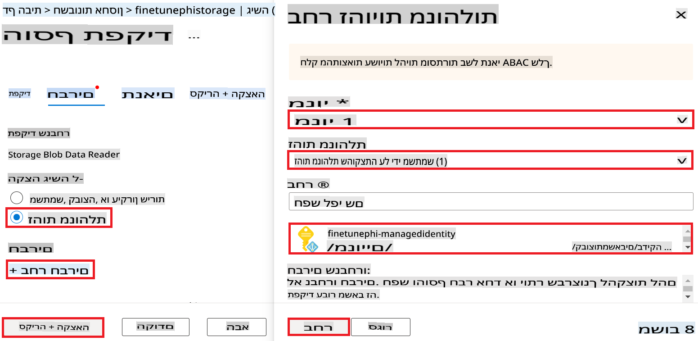

1. בחרו **Review + assign**.

#### הוספת הרשאת AcrPull ל-Managed Identity

1. הקלידו *container registries* בשורת החיפוש בראש דף הפורטל ובחרו **Container registries** מתוך האפשרויות המופיעות.

    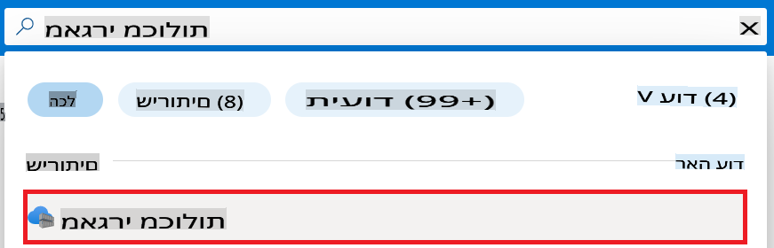

1. בחרו את ה-Container registry המשויך ל-Azure Machine Learning workspace. לדוגמה, *finetunephicontainerregistry*.

1. בצעו את הפעולות הבאות כדי לנווט לדף Add role assignment:

    - בחרו **Access Control (IAM)** מתפריט הצד השמאלי.  
    - בחרו **+ Add** מתפריט הניווט.  
    - בחרו **Add role assignment** מתפריט הניווט.  

1. בתוך דף Add role assignment, בצעו את הפעולות הבאות:

    - הקלידו *AcrPull* בשורת החיפוש ובחרו **AcrPull** מתוך האפשרויות המופיעות.  
    - בחרו **Next**.  
    - בחרו **Assign access to** ל-**Managed identity**.  
    - בחרו **+ Select members**.  
    - בחרו את **מנוי Azure** שלכם.  
    - בחרו את **Managed identity** שיצרתם. לדוגמה, *finetunephi-managedidentity*.  
    - בחרו **Select**.  
    - בחרו **Review + assign**.

### הגדרת פרויקט

להורדת מערכי הנתונים הנדרשים לכוונון, תגדירו סביבת עבודה מקומית.

בתרגיל זה תבצעו:

- יצירת תיקייה לעבודה בתוכה.  
- יצירת סביבת עבודה וירטואלית.  
- התקנת חבילות נדרשות.  
- יצירת קובץ *download_dataset.py* להורדת מערכי הנתונים.

#### יצירת תיקייה לעבודה בתוכה

1. פתחו חלון טרמינל והקלידו את הפקודה הבאה ליצירת תיקייה בשם *finetune-phi* בנתיב ברירת המחדל.

    ```console
    mkdir finetune-phi
    ```

2. הקלידו את הפקודה הבאה בטרמינל כדי לנווט לתיקיית *finetune-phi* שיצרתם.

    ```console
    cd finetune-phi
    ```

#### יצירת סביבת עבודה וירטואלית

1. הקלידו את הפקודה הבאה בטרמינל ליצירת סביבת עבודה וירטואלית בשם *.venv*.

    ```console
    python -m venv .venv
    ```

2. הקלידו את הפקודה הבאה בטרמינל להפעלת סביבת העבודה הווירטואלית.

    ```console
    .venv\Scripts\activate.bat
    ```

> [!NOTE]  
> אם זה עבד, תראו *(.venv)* לפני שורת הפקודה.

#### התקנת חבילות נדרשות

1. הקלידו את הפקודות הבאות בטרמינל להתקנת החבילות הנדרשות.

    ```console
    pip install datasets==2.19.1
    ```

#### יצירת `download_dataset.py`

> [!NOTE]  
> מבנה התיקיות המלא:  
>  
> ```text
> └── YourUserName
> .    └── finetune-phi
> .        └── download_dataset.py
> ```

1. פתחו את **Visual Studio Code**.

1. בחרו **File** משורת התפריט.

1. בחרו **Open Folder**.

1. בחרו את התיקייה *finetune-phi* שיצרתם, הממוקמת ב-*C:\Users\yourUserName\finetune-phi*.

    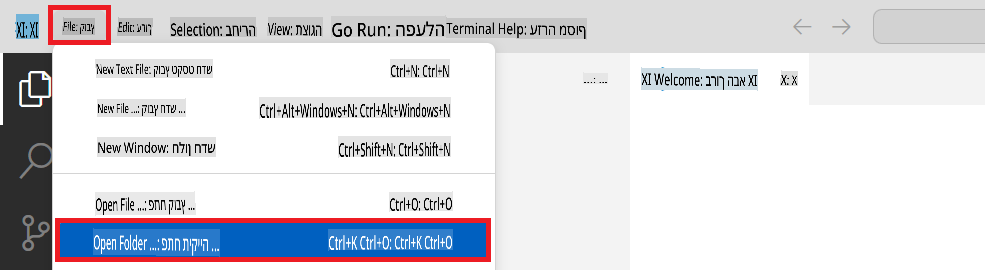

1. בחלונית השמאלית של Visual Studio Code, לחצו לחצן ימני ובחרו **New File** ליצירת קובץ חדש בשם *download_dataset.py*.

    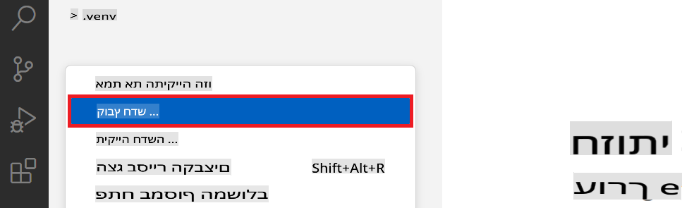

### הכנת מערכי נתונים לכוונון

בתרגיל זה תריצו את קובץ *download_dataset.py* להורדת מערכי נתונים *ultrachat_200k* לסביבה המקומית שלכם. לאחר מכן תשתמשו במערכי נתונים אלו לכוונון מודל Phi-3 ב-Azure Machine Learning.

בתרגיל זה תבצעו:

- הוספת קוד לקובץ *download_dataset.py* להורדת מערכי הנתונים.  
- הרצת קובץ *download_dataset.py* להורדת מערכי נתונים לסביבה המקומית.

#### הורדת מערכי נתונים באמצעות *download_dataset.py*

1. פתחו את קובץ *download_dataset.py* ב-Visual Studio Code.

1. הוסיפו את הקוד הבא לקובץ *download_dataset.py*.

    ```python
    import json
    import os
    from datasets import load_dataset

    def load_and_split_dataset(dataset_name, config_name, split_ratio):
        """
        Load and split a dataset.
        """
        # Load the dataset with the specified name, configuration, and split ratio
        dataset = load_dataset(dataset_name, config_name, split=split_ratio)
        print(f"Original dataset size: {len(dataset)}")
        
        # Split the dataset into train and test sets (80% train, 20% test)
        split_dataset = dataset.train_test_split(test_size=0.2)
        print(f"Train dataset size: {len(split_dataset['train'])}")
        print(f"Test dataset size: {len(split_dataset['test'])}")
        
        return split_dataset

    def save_dataset_to_jsonl(dataset, filepath):
        """
        Save a dataset to a JSONL file.
        """
        # Create the directory if it does not exist
        os.makedirs(os.path.dirname(filepath), exist_ok=True)
        
        # Open the file in write mode
        with open(filepath, 'w', encoding='utf-8') as f:
            # Iterate over each record in the dataset
            for record in dataset:
                # Dump the record as a JSON object and write it to the file
                json.dump(record, f)
                # Write a newline character to separate records
                f.write('\n')
        
        print(f"Dataset saved to {filepath}")

    def main():
        """
        Main function to load, split, and save the dataset.
        """
        # Load and split the ULTRACHAT_200k dataset with a specific configuration and split ratio
        dataset = load_and_split_dataset("HuggingFaceH4/ultrachat_200k", 'default', 'train_sft[:1%]')
        
        # Extract the train and test datasets from the split
        train_dataset = dataset['train']
        test_dataset = dataset['test']

        # Save the train dataset to a JSONL file
        save_dataset_to_jsonl(train_dataset, "data/train_data.jsonl")
        
        # Save the test dataset to a separate JSONL file
        save_dataset_to_jsonl(test_dataset, "data/test_data.jsonl")

    if __name__ == "__main__":
        main()

    ```

1. הקלידו את הפקודה הבאה בטרמינל להרצת הסקריפט ולהורדת מערכי הנתונים לסביבה המקומית.

    ```console
    python download_dataset.py
    ```

1. ודאו שמערכי הנתונים נשמרו בהצלחה בתיקיית *finetune-phi/data* המקומית שלכם.

> [!NOTE]  
>
> #### הערה על גודל מערך הנתונים וזמן הכוונון  
>
> במדריך זה, תשתמשו רק ב-1% ממערך הנתונים (`split='train[:1%]'`). זה מפחית משמעותית את כמות הנתונים, ומזרז את תהליכי ההעלאה והכוונון. ניתן להתאים את האחוז למציאת האיזון בין זמן הכשרה לביצועי המודל. שימוש בתת-קבוצה קטנה של מערך הנתונים מקצר את זמן הכוונון, מה שהופך את התהליך לנוח יותר עבור מדריך זה.

## תרחיש 2: כוונון מודל Phi-3 ופריסתו ב-Azure Machine Learning Studio

### כוונון מודל Phi-3

בתרגיל
1. בקרו ב-[Azure ML Studio](https://ml.azure.com/home?wt.mc_id=studentamb_279723).

1. בחרו **Compute** מתפריט הצד השמאלי.

1. בחרו **Compute clusters** מתפריט הניווט.

1. בחרו **+ New**.

    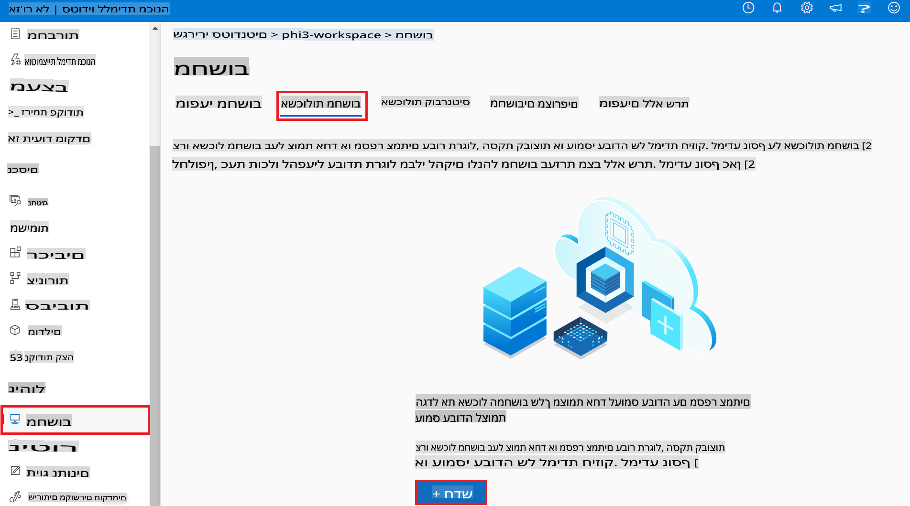

1. בצעו את הפעולות הבאות:

    - בחרו את ה-**Region** שבו תרצו להשתמש.
    - בחרו את **Virtual machine tier** ל-**Dedicated**.
    - בחרו את **Virtual machine type** ל-**GPU**.
    - הגדירו את מסנן **Virtual machine size** ל-**Select from all options**.
    - בחרו את **Virtual machine size** ל-**Standard_NC24ads_A100_v4**.

    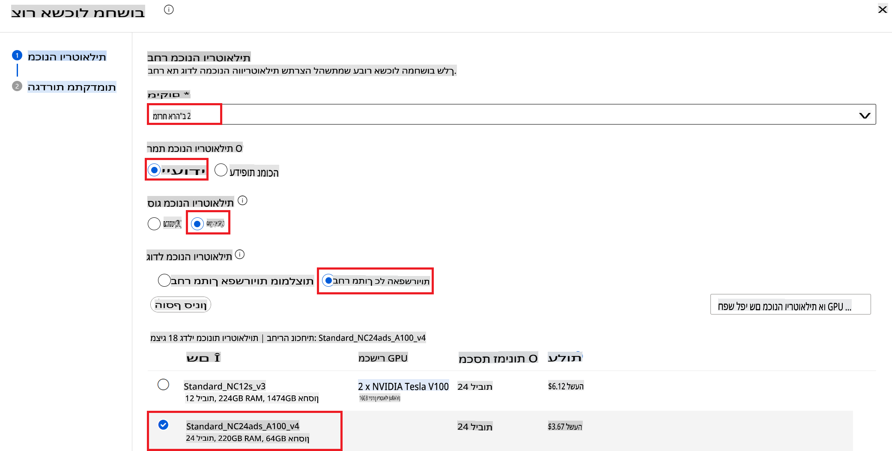

1. בחרו **Next**.

1. בצעו את הפעולות הבאות:

    - הזינו **Compute name**. יש לוודא שהוא ייחודי.
    - הגדירו את **Minimum number of nodes** ל-**0**.
    - הגדירו את **Maximum number of nodes** ל-**1**.
    - הגדירו את **Idle seconds before scale down** ל-**120**.

    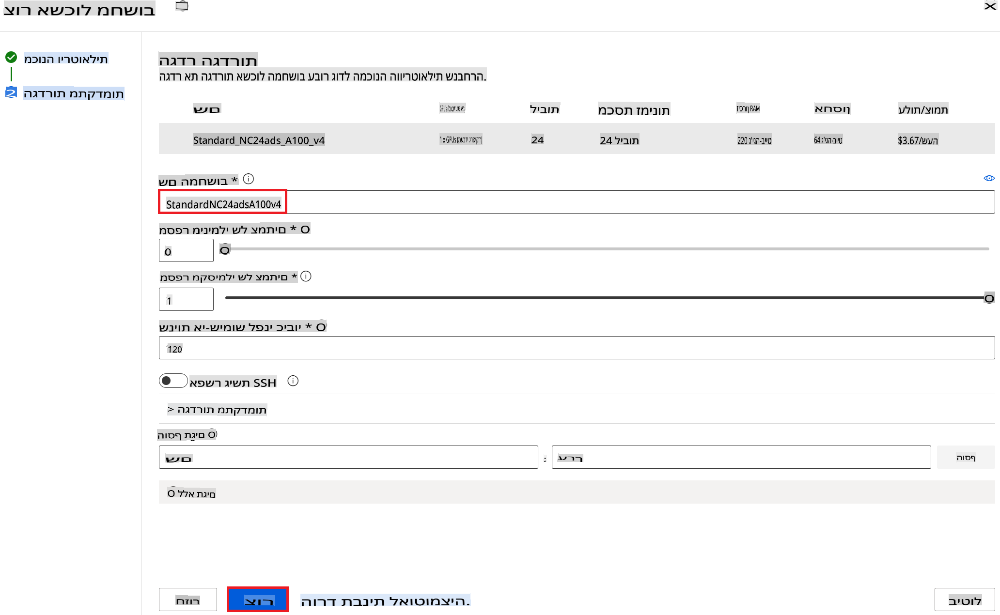

1. בחרו **Create**.

#### כוונון עדין למודל Phi-3

1. בקרו ב-[Azure ML Studio](https://ml.azure.com/home?wt.mc_id=studentamb_279723).

1. בחרו את סביבת העבודה של Azure Machine Learning שיצרתם.

    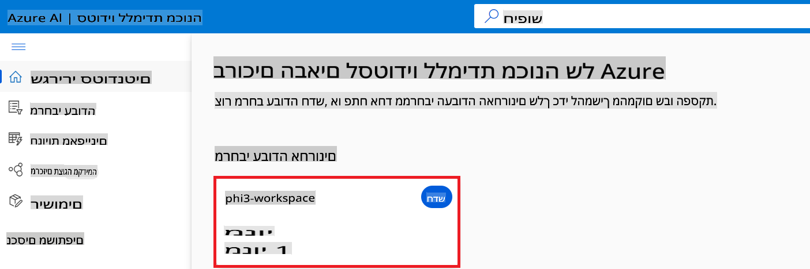

1. בצעו את הפעולות הבאות:

    - בחרו **Model catalog** מתפריט הצד השמאלי.
    - הקלידו *phi-3-mini-4k* ב-**search bar** ובחרו **Phi-3-mini-4k-instruct** מהאפשרויות שמופיעות.

    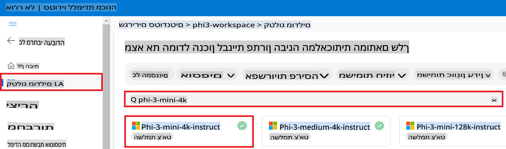

1. בחרו **Fine-tune** מתפריט הניווט.

    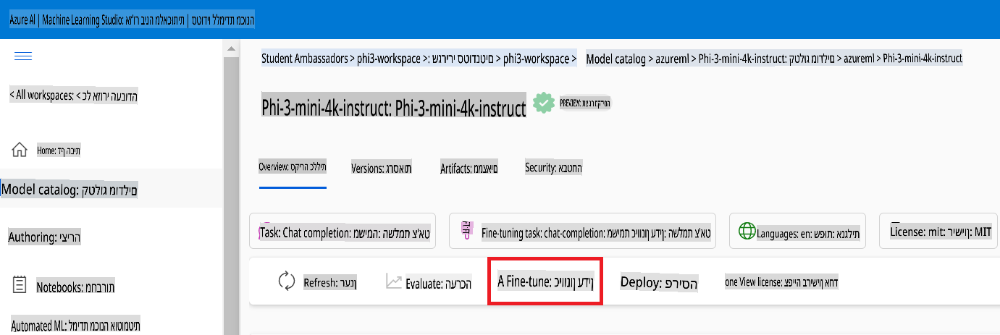

1. בצעו את הפעולות הבאות:

    - בחרו **Select task type** ל-**Chat completion**.
    - בחרו **+ Select data** להעלאת **Training data**.
    - בחרו את סוג העלאת נתוני האימות ל-**Provide different validation data**.
    - בחרו **+ Select data** להעלאת **Validation data**.

    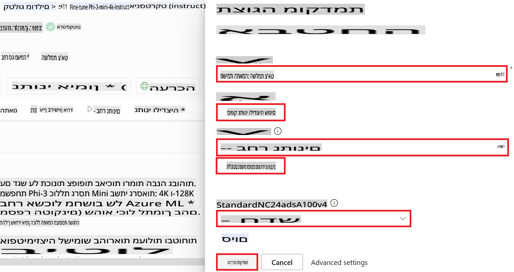

    > [!TIP]
    >
    > ניתן לבחור **Advanced settings** כדי להתאים אישית הגדרות כמו **learning_rate** ו-**lr_scheduler_type** לשיפור תהליך הכוונון העדין בהתאם לצרכים שלכם.

1. בחרו **Finish**.

1. בתרגיל זה, ביצעתם כוונון עדין למודל Phi-3 באמצעות Azure Machine Learning. שימו לב שתהליך הכוונון העדין עשוי לקחת זמן רב. לאחר הרצת משימת הכוונון העדין, תצטרכו להמתין לסיומה. ניתן לעקוב אחר סטטוס משימת הכוונון העדין על ידי מעבר ללשונית Jobs בצד השמאלי של סביבת העבודה של Azure Machine Learning. בסדרה הבאה, תפרסו את המודל שעבר כוונון ותשלבו אותו עם Prompt Flow.

    

### פריסת המודל Phi-3 שעבר כוונון עדין

כדי לשלב את המודל Phi-3 שעבר כוונון עדין עם Prompt Flow, יש לפרוס את המודל כך שיהיה נגיש להסקת מסקנות בזמן אמת. תהליך זה כולל רישום המודל, יצירת נקודת קצה מקוונת ופריסת המודל.

בתרגיל זה, תבצעו את השלבים הבאים:

- תרשמו את המודל שעבר כוונון עדין בסביבת העבודה של Azure Machine Learning.
- תיצרו נקודת קצה מקוונת.
- תפרסו את המודל Phi-3 שעבר כוונון עדין.

#### רישום המודל שעבר כוונון עדין

1. בקרו ב-[Azure ML Studio](https://ml.azure.com/home?wt.mc_id=studentamb_279723).

1. בחרו את סביבת העבודה של Azure Machine Learning שיצרתם.

    

1. בחרו **Models** מתפריט הצד השמאלי.
1. בחרו **+ Register**.
1. בחרו **From a job output**.

    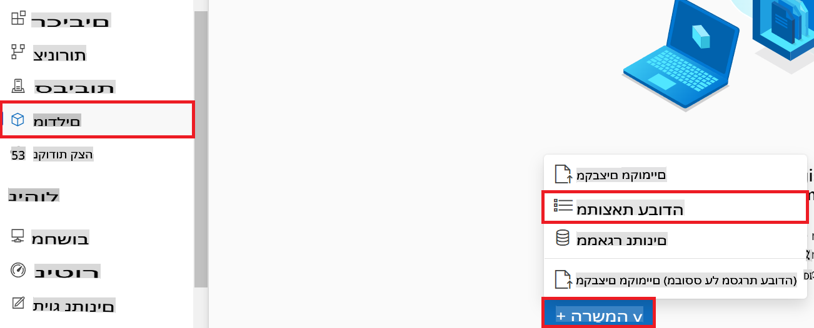

1. בחרו את המשימה שיצרתם.

    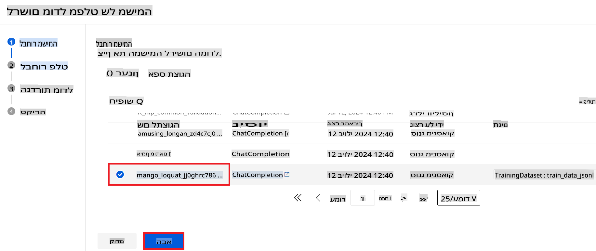

1. בחרו **Next**.

1. בחרו **Model type** ל-**MLflow**.

1. ודאו ש-**Job output** נבחר; הוא אמור להיבחר אוטומטית.

    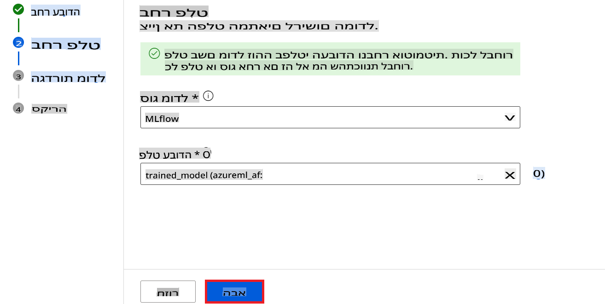

2. בחרו **Next**.

3. בחרו **Register**.

    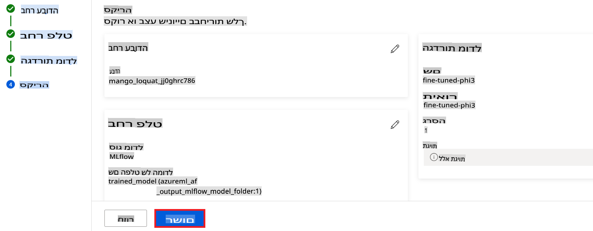

4. ניתן לראות את המודל הרשום על ידי מעבר לתפריט **Models** מתפריט הצד השמאלי.

    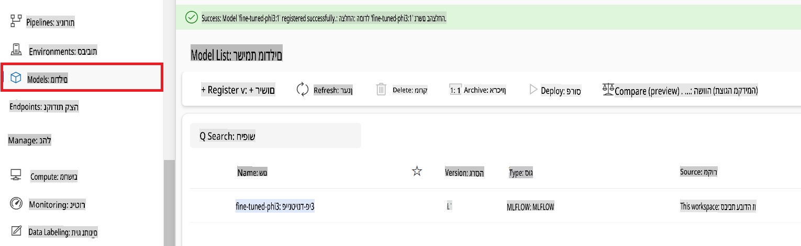

#### פריסת המודל שעבר כוונון עדין

1. עברו לסביבת העבודה של Azure Machine Learning שיצרתם.

1. בחרו **Endpoints** מתפריט הצד השמאלי.

1. בחרו **Real-time endpoints** מתפריט הניווט.

    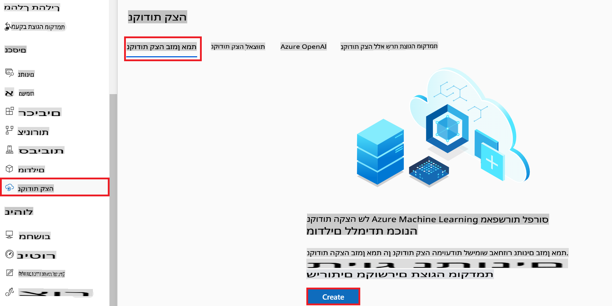

1. בחרו **Create**.

1. בחרו את המודל הרשום שיצרתם.

    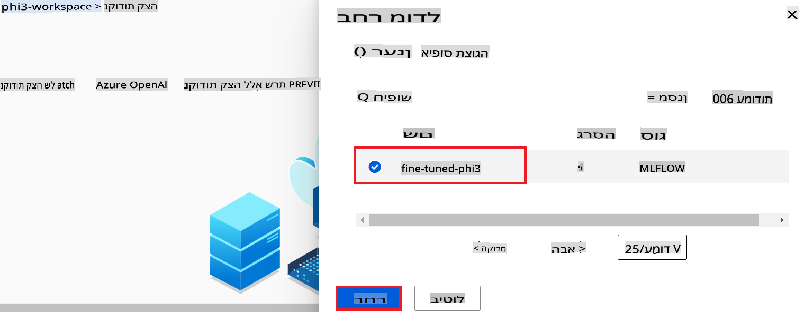

1. בחרו **Select**.

1. בצעו את הפעולות הבאות:

    - בחרו **Virtual machine** ל-*Standard_NC6s_v3*.
    - בחרו את מספר ה-**Instance count** שבו תרצו להשתמש, לדוגמה, *1*.
    - בחרו את **Endpoint** ל-**New** כדי ליצור נקודת קצה.
    - הזינו **Endpoint name**. יש לוודא שהוא ייחודי.
    - הזינו **Deployment name**. יש לוודא שהוא ייחודי.

    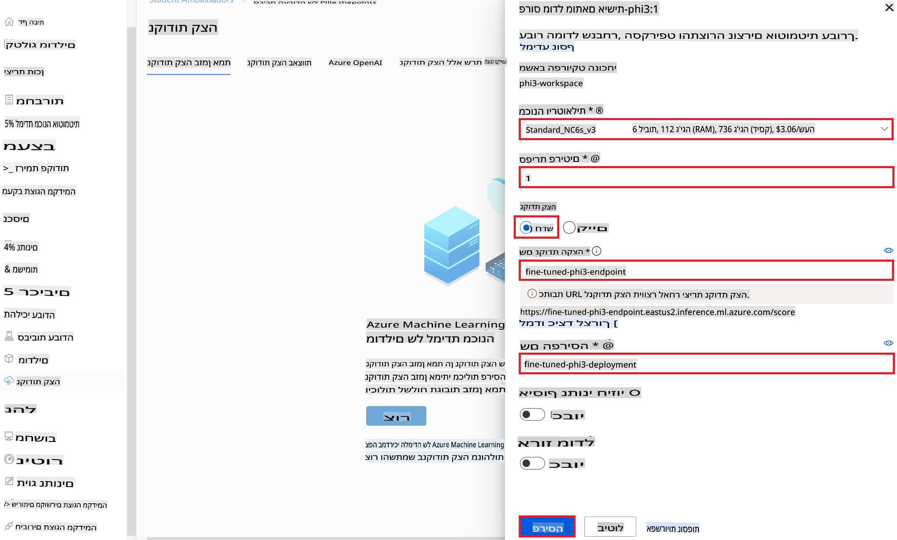

1. בחרו **Deploy**.

> [!WARNING]
> כדי להימנע מחיובים נוספים בחשבונכם, ודאו שאתם מוחקים את נקודת הקצה שיצרתם בסביבת העבודה של Azure Machine Learning.
>

#### בדיקת סטטוס הפריסה בסביבת העבודה של Azure Machine Learning

1. עברו לסביבת העבודה של Azure Machine Learning שיצרתם.

1. בחרו **Endpoints** מתפריט הצד השמאלי.

1. בחרו את נקודת הקצה שיצרתם.

    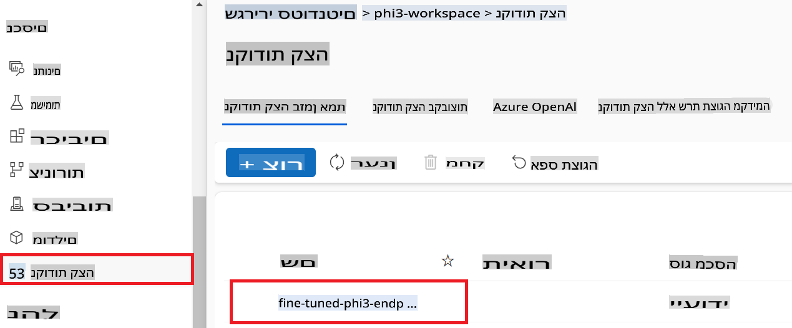

1. בעמוד זה, תוכלו לנהל את נקודות הקצה במהלך תהליך הפריסה.

> [!NOTE]
> לאחר השלמת הפריסה, ודאו ש-**Live traffic** מוגדר ל-**100%**. אם לא, בחרו **Update traffic** כדי להתאים את הגדרות התעבורה. שימו לב שלא ניתן לבדוק את המודל אם התעבורה מוגדרת ל-0%.
>
> 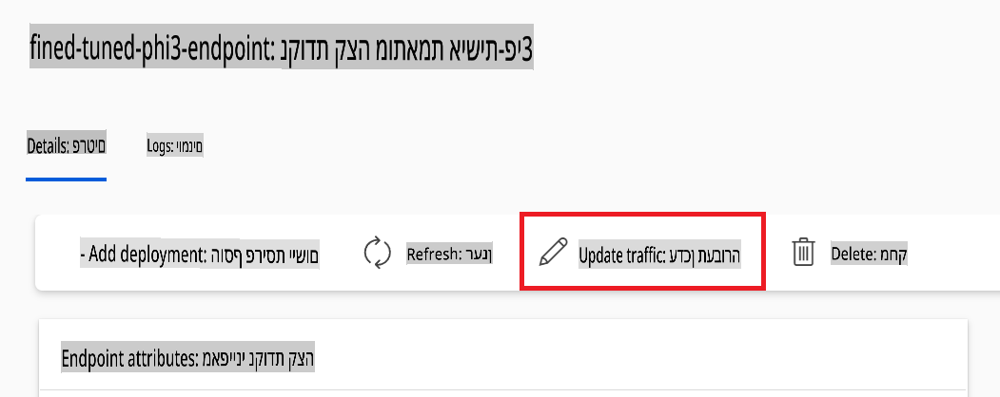
>

## תרחיש 3: שילוב עם Prompt Flow ושיחה עם המודל המותאם אישית שלכם ב-Azure AI Foundry

### שילוב המודל Phi-3 המותאם אישית עם Prompt Flow

לאחר פריסת המודל שעבר כוונון עדין, ניתן לשלב אותו עם Prompt Flow לשימוש בזמן אמת, המאפשר מגוון משימות אינטראקטיביות עם המודל Phi-3 המותאם אישית שלכם.

בתרגיל זה, תבצעו את השלבים הבאים:

- תיצרו Hub ב-Azure AI Foundry.
- תיצרו פרויקט ב-Azure AI Foundry.
- תיצרו Prompt Flow.
- תוסיפו חיבור מותאם אישית למודל Phi-3 המותאם אישית.
- תגדירו את Prompt Flow לשיחה עם המודל Phi-3 המותאם אישית שלכם.

> [!NOTE]
> ניתן גם לשלב עם Prompt Flow באמצעות Azure ML Studio. תהליך השילוב זהה גם ב-Azure ML Studio.

#### יצירת Hub ב-Azure AI Foundry

יש ליצור Hub לפני יצירת פרויקט. Hub פועל כקבוצת משאבים, ומאפשר לארגן ולנהל פרויקטים מרובים ב-Azure AI Foundry.

1. בקרו ב-[Azure AI Foundry](https://ai.azure.com/?WT.mc_id=aiml-137032-kinfeylo).

1. בחרו **All hubs** מתפריט הצד השמאלי.

1. בחרו **+ New hub** מתפריט הניווט.

    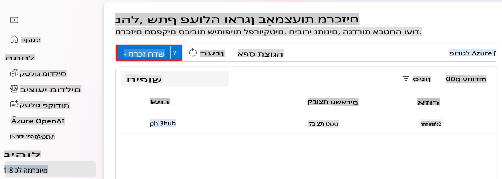

1. בצעו את הפעולות הבאות:

    - הזינו **Hub name**. יש לוודא שהוא ייחודי.
    - בחרו את **Subscription** שלכם ב-Azure.
    - בחרו את קבוצת המשאבים (**Resource group**) לשימוש (צרו חדשה במידת הצורך).
    - בחרו את **Location** שבו תרצו להשתמש.
    - בחרו את **Connect Azure AI Services** לשימוש (צרו חדש במידת הצורך).
    - בחרו **Connect Azure AI Search** ל-**Skip connecting**.

    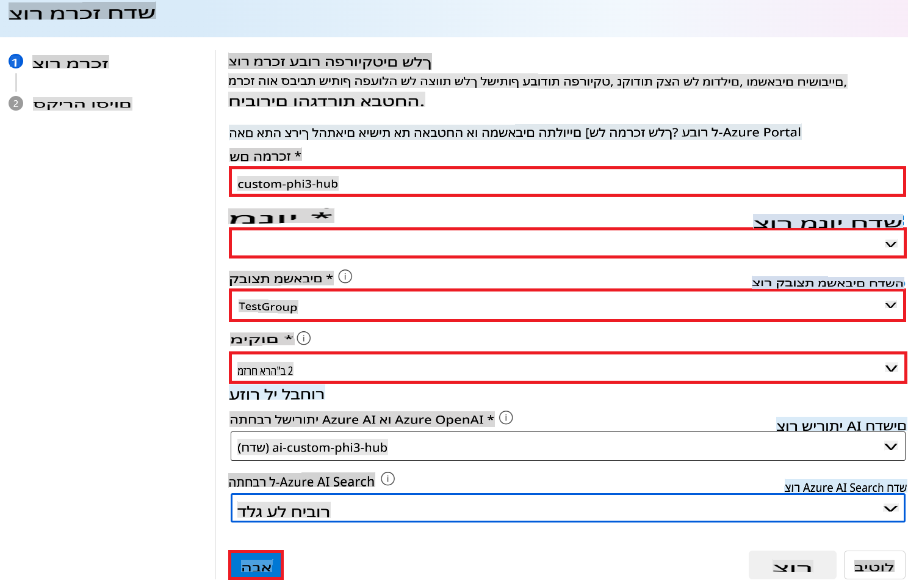

1. בחרו **Next**.

#### יצירת פרויקט ב-Azure AI Foundry

1. ב-Hub שיצרתם, בחרו **All projects** מתפריט הצד השמאלי.

1. בחרו **+ New project** מתפריט הניווט.

    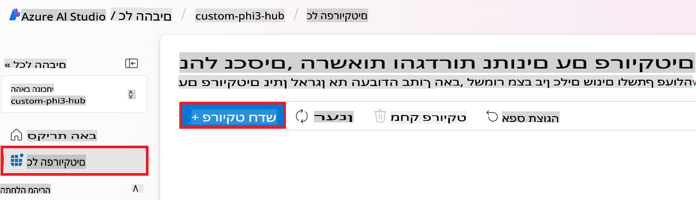

1. הזינו **Project name**. יש לוודא שהוא ייחודי.

    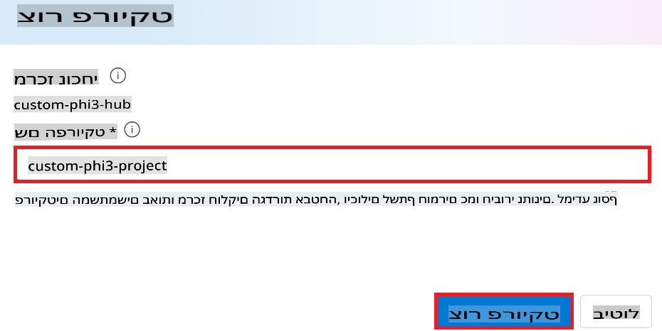

1. בחרו **Create a project**.

#### הוספת חיבור מותאם אישית למודל Phi-3 המותאם אישית

כדי לשלב את המודל Phi-3 המותאם אישית שלכם עם Prompt Flow, עליכם לשמור את נקודת הקצה והמפתח של המודל בחיבור מותאם אישית. הגדרה זו מבטיחה גישה למודל המותאם אישית שלכם ב-Prompt Flow.

#### הגדרת מפתח API וכתובת URI של נקודת הקצה למודל Phi-3 המותאם אישית

1. בקרו ב-[Azure ML Studio](https://ml.azure.com/home?WT.mc_id=aiml-137032-kinfeylo).

1. עברו לסביבת העבודה של Azure Machine Learning שיצרתם.

1. בחרו **Endpoints** מתפריט הצד השמאלי.

    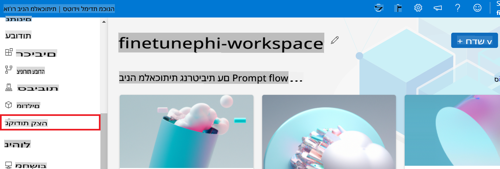

1. בחרו את נקודת הקצה שיצרתם.

    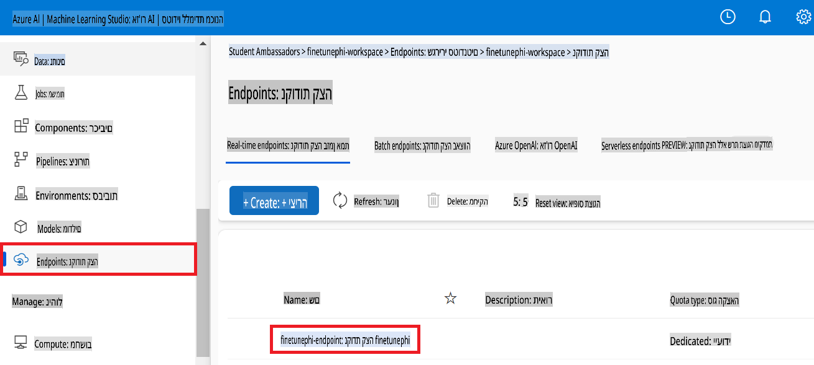

1. בחרו **Consume** מתפריט הניווט.

1. העתיקו את **REST endpoint** ואת **Primary key** שלכם.
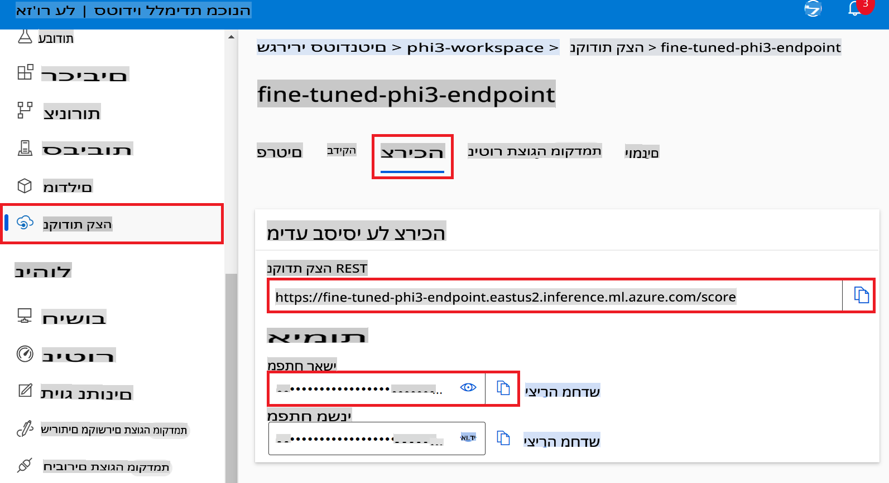

#### הוספת חיבור מותאם אישית

1. בקרו ב-[Azure AI Foundry](https://ai.azure.com/?WT.mc_id=aiml-137032-kinfeylo).

1. נווטו לפרויקט Azure AI Foundry שיצרתם.

1. בפרויקט שיצרתם, בחרו **Settings** מהתפריט בצד שמאל.

1. בחרו **+ New connection**.

    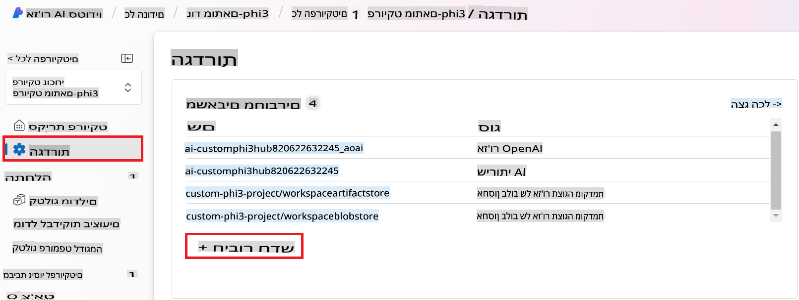

1. בחרו **Custom keys** מתפריט הניווט.

    

1. בצעו את המשימות הבאות:

    - בחרו **+ Add key value pairs**.
    - בשם המפתח, הזינו **endpoint** והדביקו את נקודת הקצה שהעתקתם מ-Azure ML Studio לשדה הערך.
    - בחרו **+ Add key value pairs** שוב.
    - בשם המפתח, הזינו **key** והדביקו את המפתח שהעתקתם מ-Azure ML Studio לשדה הערך.
    - לאחר הוספת המפתחות, בחרו **is secret** כדי למנוע חשיפת המפתח.

    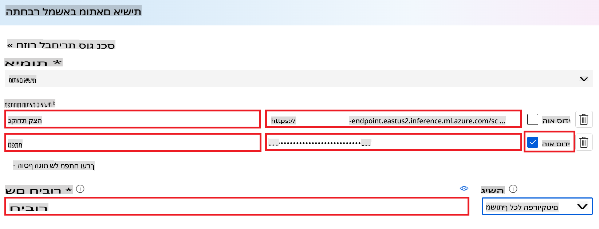

1. בחרו **Add connection**.

#### יצירת Prompt flow

הוספתם חיבור מותאם אישית ב-Azure AI Foundry. עכשיו, בואו ניצור Prompt flow באמצעות השלבים הבאים. לאחר מכן, תחברו את ה-Prompt flow לחיבור המותאם כדי שתוכלו להשתמש במודל המותאם אישית בתוך ה-Prompt flow.

1. נווטו לפרויקט Azure AI Foundry שיצרתם.

1. בחרו **Prompt flow** מהתפריט בצד שמאל.

1. בחרו **+ Create** מתפריט הניווט.

    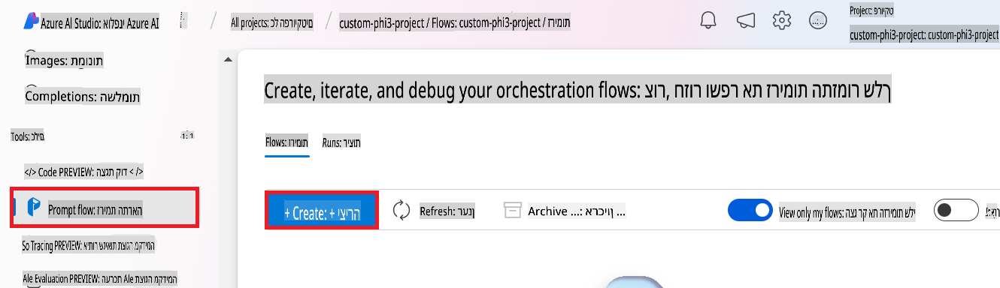

1. בחרו **Chat flow** מתפריט הניווט.

    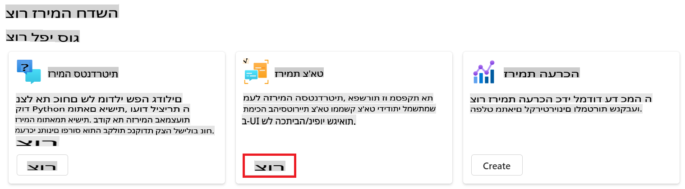

1. הזינו **Folder name** לשימוש.

    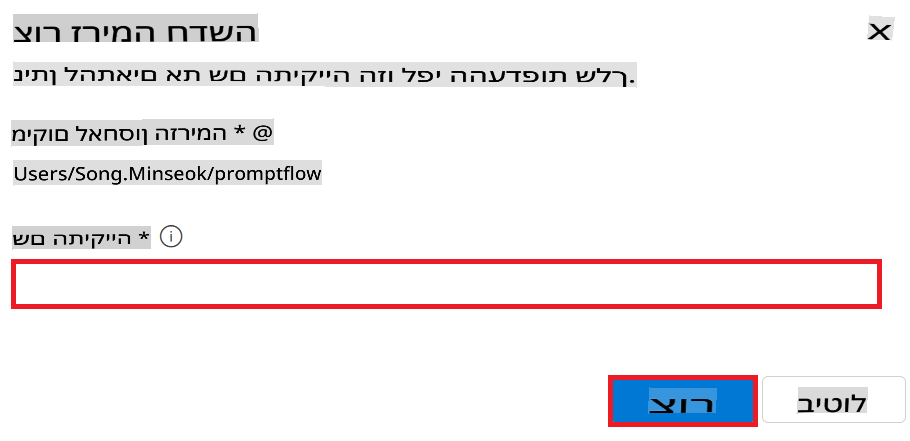

2. בחרו **Create**.

#### הגדרת Prompt flow לצ'אט עם מודל Phi-3 המותאם אישית שלכם

עליכם לשלב את מודל Phi-3 המותאם אישית ב-Prompt flow. עם זאת, ה-Prompt flow הקיים אינו מותאם למטרה זו. לכן, יש לעצב מחדש את ה-Prompt flow כדי לאפשר את שילוב המודל המותאם.

1. ב-Prompt flow, בצעו את המשימות הבאות כדי לבנות מחדש את הזרימה הקיימת:

    - בחרו **Raw file mode**.
    - מחקו את כל הקוד הקיים בקובץ *flow.dag.yml*.
    - הוסיפו את הקוד הבא לקובץ *flow.dag.yml*.

        ```yml
        inputs:
          input_data:
            type: string
            default: "Who founded Microsoft?"

        outputs:
          answer:
            type: string
            reference: ${integrate_with_promptflow.output}

        nodes:
        - name: integrate_with_promptflow
          type: python
          source:
            type: code
            path: integrate_with_promptflow.py
          inputs:
            input_data: ${inputs.input_data}
        ```

    - בחרו **Save**.

    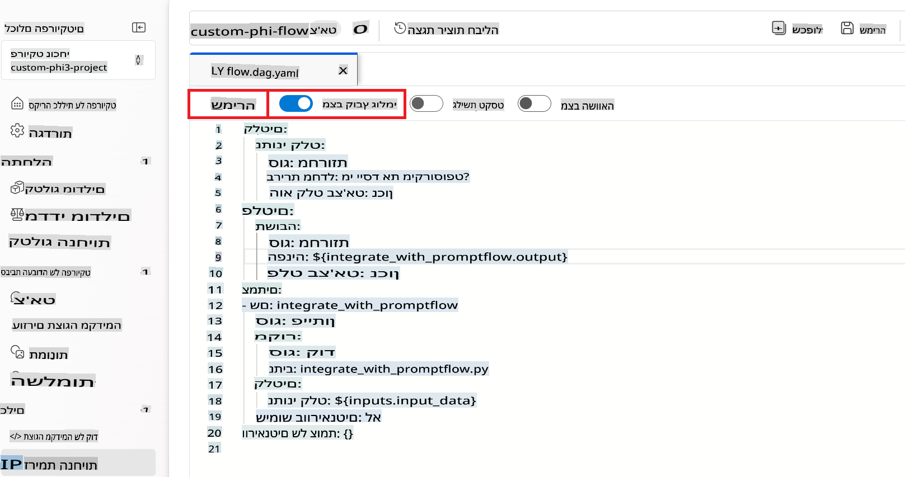

1. הוסיפו את הקוד הבא לקובץ *integrate_with_promptflow.py* כדי להשתמש במודל Phi-3 המותאם אישית ב-Prompt flow.

    ```python
    import logging
    import requests
    from promptflow import tool
    from promptflow.connections import CustomConnection

    # Logging setup
    logging.basicConfig(
        format="%(asctime)s - %(levelname)s - %(name)s - %(message)s",
        datefmt="%Y-%m-%d %H:%M:%S",
        level=logging.DEBUG
    )
    logger = logging.getLogger(__name__)

    def query_phi3_model(input_data: str, connection: CustomConnection) -> str:
        """
        Send a request to the Phi-3 model endpoint with the given input data using Custom Connection.
        """

        # "connection" is the name of the Custom Connection, "endpoint", "key" are the keys in the Custom Connection
        endpoint_url = connection.endpoint
        api_key = connection.key

        headers = {
            "Content-Type": "application/json",
            "Authorization": f"Bearer {api_key}"
        }
        data = {
            "input_data": {
                "input_string": [
                    {"role": "user", "content": input_data}
                ],
                "parameters": {
                    "temperature": 0.7,
                    "max_new_tokens": 128
                }
            }
        }
        try:
            response = requests.post(endpoint_url, json=data, headers=headers)
            response.raise_for_status()
            
            # Log the full JSON response
            logger.debug(f"Full JSON response: {response.json()}")

            result = response.json()["output"]
            logger.info("Successfully received response from Azure ML Endpoint.")
            return result
        except requests.exceptions.RequestException as e:
            logger.error(f"Error querying Azure ML Endpoint: {e}")
            raise

    @tool
    def my_python_tool(input_data: str, connection: CustomConnection) -> str:
        """
        Tool function to process input data and query the Phi-3 model.
        """
        return query_phi3_model(input_data, connection)

    ```

    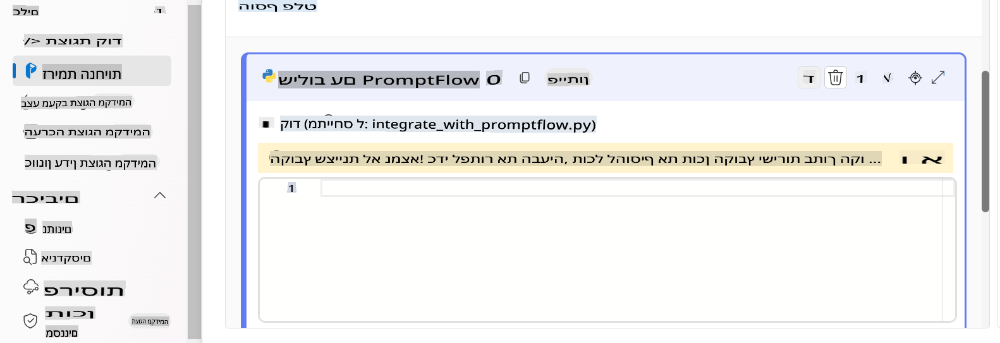

> [!NOTE]
> למידע מפורט יותר על השימוש ב-Prompt flow ב-Azure AI Foundry, ניתן לעיין ב-[Prompt flow in Azure AI Foundry](https://learn.microsoft.com/azure/ai-studio/how-to/prompt-flow).

1. בחרו **Chat input**, **Chat output** כדי לאפשר צ'אט עם המודל שלכם.

    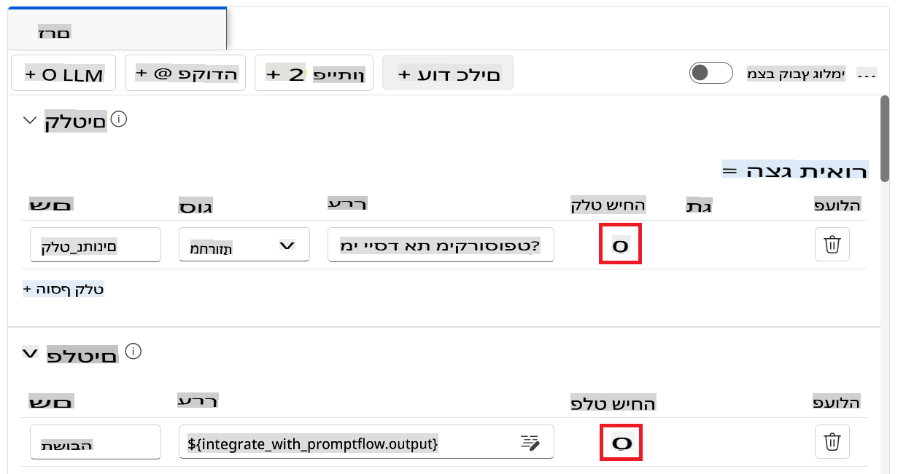

1. כעת אתם מוכנים לצ'אט עם מודל Phi-3 המותאם אישית שלכם. בתרגיל הבא תלמדו כיצד להפעיל את ה-Prompt flow ולהשתמש בו לצ'אט עם המודל המותאם.

> [!NOTE]
>
> הזרימה החדשה צריכה להיראות כמו בתמונה למטה:
>
> 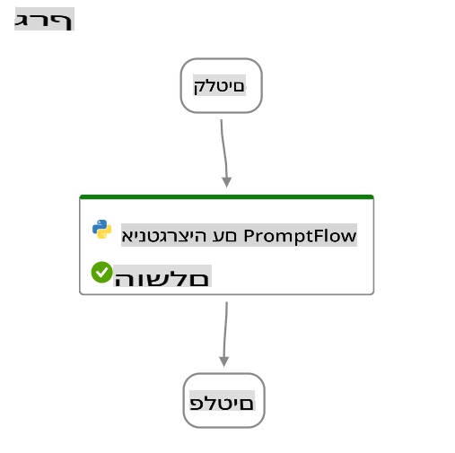
>

### צ'אט עם מודל Phi-3 המותאם אישית שלכם

כעת, לאחר שהתאמתם ושילבתם את מודל Phi-3 המותאם אישית שלכם עם Prompt flow, אתם מוכנים להתחיל לתקשר איתו. תרגיל זה ינחה אתכם בתהליך ההגדרה וההפעלה של צ'אט עם המודל שלכם באמצעות Prompt flow. על ידי ביצוע השלבים, תוכלו לנצל את היכולות של מודל Phi-3 המותאם שלכם למשימות ושיחות שונות.

- צ'אט עם מודל Phi-3 המותאם אישית שלכם באמצעות Prompt flow.

#### הפעלת Prompt flow

1. בחרו **Start compute sessions** כדי להפעיל את ה-Prompt flow.

    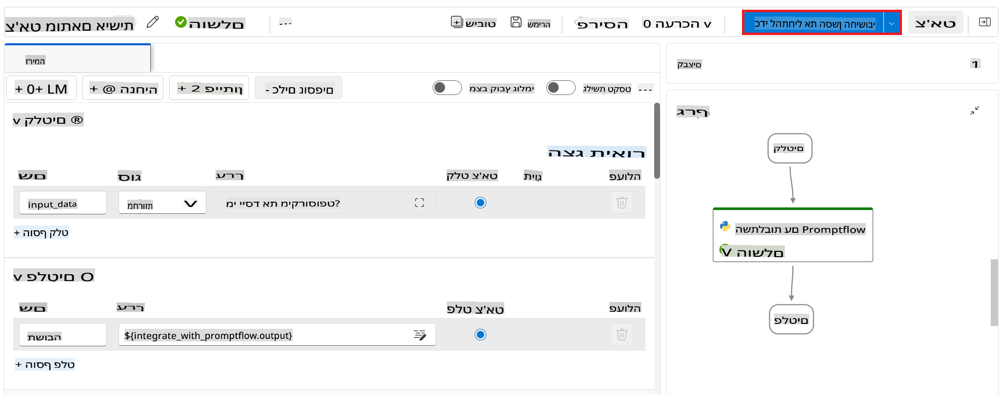

1. בחרו **Validate and parse input** כדי לחדש פרמטרים.

    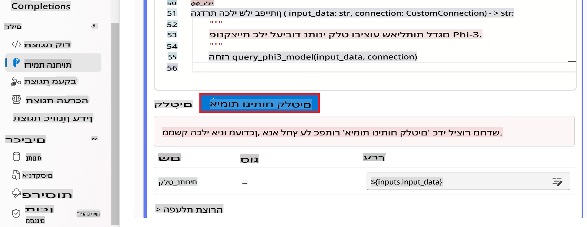

1. בחרו את **Value** של ה-**connection** לחיבור המותאם שיצרתם. לדוגמה, *connection*.

    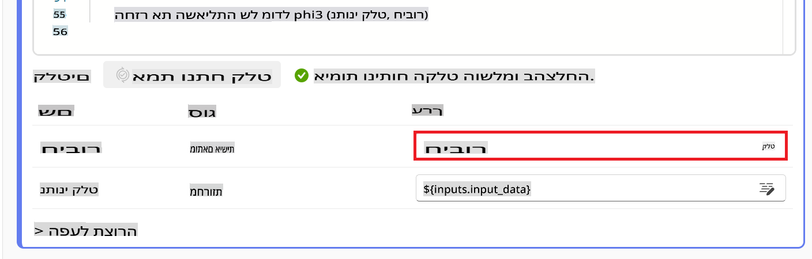

#### צ'אט עם המודל המותאם אישית שלכם

1. בחרו **Chat**.

    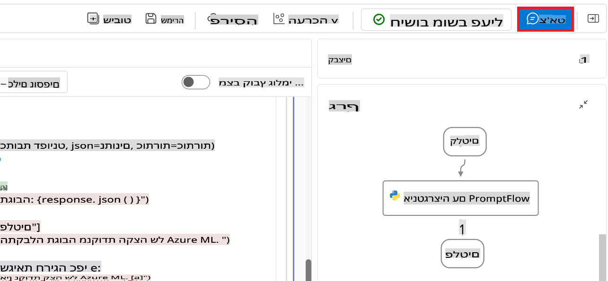

1. דוגמה לתוצאות: כעת תוכלו לצ'אט עם מודל Phi-3 המותאם אישית שלכם. מומלץ לשאול שאלות המבוססות על הנתונים ששימשו להתאמה.

    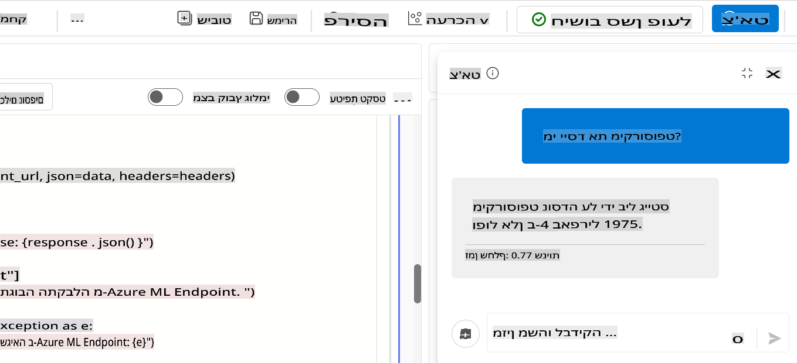

**כתב ויתור**:  
מסמך זה תורגם באמצעות שירותי תרגום מבוססי בינה מלאכותית. למרות שאנו שואפים לדיוק, יש להיות מודעים לכך שתרגומים אוטומטיים עשויים להכיל שגיאות או אי-דיוקים. המסמך המקורי בשפתו המקורית צריך להיחשב כמקור הסמכותי. למידע קריטי, מומלץ להשתמש בתרגום מקצועי על ידי בני אדם. אנו לא נושאים באחריות לאי-הבנות או לפרשנויות שגויות הנובעות משימוש בתרגום זה.