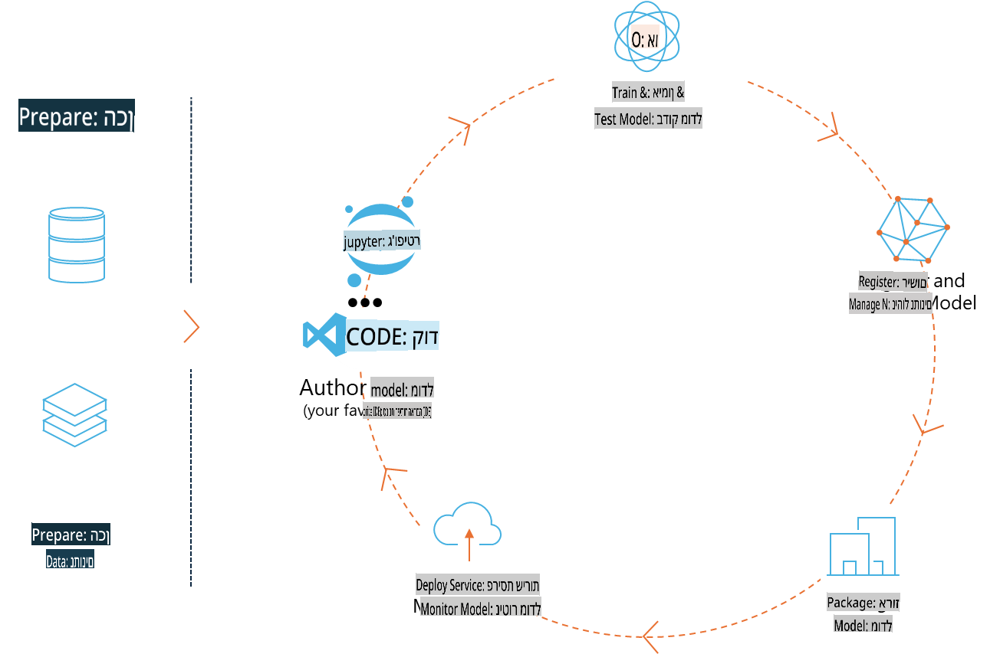
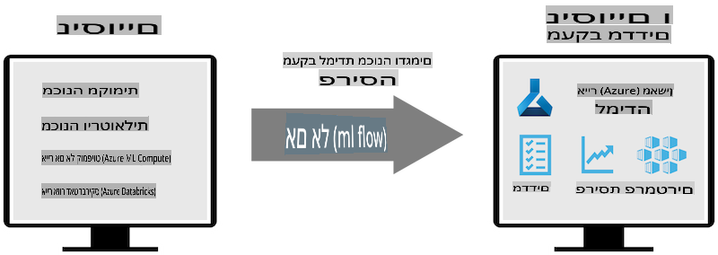
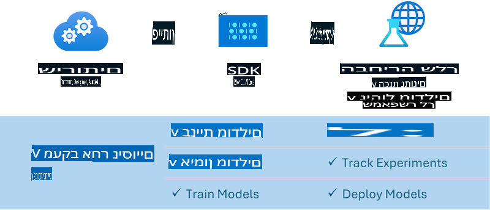

# MLflow

[MLflow](https://mlflow.org/) היא פלטפורמה בקוד פתוח שנועדה לנהל את מחזור החיים המלא של למידת מכונה.



MLFlow משמשת לניהול מחזור החיים של למידת מכונה, כולל ניסויים, שחזור, פריסה ורישום מרכזי של מודלים. נכון לעכשיו, MLFlow מציעה ארבעה רכיבים:

- **MLflow Tracking:** תיעוד ושאילתא של ניסויים, קוד, הגדרות נתונים ותוצאות.
- **MLflow Projects:** אריזת קוד מדעי נתונים בפורמט שמאפשר שחזור ריצות בכל פלטפורמה.
- **Mlflow Models:** פריסת מודלים של למידת מכונה בסביבות שירות מגוונות.
- **Model Registry:** אחסון, הוספת הערות וניהול מודלים במאגר מרכזי.

MLFlow כוללת יכולות לתיעוד ניסויים, אריזת קוד לריצות שניתנות לשחזור, ושיתוף ופריסה של מודלים. היא משולבת ב-Databricks ותומכת במגוון ספריות ML, מה שהופך אותה לאגנוסטית לספריות. ניתן להשתמש בה עם כל ספריית למידת מכונה ובכל שפת תכנות, בזכות REST API ו-CLI שמקלים על השימוש.



המאפיינים המרכזיים של MLFlow כוללים:

- **תיעוד ניסויים:** תיעוד והשוואת פרמטרים ותוצאות.
- **ניהול מודלים:** פריסת מודלים לפלטפורמות שונות של שירות והסקת מסקנות.
- **רישום מודלים:** ניהול מחזור החיים של מודלים ב-MLFlow בשיתוף פעולה, כולל גרסאות והערות.
- **פרויקטים:** אריזת קוד ML לשיתוף או שימוש בייצור.

MLFlow תומכת גם בלולאת MLOps, הכוללת הכנת נתונים, רישום וניהול מודלים, אריזת מודלים לביצוע, פריסת שירותים ומעקב אחרי מודלים. היא שואפת לפשט את המעבר מאבטיפוס לעבודה בייצור, במיוחד בסביבות ענן וקצה.

## תרחיש מקצה לקצה - בניית עטיפה ושימוש ב-Phi-3 כמודל MLFlow

בדוגמה מקצה לקצה זו, נדגים שתי גישות שונות לבניית עטיפה סביב מודל השפה הקטן Phi-3 ולאחר מכן הרצתה כמודל MLFlow מקומית או בענן, למשל ב-Azure Machine Learning workspace.



| פרויקט | תיאור | מיקום |
| ------------ | ----------- | -------- |
| צינור Transformer | צינור Transformer הוא האפשרות הפשוטה ביותר לבניית עטיפה אם ברצונך להשתמש במודל HuggingFace עם התמיכה הניסיונית של MLFlow בפורמט transformers. | [**TransformerPipeline.ipynb**](../../../../../../code/06.E2E/E2E_Phi-3-MLflow_TransformerPipeline.ipynb) |
| עטיפת Python מותאמת אישית | בעת כתיבת שורות אלה, צינור הטרנספורמרים לא תמך ביצירת עטיפת MLFlow עבור מודלים של HuggingFace בפורמט ONNX, גם לא עם חבילת ה-Python הניסיונית optimum. במקרים כאלה, ניתן לבנות עטיפת Python מותאמת אישית למודל MLFlow | [**CustomPythonWrapper.ipynb**](../../../../../../code/06.E2E/E2E_Phi-3-MLflow_CustomPythonWrapper.ipynb) |

## פרויקט: צינור Transformer

1. תצטרכו חבילות Python רלוונטיות מ-MLFlow ו-HuggingFace:

    ``` Python
    import mlflow
    import transformers
    ```

2. לאחר מכן, יש להתחיל צינור Transformer על ידי הפניה למודל Phi-3 היעד ברישום HuggingFace. ניתן לראות מכרטיס המודל של _Phi-3-mini-4k-instruct_ שמשימתו היא מסוג "יצירת טקסט":

    ``` Python
    pipeline = transformers.pipeline(
        task = "text-generation",
        model = "microsoft/Phi-3-mini-4k-instruct"
    )
    ```

3. כעת ניתן לשמור את צינור הטרנספורמרים של מודל Phi-3 בפורמט MLFlow ולספק פרטים נוספים כמו נתיב הארכיון היעד, הגדרות תצורת מודל ספציפיות וסוג ה-API להסקה:

    ``` Python
    model_info = mlflow.transformers.log_model(
        transformers_model = pipeline,
        artifact_path = "phi3-mlflow-model",
        model_config = model_config,
        task = "llm/v1/chat"
    )
    ```

## פרויקט: עטיפת Python מותאמת אישית

1. כאן ניתן להשתמש ב-[ONNX Runtime generate() API](https://github.com/microsoft/onnxruntime-genai) של Microsoft עבור הסקת המודל בפורמט ONNX וקידוד/פענוח טוקנים. יש לבחור את חבילת _onnxruntime_genai_ עבור מחשוב היעד, כמו בדוגמה הבאה שמיועדת ל-CPU:

    ``` Python
    import mlflow
    from mlflow.models import infer_signature
    import onnxruntime_genai as og
    ```

1. המחלקה המותאמת אישית שלנו מממשת שתי שיטות: _load_context()_ לאתחול **מודל ONNX** של Phi-3 Mini 4K Instruct, **פרמטרי הגנרטור** ו-**טוקניזר**; ו-_predict()_ ליצירת טוקנים פלט עבור הפקודה הנתונה:

    ``` Python
    class Phi3Model(mlflow.pyfunc.PythonModel):
        def load_context(self, context):
            # Retrieving model from the artifacts
            model_path = context.artifacts["phi3-mini-onnx"]
            model_options = {
                 "max_length": 300,
                 "temperature": 0.2,         
            }
        
            # Defining the model
            self.phi3_model = og.Model(model_path)
            self.params = og.GeneratorParams(self.phi3_model)
            self.params.set_search_options(**model_options)
            
            # Defining the tokenizer
            self.tokenizer = og.Tokenizer(self.phi3_model)
    
        def predict(self, context, model_input):
            # Retrieving prompt from the input
            prompt = model_input["prompt"][0]
            self.params.input_ids = self.tokenizer.encode(prompt)
    
            # Generating the model's response
            response = self.phi3_model.generate(self.params)
    
            return self.tokenizer.decode(response[0][len(self.params.input_ids):])
    ```

1. כעת ניתן להשתמש בפונקציה _mlflow.pyfunc.log_model()_ ליצירת עטיפת Python מותאמת אישית (בפורמט pickle) עבור מודל Phi-3, יחד עם מודל ה-ONNX המקורי והתלויות הנדרשות:

    ``` Python
    model_info = mlflow.pyfunc.log_model(
        artifact_path = artifact_path,
        python_model = Phi3Model(),
        artifacts = {
            "phi3-mini-onnx": "cpu_and_mobile/cpu-int4-rtn-block-32-acc-level-4",
        },
        input_example = input_example,
        signature = infer_signature(input_example, ["Run"]),
        extra_pip_requirements = ["torch", "onnxruntime_genai", "numpy"],
    )
    ```

## חתימות של מודלים שנוצרו ב-MLFlow

1. בשלב 3 של פרויקט צינור ה-Transformer לעיל, הגדרנו את משימת מודל MLFlow ל-"_llm/v1/chat_". הוראה זו יוצרת עטיפת API למודל, שתואמת ל-Chat API של OpenAI כפי שמוצג להלן:

    ``` Python
    {inputs: 
      ['messages': Array({content: string (required), name: string (optional), role: string (required)}) (required), 'temperature': double (optional), 'max_tokens': long (optional), 'stop': Array(string) (optional), 'n': long (optional), 'stream': boolean (optional)],
    outputs: 
      ['id': string (required), 'object': string (required), 'created': long (required), 'model': string (required), 'choices': Array({finish_reason: string (required), index: long (required), message: {content: string (required), name: string (optional), role: string (required)} (required)}) (required), 'usage': {completion_tokens: long (required), prompt_tokens: long (required), total_tokens: long (required)} (required)],
    params: 
      None}
    ```

1. כתוצאה מכך, ניתן להגיש את הפקודה שלכם בפורמט הבא:

    ``` Python
    messages = [{"role": "user", "content": "What is the capital of Spain?"}]
    ```

1. לאחר מכן, ניתן להשתמש בעיבוד פוסט תואם ל-API של OpenAI, לדוגמה _response[0][‘choices’][0][‘message’][‘content’]_, כדי לייפות את הפלט למשהו כזה:

    ``` JSON
    Question: What is the capital of Spain?
    
    Answer: The capital of Spain is Madrid. It is the largest city in Spain and serves as the political, economic, and cultural center of the country. Madrid is located in the center of the Iberian Peninsula and is known for its rich history, art, and architecture, including the Royal Palace, the Prado Museum, and the Plaza Mayor.
    
    Usage: {'prompt_tokens': 11, 'completion_tokens': 73, 'total_tokens': 84}
    ```

1. בשלב 3 של פרויקט עטיפת ה-Python המותאמת אישית לעיל, אפשרנו לחבילת MLFlow ליצור את חתימת המודל מתוך דוגמת קלט נתונה. חתימת עטיפת MLFlow שלנו תיראה כך:

    ``` Python
    {inputs: 
      ['prompt': string (required)],
    outputs: 
      [string (required)],
    params: 
      None}
    ```

1. לכן, הפקודה שלנו תצטרך להכיל מפתח מילון "prompt", כמו זה:

    ``` Python
    {"prompt": "<|system|>You are a stand-up comedian.<|end|><|user|>Tell me a joke about atom<|end|><|assistant|>",}
    ```

1. הפלט של המודל יסופק אז בפורמט מחרוזת:

    ``` JSON
    Alright, here's a little atom-related joke for you!
    
    Why don't electrons ever play hide and seek with protons?
    
    Because good luck finding them when they're always "sharing" their electrons!
    
    Remember, this is all in good fun, and we're just having a little atomic-level humor!
    ```

**כתב ויתור**:  
מסמך זה תורגם באמצעות שירותי תרגום מבוססי בינה מלאכותית. למרות שאנו שואפים לדיוק, יש להיות מודעים לכך שתרגומים אוטומטיים עשויים להכיל טעויות או אי-דיוקים. יש להתייחס למסמך המקורי בשפתו המקורית כמקור הסמכותי. עבור מידע קריטי, מומלץ להשתמש בשירותי תרגום מקצועיים על ידי בני אדם. אנו לא נושאים באחריות לאי-הבנות או לפרשנויות שגויות הנובעות משימוש בתרגום זה.