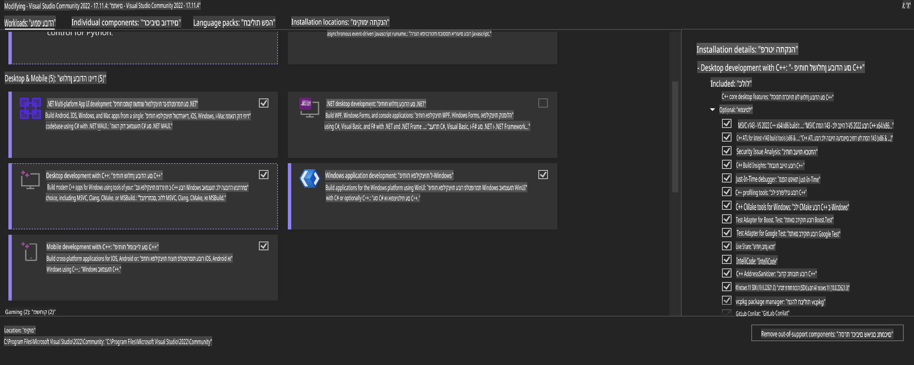
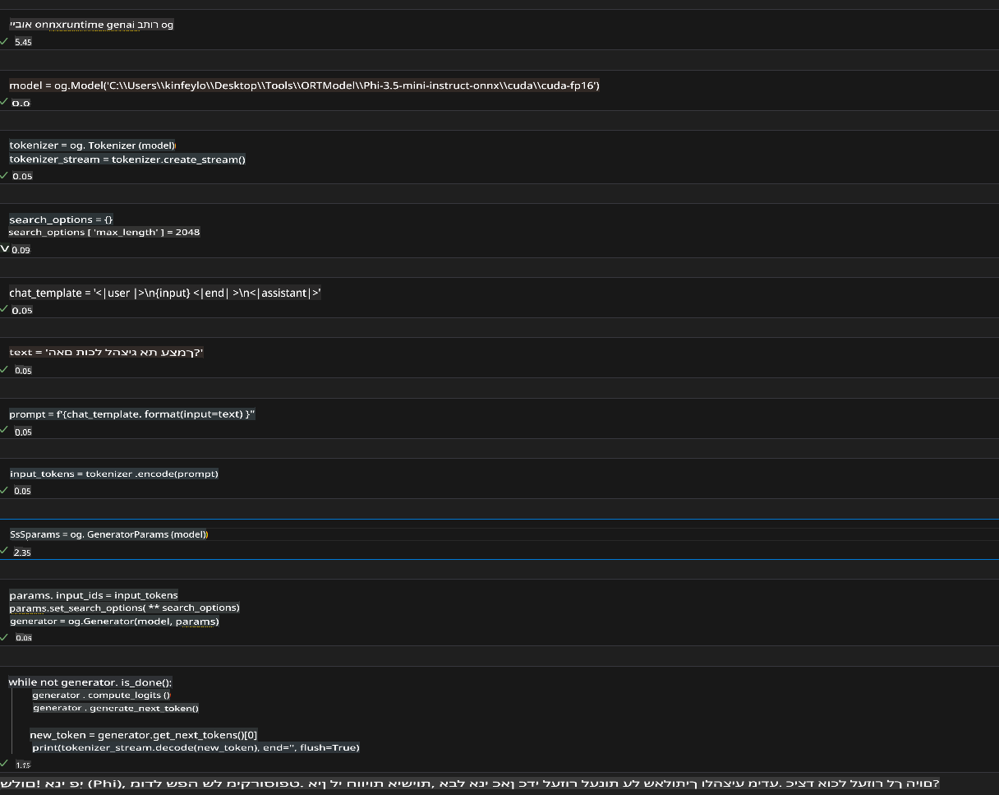
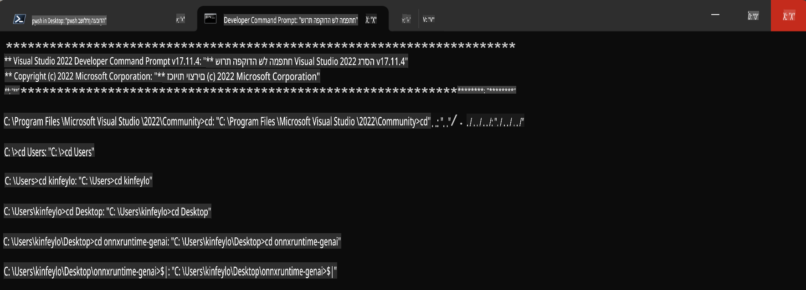

# **מדריך לשימוש ב-OnnxRuntime GenAI עם GPU ב-Windows**

מדריך זה מספק שלבים להגדרת ושימוש ב-ONNX Runtime (ORT) עם GPUs על Windows. המדריך נועד לעזור לך לנצל את האצת ה-GPU עבור המודלים שלך, ולשפר את הביצועים והיעילות.

המסמך כולל הנחיות בנושאים הבאים:

- הגדרת סביבה: הוראות להתקנת התלויות הנדרשות כמו CUDA, cuDNN ו-ONNX Runtime.
- קונפיגורציה: כיצד להגדיר את הסביבה ואת ONNX Runtime לניצול יעיל של משאבי GPU.
- טיפים לאופטימיזציה: עצות לכוונון הגדרות ה-GPU שלך להשגת ביצועים מיטביים.

### **1. Python 3.10.x /3.11.8**

   ***הערה*** מומלץ להשתמש ב-[miniforge](https://github.com/conda-forge/miniforge/releases/latest/download/Miniforge3-Windows-x86_64.exe) כסביבת Python שלך.

   ```bash

   conda create -n pydev python==3.11.8

   conda activate pydev

   ```

   ***תזכורת*** אם התקנת ספריות ONNX כלשהן עבור Python, יש להסיר אותן תחילה.

### **2. התקנת CMake באמצעות winget**

   ```bash

   winget install -e --id Kitware.CMake

   ```

### **3. התקנת Visual Studio 2022 - Desktop Development with C++**

   ***הערה*** אם אינך מעוניין לבצע קומפילציה, ניתן לדלג על שלב זה.



### **4. התקנת מנהל התקן NVIDIA**

1. **מנהל התקן GPU של NVIDIA**  [https://www.nvidia.com/en-us/drivers/](https://www.nvidia.com/en-us/drivers/)

2. **NVIDIA CUDA 12.4** [https://developer.nvidia.com/cuda-12-4-0-download-archive](https://developer.nvidia.com/cuda-12-4-0-download-archive)

3. **NVIDIA CUDNN 9.4**  [https://developer.nvidia.com/cudnn-downloads](https://developer.nvidia.com/cudnn-downloads)

***תזכורת*** יש להשתמש בהגדרות ברירת המחדל במהלך תהליך ההתקנה.

### **5. הגדרת סביבה של NVIDIA**

יש להעתיק את הקבצים של NVIDIA CUDNN 9.4 לתיקיות המתאימות של NVIDIA CUDA 12.4:

- העתק את הקבצים מ-*'C:\Program Files\NVIDIA\CUDNN\v9.4\bin\12.6'* ל-*'C:\Program Files\NVIDIA GPU Computing Toolkit\CUDA\v12.4\bin'*

- העתק את הקבצים מ-*'C:\Program Files\NVIDIA\CUDNN\v9.4\include\12.6'* ל-*'C:\Program Files\NVIDIA GPU Computing Toolkit\CUDA\v12.4\include'*

- העתק את הקבצים מ-*'C:\Program Files\NVIDIA\CUDNN\v9.4\lib\12.6'* ל-*'C:\Program Files\NVIDIA GPU Computing Toolkit\CUDA\v12.4\lib\x64'*

### **6. הורדת Phi-3.5-mini-instruct-onnx**

   ```bash

   winget install -e --id Git.Git

   winget install -e --id GitHub.GitLFS

   git lfs install

   git clone https://huggingface.co/microsoft/Phi-3.5-mini-instruct-onnx

   ```

### **7. הפעלת InferencePhi35Instruct.ipynb**

   פתח [Notebook](../../../../../../code/09.UpdateSamples/Aug/ortgpu-phi35-instruct.ipynb) ובצע את הקוד.



### **8. קומפילציה של ORT GenAI GPU**

   ***הערה*** 
   
   1. יש להסיר תחילה את כל ההתקנות הקשורות ל-onnx, onnxruntime ו-onnxruntime-genai.

   
   ```bash

   pip list 
   
   ```

   לאחר מכן, הסר את כל ספריות onnxruntime לדוגמה:

   ```bash

   pip uninstall onnxruntime

   pip uninstall onnxruntime-genai

   pip uninstall onnxruntume-genai-cuda
   
   ```

   2. בדוק את התמיכה של Visual Studio Extension.

   בדוק בנתיב C:\Program Files\NVIDIA GPU Computing Toolkit\CUDA\v12.4\extras לוודא שהתיקייה C:\Program Files\NVIDIA GPU Computing Toolkit\CUDA\v12.4\extras\visual_studio_integration קיימת. 
   
   אם לא נמצאה, בדוק תיקיות אחרות של CUDA Toolkit והעתק את התיקייה visual_studio_integration ותוכנה לנתיב C:\Program Files\NVIDIA GPU Computing Toolkit\CUDA\v12.4\extras\visual_studio_integration.

   - אם אינך מעוניין לבצע קומפילציה, ניתן לדלג על שלב זה.

   ```bash

   git clone https://github.com/microsoft/onnxruntime-genai

   ```

   - הורד [https://github.com/microsoft/onnxruntime/releases/download/v1.19.2/onnxruntime-win-x64-gpu-1.19.2.zip](https://github.com/microsoft/onnxruntime/releases/download/v1.19.2/onnxruntime-win-x64-gpu-1.19.2.zip).

   - חלץ את onnxruntime-win-x64-gpu-1.19.2.zip, ושנה את שם התיקייה ל-**ort**, ולאחר מכן העתק את תיקיית ort ל-onnxruntime-genai.

   - באמצעות Windows Terminal, עבור ל-Deveopler Command Prompt עבור VS 2022 ועבור לתיקיית onnxruntime-genai.



   - בצע קומפילציה עם סביבת ה-Python שלך.

   
   ```bash

   cd onnxruntime-genai

   python build.py --use_cuda  --cuda_home "C:\Program Files\NVIDIA GPU Computing Toolkit\CUDA\v12.4" --config Release
 

   cd build/Windows/Release/Wheel

   pip install .whl

   ```

**כתב ויתור**:  
מסמך זה תורגם באמצעות שירותי תרגום מבוססי בינה מלאכותית. למרות שאנו שואפים לדיוק, יש להיות מודעים לכך שתרגומים אוטומטיים עשויים להכיל שגיאות או אי-דיוקים. המסמך המקורי בשפתו המקורית יש לראות בו כמקור הסמכותי. למידע קריטי, מומלץ להשתמש בתרגום אנושי מקצועי. איננו נושאים באחריות לאי-הבנות או לפרשנויות שגויות הנובעות מהשימוש בתרגום זה.