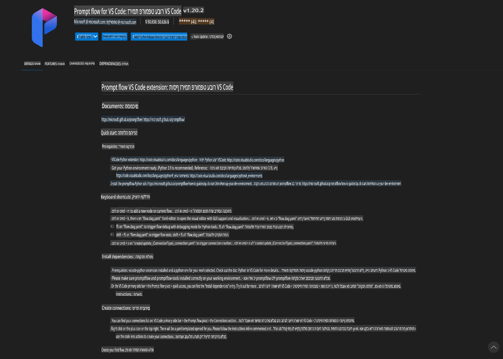
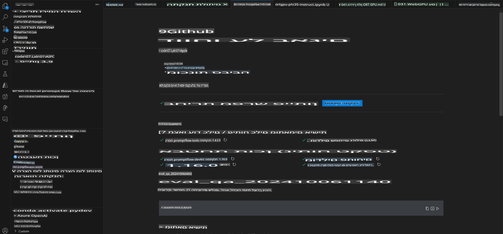
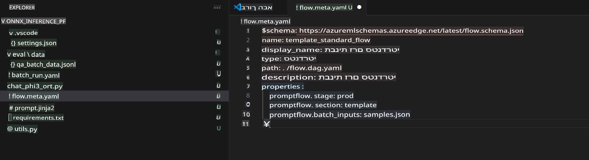
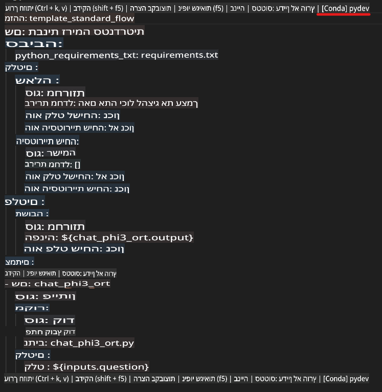
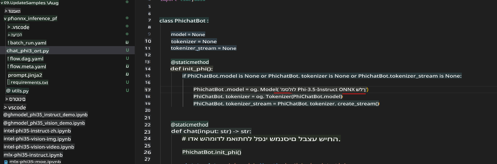
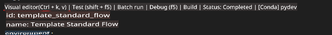
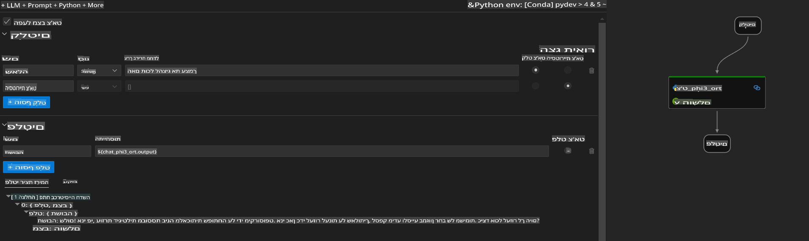
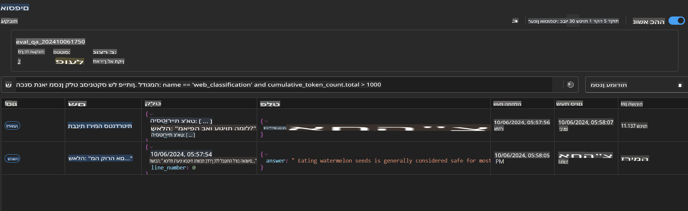

# שימוש ב-Windows GPU ליצירת פתרון Prompt flow עם Phi-3.5-Instruct ONNX

המסמך הבא הוא דוגמה לשימוש ב-PromptFlow עם ONNX (Open Neural Network Exchange) לפיתוח יישומי AI המבוססים על מודלים של Phi-3.

PromptFlow הוא סט כלים לפיתוח שנועד לפשט את תהליך הפיתוח המלא של יישומי AI מבוססי מודלים גדולים (LLM), החל משלב הרעיון והאב-טיפוס ועד לבדיקות והערכה.

באמצעות שילוב של PromptFlow עם ONNX, מפתחים יכולים:

- **לייעל ביצועי מודלים**: לנצל את ONNX לביצוע מודלים בצורה יעילה ולהטמעה.
- **לפשט את תהליך הפיתוח**: להשתמש ב-PromptFlow לניהול תהליכי עבודה ואוטומציה של משימות חוזרות.
- **לשפר שיתוף פעולה**: להקל על שיתוף פעולה בין חברי הצוות באמצעות סביבת פיתוח מאוחדת.

**Prompt flow** הוא סט כלים לפיתוח שנועד לפשט את תהליך הפיתוח המלא של יישומי AI מבוססי מודלים גדולים, החל משלב הרעיון, האב-טיפוס, הבדיקות וההערכה ועד לפריסה ומעקב בייצור. הוא הופך את תהליך הנדסת הפרומפטים לקל יותר ומאפשר בניית אפליקציות LLM באיכות ייצור.

Prompt flow יכול להתחבר ל-OpenAI, Azure OpenAI Service, ולמודלים מותאמים אישית (Huggingface, מודלים מקומיים LLM/SLM). אנו מקווים לפרוס את מודל Phi-3.5 המכווץ בפורמט ONNX ליישומים מקומיים. Prompt flow יכול לעזור לנו לתכנן טוב יותר את העסק שלנו ולהשלים פתרונות מקומיים המבוססים על Phi-3.5. בדוגמה זו, נשלב את ONNX Runtime GenAI Library כדי להשלים את פתרון ה-Prompt flow המבוסס על Windows GPU.

## **התקנה**

### **ONNX Runtime GenAI עבור Windows GPU**

קראו את המדריך הבא כדי להגדיר את ONNX Runtime GenAI עבור Windows GPU [לחצו כאן](./ORTWindowGPUGuideline.md)

### **הגדרת Prompt flow ב-VSCode**

1. התקינו את הרחבת Prompt flow ל-VS Code



2. לאחר התקנת הרחבת Prompt flow ל-VS Code, לחצו על ההרחבה ובחרו **Installation dependencies**. עקבו אחרי המדריך כדי להתקין את ה-SDK של Prompt flow בסביבה שלכם.



3. הורידו [קוד לדוגמה](../../../../../../code/09.UpdateSamples/Aug/pf/onnx_inference_pf) ופתחו אותו ב-VS Code.



4. פתחו את **flow.dag.yaml** כדי לבחור את סביבת ה-Python שלכם.



   פתחו את **chat_phi3_ort.py** כדי לשנות את מיקום מודל Phi-3.5-instruct ONNX.



5. הריצו את ה-Prompt flow שלכם לבדיקה.

פתחו את **flow.dag.yaml** ולחצו על עורך ויזואלי.



לאחר הלחיצה, הריצו אותו לבדיקה.



1. תוכלו להריץ אצווה (batch) בטרמינל כדי לבדוק תוצאות נוספות.

```bash

pf run create --file batch_run.yaml --stream --name 'Your eval qa name'    

```

תוכלו לבדוק את התוצאות בדפדפן ברירת המחדל שלכם.



**כתב ויתור**:  
מסמך זה תורגם באמצעות שירותי תרגום מבוססי בינה מלאכותית. למרות שאנו שואפים לדיוק, יש לקחת בחשבון שתרגומים אוטומטיים עשויים להכיל שגיאות או אי-דיוקים. המסמך המקורי בשפתו המקורית צריך להיחשב כמקור הסמכותי. למידע קריטי, מומלץ להשתמש בשירותי תרגום אנושיים מקצועיים. איננו נושאים באחריות לאי-הבנות או לפרשנויות שגויות הנובעות משימוש בתרגום זה.