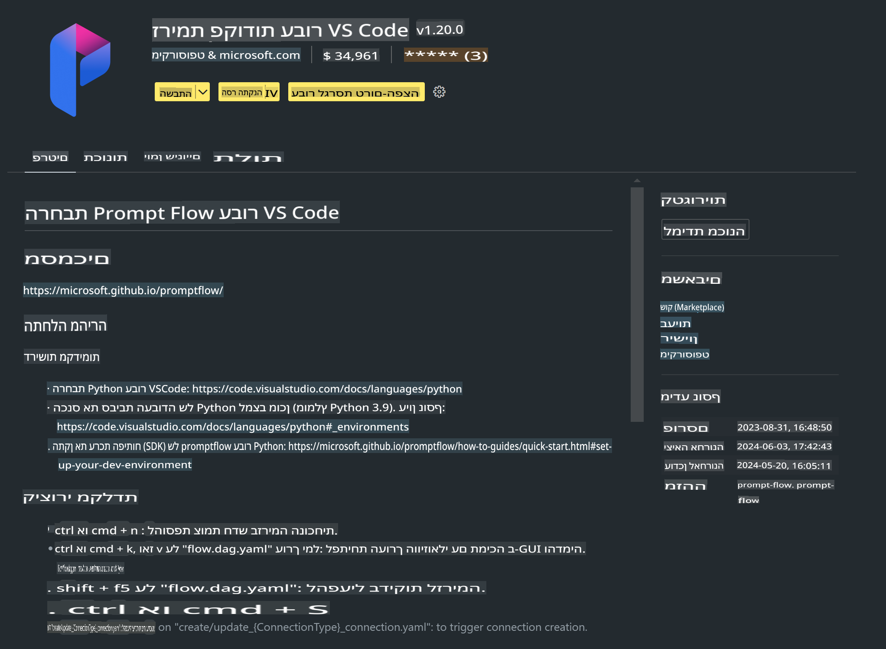

# **מעבדה 0 - התקנה**

כשנכנסים למעבדה, יש להגדיר את הסביבה הרלוונטית:

### **1. Python 3.11+**

מומלץ להשתמש ב-miniforge כדי להגדיר את סביבת ה-Python שלך.

כדי להגדיר את miniforge, אנא עיין ב-[https://github.com/conda-forge/miniforge](https://github.com/conda-forge/miniforge)

לאחר הגדרת miniforge, הרץ את הפקודה הבאה ב-Power Shell:

```bash

conda create -n pyenv python==3.11.8 -y

conda activate pyenv

```

### **2. התקנת Prompt flow SDK**

במעבדה 1, נשתמש ב-Prompt flow, לכן עליך להגדיר את Prompt flow SDK.

```bash

pip install promptflow --upgrade

```

תוכל לבדוק את Prompt flow SDK באמצעות הפקודה הבאה:

```bash

pf --version

```

### **3. התקנת הרחבת Prompt flow ל-Visual Studio Code**



### **4. ספריית האצה NPU של אינטל**

מעבדי הדור החדש של אינטל תומכים ב-NPU. אם ברצונך להשתמש ב-NPU כדי להריץ LLMs / SLMs באופן מקומי, תוכל להשתמש ב-***Intel NPU Acceleration Library***. למידע נוסף, תוכל לעיין ב-[https://github.com/microsoft/PhiCookBook/blob/main/md/01.Introduction/03/AIPC_Inference.md](https://github.com/microsoft/PhiCookBook/blob/main/md/01.Introduction/03/AIPC_Inference.md).

התקן את ספריית ההאצה של אינטל ב-bash:

```bash

pip install intel-npu-acceleration-library

```

***הערה***: שים לב שספרייה זו תומכת בגרסה ***4.40.2*** של transformers, אנא וודא את הגרסה.

### **5. ספריות Python נוספות**

צור קובץ requirements.txt והוסף את התוכן הבא:

```txt

notebook
numpy 
scipy 
scikit-learn 
matplotlib 
pandas 
pillow 
graphviz

```

### **6. התקנת NVM**

התקן nvm ב-Powershell:

```bash

winget install -e --id CoreyButler.NVMforWindows

```

התקן את nodejs 18.20:

```bash

nvm install 18.20.0

nvm use 18.20.0

```

### **7. התקנת תמיכה בפיתוח ב-Visual Studio Code**

```bash

npm install --global yo generator-code

```

מזל טוב! סיימת בהצלחה את הגדרת ה-SDK. כעת, המשך לשלבים המעשיים.

**כתב ויתור**:  
מסמך זה תורגם באמצעות שירותי תרגום מבוססי בינה מלאכותית. למרות שאנו שואפים לדיוק, יש לקחת בחשבון שתרגומים אוטומטיים עשויים לכלול טעויות או אי-דיוקים. המסמך המקורי בשפתו המקורית צריך להיחשב כמקור הסמכותי. למידע קריטי, מומלץ להשתמש בתרגום מקצועי על ידי אדם. איננו אחראים לאי-הבנות או לפרשנויות שגויות הנובעות מהשימוש בתרגום זה.