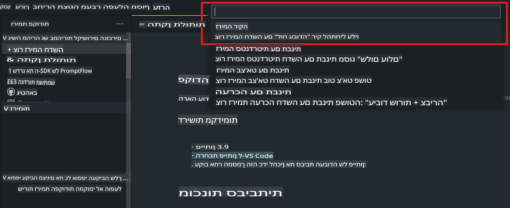
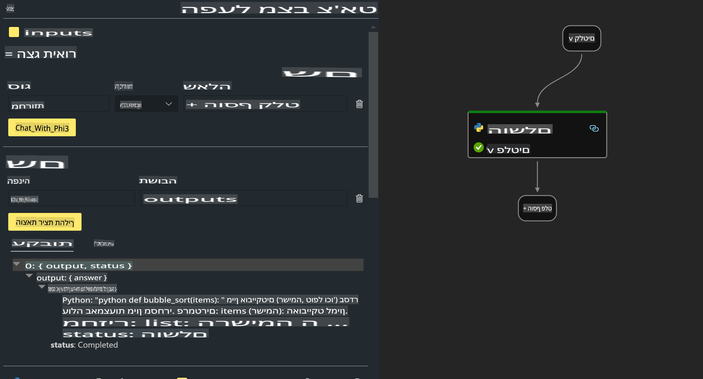

# **מעבדה 2 - הרצת Prompt flow עם Phi-3-mini ב-AIPC**

## **מהו Prompt flow**

Prompt flow הוא סט כלים לפיתוח שנועד לפשט את מחזור הפיתוח המלא של יישומי AI מבוססי LLM, החל מרעיונאות, יצירת אב-טיפוס, בדיקות, הערכה ועד לפריסה בייצור וניטור. הכלי מקל על הנדסת פרומפטים ומאפשר לבנות אפליקציות LLM באיכות ייצור.

עם Prompt flow, תוכלו:

- ליצור תהליכים שמקשרים בין LLMs, פרומפטים, קוד Python וכלים נוספים בתהליך עבודה שניתן להריץ.

- לנטר ולשפר את התהליכים שלכם, במיוחד את האינטראקציה עם LLMs, בצורה פשוטה.

- להעריך את התהליכים, לחשב מדדי איכות וביצועים עם מערכי נתונים גדולים.

- לשלב את הבדיקות וההערכות במערכת CI/CD שלכם כדי להבטיח את איכות התהליך.

- לפרוס את התהליכים לפלטפורמת ההרצה שבחרתם או לשלבם בקלות בבסיס הקוד של האפליקציה שלכם.

- (אופציונלי אך מומלץ מאוד) לשתף פעולה עם הצוות שלכם באמצעות גרסת הענן של Prompt flow ב-Azure AI.


## **בניית תהליכי יצירת קוד על Apple Silicon**

***הערה***: אם לא השלמתם את התקנת הסביבה, בקרו ב-[מעבדה 0 - התקנות](./01.Installations.md)

1. פתחו את תוסף Prompt flow ב-Visual Studio Code וצרו פרויקט תהליך ריק.



2. הוסיפו פרמטרים של קלט ופלט והוסיפו קוד Python כתהליך חדש.



ניתן להיעזר במבנה הזה (flow.dag.yaml) כדי לבנות את התהליך שלכם:

```yaml

inputs:
  prompt:
    type: string
    default: Write python code for Fibonacci serie. Please use markdown as output
outputs:
  result:
    type: string
    reference: ${gen_code_by_phi3.output}
nodes:
- name: gen_code_by_phi3
  type: python
  source:
    type: code
    path: gen_code_by_phi3.py
  inputs:
    prompt: ${inputs.prompt}


```

3. כימות phi-3-mini

כדי להפעיל SLM טוב יותר על מכשירים מקומיים, לרוב אנו מכמתים את המודל (INT4, FP16, FP32).

```bash

python -m mlx_lm.convert --hf-path microsoft/Phi-3-mini-4k-instruct

```

**הערה:** תיקיית ברירת המחדל היא mlx_model.

4. הוסיפו קוד ב-***Chat_With_Phi3.py***

```python


from promptflow import tool

from mlx_lm import load, generate


# The inputs section will change based on the arguments of the tool function, after you save the code
# Adding type to arguments and return value will help the system show the types properly
# Please update the function name/signature per need
@tool
def my_python_tool(prompt: str) -> str:

    model_id = './mlx_model_phi3_mini'

    model, tokenizer = load(model_id)

    # <|user|>\nWrite python code for Fibonacci serie. Please use markdown as output<|end|>\n<|assistant|>

    response = generate(model, tokenizer, prompt="<|user|>\n" + prompt  + "<|end|>\n<|assistant|>", max_tokens=2048, verbose=True)

    return response


```

4. ניתן לבדוק את התהליך מ-Debug או Run כדי לוודא שיצירת הקוד פועלת כהלכה.


5. הריצו את התהליך כ-API פיתוח דרך הטרמינל.

```

pf flow serve --source ./ --port 8080 --host localhost   

```

ניתן לבדוק זאת ב-Postman / Thunder Client.


### **הערות**

1. ההרצה הראשונה אורכת זמן רב. מומלץ להוריד את מודל phi-3 מ-Hugging face CLI.

2. בהתחשב בכוח העיבוד המוגבל של Intel NPU, מומלץ להשתמש ב-Phi-3-mini-4k-instruct.

3. אנו משתמשים בהאצת Intel NPU לכימות המרה ל-INT4, אך אם תריצו את השירות מחדש, יש למחוק את התיקיות cache ו-nc_workshop.


## **משאבים**

1. למדו על Promptflow [https://microsoft.github.io/promptflow/](https://microsoft.github.io/promptflow/)

2. למדו על האצת Intel NPU [https://github.com/intel/intel-npu-acceleration-library](https://github.com/intel/intel-npu-acceleration-library)

3. דוגמת קוד, הורידו [Local NPU Agent Sample Code](../../../../../../../../../code/07.Lab/01/AIPC/local-npu-agent)

**כתב ויתור**:  
מסמך זה תורגם באמצעות שירותי תרגום מבוססי בינה מלאכותית. למרות שאנו שואפים לדיוק, יש לקחת בחשבון שתרגומים אוטומטיים עשויים להכיל שגיאות או אי-דיוקים. יש להתייחס למסמך המקורי בשפתו המקורית כמקור הסמכותי. למידע קריטי, מומלץ להשתמש בתרגום מקצועי על ידי אדם. איננו נושאים באחריות לאי-הבנות או לפרשנויות שגויות הנובעות משימוש בתרגום זה.