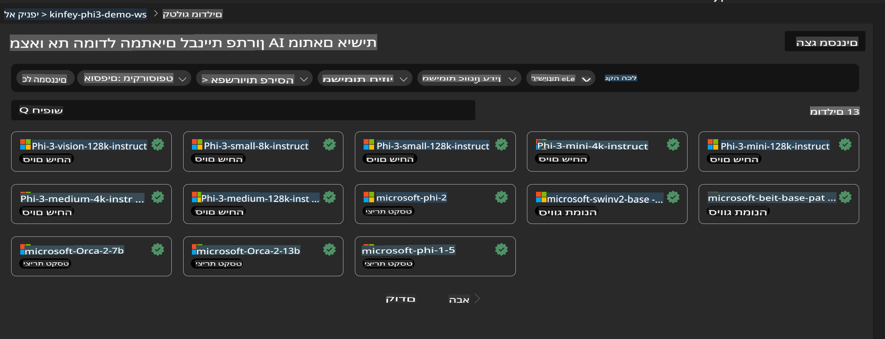
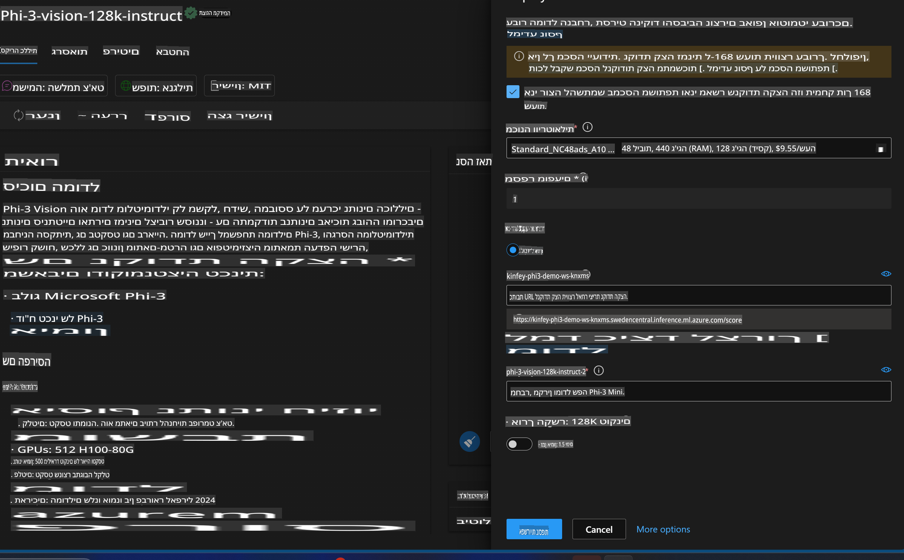

# **מעבדה 3 - פריסת Phi-3-Vision בשירות Azure Machine Learning**

אנחנו משתמשים ב-NPU להשלמת פריסת הקוד המקומי לסביבת ייצור, ולאחר מכן רוצים להוסיף את היכולת של PHI-3-VISION כדי להפוך תמונות לקוד.

בהדרכה זו, נלמד כיצד להקים במהירות שירות Phi-3 Vision כמודל כשירות (Model As Service) ב-Azure Machine Learning Service.

***Note***: Phi-3 Vision דורש כוח חישוב כדי לייצר תוכן במהירות גבוהה יותר. אנו זקוקים לכוח חישוב בענן שיעזור לנו להשיג זאת.

### **1. יצירת Azure Machine Learning Service**

יש ליצור Azure Machine Learning Service בפורטל Azure. אם אתם רוצים ללמוד כיצד לעשות זאת, בקרו בקישור הבא: [https://learn.microsoft.com/azure/machine-learning/quickstart-create-resources?view=azureml-api-2](https://learn.microsoft.com/azure/machine-learning/quickstart-create-resources?view=azureml-api-2)

### **2. בחירת Phi-3 Vision ב-Azure Machine Learning Service**



### **3. פריסת Phi-3-Vision ב-Azure**



### **4. בדיקת Endpoint ב-Postman**


***Note***

1. הפרמטרים שיש להעביר חייבים לכלול Authorization, azureml-model-deployment, ו-Content-Type. יש לבדוק את פרטי הפריסה כדי לקבל אותם.

2. להעברת פרמטרים, Phi-3-Vision דורש העברת קישור לתמונה. אנא עיינו בשיטה של GPT-4-Vision להעברת פרמטרים, לדוגמה:

```json

{
  "input_data":{
    "input_string":[
      {
        "role":"user",
        "content":[ 
          {
            "type": "text",
            "text": "You are a Python coding assistant.Please create Python code for image "
          },
          {
              "type": "image_url",
              "image_url": {
                "url": "https://ajaytech.co/wp-content/uploads/2019/09/index.png"
              }
          }
        ]
      }
    ],
    "parameters":{
          "temperature": 0.6,
          "top_p": 0.9,
          "do_sample": false,
          "max_new_tokens": 2048
    }
  }
}

```

3. יש לקרוא ל-**/score** באמצעות שיטת Post.

**מזל טוב**! השלמתם את פריסת PHI-3-VISION במהירות וניסיתם כיצד להשתמש בתמונות כדי לייצר קוד. כעת, ניתן לבנות יישומים המשלבים בין NPU לענן.

**כתב ויתור**:  
מסמך זה תורגם באמצעות שירותי תרגום מבוססי בינה מלאכותית. למרות שאנו שואפים לדיוק, יש להיות מודעים לכך שתרגומים אוטומטיים עשויים לכלול שגיאות או אי-דיוקים. המסמך המקורי בשפתו המקורית צריך להיחשב כמקור הסמכותי. למידע קריטי, מומלץ להשתמש בתרגום מקצועי על ידי בני אדם. אנו לא נושאים באחריות לאי-הבנות או לפרשנויות שגויות הנובעות משימוש בתרגום זה.