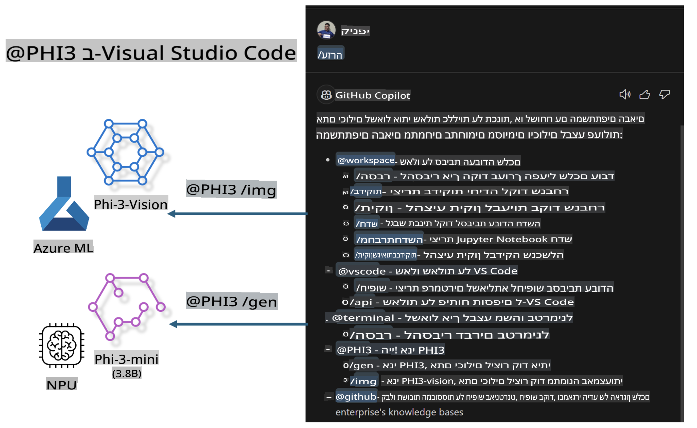

# **בנה את Visual Studio Code GitHub Copilot Chat שלך עם משפחת Microsoft Phi-3**

האם השתמשת בסוכן ה-Workspace בצ'אט של GitHub Copilot? האם אתה רוצה לבנות סוכן קוד מותאם לצוות שלך? המעבדה המעשית הזו נועדה לשלב את המודל בקוד פתוח כדי לבנות סוכן עסקי ברמת הארגון.

## **יסודות**

### **למה לבחור ב-Microsoft Phi-3**

Phi-3 היא סדרה משפחתית, הכוללת את phi-3-mini, phi-3-small ו-phi-3-medium, המבוססים על פרמטרי אימון שונים ליצירת טקסט, השלמת דיאלוגים ויצירת קוד. בנוסף, יש גם את phi-3-vision המבוסס על Vision. המודל מתאים לארגונים או לצוותים שונים ליצירת פתרונות AI גנרטיביים שאינם מחוברים לאינטרנט.

מומלץ לקרוא את הקישור הבא: [https://github.com/microsoft/PhiCookBook/blob/main/md/01.Introduction/01/01.PhiFamily.md](https://github.com/microsoft/PhiCookBook/blob/main/md/01.Introduction/01/01.PhiFamily.md)

### **Microsoft GitHub Copilot Chat**

ההרחבה GitHub Copilot Chat מספקת ממשק צ'אט שמאפשר לך לתקשר עם GitHub Copilot ולקבל תשובות לשאלות הקשורות לקוד ישירות בתוך VS Code, מבלי שתצטרך לחפש בתיעוד או בפורומים מקוונים.

Copilot Chat עשוי להשתמש בהדגשת תחביר, הזחה ותכונות עיצוב אחרות כדי להבהיר את התשובה שנוצרת. בהתאם לסוג השאלה של המשתמש, התוצאה עשויה לכלול קישורים להקשר שבו Copilot השתמש ליצירת התשובה, כמו קבצי קוד מקור או תיעוד, או כפתורים לגישה לפונקציות ב-VS Code.

- Copilot Chat משתלב בתהליך העבודה של המפתח ומספק עזרה היכן שצריך:

- פתח שיחת צ'אט ישירה מתוך העורך או הטרמינל לקבלת עזרה בזמן כתיבת קוד

- השתמש בתצוגת הצ'אט כדי לקבל עוזר AI זמין בכל רגע

- הפעל Quick Chat כדי לשאול שאלה מהירה ולחזור לעבודה שלך

ניתן להשתמש ב-GitHub Copilot Chat במגוון תרחישים, כמו:

- מענה על שאלות קוד כיצד לפתור בעיה בצורה הטובה ביותר

- הסבר על קוד של מישהו אחר והצעת שיפורים

- הצעת תיקונים לקוד

- יצירת מקרי בדיקה ליחידות

- יצירת תיעוד לקוד

מומלץ לקרוא את הקישור הבא: [https://code.visualstudio.com/docs/copilot/copilot-chat](https://code.visualstudio.com/docs/copilot/copilot-chat?WT.mc_id=aiml-137032-kinfeylo)

### **Microsoft GitHub Copilot Chat @workspace**

הפניה ל-**@workspace** בצ'אט של Copilot מאפשרת לך לשאול שאלות על כל בסיס הקוד שלך. בהתאם לשאלה, Copilot שולף בצורה חכמה קבצים וסמלים רלוונטיים, ומציג אותם בתשובותיו כקישורים ודוגמאות קוד.

כדי לענות על שאלתך, **@workspace** מחפש באותם מקורות שבהם מפתח היה משתמש בזמן ניווט בבסיס קוד ב-VS Code:

- כל הקבצים ב-Workspace, למעט קבצים שהתעלמו מהם באמצעות קובץ .gitignore

- מבנה ספריות עם שמות תיקיות וקבצים מקוננים

- אינדקס החיפוש בקוד של GitHub, אם ה-Workspace הוא מאגר GitHub שמאונדקס על ידי חיפוש קוד

- סמלים והגדרות ב-Workspace

- טקסט שנבחר כרגע או טקסט גלוי בעורך הפעיל

שימו לב: קובץ .gitignore מתעלם אם פתחת קובץ או בחרת טקסט בתוך קובץ שהתעלמו ממנו.

מומלץ לקרוא את הקישור הבא: [https://code.visualstudio.com/docs/copilot/copilot-chat](https://code.visualstudio.com/docs/copilot/workspace-context?WT.mc_id=aiml-137032-kinfeylo)

## **מידע נוסף על המעבדה**

GitHub Copilot שיפר בצורה משמעותית את יעילות התכנות בארגונים, וכל ארגון מקווה להתאים אישית את הפונקציות הרלוונטיות של GitHub Copilot. ארגונים רבים התאימו אישית הרחבות דומות ל-GitHub Copilot בהתבסס על תרחישי העסק שלהם ומודלים בקוד פתוח. עבור ארגונים, הרחבות מותאמות אישית קלות יותר לשליטה, אך זה גם משפיע על חוויית המשתמש. אחרי הכל, ל-GitHub Copilot יש פונקציות חזקות יותר בהתמודדות עם תרחישים כלליים ומקצועיים. אם ניתן לשמור על חוויית משתמש עקבית, עדיף להתאים אישית את ההרחבה של הארגון. GitHub Copilot Chat מספק API רלוונטיים לארגונים להרחבה בחוויית הצ'אט. שמירה על חוויה עקבית וקיום פונקציות מותאמות אישית יוצרת חוויית משתמש טובה יותר.

המעבדה הזו משתמשת בעיקר במודל Phi-3 בשילוב עם NPU מקומי ואינטגרציה עם Azure כדי לבנות סוכן מותאם אישית בצ'אט של GitHub Copilot ***@PHI3*** כדי לסייע למפתחים ארגוניים ביצירת קוד ***(@PHI3 /gen)*** ויצירת קוד מתמונות ***(@PHI3 /img)***.

### ***הערה:*** 

המעבדה הזו מיושמת כרגע ב-AIPC של מעבדי Intel וב-Apple Silicon. אנו נמשיך לעדכן את גרסת ה-NPU של Qualcomm.

## **מעבדה**

| שם | תיאור | AIPC | Apple |
| ------------ | ----------- | -------- |-------- |
| Lab0 - התקנות(✅) | הגדרת והתקנת סביבות וכלי התקנה רלוונטיים | [Go](./HOL/AIPC/01.Installations.md) |[Go](./HOL/Apple/01.Installations.md) |
| Lab1 - הפעלת Prompt flow עם Phi-3-mini (✅) | בשילוב עם AIPC / Apple Silicon, יצירת קוד באמצעות Phi-3-mini עם NPU מקומי | [Go](./HOL/AIPC/02.PromptflowWithNPU.md) |  [Go](./HOL/Apple/02.PromptflowWithMLX.md) |
| Lab2 - פריסת Phi-3-vision על Azure Machine Learning Service(✅) | יצירת קוד על ידי פריסת Phi-3-vision עם קטלוג המודלים של Azure Machine Learning Service | [Go](./HOL/AIPC/03.DeployPhi3VisionOnAzure.md) |[Go](./HOL/Apple/03.DeployPhi3VisionOnAzure.md) |
| Lab3 - יצירת סוכן @phi-3 ב-GitHub Copilot Chat(✅)  | יצירת סוכן Phi-3 מותאם אישית ב-GitHub Copilot Chat ליצירת קוד, יצירת גרפים, RAG ועוד | [Go](./HOL/AIPC/04.CreatePhi3AgentInVSCode.md) | [Go](./HOL/Apple/04.CreatePhi3AgentInVSCode.md) |
| קוד לדוגמה (✅)  | הורדת קוד לדוגמה | [Go](../../../../../../../code/07.Lab/01/AIPC) | [Go](../../../../../../../code/07.Lab/01/Apple) |

## **משאבים**

1. Phi-3 Cookbook [https://github.com/microsoft/Phi-3CookBook](https://github.com/microsoft/Phi-3CookBook)

2. למידע נוסף על GitHub Copilot [https://learn.microsoft.com/training/paths/copilot/](https://learn.microsoft.com/training/paths/copilot/?WT.mc_id=aiml-137032-kinfeylo)

3. למידע נוסף על GitHub Copilot Chat [https://learn.microsoft.com/training/paths/accelerate-app-development-using-github-copilot/](https://learn.microsoft.com/training/paths/accelerate-app-development-using-github-copilot/?WT.mc_id=aiml-137032-kinfeylo)

4. למידע נוסף על GitHub Copilot Chat API [https://code.visualstudio.com/api/extension-guides/chat](https://code.visualstudio.com/api/extension-guides/chat?WT.mc_id=aiml-137032-kinfeylo)

5. למידע נוסף על Azure AI Foundry [https://learn.microsoft.com/training/paths/create-custom-copilots-ai-studio/](https://learn.microsoft.com/training/paths/create-custom-copilots-ai-studio/?WT.mc_id=aiml-137032-kinfeylo)

6. למידע נוסף על קטלוג המודלים של Azure AI Foundry [https://learn.microsoft.com/azure/ai-studio/how-to/model-catalog-overview](https://learn.microsoft.com/azure/ai-studio/how-to/model-catalog-overview)

**כתב ויתור**:  
מסמך זה תורגם באמצעות שירותי תרגום מבוססי בינה מלאכותית. למרות שאנו שואפים לדיוק, יש לקחת בחשבון שתרגומים אוטומטיים עלולים להכיל שגיאות או אי-דיוקים. המסמך המקורי בשפתו המקורית צריך להיחשב כמקור הסמכותי. למידע קריטי, מומלץ להשתמש בתרגום אנושי מקצועי. אנו לא נושאים באחריות לאי-הבנות או לפרשנויות שגויות הנובעות משימוש בתרגום זה.