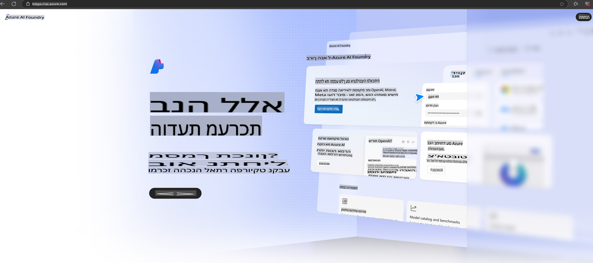

# **שימוש ב-Phi-3 ב-Azure AI Foundry**

עם ההתפתחות של Generative AI, אנו שואפים להשתמש בפלטפורמה אחידה לניהול מודלים גדולים לשפה (LLM) ומודלים קטנים לשפה (SLM), אינטגרציה של נתוני ארגון, פעולות Fine-tuning/RAG, והערכת עסקים ארגוניים לאחר שילוב של LLM ו-SLM, כך שיישומי AI יצירתיים יוכלו להיות מיושמים בצורה חכמה יותר. [Azure AI Foundry](https://ai.azure.com) היא פלטפורמה ארגונית ליישומי Generative AI.

עם Azure AI Foundry, ניתן להעריך תגובות של מודלים גדולים לשפה (LLM) ולבצע תזמור של רכיבי אפליקציות בעזרת Prompt Flow לשיפור ביצועים. הפלטפורמה מאפשרת גמישות והרחבה להפיכת Proof of Concepts למערכות ייצור מלאות בקלות. ניטור ושיפור מתמשכים תומכים בהצלחה לטווח ארוך.

ניתן לפרוס את מודל Phi-3 במהירות ב-Azure AI Foundry בעזרת מספר שלבים פשוטים, ולאחר מכן להשתמש ב-Azure AI Foundry להשלמת פעולות כמו Playground/Chat, Fine-tuning, הערכה ועוד.

## **1. הכנה**

אם כבר התקנתם את [Azure Developer CLI](https://learn.microsoft.com/azure/developer/azure-developer-cli/overview?WT.mc_id=aiml-138114-kinfeylo) במחשב שלכם, השימוש בתבנית זו פשוט כמו הרצת הפקודה הזו בתיקייה חדשה.

## יצירה ידנית

יצירת פרויקט ומרכז ב-Azure AI Foundry היא דרך מצוינת לארגן ולנהל את עבודת ה-AI שלכם. הנה מדריך שלב אחר שלב להתחלה:

### יצירת פרויקט ב-Azure AI Foundry

1. **היכנסו ל-Azure AI Foundry**: התחברו לפורטל Azure AI Foundry.
2. **צרו פרויקט**:
   - אם אתם נמצאים בפרויקט, לחצו על "Azure AI Foundry" בפינה השמאלית העליונה של העמוד כדי לחזור לדף הבית.
   - בחרו ב-"Create project+".
   - הזינו שם לפרויקט.
   - אם יש לכם Hub, הוא ייבחר כברירת מחדל. אם יש לכם גישה ליותר מ-Hub אחד, תוכלו לבחור Hub אחר מהרשימה. אם ברצונכם ליצור Hub חדש, בחרו "Create new hub" והזינו שם.
   - לחצו על "Create".

### יצירת Hub ב-Azure AI Foundry

1. **היכנסו ל-Azure AI Foundry**: התחברו עם חשבון Azure שלכם.
2. **צרו Hub**:
   - בחרו במרכז הניהול מהתפריט השמאלי.
   - בחרו "All resources", ולאחר מכן החץ ליד "+ New project" ובחרו "+ New hub".
   - בחלון "Create a new hub", הזינו שם ל-Hub שלכם (לדוגמה, contoso-hub) ושנו שדות נוספים לפי הצורך.
   - לחצו על "Next", בדקו את המידע ולחצו על "Create".

למידע מפורט יותר, ניתן לעיין ב-[תיעוד הרשמי של Microsoft](https://learn.microsoft.com/azure/ai-studio/how-to/create-projects).

לאחר יצירה מוצלחת, תוכלו לגשת לסטודיו שיצרתם דרך [ai.azure.com](https://ai.azure.com/).

ב-AI Foundry יכולים להיות מספר פרויקטים. צרו פרויקט ב-AI Foundry כהכנה.

צרו [QuickStarts של Azure AI Foundry](https://learn.microsoft.com/azure/ai-studio/quickstarts/get-started-code)

## **2. פריסת מודל Phi ב-Azure AI Foundry**

לחצו על אפשרות Explore בפרויקט כדי להיכנס לקטלוג המודלים ובחרו Phi-3.

בחרו Phi-3-mini-4k-instruct.

לחצו על 'Deploy' כדי לפרוס את מודל Phi-3-mini-4k-instruct.

> [!NOTE]
>
> ניתן לבחור עוצמת מחשוב בעת הפריסה.

## **3. Playground Chat Phi ב-Azure AI Foundry**

גשו לעמוד הפריסה, בחרו Playground, ושוחחו עם Phi-3 של Azure AI Foundry.

## **4. פריסת מודל מתוך Azure AI Foundry**

כדי לפרוס מודל מתוך קטלוג המודלים של Azure, תוכלו לבצע את השלבים הבאים:

- התחברו ל-Azure AI Foundry.
- בחרו את המודל שברצונכם לפרוס מתוך קטלוג המודלים של Azure AI Foundry.
- בעמוד הפרטים של המודל, בחרו Deploy ולאחר מכן בחרו Serverless API עם Azure AI Content Safety.
- בחרו את הפרויקט שבו תרצו לפרוס את המודלים שלכם. כדי להשתמש בהצעת Serverless API, ה-Workspace שלכם חייב להיות באזור East US 2 או Sweden Central. ניתן להתאים אישית את שם הפריסה.
- באשף הפריסה, בחרו Pricing and terms כדי ללמוד על התמחור ותנאי השימוש.
- לחצו על Deploy. המתינו עד שהפריסה תהיה מוכנה ותועברו לעמוד Deployments.
- בחרו Open in playground כדי להתחיל אינטראקציה עם המודל.
- תוכלו לחזור לעמוד Deployments, לבחור בפריסה, ולציין את Target URL ואת Secret Key של ה-EndPoint, שתוכלו להשתמש בהם כדי לקרוא לפריסה וליצור תגובות.
- תמיד ניתן למצוא את פרטי ה-EndPoint, URL ומפתחות הגישה על ידי ניווט ללשונית Build ובחירה ב-Deployments מתוך רכיב Components.

> [!NOTE]
> שימו לב שלחשבונכם חייבות להיות הרשאות Azure AI Developer על קבוצת המשאבים כדי לבצע שלבים אלו.

## **5. שימוש ב-API של Phi ב-Azure AI Foundry**

תוכלו לגשת לכתובת https://{Your project name}.region.inference.ml.azure.com/swagger.json דרך Postman GET ולשלב אותה עם מפתח (Key) כדי ללמוד על הממשקים הקיימים.

תוכלו לקבל בקלות את פרמטרי הבקשה ואת פרמטרי התגובה.

**כתב ויתור**:  
מסמך זה תורגם באמצעות שירותי תרגום מבוססי בינה מלאכותית. למרות שאנו שואפים לדיוק, יש להיות מודעים לכך שתרגומים אוטומטיים עשויים להכיל שגיאות או אי-דיוקים. המסמך המקורי בשפתו המקורית ייחשב כמקור הסמכותי. למידע קריטי, מומלץ להשתמש בשירותי תרגום אנושיים מקצועיים. איננו נושאים באחריות לאי-הבנות או לפרשנויות שגויות הנובעות משימוש בתרגום זה.