# כיוונון עדין של Phi-3 עם Azure AI Foundry

בואו נחקור כיצד לבצע כיוונון עדין למודל השפה Phi-3 Mini של מיקרוסופט באמצעות Azure AI Foundry. כיוונון עדין מאפשר להתאים את Phi-3 Mini למשימות ספציפיות, ולהפוך אותו לעוצמתי ומודע יותר להקשר.

## שיקולים

- **יכולות:** אילו מודלים ניתנים לכיוונון עדין? למה ניתן להתאים את המודל הבסיסי?
- **עלות:** מהו מודל התמחור עבור כיוונון עדין?
- **התאמה אישית:** עד כמה ניתן לשנות את המודל הבסיסי – ובאילו דרכים?
- **נוחות:** איך מתבצע הכיוונון העדין בפועל – האם צריך לכתוב קוד מותאם אישית? האם צריך להביא משאבי מחשוב משלך?
- **בטיחות:** ידוע שמודלים שעברו כיוונון עדין עלולים להוות סיכונים בטיחותיים – האם יש מנגנוני הגנה למניעת נזק בלתי מכוון?

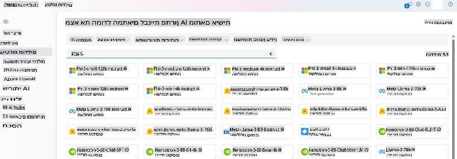

## הכנה לכיוונון עדין

### דרישות מוקדמות

> [!NOTE]
> עבור מודלים ממשפחת Phi-3, האפשרות לכיוונון עדין במודל "שלם לפי שימוש" זמינה רק עם Hubs שנוצרו באזורים **East US 2**.

- מנוי Azure. אם אין לך מנוי Azure, צור [חשבון Azure בתשלום](https://azure.microsoft.com/pricing/purchase-options/pay-as-you-go) כדי להתחיל.

- [פרויקט AI Foundry](https://ai.azure.com?WT.mc_id=aiml-138114-kinfeylo).
- בקרות גישה מבוססות תפקידים של Azure (Azure RBAC) משמשות להענקת גישה לפעולות ב-Azure AI Foundry. כדי לבצע את השלבים במאמר זה, חשבון המשתמש שלך חייב להיות משויך ל-__תפקיד מפתח AI של Azure__ בקבוצת המשאבים.

### רישום ספק מנוי

וודא שהמנוי רשום לספק המשאבים `Microsoft.Network`.

1. היכנס ל-[פורטל Azure](https://portal.azure.com).
1. בחר **Subscriptions** מהתפריט השמאלי.
1. בחר את המנוי שברצונך להשתמש בו.
1. בחר **AI project settings** > **Resource providers** מהתפריט השמאלי.
1. וודא ש-**Microsoft.Network** מופיע ברשימת ספקי המשאבים. אחרת, הוסף אותו.

### הכנת נתונים

הכן את נתוני האימון והאימות שלך כדי לכוונן את המודל. מערכי הנתונים לאימון ולאימות צריכים לכלול דוגמאות קלט ופלט המראות כיצד תרצה שהמודל יתפקד.

וודא שכל דוגמאות האימון שלך עוקבות אחר הפורמט המצופה עבור הסקה. כדי לכוונן מודלים ביעילות, הקפד על מערך נתונים מאוזן ומגוון.

זה כולל שמירה על איזון נתונים, הכללת תרחישים שונים, ושיפור תקופתי של נתוני האימון כך שיתאימו לציפיות בעולם האמיתי, מה שיוביל לתגובות מדויקות ומאוזנות יותר של המודל.

סוגי מודלים שונים דורשים פורמט שונה של נתוני אימון.

### השלמת שיחה

נתוני האימון והאימות שבהם אתה משתמש **חייבים** להיות בפורמט מסמך JSON Lines (JSONL). עבור `Phi-3-mini-128k-instruct` מערך הנתונים לכיוונון עדין חייב להיות בפורמט שיחתי המשמש את ה-API של השלמת שיחה.

### דוגמת פורמט קובץ

```json
    {"messages": [{"role": "system", "content": "You are an Xbox customer support agent whose primary goal is to help users with issues they are experiencing with their Xbox devices. You are friendly and concise. You only provide factual answers to queries, and do not provide answers that are not related to Xbox."}, {"role": "user", "content": "Is Xbox better than PlayStation?"}, {"role": "assistant", "content": "I apologize, but I cannot provide personal opinions. My primary job is to assist you with any issues related to your Xbox device. Do you have any Xbox-related issues that need addressing?"}]}
    {"messages": [{"role": "system", "content": "You are an Xbox customer support agent whose primary goal is to help users with issues they are experiencing with their Xbox devices. You are friendly and concise. You only provide factual answers to queries, and do not provide answers that are not related to Xbox."}, {"role": "user", "content": "Can I play PC games on my Xbox?"}, {"role": "assistant", "content": "While Xbox consoles don't natively support PC games, they can play an array of Xbox games, many of which are also available on PC. Can I assist you with finding games compatible with your Xbox device?"}]}
    {"messages": [{"role": "system", "content": "You are an Xbox customer support agent whose primary goal is to help users with issues they are experiencing with their Xbox devices. You are friendly and concise. You only provide factual answers to queries, and do not provide answers that are not related to Xbox."}, {"role": "user", "content": "I'm having trouble connecting my Xbox to the Wi-Fi."}, {"role": "assistant", "content": "No worries, let's go through the network settings on your Xbox. Can you please tell me what happens when you try to connect it to the Wi-Fi?"}]}
```

סוג הקובץ הנתמך הוא JSON Lines. קבצים מועלים לאחסון ברירת המחדל וזמינים בפרויקט שלך.

## כיוונון עדין של Phi-3 עם Azure AI Foundry

Azure AI Foundry מאפשר לך להתאים מודלים של שפה גדולה למערכי הנתונים האישיים שלך באמצעות תהליך שנקרא כיוונון עדין. כיוונון עדין מספק ערך משמעותי על ידי התאמה אישית ואופטימיזציה למשימות ויישומים ספציפיים. זה מוביל לביצועים משופרים, חיסכון בעלויות, הפחתת זמן תגובה, ותוצאות מותאמות אישית.

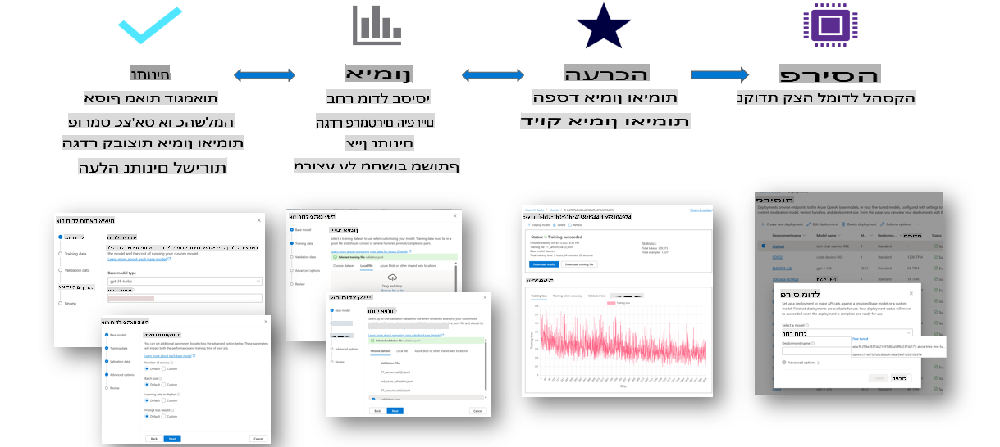

### יצירת פרויקט חדש

1. היכנס ל-[Azure AI Foundry](https://ai.azure.com).

1. בחר **+New project** כדי ליצור פרויקט חדש ב-Azure AI Foundry.

    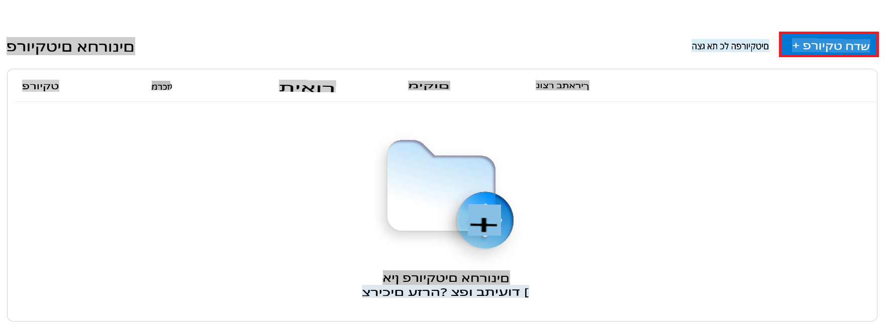

1. בצע את המשימות הבאות:

    - **Hub name** של הפרויקט. חייב להיות ערך ייחודי.
    - בחר את ה-**Hub** לשימוש (צור אחד חדש אם צריך).

    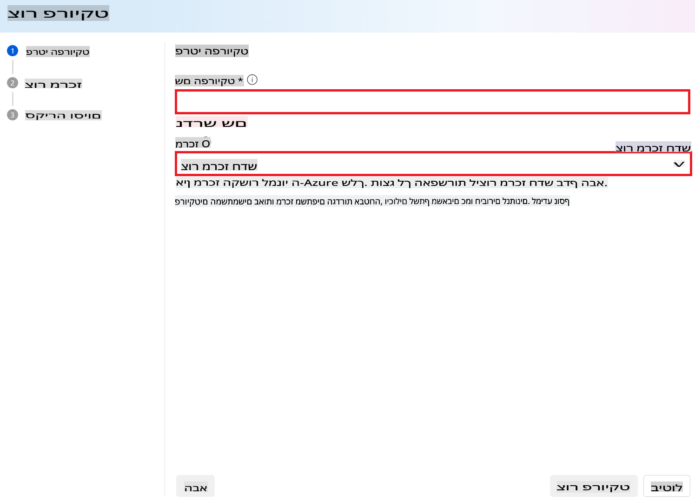

1. בצע את המשימות הבאות כדי ליצור Hub חדש:

    - הזן **Hub name**. חייב להיות ערך ייחודי.
    - בחר את **מנוי Azure** שלך.
    - בחר את **קבוצת המשאבים** לשימוש (צור אחת חדשה אם צריך).
    - בחר את **המיקום** שברצונך להשתמש בו.
    - בחר את **Connect Azure AI Services** לשימוש (צור אחד חדש אם צריך).
    - בחר **Connect Azure AI Search** ל-**Skip connecting**.

    

1. בחר **Next**.
1. בחר **Create a project**.

### הכנת נתונים

לפני כיוונון עדין, אסוף או צור מערך נתונים רלוונטי למשימה שלך, כגון הוראות שיחה, שאלות-תשובות, או כל טקסט רלוונטי אחר. נקה ועבד את הנתונים על ידי הסרת רעש, טיפול בערכים חסרים, ותהליך טוקניזציה של הטקסט.

### כיוונון עדין של מודלים Phi-3 ב-Azure AI Foundry

> [!NOTE]
> כיוונון עדין של מודלים Phi-3 נתמך כעת בפרויקטים הממוקמים ב-East US 2.

1. בחר **Model catalog** מהתפריט השמאלי.

1. הקלד *phi-3* ב-**שורת החיפוש** ובחר את מודל phi-3 שברצונך להשתמש בו.

    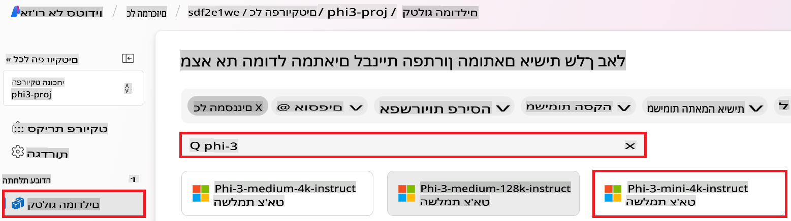

1. בחר **Fine-tune**.

    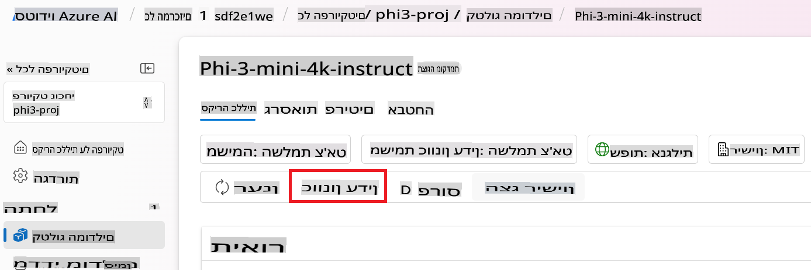

1. הזן את **שם המודל שעבר כיוונון עדין**.

    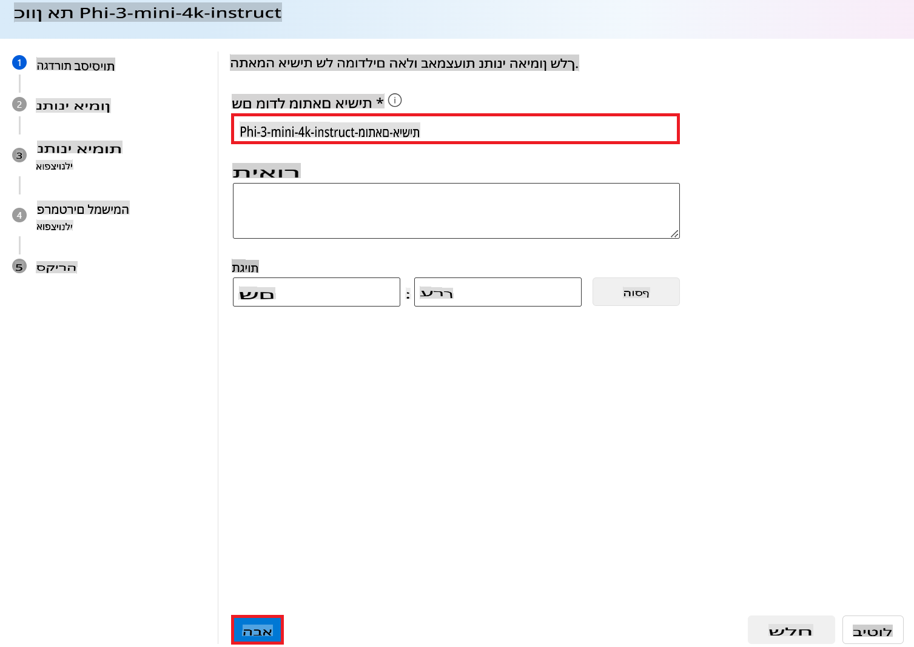

1. בחר **Next**.

1. בצע את המשימות הבאות:

    - בחר **סוג משימה** ל-**Chat completion**.
    - בחר את **נתוני האימון** שברצונך להשתמש בהם. תוכל להעלות אותם דרך Azure AI Foundry או מהסביבה המקומית שלך.

    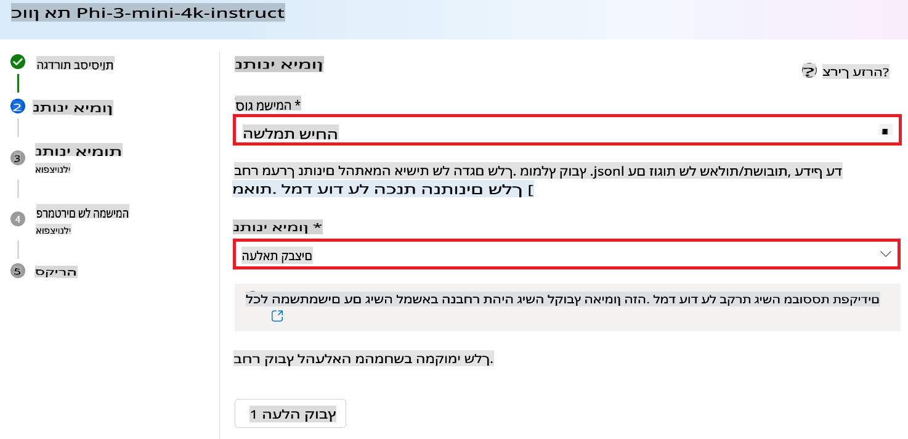

1. בחר **Next**.

1. העלה את **נתוני האימות** שברצונך להשתמש בהם, או תוכל לבחור **חלוקה אוטומטית של נתוני האימון**.

    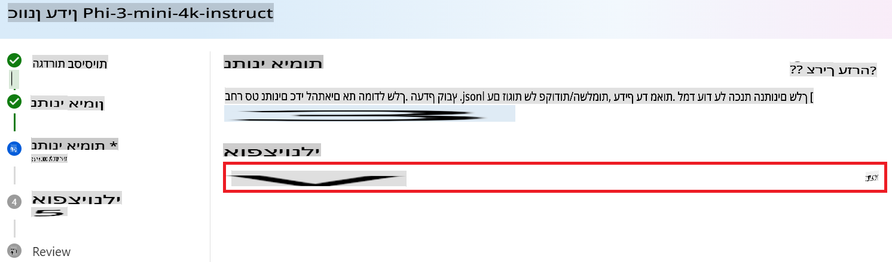

1. בחר **Next**.

1. בצע את המשימות הבאות:

    - בחר את **כופל גודל האצווה** שברצונך להשתמש בו.
    - בחר את **קצב הלמידה** שברצונך להשתמש בו.
    - בחר את **מספר האפוקים** שברצונך להשתמש בהם.

    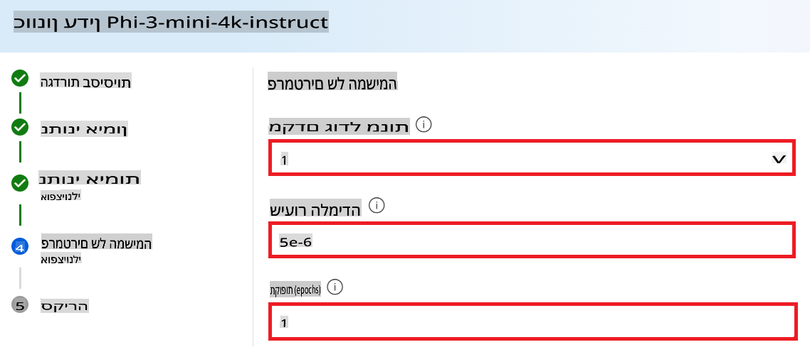

1. בחר **Submit** כדי להתחיל את תהליך הכיוונון העדין.

    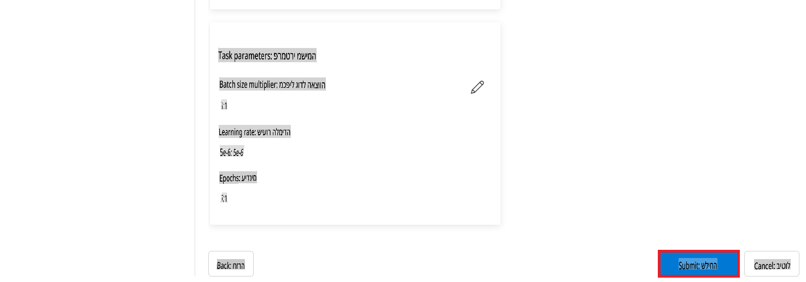

1. לאחר שהמודל שלך עבר כיוונון עדין, הסטטוס יוצג כ-**Completed**, כפי שמוצג בתמונה למטה. כעת תוכל לפרוס את המודל ולהשתמש בו באפליקציה שלך, ב-playground, או ב-prompt flow. למידע נוסף, ראה [כיצד לפרוס מודלים ממשפחת Phi-3 עם Azure AI Foundry](https://learn.microsoft.com/azure/ai-studio/how-to/deploy-models-phi-3?tabs=phi-3-5&pivots=programming-language-python).

    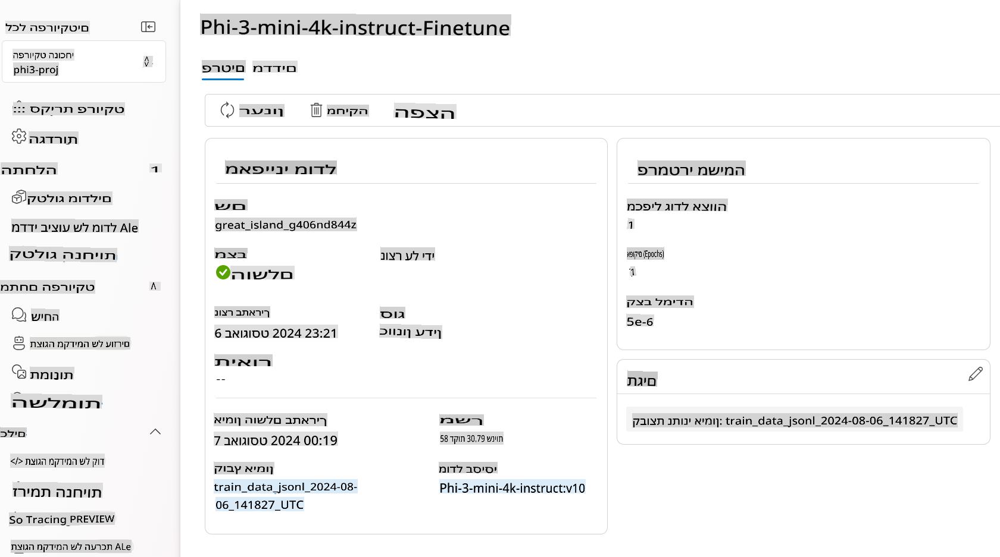

> [!NOTE]
> למידע מפורט יותר על כיוונון עדין של Phi-3, בקר ב-[כיוונון עדין של מודלים Phi-3 ב-Azure AI Foundry](https://learn.microsoft.com/azure/ai-studio/how-to/fine-tune-phi-3?tabs=phi-3-mini).

## ניקוי מודלים שעברו כיוונון עדין

תוכל למחוק מודל שעבר כיוונון עדין מרשימת המודלים שעברו כיוונון ב-[Azure AI Foundry](https://ai.azure.com) או מדף פרטי המודל. בחר את המודל שעבר כיוונון עדין שברצונך למחוק מדף הכיוונון, ולאחר מכן בחר בלחצן Delete כדי למחוק את המודל.

> [!NOTE]
> אינך יכול למחוק מודל מותאם אישית אם יש לו פריסה קיימת. תחילה עליך למחוק את הפריסה של המודל לפני שתוכל למחוק את המודל המותאם אישית.

## עלות ומכסות

### שיקולי עלות ומכסות עבור כיוונון עדין של מודלים Phi-3

מודלים Phi שעברו כיוונון עדין כשירות מוצעים על ידי מיקרוסופט ומשולבים עם Azure AI Foundry לשימוש. תוכל למצוא את התמחור בעת [פריסה](https://learn.microsoft.com/azure/ai-studio/how-to/deploy-models-phi-3?tabs=phi-3-5&pivots=programming-language-python) או כיוונון עדין של המודלים תחת הכרטיסייה Pricing and terms באשף הפריסה.

## סינון תוכן

מודלים שפורסו כשירות עם תשלום לפי שימוש מוגנים על ידי Azure AI Content Safety. כאשר הם נפרסים לנקודות קצה בזמן אמת, ניתן לבטל את אפשרות זו. עם הפעלת Azure AI Content Safety, גם ההנחיה וגם התשובה עוברות דרך מערך מודלים של סיווג שמטרתם לזהות ולמנוע הפקה של תוכן מזיק. מערכת סינון התוכן מזהה ונוקטת פעולה על קטגוריות מסוימות של תוכן פוגעני פוטנציאלי הן בהנחיות הקלט והן בתשובות. למידע נוסף, ראה [Azure AI Content Safety](https://learn.microsoft.com/azure/ai-studio/concepts/content-filtering).

**הגדרת כיוונון עדין**

היפרפרמטרים: הגדר היפרפרמטרים כגון קצב למידה, גודל אצווה, ומספר אפוקים לאימון.

**פונקציית הפסד**

בחר פונקציית הפסד מתאימה למשימה שלך (לדוגמה, cross-entropy).

**אופטימייזר**

בחר אופטימייזר (לדוגמה, Adam) לעדכוני גרדיאנט במהלך האימון.

**תהליך הכיוונון העדין**

- טען מודל מאומן מראש: טען את נקודת הבדיקה של Phi-3 Mini.
- הוסף שכבות מותאמות אישית: הוסף שכבות מותאמות למשימה (לדוגמה, ראש סיווג להוראות שיחה).

**אימון המודל**
בצע כיוונון עדין למודל באמצעות מערך הנתונים שהכנת. עקוב אחר התקדמות האימון והתאם היפרפרמטרים לפי הצורך.

**הערכה ואימות**

מערך אימות: חלק את הנתונים שלך למערכי אימון ואימות.

**הערכת ביצועים**

השתמש במדדים כמו דיוק, F1-score, או perplexity כדי להעריך את ביצועי המודל.

## שמירת מודל שעבר כיוונון עדין

**נקודת בדיקה**
שמור את נקודת הבדיקה של המודל שעבר כיוונון עדין לשימוש עתידי.

## פריסה

- פרוס כשירות רשת: פרוס את המודל שעבר כיוונון עדין כשירות רשת ב-Azure AI Foundry.
- בדוק את נקודת הקצה: שלח שאילתות בדיקה לנקודת הקצה שפורסה כדי לוודא את תפקודה.

## חזור ושפר

חזור: אם הביצועים אינם מספקים, חזור על ידי התאמת היפרפרמטרים, הוספת נתונים, או כיוונון נוסף לאפוקים נוספים.

## מעקב ושיפור

עקוב ברציפות אחר התנהגות המודל ושפר לפי הצורך.

## התאמה אישית והרחבה

משימות מותאמות אישית: ניתן לכוונן את Phi-3 Mini למשימות שונות מעבר להוראות שיחה. חקור מקרי שימוש נוספים!
ניסוי: נסה ארכיטקטורות שונות, שילובי שכבות, וטכניקות לשיפור ביצועים.

> [!NOTE]
> כיוונון עדין הוא תהליך מחזורי. נסה, למד, והתאם את המודל שלך כדי להשיג את התוצאות הטובות ביותר עבור המשימה הספציפית שלך!

**כתב ויתור**:  
מסמך זה תורגם באמצעות שירותי תרגום מבוססי בינה מלאכותית. בעוד שאנו שואפים לדיוק, אנא היו מודעים לכך שתרגומים אוטומטיים עשויים להכיל שגיאות או אי-דיוקים. יש להתייחס למסמך המקורי בשפתו המקורית כמקור הסמכותי. למידע קריטי, מומלץ להשתמש בתרגום אנושי מקצועי. אנו לא נושאים באחריות לאי-הבנות או לפרשנויות שגויות הנובעות משימוש בתרגום זה.