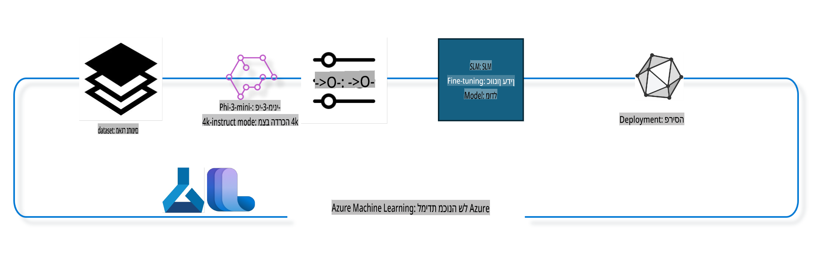

## איך להשתמש ברכיבי השלמת-שיחה ממאגר המערכות של Azure ML לכוונון מודל

בדוגמה זו נבצע כוונון של מודל Phi-3-mini-4k-instruct כדי להשלים שיחה בין שני אנשים באמצעות ערכת הנתונים ultrachat_200k.



הדוגמה תראה כיצד לבצע כוונון באמצעות Azure ML SDK ו-Python ולאחר מכן לפרוס את המודל המכוונן לנקודת קצה מקוונת עבור הסקה בזמן אמת.

### נתוני אימון

נשתמש בערכת הנתונים ultrachat_200k. זוהי גרסה מסוננת בכבדות של ערכת הנתונים UltraChat ושימשה לאימון Zephyr-7B-β, מודל שיחה מתקדם בגודל 7 מיליארד פרמטרים.

### מודל

נשתמש במודל Phi-3-mini-4k-instruct כדי להראות כיצד משתמש יכול לכוונן מודל למשימת השלמת-שיחה. אם פתחתם את המחברת מתוך כרטיס מודל ספציפי, זכרו להחליף את שם המודל הספציפי.

### משימות

- לבחור מודל לכוונון.
- לבחור ולחקור נתוני אימון.
- להגדיר את עבודת הכוונון.
- להריץ את עבודת הכוונון.
- לבדוק מדדי אימון והערכה.
- לרשום את המודל המכוונן.
- לפרוס את המודל המכוונן להסקה בזמן אמת.
- לנקות משאבים.

## 1. הגדרת דרישות מוקדמות

- התקנת תלותים.
- חיבור ל-AzureML Workspace. למידע נוסף, למדו על הגדרת אימות SDK. החליפו <WORKSPACE_NAME>, <RESOURCE_GROUP> ו-<SUBSCRIPTION_ID> למטה.
- חיבור למאגר המערכות של AzureML.
- הגדרת שם ניסוי אופציונלי.
- בדיקת משאבים או יצירתם.

> [!NOTE]  
> דרישות: צומת GPU יחיד יכול לכלול מספר כרטיסי GPU. לדוגמה, בצומת אחד של Standard_NC24rs_v3 ישנם 4 כרטיסי NVIDIA V100, בעוד שב-Standard_NC12s_v3 ישנם 2 כרטיסי NVIDIA V100. עיינו בתיעוד למידע זה. מספר כרטיסי ה-GPU לצומת מוגדר בפרמטר gpus_per_node למטה. הגדרה נכונה של ערך זה תבטיח ניצול מיטבי של כל ה-GPU בצומת. ניתן למצוא את ה-SKU של ה-GPU המומלצים כאן וכאן.

### ספריות Python

התקינו את התלותים על ידי הרצת התא הבא. זהו שלב שאינו אופציונלי בסביבה חדשה.

```bash
pip install azure-ai-ml
pip install azure-identity
pip install datasets==2.9.0
pip install mlflow
pip install azureml-mlflow
```

### אינטראקציה עם Azure ML

1. סקריפט Python זה משמש לאינטראקציה עם שירות Azure Machine Learning (Azure ML). להלן פירוט הפעולות שהוא מבצע:

    - מייבא מודולים נחוצים מהחבילות azure.ai.ml, azure.identity ו-azure.ai.ml.entities. בנוסף, מייבא את מודול time.

    - מנסה לאמת באמצעות DefaultAzureCredential(), המספק חוויית אימות פשוטה לפיתוח מהיר של יישומים ב-Azure. אם נכשל, עובר ל-InteractiveBrowserCredential(), המספק חלון התחברות אינטראקטיבי.

    - מנסה ליצור מופע MLClient באמצעות השיטה from_config, שקוראת את ההגדרות מקובץ ברירת המחדל (config.json). אם נכשל, יוצר מופע MLClient על ידי אספקת subscription_id, resource_group_name ו-workspace_name ידנית.

    - יוצר מופע נוסף של MLClient, הפעם עבור מאגר Azure ML בשם "azureml". מאגר זה מאחסן מודלים, צינורות כוונון וסביבות עבודה.

    - מגדיר את experiment_name ל-"chat_completion_Phi-3-mini-4k-instruct".

    - מייצר חותמת זמן ייחודית על ידי המרת הזמן הנוכחי (בשניות מאז epoch, כמספר עשרוני) למספר שלם ולאחר מכן למחרוזת. חותמת זמן זו יכולה לשמש ליצירת שמות וגרסאות ייחודיים.

    ```python
    # Import necessary modules from Azure ML and Azure Identity
    from azure.ai.ml import MLClient
    from azure.identity import (
        DefaultAzureCredential,
        InteractiveBrowserCredential,
    )
    from azure.ai.ml.entities import AmlCompute
    import time  # Import time module
    
    # Try to authenticate using DefaultAzureCredential
    try:
        credential = DefaultAzureCredential()
        credential.get_token("https://management.azure.com/.default")
    except Exception as ex:  # If DefaultAzureCredential fails, use InteractiveBrowserCredential
        credential = InteractiveBrowserCredential()
    
    # Try to create an MLClient instance using the default config file
    try:
        workspace_ml_client = MLClient.from_config(credential=credential)
    except:  # If that fails, create an MLClient instance by manually providing the details
        workspace_ml_client = MLClient(
            credential,
            subscription_id="<SUBSCRIPTION_ID>",
            resource_group_name="<RESOURCE_GROUP>",
            workspace_name="<WORKSPACE_NAME>",
        )
    
    # Create another MLClient instance for the Azure ML registry named "azureml"
    # This registry is where models, fine-tuning pipelines, and environments are stored
    registry_ml_client = MLClient(credential, registry_name="azureml")
    
    # Set the experiment name
    experiment_name = "chat_completion_Phi-3-mini-4k-instruct"
    
    # Generate a unique timestamp that can be used for names and versions that need to be unique
    timestamp = str(int(time.time()))
    ```

## 2. בחירת מודל בסיס לכוונון

1. Phi-3-mini-4k-instruct הוא מודל קל משקל עם 3.8 מיליארד פרמטרים, המבוסס על מערכי נתונים ששימשו את Phi-2. המודל שייך למשפחת המודלים Phi-3, וגרסת Mini מגיעה בשני וריאנטים: 4K ו-128K, שהם אורך ההקשר (בטוקנים) שהמודל יכול לתמוך בו. עלינו לכוונן את המודל למטרה הספציפית שלנו כדי להשתמש בו. ניתן לעיין במודלים אלה בקטלוג המודלים ב-AzureML Studio, תוך סינון לפי משימת השלמת-שיחה. בדוגמה זו, אנו משתמשים במודל Phi-3-mini-4k-instruct. אם פתחתם את המחברת עבור מודל אחר, החליפו את שם המודל והגרסה בהתאם.

    > [!NOTE]  
    > מאפיין model id של המודל. זה יועבר כקלט לעבודה של כוונון. מאפיין זה זמין גם בשדה Asset ID בדף פרטי המודל בקטלוג המודלים של AzureML Studio.

2. סקריפט Python זה מבצע אינטראקציה עם שירות Azure Machine Learning (Azure ML). להלן פירוט הפעולות שהוא מבצע:

    - מגדיר את model_name ל-"Phi-3-mini-4k-instruct".

    - משתמש בשיטת get של המאפיין models של האובייקט registry_ml_client כדי לאחזר את הגרסה העדכנית ביותר של המודל עם השם שצוין ממאגר Azure ML. השיטה get נקראת עם שני ארגומנטים: שם המודל ותווית המגדירה שיש לאחזר את הגרסה העדכנית ביותר של המודל.

    - מדפיס הודעה למסוף המצביעה על שם, גרסה ומזהה המודל שישמשו לכוונון. שיטת format של המחרוזת משמשת להחדרת שם, גרסה ומזהה המודל להודעה. שם, גרסה ומזהה המודל נגישים כמאפיינים של האובייקט foundation_model.

    ```python
    # Set the model name
    model_name = "Phi-3-mini-4k-instruct"
    
    # Get the latest version of the model from the Azure ML registry
    foundation_model = registry_ml_client.models.get(model_name, label="latest")
    
    # Print the model name, version, and id
    # This information is useful for tracking and debugging
    print(
        "\n\nUsing model name: {0}, version: {1}, id: {2} for fine tuning".format(
            foundation_model.name, foundation_model.version, foundation_model.id
        )
    )
    ```

## 3. יצירת משאב חישוב לשימוש בעבודה

עבודת הכוונון פועלת **רק** עם משאב חישוב מסוג GPU. גודל המשאב תלוי בגודל המודל ובמקרים רבים קשה לזהות את המשאב המתאים לעבודה. בתא זה, אנו מדריכים את המשתמש לבחור את המשאב המתאים לעבודה.

> [!NOTE]  
> משאבי החישוב המפורטים למטה פועלים עם התצורה האופטימלית ביותר. שינויים בתצורה עלולים לגרום לשגיאת Cuda Out Of Memory. במקרים כאלה, נסו לשדרג את המשאב לגודל גדול יותר.

> [!NOTE]  
> בעת בחירת compute_cluster_size למטה, ודאו שהמשאב זמין בקבוצת המשאבים שלכם. אם משאב מסוים אינו זמין, ניתן להגיש בקשה לקבלת גישה למשאב.

### בדיקת תמיכה בכוונון למודל

1. סקריפט Python זה מבצע אינטראקציה עם מודל Azure Machine Learning (Azure ML). להלן פירוט הפעולות שהוא מבצע:

    - מייבא את מודול ast, המספק פונקציות לעיבוד עצים של תחביר Python.

    - בודק אם לאובייקט foundation_model (המייצג מודל ב-Azure ML) יש תג בשם finetune_compute_allow_list. תגים ב-Azure ML הם זוגות מפתח-ערך שניתן ליצור ולהשתמש בהם לסינון ומיון מודלים.

    - אם התג finetune_compute_allow_list קיים, משתמש בפונקציה ast.literal_eval כדי לנתח בבטחה את הערך של התג (מחרוזת) לרשימה ב-Python. רשימה זו מוקצית למשתנה computes_allow_list. לאחר מכן, מדפיס הודעה המציינת שיש ליצור משאב חישוב מהרשימה.

    - אם התג finetune_compute_allow_list אינו קיים, מגדיר את computes_allow_list ל-None ומדפיס הודעה המציינת שהתג finetune_compute_allow_list אינו חלק מהתגים של המודל.

    - לסיכום, סקריפט זה בודק תג מסוים במטא-נתונים של המודל, ממיר את הערך של התג לרשימה אם הוא קיים, ומספק משוב למשתמש בהתאם.

    ```python
    # Import the ast module, which provides functions to process trees of the Python abstract syntax grammar
    import ast
    
    # Check if the 'finetune_compute_allow_list' tag is present in the model's tags
    if "finetune_compute_allow_list" in foundation_model.tags:
        # If the tag is present, use ast.literal_eval to safely parse the tag's value (a string) into a Python list
        computes_allow_list = ast.literal_eval(
            foundation_model.tags["finetune_compute_allow_list"]
        )  # convert string to python list
        # Print a message indicating that a compute should be created from the list
        print(f"Please create a compute from the above list - {computes_allow_list}")
    else:
        # If the tag is not present, set computes_allow_list to None
        computes_allow_list = None
        # Print a message indicating that the 'finetune_compute_allow_list' tag is not part of the model's tags
        print("`finetune_compute_allow_list` is not part of model tags")
    ```

### בדיקת מופע חישוב

1. סקריפט Python זה מבצע אינטראקציה עם שירות Azure Machine Learning (Azure ML) ומבצע מספר בדיקות על מופע חישוב. להלן פירוט הפעולות שהוא מבצע:

    - מנסה לאחזר את מופע החישוב עם השם המאוחסן ב-compute_cluster מ-Azure ML workspace. אם מצב ההקצאה של מופע החישוב הוא "נכשל", מעלה ValueError.

    - בודק אם computes_allow_list אינו None. אם אינו None, ממיר את כל גדלי המשאבים ברשימה לאותיות קטנות ובודק אם הגודל של מופע החישוב הנוכחי נמצא ברשימה. אם אינו נמצא, מעלה ValueError.

    - אם computes_allow_list הוא None, בודק אם גודל מופע החישוב נמצא ברשימת גדלי VM של GPU שאינם נתמכים. אם נמצא, מעלה ValueError.

    - מאחזר רשימה של כל גדלי המשאבים הזמינים ב-workspace. לאחר מכן, עובר על הרשימה, ובכל גודל משאב בודק אם השם שלו תואם לגודל מופע החישוב הנוכחי. אם כן, מאחזר את מספר ה-GPU לגודל המשאב הזה ומגדיר gpu_count_found ל-True.

    - אם gpu_count_found הוא True, מדפיס את מספר ה-GPU במופע החישוב. אם gpu_count_found הוא False, מעלה ValueError.

    - לסיכום, סקריפט זה מבצע מספר בדיקות על מופע חישוב ב-Azure ML workspace, כולל בדיקת מצב ההקצאה שלו, גודלו מול רשימת אישור או דחייה, ומספר ה-GPU שיש לו.

    ```python
    # Print the exception message
    print(e)
    # Raise a ValueError if the compute size is not available in the workspace
    raise ValueError(
        f"WARNING! Compute size {compute_cluster_size} not available in workspace"
    )
    
    # Retrieve the compute instance from the Azure ML workspace
    compute = workspace_ml_client.compute.get(compute_cluster)
    # Check if the provisioning state of the compute instance is "failed"
    if compute.provisioning_state.lower() == "failed":
        # Raise a ValueError if the provisioning state is "failed"
        raise ValueError(
            f"Provisioning failed, Compute '{compute_cluster}' is in failed state. "
            f"please try creating a different compute"
        )
    
    # Check if computes_allow_list is not None
    if computes_allow_list is not None:
        # Convert all compute sizes in computes_allow_list to lowercase
        computes_allow_list_lower_case = [x.lower() for x in computes_allow_list]
        # Check if the size of the compute instance is in computes_allow_list_lower_case
        if compute.size.lower() not in computes_allow_list_lower_case:
            # Raise a ValueError if the size of the compute instance is not in computes_allow_list_lower_case
            raise ValueError(
                f"VM size {compute.size} is not in the allow-listed computes for finetuning"
            )
    else:
        # Define a list of unsupported GPU VM sizes
        unsupported_gpu_vm_list = [
            "standard_nc6",
            "standard_nc12",
            "standard_nc24",
            "standard_nc24r",
        ]
        # Check if the size of the compute instance is in unsupported_gpu_vm_list
        if compute.size.lower() in unsupported_gpu_vm_list:
            # Raise a ValueError if the size of the compute instance is in unsupported_gpu_vm_list
            raise ValueError(
                f"VM size {compute.size} is currently not supported for finetuning"
            )
    
    # Initialize a flag to check if the number of GPUs in the compute instance has been found
    gpu_count_found = False
    # Retrieve a list of all available compute sizes in the workspace
    workspace_compute_sku_list = workspace_ml_client.compute.list_sizes()
    available_sku_sizes = []
    # Iterate over the list of available compute sizes
    for compute_sku in workspace_compute_sku_list:
        available_sku_sizes.append(compute_sku.name)
        # Check if the name of the compute size matches the size of the compute instance
        if compute_sku.name.lower() == compute.size.lower():
            # If it does, retrieve the number of GPUs for that compute size and set gpu_count_found to True
            gpus_per_node = compute_sku.gpus
            gpu_count_found = True
    # If gpu_count_found is True, print the number of GPUs in the compute instance
    if gpu_count_found:
        print(f"Number of GPU's in compute {compute.size}: {gpus_per_node}")
    else:
        # If gpu_count_found is False, raise a ValueError
        raise ValueError(
            f"Number of GPU's in compute {compute.size} not found. Available skus are: {available_sku_sizes}."
            f"This should not happen. Please check the selected compute cluster: {compute_cluster} and try again."
        )
    ```

## 4. בחירת ערכת הנתונים לכוונון המודל

1. אנו משתמשים בערכת הנתונים ultrachat_200k. לערכת הנתונים ארבעה חלוקות, המתאימות לכוונון מפוקח (sft). דירוג יצירה (gen). מספר הדוגמאות לכל חלוקה מוצג כדלקמן:

    ```bash
    train_sft test_sft  train_gen  test_gen
    207865  23110  256032  28304
    ```

1. התאים הבאים מציגים הכנת נתונים בסיסית לכוונון:

### הצגת שורות נתונים לדוגמה

אנו רוצים שהדוגמה הזו תפעל במהירות, ולכן נשמור קבצים train_sft ו-test_sft המכילים 5% מהשורות שכבר נחתכו. המשמעות היא שהמודל המכוונן יהיה בעל דיוק נמוך יותר, ולכן אין להשתמש בו לשימוש בעולם האמיתי.  
הסקריפט download-dataset.py משמש להורדת ערכת הנתונים ultrachat_200k ולהמרתה לפורמט שניתן לצרוך בצינור הכוונון. בנוסף, מכיוון שערכת הנתונים גדולה, כאן אנו משתמשים רק בחלק ממנה.

1. הרצת הסקריפט למטה מורידה רק 5% מהנתונים. ניתן להגדיל זאת על ידי שינוי הפרמטר dataset_split_pc לאחוז הרצוי.

    > [!NOTE]  
    > למודלי שפה מסוימים יש קודים שונים לשפות ולכן שמות העמודות בערכת הנתונים צריכים לשקף זאת.

1. דוגמה לאופן שבו הנתונים צריכים להיראות:  
ערכת הנתונים של השלמת-שיחה נשמרת בפורמט parquet כאשר כל רשומה משתמשת בסכימה הבאה:

    - מדובר במסמך JSON (JavaScript Object Notation), שהוא פורמט פופולרי להחלפת נתונים. זה אינו קוד שניתן להריץ, אלא דרך לאחסן ולהעביר נתונים. להלן פירוט המבנה שלו:

    - "prompt": מפתח זה מכיל ערך מחרוזת המייצג משימה או שאלה שהוצגו בפני עוזר AI.

    - "messages": מפתח זה מכיל מערך של אובייקטים. כל אובייקט מייצג הודעה בשיחה בין משתמש לעוזר AI. לכל אובייקט הודעה יש שני מפתחות:

        - "content": מפתח זה מכיל ערך מחרוזת המייצג את תוכן ההודעה.
        - "role": מפתח זה מכיל ערך מחרוזת המייצג את התפקיד של הישות ששלחה את ההודעה. זה יכול להיות "user" או "assistant".

    - "prompt_id": מפתח זה מכיל ערך מחרוזת המייצג מזהה ייחודי להנחיה.

1. במסמך JSON הספציפי הזה, מיוצגת שיחה שבה משתמש מבקש מעוזר AI ליצור דמות ראשית לסיפור דיסטופי. העוזר מגיב, והמשתמש מבקש פרטים נוספים. העוזר מסכים לספק פרטים נוספים. כל השיחה משויכת למזהה הנחיה מסוים.

    ```python
    {
        // The task or question posed to an AI assistant
        "prompt": "Create a fully-developed protagonist who is challenged to survive within a dystopian society under the rule of a tyrant. ...",
        
        // An array of objects, each representing a message in a conversation between a user and an AI assistant
        "messages":[
            {
                // The content of the user's message
                "content": "Create a fully-developed protagonist who is challenged to survive within a dystopian society under the rule of a tyrant. ...",
                // The role of the entity that sent the message
                "role": "user"
            },
            {
                // The content of the assistant's message
                "content": "Name: Ava\n\n Ava was just 16 years old when the world as she knew it came crashing down. The government had collapsed, leaving behind a chaotic and lawless society. ...",
                // The role of the entity that sent the message
                "role": "assistant"
            },
            {
                // The content of the user's message
                "content": "Wow, Ava's story is so intense and inspiring! Can you provide me with more details.  ...",
                // The role of the entity that sent the message
                "role": "user"
            }, 
            {
                // The content of the assistant's message
                "content": "Certainly! ....",
                // The role of the entity that sent the message
                "role": "assistant"
            }
        ],
        
        // A unique identifier for the prompt
        "prompt_id": "d938b65dfe31f05f80eb8572964c6673eddbd68eff3db6bd234d7f1e3b86c2af"
    }
    ```

### הורדת נתונים

1. סקריפט Python זה משמש להורדת ערכת נתונים באמצעות סקריפט עזר בשם download-dataset.py. להלן פירוט הפעולות שהוא מבצע:

    - מייבא את מודול os, המספק דרך ניידת להשתמש בפונקציונליות התלויה במערכת ההפעלה.

    - משתמש בפונקציה os.system כדי להריץ את הסקריפט download-dataset.py ב-shell עם ארגומנטים ספציפיים בשורת הפקודה. הארגומנטים מציינים את ערכת הנתונים להורדה (HuggingFaceH4/ultrachat_200k), את הספרייה שאליה להוריד (ultrachat_200k_dataset), ואת אחוז ערכת הנתונים לחלוקה (5). פונקציית os.system מחזירה את סטטוס היציאה של הפקודה שהיא הריצה; סטטוס זה נשמר במשתנה exit_status.

    - בודק אם exit_status אינו 0. במערכות הפעלה דמויות יוניקס, סטטוס יציאה של 0 מציין בדרך כלל שהפקודה הצליחה, בעוד שכל מספר אחר מציין שגיאה. אם exit_status אינו 0, מעלה Exception עם הודעה המציינת שהייתה שגיאה בהורדת ערכת הנתונים.

    - לסיכום, סקריפט זה מריץ פקודה להורדת ערכת נתונים באמצעות סקריפט עזר, ומעלה חריגה אם הפקודה נכשלת.

    ```python
    # Import the os module, which provides a way of using operating system dependent functionality
    import os
    
    # Use the os.system function to run the download-dataset.py script in the shell with specific command-line arguments
    # The arguments specify the dataset to download (HuggingFaceH4/ultrachat_200k), the directory to download it to (ultrachat_200k_dataset), and the percentage of the dataset to split (5)
    # The os.system function returns the exit status of the command it executed; this status is stored in the exit_status variable
    exit_status = os.system(
        "python ./download-dataset.py --dataset HuggingFaceH4/ultrachat_200k --download_dir ultrachat_200k_dataset --dataset_split_pc 5"
    )
    
    # Check if exit_status is not 0
    # In Unix-like operating systems, an exit status of 0 usually indicates that a command has succeeded, while any other number indicates an error
    # If exit_status is not 0, raise an Exception with a message indicating that there was an error downloading the dataset
    if exit_status != 0:
        raise Exception("Error downloading dataset")
    ```

### טעינת נתונים ל-DataFrame

1. סקריפט Python זה טוען קובץ JSON Lines ל-DataFrame של pandas ומציג את חמש השורות הראשונות. להלן פירוט הפעולות שהוא מבצע:

    - מייבא את ספריית pandas, שהיא ספרייה חזקה למניפולציה וניתוח נתונים.

    - מגדיר את רוחב העמודה המרבי באפשרויות התצוגה של pandas ל-0. המשמעות היא שהטקסט המלא של כל עמודה יוצג ללא קיצוץ כאשר ה-DataFrame יודפס.

    - משתמש בפונקציה pd.read_json כדי לטעון את הקובץ train_sft.jsonl מהספרייה ultrachat_200k_dataset ל-DataFrame. הארגומנט lines=True מציין שהקובץ בפורמט JSON Lines, שבו כל שורה היא אובייקט JSON נפרד.

    - משתמש בשיטה head כדי להציג את חמש השורות הראשונות של ה-DataFrame. אם ל-DataFrame יש פחות מ-5 שורות, הוא יציג את כולן.

    - לסיכום, סקריפט זה טוען קובץ JSON Lines ל-DataFrame ומציג את חמש השורות הראשונות עם טקסט מלא בעמודות.

    ```python
    # Import the pandas library, which is a powerful data manipulation and analysis library
    import pandas as pd
    
    # Set the maximum column width for pandas' display options to 0
    # This means that the full text of each column will be displayed without truncation when the DataFrame is printed
    pd.set_option("display.max_colwidth", 0)
    
    # Use the pd.read_json function to load the train_sft.jsonl file from the ultrachat_200k_dataset directory into a DataFrame
    # The lines=True argument indicates that the file is in JSON Lines format, where each line is a separate JSON object
    df = pd.read_json("./ultrachat_200k_dataset/train_sft.jsonl", lines=True)
    
    # Use the head method to display the first 5 rows of the DataFrame
    # If the DataFrame has less than 5 rows, it will display all of them
    df.head()
    ```

## 5. שליחת עבודת כוונון באמצעות המודל והנתונים כקלט

צרו את העבודה המשתמשת ברכיב צינור השלמת-שיחה. למדו עוד על כל הפרמטרים הנתמכים לכוונון.

### הגדרת פרמטרי כוונון

1. פרמטרי כוונון ניתנים לחלוקה לשתי קטגוריות: פרמטרי אימון ופרמטרי אופטימיזציה.

1. פרמטרי אימון מגדירים את היבטי האימון כמו:

    - האופטימייזר וה-scheduler לשימוש.
    - המדד שאותו יש למקסם במהלך הכוונון.
    - מספר שלבי האימון וגודל האצווה, ועוד.

1. פרמטרי אופטימיזציה מסייעים באופטימיזציה של זיכרון ה-GPU וניצול יעיל של משאבי החישוב.  

1. להלן מספר פרמטרים המשתייכים לקטגוריה זו. פרמטרי האופטימיזציה משתנים בין מודלים שונים ונארזים יחד עם המודל כדי להתמודד עם השונות הזו.

    - הפעלת DeepSpeed ו-LoRA.
    - הפעלת אימון בדיוק מעורב.
    - הפעלת אימון במספר צמתים.

> [!NOTE]  
> כוונון מפוקח עלול לגרום לאובדן יישור או שכחה קטסטרופלית. אנו ממליצים לבדוק בעיה זו ולהריץ שלב יישור לאחר הכוונון.

###
### הגדרת צינור אימון
הגדרת צינור אימון מבוסס על פרמטרים שונים, ולאחר מכן הדפסת שם התצוגה.  
```python
    # Define a function to generate a display name for the training pipeline
    def get_pipeline_display_name():
        # Calculate the total batch size by multiplying the per-device batch size, the number of gradient accumulation steps, the number of GPUs per node, and the number of nodes used for fine-tuning
        batch_size = (
            int(finetune_parameters.get("per_device_train_batch_size", 1))
            * int(finetune_parameters.get("gradient_accumulation_steps", 1))
            * int(gpus_per_node)
            * int(finetune_parameters.get("num_nodes_finetune", 1))
        )
        # Retrieve the learning rate scheduler type
        scheduler = finetune_parameters.get("lr_scheduler_type", "linear")
        # Retrieve whether DeepSpeed is applied
        deepspeed = finetune_parameters.get("apply_deepspeed", "false")
        # Retrieve the DeepSpeed stage
        ds_stage = finetune_parameters.get("deepspeed_stage", "2")
        # If DeepSpeed is applied, include "ds" followed by the DeepSpeed stage in the display name; if not, include "nods"
        if deepspeed == "true":
            ds_string = f"ds{ds_stage}"
        else:
            ds_string = "nods"
        # Retrieve whether Layer-wise Relevance Propagation (LoRa) is applied
        lora = finetune_parameters.get("apply_lora", "false")
        # If LoRa is applied, include "lora" in the display name; if not, include "nolora"
        if lora == "true":
            lora_string = "lora"
        else:
            lora_string = "nolora"
        # Retrieve the limit on the number of model checkpoints to keep
        save_limit = finetune_parameters.get("save_total_limit", -1)
        # Retrieve the maximum sequence length
        seq_len = finetune_parameters.get("max_seq_length", -1)
        # Construct the display name by concatenating all these parameters, separated by hyphens
        return (
            model_name
            + "-"
            + "ultrachat"
            + "-"
            + f"bs{batch_size}"
            + "-"
            + f"{scheduler}"
            + "-"
            + ds_string
            + "-"
            + lora_string
            + f"-save_limit{save_limit}"
            + f"-seqlen{seq_len}"
        )
    
    # Call the function to generate the display name
    pipeline_display_name = get_pipeline_display_name()
    # Print the display name
    print(f"Display name used for the run: {pipeline_display_name}")
    ```  

### הגדרת צינור
סקריפט הפייתון הזה מגדיר ומגדיר צינור למידת מכונה באמצעות Azure Machine Learning SDK. הנה פירוט של מה שהוא עושה:  
1. מייבא מודולים נדרשים מ-Azure AI ML SDK.  
2. מאחזר רכיב צינור בשם "chat_completion_pipeline" מהרשימה.  
3. מגדיר עבודה של צינור באמצעות `@pipeline` decorator and the function `create_pipeline`. The name of the pipeline is set to `pipeline_display_name`.

1. Inside the `create_pipeline` function, it initializes the fetched pipeline component with various parameters, including the model path, compute clusters for different stages, dataset splits for training and testing, the number of GPUs to use for fine-tuning, and other fine-tuning parameters.

1. It maps the output of the fine-tuning job to the output of the pipeline job. This is done so that the fine-tuned model can be easily registered, which is required to deploy the model to an online or batch endpoint.

1. It creates an instance of the pipeline by calling the `create_pipeline` function.

1. It sets the `force_rerun` setting of the pipeline to `True`, meaning that cached results from previous jobs will not be used.

1. It sets the `continue_on_step_failure` setting of the pipeline to `False`, מה שאומר שהצינור יפסיק אם שלב כלשהו ייכשל.  
4. לסיכום, סקריפט זה מגדיר ומגדיר צינור למידת מכונה למשימת השלמת שיחה באמצעות Azure Machine Learning SDK.  
```python
    # Import necessary modules from the Azure AI ML SDK
    from azure.ai.ml.dsl import pipeline
    from azure.ai.ml import Input
    
    # Fetch the pipeline component named "chat_completion_pipeline" from the registry
    pipeline_component_func = registry_ml_client.components.get(
        name="chat_completion_pipeline", label="latest"
    )
    
    # Define the pipeline job using the @pipeline decorator and the function create_pipeline
    # The name of the pipeline is set to pipeline_display_name
    @pipeline(name=pipeline_display_name)
    def create_pipeline():
        # Initialize the fetched pipeline component with various parameters
        # These include the model path, compute clusters for different stages, dataset splits for training and testing, the number of GPUs to use for fine-tuning, and other fine-tuning parameters
        chat_completion_pipeline = pipeline_component_func(
            mlflow_model_path=foundation_model.id,
            compute_model_import=compute_cluster,
            compute_preprocess=compute_cluster,
            compute_finetune=compute_cluster,
            compute_model_evaluation=compute_cluster,
            # Map the dataset splits to parameters
            train_file_path=Input(
                type="uri_file", path="./ultrachat_200k_dataset/train_sft.jsonl"
            ),
            test_file_path=Input(
                type="uri_file", path="./ultrachat_200k_dataset/test_sft.jsonl"
            ),
            # Training settings
            number_of_gpu_to_use_finetuning=gpus_per_node,  # Set to the number of GPUs available in the compute
            **finetune_parameters
        )
        return {
            # Map the output of the fine tuning job to the output of pipeline job
            # This is done so that we can easily register the fine tuned model
            # Registering the model is required to deploy the model to an online or batch endpoint
            "trained_model": chat_completion_pipeline.outputs.mlflow_model_folder
        }
    
    # Create an instance of the pipeline by calling the create_pipeline function
    pipeline_object = create_pipeline()
    
    # Don't use cached results from previous jobs
    pipeline_object.settings.force_rerun = True
    
    # Set continue on step failure to False
    # This means that the pipeline will stop if any step fails
    pipeline_object.settings.continue_on_step_failure = False
    ```  

### הגשת העבודה
1. סקריפט הפייתון הזה מגיש עבודה של צינור למידת מכונה ל-Azure Machine Learning workspace ולאחר מכן ממתין להשלמת העבודה. הנה פירוט של מה שהוא עושה:  
   - הוא קורא לשיטת create_or_update של אובייקט ה-jobs ב-workspace_ml_client כדי להגיש את העבודה של הצינור. הצינור שיש להריץ מוגדר על ידי pipeline_object, והניסוי שמתחתיו העבודה מתבצעת מוגדר על ידי experiment_name.  
   - לאחר מכן הוא קורא לשיטת stream של אובייקט ה-jobs ב-workspace_ml_client כדי להמתין להשלמת העבודה של הצינור. העבודה שממתינים לה מוגדרת על ידי התכונה name של אובייקט pipeline_job.  
   - לסיכום, סקריפט זה מגיש עבודה של צינור למידת מכונה ל-Azure Machine Learning workspace, ולאחר מכן ממתין להשלמת העבודה.  
```python
    # Submit the pipeline job to the Azure Machine Learning workspace
    # The pipeline to be run is specified by pipeline_object
    # The experiment under which the job is run is specified by experiment_name
    pipeline_job = workspace_ml_client.jobs.create_or_update(
        pipeline_object, experiment_name=experiment_name
    )
    
    # Wait for the pipeline job to complete
    # The job to wait for is specified by the name attribute of the pipeline_job object
    workspace_ml_client.jobs.stream(pipeline_job.name)
    ```  

## 6. רישום המודל המותאם עם ה-workspace
נרשום את המודל מתוצאת עבודת ההתאמה. זה יעקוב אחר הקשרים בין המודל המותאם לבין עבודת ההתאמה. עבודת ההתאמה, בנוסף, עוקבת אחר הקשרים למודל הבסיס, הנתונים וקוד האימון.  

### רישום מודל ML
1. סקריפט הפייתון הזה רושם מודל למידת מכונה שאומן בצינור Azure Machine Learning. הנה פירוט של מה שהוא עושה:  
   - מייבא מודולים נדרשים מ-Azure AI ML SDK.  
   - בודק אם הפלט trained_model זמין מעבודת הצינור על ידי קריאה לשיטת get של אובייקט ה-jobs ב-workspace_ml_client וגישה לתכונה outputs שלו.  
   - בונה נתיב למודל המאומן על ידי עיצוב מחרוזת עם שם עבודת הצינור ושם הפלט ("trained_model").  
   - מגדיר שם למודל המותאם על ידי הוספת "-ultrachat-200k" לשם המודל המקורי והחלפת כל הסלשים במקפים.  
   - מתכונן לרשום את המודל על ידי יצירת אובייקט Model עם פרמטרים שונים, כולל הנתיב למודל, סוג המודל (מודל MLflow), שם וגרסת המודל, ותיאור המודל.  
   - רושם את המודל על ידי קריאה לשיטת create_or_update של אובייקט ה-models ב-workspace_ml_client עם אובייקט Model כארגומנט.  
   - מדפיס את המודל הרשום.  
   - לסיכום, סקריפט זה רושם מודל למידת מכונה שאומן בצינור Azure Machine Learning.  
```python
    # Import necessary modules from the Azure AI ML SDK
    from azure.ai.ml.entities import Model
    from azure.ai.ml.constants import AssetTypes
    
    # Check if the `trained_model` output is available from the pipeline job
    print("pipeline job outputs: ", workspace_ml_client.jobs.get(pipeline_job.name).outputs)
    
    # Construct a path to the trained model by formatting a string with the name of the pipeline job and the name of the output ("trained_model")
    model_path_from_job = "azureml://jobs/{0}/outputs/{1}".format(
        pipeline_job.name, "trained_model"
    )
    
    # Define a name for the fine-tuned model by appending "-ultrachat-200k" to the original model name and replacing any slashes with hyphens
    finetuned_model_name = model_name + "-ultrachat-200k"
    finetuned_model_name = finetuned_model_name.replace("/", "-")
    
    print("path to register model: ", model_path_from_job)
    
    # Prepare to register the model by creating a Model object with various parameters
    # These include the path to the model, the type of the model (MLflow model), the name and version of the model, and a description of the model
    prepare_to_register_model = Model(
        path=model_path_from_job,
        type=AssetTypes.MLFLOW_MODEL,
        name=finetuned_model_name,
        version=timestamp,  # Use timestamp as version to avoid version conflict
        description=model_name + " fine tuned model for ultrachat 200k chat-completion",
    )
    
    print("prepare to register model: \n", prepare_to_register_model)
    
    # Register the model by calling the create_or_update method of the models object in the workspace_ml_client with the Model object as the argument
    registered_model = workspace_ml_client.models.create_or_update(
        prepare_to_register_model
    )
    
    # Print the registered model
    print("registered model: \n", registered_model)
    ```  

## 7. פריסת המודל המותאם לנקודת קצה מקוונת
נקודות קצה מקוונות מספקות API REST עמיד שניתן לשלב עם יישומים שצריכים להשתמש במודל.  

### ניהול נקודת קצה
1. סקריפט הפייתון הזה יוצר נקודת קצה מקוונת מנוהלת ב-Azure Machine Learning עבור מודל רשום. הנה פירוט של מה שהוא עושה:  
   - מייבא מודולים נדרשים מ-Azure AI ML SDK.  
   - מגדיר שם ייחודי לנקודת הקצה המקוונת על ידי הוספת חותמת זמן למחרוזת "ultrachat-completion-".  
   - מתכונן ליצור את נקודת הקצה המקוונת על ידי יצירת אובייקט ManagedOnlineEndpoint עם פרמטרים שונים, כולל שם נקודת הקצה, תיאור נקודת הקצה, ומצב האימות ("key").  
   - יוצר את נקודת הקצה המקוונת על ידי קריאה לשיטת begin_create_or_update של workspace_ml_client עם אובייקט ManagedOnlineEndpoint כארגומנט. לאחר מכן הוא ממתין להשלמת פעולת היצירה על ידי קריאה לשיטת wait.  
   - לסיכום, סקריפט זה יוצר נקודת קצה מקוונת מנוהלת ב-Azure Machine Learning עבור מודל רשום.  
```python
    # Import necessary modules from the Azure AI ML SDK
    from azure.ai.ml.entities import (
        ManagedOnlineEndpoint,
        ManagedOnlineDeployment,
        ProbeSettings,
        OnlineRequestSettings,
    )
    
    # Define a unique name for the online endpoint by appending a timestamp to the string "ultrachat-completion-"
    online_endpoint_name = "ultrachat-completion-" + timestamp
    
    # Prepare to create the online endpoint by creating a ManagedOnlineEndpoint object with various parameters
    # These include the name of the endpoint, a description of the endpoint, and the authentication mode ("key")
    endpoint = ManagedOnlineEndpoint(
        name=online_endpoint_name,
        description="Online endpoint for "
        + registered_model.name
        + ", fine tuned model for ultrachat-200k-chat-completion",
        auth_mode="key",
    )
    
    # Create the online endpoint by calling the begin_create_or_update method of the workspace_ml_client with the ManagedOnlineEndpoint object as the argument
    # Then wait for the creation operation to complete by calling the wait method
    workspace_ml_client.begin_create_or_update(endpoint).wait()
    ```  

> [!NOTE]  
> ניתן למצוא כאן את רשימת ה-SKU הנתמכים לפריסה - [Managed online endpoints SKU list](https://learn.microsoft.com/azure/machine-learning/reference-managed-online-endpoints-vm-sku-list)  

### פריסת מודל ML
1. סקריפט הפייתון הזה פורש מודל למידת מכונה רשום לנקודת קצה מקוונת מנוהלת ב-Azure Machine Learning. הנה פירוט של מה שהוא עושה:  
   - מייבא את המודול ast, המספק פונקציות לעיבוד עצי תחביר של פייתון.  
   - מגדיר את סוג המופע לפריסה כ-"Standard_NC6s_v3".  
   - בודק אם תג inference_compute_allow_list קיים במודל הבסיס. אם כן, הוא ממיר את ערך התג ממחרוזת לרשימה של פייתון ומקצה אותו ל-inference_computes_allow_list. אם לא, הוא מגדיר את inference_computes_allow_list כ-None.  
   - בודק אם סוג המופע שצוין נמצא ברשימת ההרשאות. אם לא, הוא מדפיס הודעה המבקשת מהמשתמש לבחור סוג מופע מתוך רשימת ההרשאות.  
   - מתכונן ליצור את הפריסה על ידי יצירת אובייקט ManagedOnlineDeployment עם פרמטרים שונים, כולל שם הפריסה, שם נקודת הקצה, מזהה המודל, סוג המופע וכמותו, הגדרות בדיקת החיות, והגדרות הבקשה.  
   - יוצר את הפריסה על ידי קריאה לשיטת begin_create_or_update של workspace_ml_client עם אובייקט ManagedOnlineDeployment כארגומנט. לאחר מכן הוא ממתין להשלמת פעולת היצירה על ידי קריאה לשיטת wait.  
   - מגדיר את תעבורת נקודת הקצה כך שכל התעבורה תנותב לפריסת "demo".  
   - מעדכן את נקודת הקצה על ידי קריאה לשיטת begin_create_or_update של workspace_ml_client עם אובייקט נקודת הקצה כארגומנט. לאחר מכן הוא ממתין להשלמת פעולת העדכון על ידי קריאה לשיטת result.  
   - לסיכום, סקריפט זה פורש מודל למידת מכונה רשום לנקודת קצה מקוונת מנוהלת ב-Azure Machine Learning.  
```python
    # Import the ast module, which provides functions to process trees of the Python abstract syntax grammar
    import ast
    
    # Set the instance type for the deployment
    instance_type = "Standard_NC6s_v3"
    
    # Check if the `inference_compute_allow_list` tag is present in the foundation model
    if "inference_compute_allow_list" in foundation_model.tags:
        # If it is, convert the tag value from a string to a Python list and assign it to `inference_computes_allow_list`
        inference_computes_allow_list = ast.literal_eval(
            foundation_model.tags["inference_compute_allow_list"]
        )
        print(f"Please create a compute from the above list - {computes_allow_list}")
    else:
        # If it's not, set `inference_computes_allow_list` to `None`
        inference_computes_allow_list = None
        print("`inference_compute_allow_list` is not part of model tags")
    
    # Check if the specified instance type is in the allow list
    if (
        inference_computes_allow_list is not None
        and instance_type not in inference_computes_allow_list
    ):
        print(
            f"`instance_type` is not in the allow listed compute. Please select a value from {inference_computes_allow_list}"
        )
    
    # Prepare to create the deployment by creating a `ManagedOnlineDeployment` object with various parameters
    demo_deployment = ManagedOnlineDeployment(
        name="demo",
        endpoint_name=online_endpoint_name,
        model=registered_model.id,
        instance_type=instance_type,
        instance_count=1,
        liveness_probe=ProbeSettings(initial_delay=600),
        request_settings=OnlineRequestSettings(request_timeout_ms=90000),
    )
    
    # Create the deployment by calling the `begin_create_or_update` method of the `workspace_ml_client` with the `ManagedOnlineDeployment` object as the argument
    # Then wait for the creation operation to complete by calling the `wait` method
    workspace_ml_client.online_deployments.begin_create_or_update(demo_deployment).wait()
    
    # Set the traffic of the endpoint to direct 100% of the traffic to the "demo" deployment
    endpoint.traffic = {"demo": 100}
    
    # Update the endpoint by calling the `begin_create_or_update` method of the `workspace_ml_client` with the `endpoint` object as the argument
    # Then wait for the update operation to complete by calling the `result` method
    workspace_ml_client.begin_create_or_update(endpoint).result()
    ```  

## 8. בדיקת נקודת הקצה עם נתוני דוגמה
נביא נתוני דוגמה מתוך מערך הנתונים לבדיקה ונשלח אותם לנקודת הקצה המקוונת לחיזוי. לאחר מכן נציג את התוויות שחושבו לצד התוויות האמתיות.  

### קריאת התוצאות
1. סקריפט הפייתון הזה קורא קובץ JSON Lines לתוך DataFrame של pandas, לוקח דגימה אקראית, ומאפס את האינדקס. הנה פירוט של מה שהוא עושה:  
   - קורא את הקובץ ./ultrachat_200k_dataset/test_gen.jsonl לתוך DataFrame של pandas. הפונקציה read_json משמשת עם הפרמטר lines=True מכיוון שהקובץ בפורמט JSON Lines, שבו כל שורה היא אובייקט JSON נפרד.  
   - לוקח דגימה אקראית של שורה אחת מתוך ה-DataFrame. הפונקציה sample משמשת עם הפרמטר n=1 כדי לציין את מספר השורות האקראיות שיש לבחור.  
   - מאפס את האינדקס של ה-DataFrame. הפונקציה reset_index משמשת עם הפרמטר drop=True כדי להסיר את האינדקס המקורי ולהחליפו באינדקס חדש של ערכי מספרים שלמים.  
   - מציג את שתי השורות הראשונות של ה-DataFrame באמצעות הפונקציה head עם הפרמטר 2. עם זאת, מכיוון שה-DataFrame מכיל רק שורה אחת לאחר הדגימה, זה יציג רק את השורה הזו.  
   - לסיכום, סקריפט זה קורא קובץ JSON Lines לתוך DataFrame של pandas, לוקח דגימה אקראית של שורה אחת, מאפס את האינדקס, ומציג את השורה הראשונה.  
```python
    # Import pandas library
    import pandas as pd
    
    # Read the JSON Lines file './ultrachat_200k_dataset/test_gen.jsonl' into a pandas DataFrame
    # The 'lines=True' argument indicates that the file is in JSON Lines format, where each line is a separate JSON object
    test_df = pd.read_json("./ultrachat_200k_dataset/test_gen.jsonl", lines=True)
    
    # Take a random sample of 1 row from the DataFrame
    # The 'n=1' argument specifies the number of random rows to select
    test_df = test_df.sample(n=1)
    
    # Reset the index of the DataFrame
    # The 'drop=True' argument indicates that the original index should be dropped and replaced with a new index of default integer values
    # The 'inplace=True' argument indicates that the DataFrame should be modified in place (without creating a new object)
    test_df.reset_index(drop=True, inplace=True)
    
    # Display the first 2 rows of the DataFrame
    # However, since the DataFrame only contains one row after the sampling, this will only display that one row
    test_df.head(2)
    ```  

### יצירת אובייקט JSON
1. סקריפט הפייתון הזה יוצר אובייקט JSON עם פרמטרים ספציפיים ושומר אותו בקובץ. הנה פירוט של מה שהוא עושה:  
   - מייבא את המודול json, המספק פונקציות לעבודה עם נתוני JSON.  
   - יוצר מילון בשם parameters עם מפתחות וערכים המייצגים פרמטרים למודל למידת מכונה. המפתחות הם "temperature", "top_p", "do_sample", ו-"max_new_tokens", והערכים התואמים להם הם 0.6, 0.9, True, ו-200 בהתאמה.  
   - יוצר מילון נוסף בשם test_json עם שני מפתחות: "input_data" ו-"params". הערך של "input_data" הוא מילון נוסף עם המפתחות "input_string" ו-"parameters". הערך של "input_string" הוא רשימה המכילה את ההודעה הראשונה מתוך ה-DataFrame test_df. הערך של "parameters" הוא המילון parameters שנוצר קודם. הערך של "params" הוא מילון ריק.  
   - פותח קובץ בשם sample_score.json  
```python
    # Import the json module, which provides functions to work with JSON data
    import json
    
    # Create a dictionary `parameters` with keys and values that represent parameters for a machine learning model
    # The keys are "temperature", "top_p", "do_sample", and "max_new_tokens", and their corresponding values are 0.6, 0.9, True, and 200 respectively
    parameters = {
        "temperature": 0.6,
        "top_p": 0.9,
        "do_sample": True,
        "max_new_tokens": 200,
    }
    
    # Create another dictionary `test_json` with two keys: "input_data" and "params"
    # The value of "input_data" is another dictionary with keys "input_string" and "parameters"
    # The value of "input_string" is a list containing the first message from the `test_df` DataFrame
    # The value of "parameters" is the `parameters` dictionary created earlier
    # The value of "params" is an empty dictionary
    test_json = {
        "input_data": {
            "input_string": [test_df["messages"][0]],
            "parameters": parameters,
        },
        "params": {},
    }
    
    # Open a file named `sample_score.json` in the `./ultrachat_200k_dataset` directory in write mode
    with open("./ultrachat_200k_dataset/sample_score.json", "w") as f:
        # Write the `test_json` dictionary to the file in JSON format using the `json.dump` function
        json.dump(test_json, f)
    ```  

### קריאה לנקודת הקצה
1. סקריפט הפייתון הזה קורא לנקודת קצה מקוונת ב-Azure Machine Learning כדי לבצע חיזוי על קובץ JSON. הנה פירוט של מה שהוא עושה:  
   - קורא לשיטת invoke של המאפיין online_endpoints של האובייקט workspace_ml_client. שיטה זו משמשת לשליחת בקשה לנקודת קצה מקוונת וקבלת תגובה.  
   - מציין את שם נקודת הקצה והפריסה עם הפרמטרים endpoint_name ו-deployment_name. במקרה זה, שם נקודת הקצה מאוחסן במשתנה online_endpoint_name ושם הפריסה הוא "demo".  
   - מציין את הנתיב לקובץ ה-JSON שיש לבצע עליו חיזוי עם הפרמטר request_file. במקרה זה, הקובץ הוא ./ultrachat_200k_dataset/sample_score.json.  
   - מאחסן את התגובה מנקודת הקצה במשתנה response.  
   - מדפיס את התגובה הגולמית.  
   - לסיכום, סקריפט זה קורא לנקודת קצה מקוונת ב-Azure Machine Learning כדי לבצע חיזוי על קובץ JSON ומדפיס את התגובה.  
```python
    # Invoke the online endpoint in Azure Machine Learning to score the `sample_score.json` file
    # The `invoke` method of the `online_endpoints` property of the `workspace_ml_client` object is used to send a request to an online endpoint and get a response
    # The `endpoint_name` argument specifies the name of the endpoint, which is stored in the `online_endpoint_name` variable
    # The `deployment_name` argument specifies the name of the deployment, which is "demo"
    # The `request_file` argument specifies the path to the JSON file to be scored, which is `./ultrachat_200k_dataset/sample_score.json`
    response = workspace_ml_client.online_endpoints.invoke(
        endpoint_name=online_endpoint_name,
        deployment_name="demo",
        request_file="./ultrachat_200k_dataset/sample_score.json",
    )
    
    # Print the raw response from the endpoint
    print("raw response: \n", response, "\n")
    ```  

## 9. מחיקת נקודת הקצה המקוונת
1. אל תשכחו למחוק את נקודת הקצה המקוונת, אחרת תמשיכו לצבור עלויות עבור החישוב שנעשה בה שימוש. שורת הקוד הזו בפייתון מוחקת נקודת קצה מקוונת ב-Azure Machine Learning. הנה פירוט של מה שהיא עושה:  
   - קוראת לשיטת begin_delete של המאפיין online_endpoints של האובייקט workspace_ml_client. שיטה זו משמשת להתחלת מחיקת נקודת קצה מקוונת.  
   - מציינת את שם נקודת הקצה שיש למחוק עם הפרמטר name. במקרה זה, שם נקודת הקצה מאוחסן במשתנה online_endpoint_name.  
   - קוראת לשיטת wait כדי להמתין להשלמת פעולת המחיקה. זוהי פעולה חוסמת, כלומר היא תמנע מהסקריפט להמשיך עד לסיום המחיקה.  
   - לסיכום, שורת קוד זו מתחילה את מחיקת נקודת הקצה המקוונת ב-Azure Machine Learning וממתינה להשלמת הפעולה.  
```python
    # Delete the online endpoint in Azure Machine Learning
    # The `begin_delete` method of the `online_endpoints` property of the `workspace_ml_client` object is used to start the deletion of an online endpoint
    # The `name` argument specifies the name of the endpoint to be deleted, which is stored in the `online_endpoint_name` variable
    # The `wait` method is called to wait for the deletion operation to complete. This is a blocking operation, meaning that it will prevent the script from continuing until the deletion is finished
    workspace_ml_client.online_endpoints.begin_delete(name=online_endpoint_name).wait()
    ```  

**כתב ויתור**:  
מסמך זה תורגם באמצעות שירותי תרגום מבוססי בינה מלאכותית. למרות שאנו שואפים לדיוק, יש לקחת בחשבון שתרגומים אוטומטיים עשויים להכיל שגיאות או אי-דיוקים. המסמך המקורי בשפתו המקורית צריך להיחשב כמקור הסמכותי. עבור מידע קריטי, מומלץ להשתמש בתרגום מקצועי על ידי אדם. איננו נושאים באחריות לאי-הבנות או לפרשנויות שגויות הנובעות משימוש בתרגום זה.