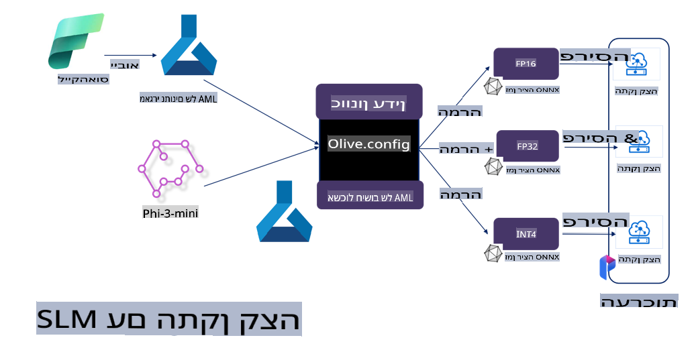

# **כיוונון עדין של Phi-3 עם Microsoft Olive**

[Olive](https://github.com/microsoft/OLive?WT.mc_id=aiml-138114-kinfeylo) הוא כלי אופטימיזציה למודלים שמתחשב בחומרה, קל לשימוש, ומשלב טכניקות מובילות בתעשייה בתחומי דחיסת מודלים, אופטימיזציה וקומפילציה.

הוא נועד לפשט את תהליך האופטימיזציה של מודלים ללמידת מכונה, תוך הבטחה לשימוש היעיל ביותר בארכיטקטורות חומרה ספציפיות.

בין אם אתם עובדים על אפליקציות מבוססות ענן או על התקנים בקצה, Olive מאפשרת לכם לבצע אופטימיזציה למודלים שלכם בקלות וביעילות.

## תכונות עיקריות:
- Olive מאגדת ומבצעת אוטומציה לטכניקות אופטימיזציה עבור חומרה רצויה.
- אין טכניקת אופטימיזציה אחת שמתאימה לכל התרחישים, ולכן Olive מאפשרת הרחבה על ידי שילוב חדשנויות אופטימיזציה של מומחי תעשייה.

## הפחתת מאמץ הנדסי:
- מפתחים נדרשים לעיתים קרובות ללמוד ולהשתמש בכלי עבודה ספציפיים של ספקי חומרה שונים כדי להכין ולבצע אופטימיזציה למודלים המוכנים לפריסה.
- Olive מפשטת את החוויה הזו על ידי אוטומציה של טכניקות האופטימיזציה עבור החומרה הרצויה.

## פתרון אופטימיזציה מקצה לקצה מוכן לשימוש:

על ידי שילוב וכיוונון טכניקות משולבות, Olive מציעה פתרון מאוחד לאופטימיזציה מקצה לקצה.
היא לוקחת בחשבון אילוצים כמו דיוק והשיהוי בעת ביצוע האופטימיזציה למודלים.

## שימוש ב-Microsoft Olive לכיוונון עדין

Microsoft Olive הוא כלי אופטימיזציה בקוד פתוח וקל לשימוש, שיכול לכסות גם כיוונון עדין וגם רפרנס בתחום הבינה המלאכותית הגנרטיבית. הוא דורש רק הגדרה פשוטה, ובשילוב עם שימוש במודלים קטנים בקוד פתוח וסביבות ריצה רלוונטיות (AzureML / GPU מקומי, CPU, DirectML), ניתן להשלים את הכיוונון העדין או הרפרנס של המודל באמצעות אופטימיזציה אוטומטית, ולמצוא את המודל הטוב ביותר לפריסה לענן או להתקנים בקצה. הדבר מאפשר לארגונים לבנות מודלים מותאמים לתעשייה שלהם, הן באתר הארגון והן בענן.


## כיוונון עדין של Phi-3 עם Microsoft Olive 



## דוגמת קוד ויישום ל-Phi-3 עם Olive
בדוגמה זו תשתמשו ב-Olive כדי:

- לבצע כיוונון עדין למתאם LoRA לסיווג ביטויים לעצוב, שמחה, פחד והפתעה.
- למזג את משקלי המתאם לתוך מודל הבסיס.
- לבצע אופטימיזציה וכימות של המודל ל-int4.

[דוגמת קוד](../../code/03.Finetuning/olive-ort-example/README.md)

### התקנת Microsoft Olive

התקנת Microsoft Olive היא פשוטה מאוד, וניתן להתקינה עבור CPU, GPU, DirectML ו-Azure ML

```bash
pip install olive-ai
```

אם ברצונכם להריץ מודל ONNX עם CPU, תוכלו להשתמש ב-

```bash
pip install olive-ai[cpu]
```

אם ברצונכם להריץ מודל ONNX עם GPU, תוכלו להשתמש ב-

```python
pip install olive-ai[gpu]
```

אם ברצונכם להשתמש ב-Azure ML, השתמשו ב-

```python
pip install git+https://github.com/microsoft/Olive#egg=olive-ai[azureml]
```

**הערה**
דרישות מערכת הפעלה: Ubuntu 20.04 / 22.04 

### **Config.json של Microsoft Olive**

לאחר ההתקנה, ניתן להגדיר הגדרות ספציפיות למודל דרך קובץ ההגדרות, כולל נתונים, חישוב, אימון, פריסה ויצירת מודלים.

**1. נתונים**

ב-Microsoft Olive ניתן לתמוך באימון על נתונים מקומיים ונתוני ענן, וניתן להגדיר זאת בהגדרות.

*הגדרות נתונים מקומיים*

ניתן להגדיר בקלות את מערך הנתונים שצריך לאמן לכיוונון עדין, לרוב בפורמט json, ולהתאים אותו לתבנית הנתונים. יש להתאים זאת לדרישות המודל (לדוגמה, להתאים לפורמט הנדרש על ידי Microsoft Phi-3-mini. אם יש לכם מודלים אחרים, נא להתייחס לפורמטים הנדרשים לכיוונון עדין של מודלים אחרים).

```json

    "data_configs": [
        {
            "name": "dataset_default_train",
            "type": "HuggingfaceContainer",
            "load_dataset_config": {
                "params": {
                    "data_name": "json", 
                    "data_files":"dataset/dataset-classification.json",
                    "split": "train"
                }
            },
            "pre_process_data_config": {
                "params": {
                    "dataset_type": "corpus",
                    "text_cols": [
                            "phrase",
                            "tone"
                    ],
                    "text_template": "### Text: {phrase}\n### The tone is:\n{tone}",
                    "corpus_strategy": "join",
                    "source_max_len": 2048,
                    "pad_to_max_len": false,
                    "use_attention_mask": false
                }
            }
        }
    ],
```

**הגדרות מקור נתוני ענן**

על ידי קישור ה-datastore של Azure AI Studio/Azure Machine Learning Service לנתונים בענן, ניתן לבחור להכניס מקורות נתונים שונים ל-Azure AI Studio/Azure Machine Learning Service באמצעות Microsoft Fabric ו-Azure Data כתמיכה לכיוונון עדין של הנתונים.

```json

    "data_configs": [
        {
            "name": "dataset_default_train",
            "type": "HuggingfaceContainer",
            "load_dataset_config": {
                "params": {
                    "data_name": "json", 
                    "data_files": {
                        "type": "azureml_datastore",
                        "config": {
                            "azureml_client": {
                                "subscription_id": "Your Azure Subscrition ID",
                                "resource_group": "Your Azure Resource Group",
                                "workspace_name": "Your Azure ML Workspaces name"
                            },
                            "datastore_name": "workspaceblobstore",
                            "relative_path": "Your train_data.json Azure ML Location"
                        }
                    },
                    "split": "train"
                }
            },
            "pre_process_data_config": {
                "params": {
                    "dataset_type": "corpus",
                    "text_cols": [
                            "Question",
                            "Best Answer"
                    ],
                    "text_template": "<|user|>\n{Question}<|end|>\n<|assistant|>\n{Best Answer}\n<|end|>",
                    "corpus_strategy": "join",
                    "source_max_len": 2048,
                    "pad_to_max_len": false,
                    "use_attention_mask": false
                }
            }
        }
    ],
    
```

**2. הגדרות חישוב**

אם יש צורך בעבודה מקומית, ניתן להשתמש ישירות במשאבי הנתונים המקומיים. אם יש צורך להשתמש במשאבי Azure AI Studio / Azure Machine Learning Service, יש להגדיר את הפרמטרים הרלוונטיים, שם המשאב וכו'.

```json

    "systems": {
        "aml": {
            "type": "AzureML",
            "config": {
                "accelerators": ["gpu"],
                "hf_token": true,
                "aml_compute": "Your Azure AI Studio / Azure Machine Learning Service Compute Name",
                "aml_docker_config": {
                    "base_image": "Your Azure AI Studio / Azure Machine Learning Service docker",
                    "conda_file_path": "conda.yaml"
                }
            }
        },
        "azure_arc": {
            "type": "AzureML",
            "config": {
                "accelerators": ["gpu"],
                "aml_compute": "Your Azure AI Studio / Azure Machine Learning Service Compute Name",
                "aml_docker_config": {
                    "base_image": "Your Azure AI Studio / Azure Machine Learning Service docker",
                    "conda_file_path": "conda.yaml"
                }
            }
        }
    },
```

***הערה***

מכיוון שהריצה מתבצעת דרך קונטיינר על Azure AI Studio/Azure Machine Learning Service, יש להגדיר את הסביבה הנדרשת. הדבר מוגדר בקובץ הסביבה conda.yaml.

```yaml

name: project_environment
channels:
  - defaults
dependencies:
  - python=3.8.13
  - pip=22.3.1
  - pip:
      - einops
      - accelerate
      - azure-keyvault-secrets
      - azure-identity
      - bitsandbytes
      - datasets
      - huggingface_hub
      - peft
      - scipy
      - sentencepiece
      - torch>=2.2.0
      - transformers
      - git+https://github.com/microsoft/Olive@jiapli/mlflow_loading_fix#egg=olive-ai[gpu]
      - --extra-index-url https://aiinfra.pkgs.visualstudio.com/PublicPackages/_packaging/ORT-Nightly/pypi/simple/ 
      - ort-nightly-gpu==1.18.0.dev20240307004
      - --extra-index-url https://aiinfra.pkgs.visualstudio.com/PublicPackages/_packaging/onnxruntime-genai/pypi/simple/
      - onnxruntime-genai-cuda

    

```

**3. בחירת SLM**

ניתן להשתמש במודל ישירות מ-Hugging Face, או לשלב אותו ישירות עם Model Catalog של Azure AI Studio / Azure Machine Learning כדי לבחור את המודל לשימוש. בדוגמת הקוד למטה נשתמש ב-Microsoft Phi-3-mini כדוגמה.

אם יש לכם את המודל באופן מקומי, תוכלו להשתמש בשיטה זו:

```json

    "input_model":{
        "type": "PyTorchModel",
        "config": {
            "hf_config": {
                "model_name": "model-cache/microsoft/phi-3-mini",
                "task": "text-generation",
                "model_loading_args": {
                    "trust_remote_code": true
                }
            }
        }
    },
```

אם ברצונכם להשתמש במודל מ-Azure AI Studio / Azure Machine Learning Service, תוכלו להשתמש בשיטה זו:

```json

    "input_model":{
        "type": "PyTorchModel",
        "config": {
            "model_path": {
                "type": "azureml_registry_model",
                "config": {
                    "name": "microsoft/Phi-3-mini-4k-instruct",
                    "registry_name": "azureml-msr",
                    "version": "11"
                }
            },
             "model_file_format": "PyTorch.MLflow",
             "hf_config": {
                "model_name": "microsoft/Phi-3-mini-4k-instruct",
                "task": "text-generation",
                "from_pretrained_args": {
                    "trust_remote_code": true
                }
            }
        }
    },
```

**הערה:**
יש לשלב עם Azure AI Studio / Azure Machine Learning Service, ולכן בעת הגדרת המודל, יש להתייחס למספר הגרסה ולשמות הרלוונטיים.

כל המודלים ב-Azure צריכים להיות מוגדרים כ-PyTorch.MLflow.

יש צורך בחשבון Hugging Face ולחבר את המפתח לערך Key של Azure AI Studio / Azure Machine Learning.

**4. אלגוריתם**

Microsoft Olive כוללת בצורה מצוינת את אלגוריתמי הכיוונון העדין Lora ו-QLora. כל שעליכם לעשות הוא להגדיר כמה פרמטרים רלוונטיים. כאן אקח את QLora כדוגמה.

```json
        "lora": {
            "type": "LoRA",
            "config": {
                "target_modules": [
                    "o_proj",
                    "qkv_proj"
                ],
                "double_quant": true,
                "lora_r": 64,
                "lora_alpha": 64,
                "lora_dropout": 0.1,
                "train_data_config": "dataset_default_train",
                "eval_dataset_size": 0.3,
                "training_args": {
                    "seed": 0,
                    "data_seed": 42,
                    "per_device_train_batch_size": 1,
                    "per_device_eval_batch_size": 1,
                    "gradient_accumulation_steps": 4,
                    "gradient_checkpointing": false,
                    "learning_rate": 0.0001,
                    "num_train_epochs": 3,
                    "max_steps": 10,
                    "logging_steps": 10,
                    "evaluation_strategy": "steps",
                    "eval_steps": 187,
                    "group_by_length": true,
                    "adam_beta2": 0.999,
                    "max_grad_norm": 0.3
                }
            }
        },
```

אם ברצונכם לבצע המרה לכימות, ענף Microsoft Olive הראשי כבר תומך בשיטת onnxruntime-genai. ניתן להגדיר זאת בהתאם לצרכים שלכם:

1. מיזוג משקלי המתאם לתוך מודל הבסיס.
2. המרת המודל למודל onnx בדיוק הנדרש באמצעות ModelBuilder.

לדוגמה, המרה ל-INT4 מכומת:

```json

        "merge_adapter_weights": {
            "type": "MergeAdapterWeights"
        },
        "builder": {
            "type": "ModelBuilder",
            "config": {
                "precision": "int4"
            }
        }
```

**הערה** 
- אם אתם משתמשים ב-QLoRA, המרת כימות של ONNXRuntime-genai אינה נתמכת בשלב זה.

- יש לציין כאן שניתן להגדיר את השלבים הנ"ל בהתאם לצרכים שלכם. אין חובה להגדיר את כל השלבים הללו במלואם. בהתאם לצרכים שלכם, ניתן להשתמש בשלבים של האלגוריתם ללא כיוונון עדין. בסופו של דבר, יש להגדיר את המנועים הרלוונטיים.

```json

    "engine": {
        "log_severity_level": 0,
        "host": "aml",
        "target": "aml",
        "search_strategy": false,
        "execution_providers": ["CUDAExecutionProvider"],
        "cache_dir": "../model-cache/models/phi3-finetuned/cache",
        "output_dir" : "../model-cache/models/phi3-finetuned"
    }
```

**5. סיום כיוונון עדין**

בשורת הפקודה, יש להריץ בתיקייה של olive-config.json:

```bash
olive run --config olive-config.json  
```

**הבהרה**:  
מסמך זה תורגם באמצעות שירותי תרגום מבוססי בינה מלאכותית. למרות שאנו שואפים לדיוק, יש לקחת בחשבון שתרגומים אוטומטיים עשויים להכיל טעויות או אי-דיוקים. המסמך המקורי בשפתו המקורית הוא המקור המחייב. למידע קריטי, מומלץ להשתמש בתרגום מקצועי אנושי. איננו אחראים לאי-הבנות או לפרשנויות שגויות הנובעות מהשימוש בתרגום זה.