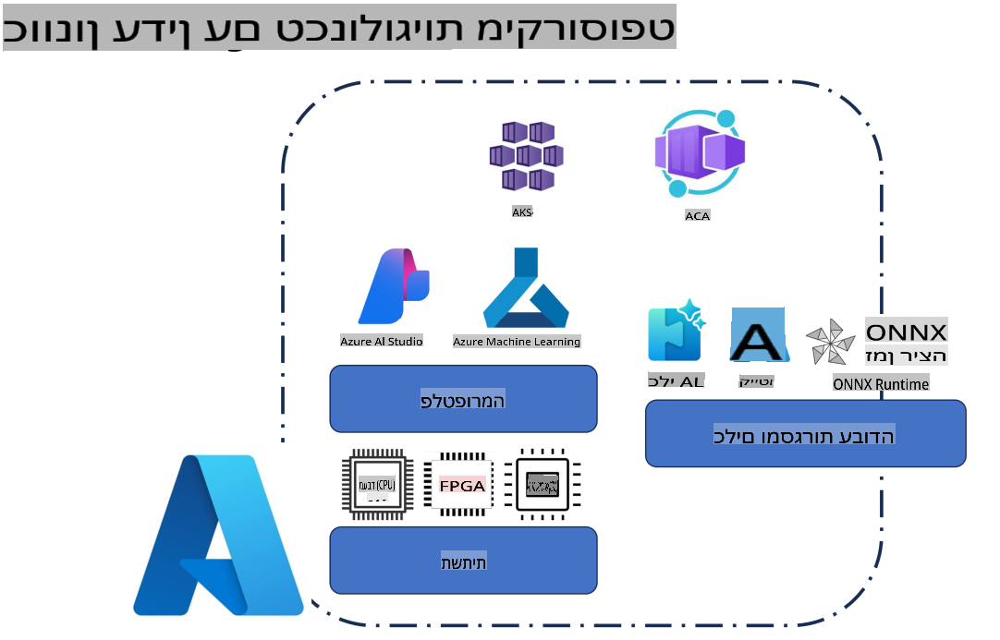
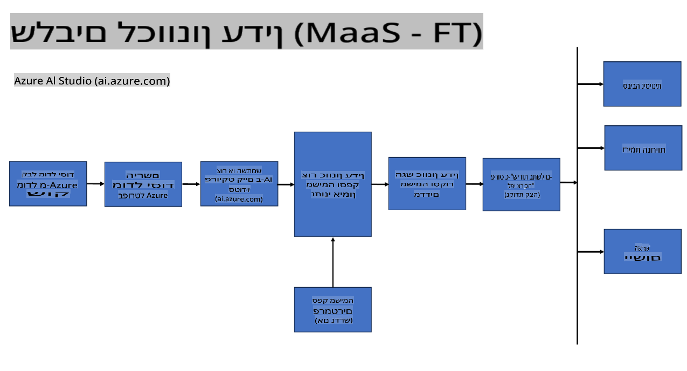
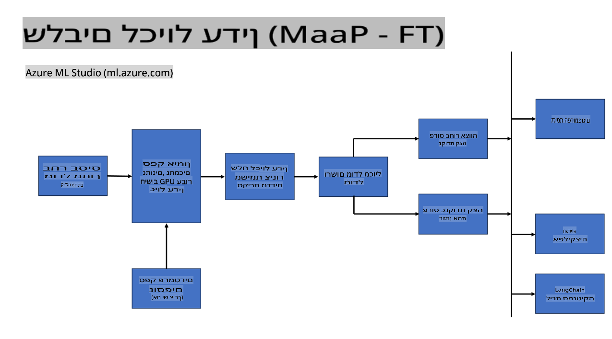
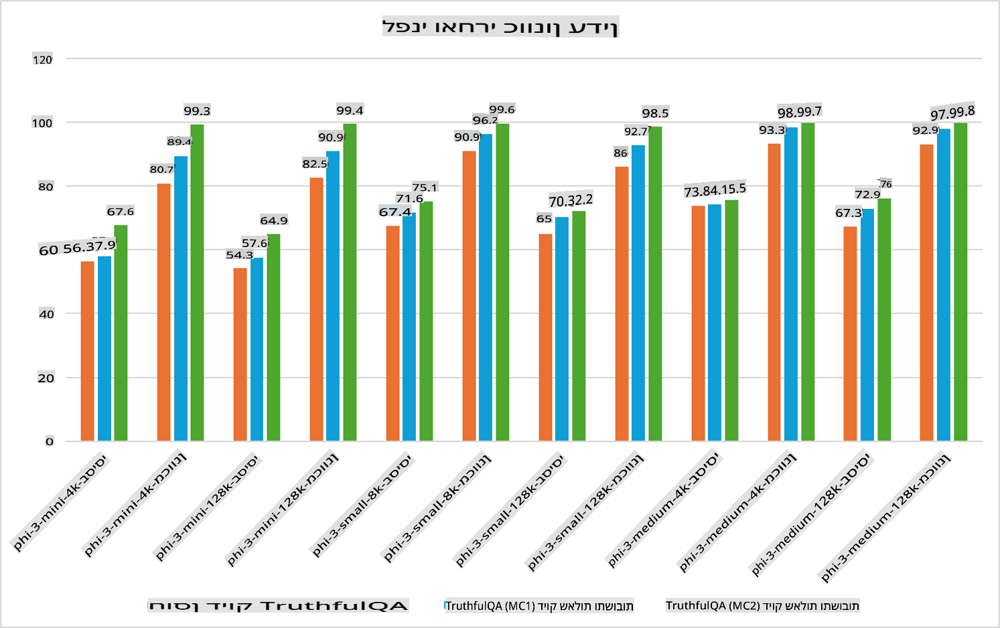

## תרחישי התאמה אישית

**פלטפורמה** זה כולל טכנולוגיות שונות כמו Azure AI Foundry, Azure Machine Learning, AI Tools, Kaito, ו-ONNX Runtime.

**תשתית** זה כולל את ה-CPU וה-FPGA, שהם חיוניים לתהליך ההתאמה האישית. הנה האייקונים של כל אחת מהטכנולוגיות האלו.

**כלים ומסגרות עבודה** זה כולל ONNX Runtime ו-ONNX Runtime. הנה האייקונים של כל אחת מהטכנולוגיות האלו.  
[הוספת אייקונים עבור ONNX Runtime ו-ONNX Runtime]

תהליך ההתאמה האישית עם טכנולוגיות Microsoft כולל רכיבים וכלים שונים. על ידי הבנה ושימוש נכון בטכנולוגיות האלו, ניתן להתאים את היישומים שלנו בצורה יעילה וליצור פתרונות טובים יותר.

## מודל כשירות

התאמה אישית של המודל באמצעות שירות מותאם בענן, ללא צורך בניהול תשתיות חישוב.

התאמה אישית ללא שרת זמינה עבור דגמי Phi-3-mini ו-Phi-3-medium, ומאפשרת למפתחים להתאים במהירות ובקלות את הדגמים עבור תרחישי ענן וקצה ללא צורך לדאוג לניהול תשתיות חישוב. כמו כן, הכרזנו כי Phi-3-small זמין כעת כחלק מהצעת ה-Models-as-a-Service שלנו, כך שמפתחים יכולים להתחיל לעבוד עם AI במהירות ובקלות ללא צורך לנהל את התשתית הבסיסית.

## מודל כפלטפורמה

משתמשים מנהלים את תשתיות החישוב שלהם לצורך התאמה אישית של המודלים.

[דוגמה להתאמה אישית](https://github.com/Azure/azureml-examples/blob/main/sdk/python/foundation-models/system/finetune/chat-completion/chat-completion.ipynb)

## תרחישי התאמה אישית

| | | | | | | |
|-|-|-|-|-|-|-|
|תרחיש|LoRA|QLoRA|PEFT|DeepSpeed|ZeRO|DORA|
|התאמת מודלים לשפה טבעית (LLMs) למשימות או תחומים ספציפיים|כן|כן|כן|כן|כן|כן|
|התאמה אישית למשימות NLP כמו סיווג טקסט, זיהוי ישויות, ותירגום מכונה|כן|כן|כן|כן|כן|כן|
|התאמה אישית למשימות שאלות ותשובות (QA)|כן|כן|כן|כן|כן|כן|
|התאמה אישית ליצירת תגובות דמויות אנוש בצ'אטבוטים|כן|כן|כן|כן|כן|כן|
|התאמה אישית ליצירת מוזיקה, אמנות, או צורות יצירתיות אחרות|כן|כן|כן|כן|כן|כן|
|הפחתת עלויות חישוב וכלכליות|כן|כן|לא|כן|כן|לא|
|הפחתת שימוש בזיכרון|לא|כן|לא|כן|כן|כן|
|שימוש בפחות פרמטרים להתאמה אישית יעילה|לא|כן|כן|לא|לא|כן|
|צורת מקביליות יעילה בזיכרון שמאפשרת גישה לזיכרון ה-GPU הכולל של כל המכשירים הזמינים|לא|לא|לא|כן|כן|כן|

## דוגמאות לביצועי התאמה אישית

**כתב ויתור**:  
מסמך זה תורגם באמצעות שירותי תרגום מבוססי בינה מלאכותית. למרות שאנו שואפים לדיוק, יש להיות מודעים לכך שתרגומים אוטומטיים עשויים להכיל שגיאות או אי-דיוקים. המסמך המקורי בשפתו המקורית צריך להיחשב כמקור הסמכותי. למידע קריטי, מומלץ להשתמש בתרגום מקצועי על ידי מתרגם אנושי. איננו נושאים באחריות לכל אי-הבנה או פירוש שגוי הנובע מהשימוש בתרגום זה.