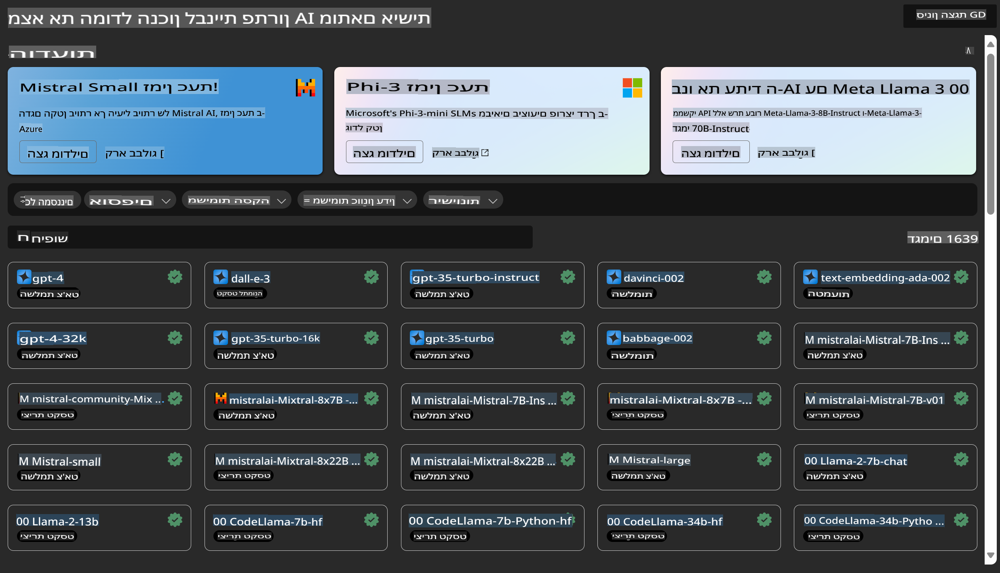

# **היכרות עם שירות Azure Machine Learning**

[Azure Machine Learning](https://ml.azure.com?WT.mc_id=aiml-138114-kinfeylo) הוא שירות ענן שמטרתו להאיץ ולנהל את מחזור החיים של פרויקטים בתחום למידת מכונה (ML).

מקצועני ML, מדעני נתונים ומהנדסים יכולים להשתמש בו כחלק משגרת העבודה שלהם כדי:

- לאמן ולפרוס מודלים.  
- לנהל פעולות למידת מכונה (MLOps).  
- ניתן ליצור מודל ב-Azure Machine Learning או להשתמש במודל שנבנה בפלטפורמה בקוד פתוח, כמו PyTorch, TensorFlow או scikit-learn.  
- כלים של MLOps מאפשרים ניטור, אימון מחדש ופריסה מחודשת של מודלים.  

## למי מיועד Azure Machine Learning?

**מדעני נתונים ומהנדסי ML**

הם יכולים להשתמש בכלים שמאיצים ומייעלים את העבודה היומיומית שלהם.  
Azure ML מספק תכונות כמו הוגנות, יכולת הסבר, מעקב ואפשרות לביקורת.  

**מפתחי אפליקציות**

הם יכולים לשלב מודלים באפליקציות או בשירותים בצורה חלקה.  

**מפתחי פלטפורמות**

יש להם גישה לסט כלים עוצמתי המבוסס על APIs של Azure Resource Manager.  
כלים אלו מאפשרים לבנות כלי ML מתקדמים.  

**ארגונים**

כאשר עובדים בענן Microsoft Azure, ארגונים נהנים מביטחון מוכר ושליטה מבוססת תפקידים.  
ניתן להגדיר פרויקטים לשליטה בגישה לנתונים מוגנים ולפעולות ספציפיות.  

## פרודוקטיביות לכל חברי הצוות

פרויקטים בתחום ML דורשים לעיתים קרובות צוות עם מגוון מיומנויות לבנייה ותחזוקה.  

Azure ML מספק כלים המאפשרים:  
- שיתוף פעולה עם הצוות באמצעות מחברות משותפות, משאבי מחשוב, מחשוב ללא שרתים, נתונים וסביבות.  
- פיתוח מודלים עם הוגנות, יכולת הסבר, מעקב ואפשרות לביקורת כדי לעמוד בדרישות תאימות ושקיפות.  
- פריסת מודלים של ML בקלות ובמהירות בקנה מידה רחב, וניהולם בצורה יעילה באמצעות MLOps.  
- הרצת עומסי עבודה של למידת מכונה בכל מקום עם ניהול, אבטחה ותאימות מובנים.  

## כלים חוצי פלטפורמות

כל חבר בצוות ML יכול להשתמש בכלים המועדפים עליו כדי לבצע את העבודה.  
בין אם מדובר בהרצת ניסויים מהירים, כיוונון היפר-פרמטרים, בניית פייפליינים או ניהול הסקות, ניתן להשתמש בממשקים מוכרים כמו:  
- Azure Machine Learning Studio  
- Python SDK (v2)  
- Azure CLI (v2)  
- Azure Resource Manager REST APIs  

ככל שמשפרים מודלים ומשתפים פעולה לאורך מחזור הפיתוח, ניתן לשתף ולמצוא נכסים, משאבים ומדדים בממשק המשתמש של Azure Machine Learning Studio.  

## **LLM/SLM ב-Azure ML**

Azure ML הוסיפה פונקציות רבות הקשורות ל-LLM/SLM, ומשלבת LLMOps ו-SLMOps כדי ליצור פלטפורמת טכנולוגיה גנרטיבית עבור ארגונים.  

### **קטלוג מודלים**

משתמשים ארגוניים יכולים לפרוס מודלים שונים בהתאם לתרחישים עסקיים שונים דרך קטלוג המודלים, ולספק שירותים כ-Model as Service למפתחים או משתמשים בארגון.  

קטלוג המודלים ב-Azure Machine Learning Studio הוא מרכז שבו ניתן לגלות ולהשתמש במגוון רחב של מודלים שמאפשרים בניית אפליקציות AI גנרטיביות. הקטלוג כולל מאות מודלים מספקי מודלים שונים כמו Azure OpenAI Service, Mistral, Meta, Cohere, Nvidia, Hugging Face, כולל מודלים שאומנו על ידי Microsoft. מודלים מספקים שאינם Microsoft מוגדרים כ"מוצרים שאינם של Microsoft", לפי תנאי המוצרים של Microsoft, וכפופים לתנאים הנלווים למודל.  

### **פייפליין משימות**

הליבה של פייפליין למידת מכונה היא חלוקת משימת למידת מכונה שלמה לזרימת עבודה מרובת שלבים. כל שלב הוא רכיב שניתן לפתח, לשפר, להגדיר ולהפעיל באופן אוטומטי בנפרד. השלבים מחוברים דרך ממשקים מוגדרים היטב. שירות הפייפליין של Azure Machine Learning מארגן אוטומטית את כל התלויות בין שלבי הפייפליין.  

בתהליך כיוונון SLM/LLM, ניתן לנהל את הנתונים, האימון ותהליכי היצירה שלנו באמצעות פייפליין.  

### **Prompt flow**

**יתרונות השימוש ב-Azure Machine Learning Prompt Flow**  
Azure Machine Learning Prompt Flow מציע מגוון יתרונות שעוזרים למשתמשים לעבור משלב הרעיון לשלב הניסוי ולבסוף לאפליקציות מבוססות LLM מוכנות לייצור:  

**גמישות בהנדסת פרומפטים**  

- חוויית כתיבה אינטראקטיבית: Azure Machine Learning Prompt Flow מספק ייצוג ויזואלי של מבנה הזרימה, המאפשר למשתמשים להבין ולנווט בפרויקטים שלהם בקלות. בנוסף, הוא מציע חוויית קידוד דמוית מחברת לפיתוח ופתרון בעיות בזרימה בצורה יעילה.  
- גרסאות לכיוונון פרומפטים: משתמשים יכולים ליצור ולהשוות מספר גרסאות של פרומפטים, מה שמאפשר תהליך שיפור איטרטיבי.  
- הערכה: זרימות הערכה מובנות מאפשרות למשתמשים להעריך את האיכות והאפקטיביות של הפרומפטים והזרימות שלהם.  
- משאבים מקיפים: Azure Machine Learning Prompt Flow כולל ספרייה של כלים מובנים, דוגמאות ותבניות שמספקים נקודת התחלה לפיתוח, מעוררים יצירתיות ומאיצים את התהליך.  

**מוכנות ארגונית לאפליקציות מבוססות LLM**  

- שיתוף פעולה: Azure Machine Learning Prompt Flow תומך בשיתוף פעולה צוותי, המאפשר למספר משתמשים לעבוד יחד על פרויקטים של הנדסת פרומפטים, לשתף ידע ולשמור על שליטה בגרסאות.  
- פלטפורמה כוללת: Azure Machine Learning Prompt Flow מייעל את כל תהליך הנדסת הפרומפטים, מפיתוח והערכה ועד לפריסה וניטור. משתמשים יכולים לפרוס בקלות את הזרימות שלהם כנקודות קצה של Azure Machine Learning ולנטר את הביצועים שלהן בזמן אמת, להבטחת פעולה אופטימלית ושיפור מתמשך.  
- פתרונות מוכנות ארגונית של Azure Machine Learning: Prompt Flow מנצל את הפתרונות הארגוניים של Azure Machine Learning, המספקים תשתית מאובטחת, ניתנת להרחבה ואמינה לפיתוח, ניסוי ופריסה של זרימות.  

עם Azure Machine Learning Prompt Flow, משתמשים יכולים למקסם את הגמישות בהנדסת פרומפטים, לשתף פעולה ביעילות ולנצל פתרונות ברמה ארגונית לפיתוח ופריסה מוצלחים של אפליקציות מבוססות LLM.  

בשילוב הכוח החישובי, הנתונים והרכיבים השונים של Azure ML, מפתחים ארגוניים יכולים לבנות בקלות את האפליקציות שלהם בתחום הבינה המלאכותית.  

**כתב ויתור**:  
מסמך זה תורגם באמצעות שירותי תרגום מבוססי בינה מלאכותית. למרות שאנו שואפים לדיוק, יש לקחת בחשבון שתרגומים אוטומטיים עשויים להכיל שגיאות או אי-דיוקים. המסמך המקורי בשפתו המקורית צריך להיחשב כמקור הסמכותי. למידע קריטי, מומלץ להשתמש בשירותי תרגום אנושיים מקצועיים. איננו נושאים באחריות לאי-הבנות או לפרשנויות שגויות הנובעות משימוש בתרגום זה.