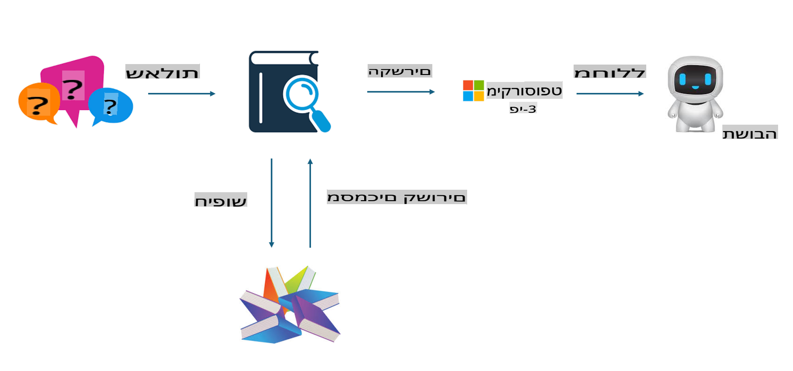
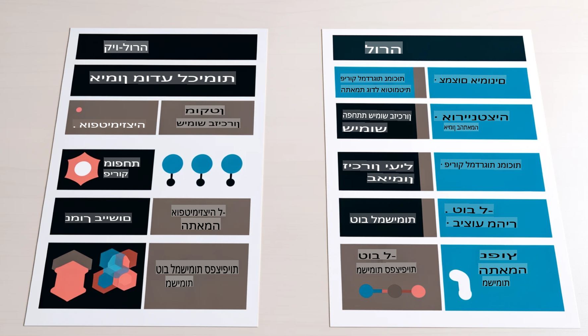

# **הפוך את Phi-3 למומחה תעשייתי**

כדי לשלב את מודל Phi-3 בתעשייה, יש להוסיף נתוני עסקים תעשייתיים למודל Phi-3. יש לנו שתי אפשרויות שונות: הראשונה היא RAG (Retrieval Augmented Generation) והשנייה היא Fine Tuning.

## **RAG לעומת Fine-Tuning**

### **Retrieval Augmented Generation**

RAG הוא שילוב של שליפת נתונים + יצירת טקסט. הנתונים המובנים והלא מובנים של הארגון נשמרים בבסיס נתונים וקטורי. בעת חיפוש תוכן רלוונטי, נמצא סיכום ותוכן רלוונטי ליצירת הקשר, ומשולבים עם יכולות השלמת הטקסט של LLM/SLM כדי לייצר תוכן.

### **Fine-tuning**

Fine-tuning מבוסס על שיפור של מודל מסוים. אין צורך להתחיל מאלגוריתם המודל, אבל יש צורך לצבור נתונים באופן מתמשך. אם נדרשת טרמינולוגיה מדויקת יותר והבעה שפתית מדויקת ביישומים תעשייתיים, Fine-tuning הוא הבחירה הטובה יותר. עם זאת, אם הנתונים שלך משתנים בתדירות גבוהה, Fine-tuning עלול להיות מורכב.

### **איך לבחור**

1. אם התשובה שלנו דורשת שילוב של נתונים חיצוניים, RAG הוא הבחירה הטובה ביותר.

2. אם יש צורך להפיק ידע תעשייתי יציב ומדויק, Fine-tuning תהיה בחירה טובה. RAG מתמקד בשליפת תוכן רלוונטי אך ייתכן שלא תמיד יקלוט את הניואנסים המיוחדים.

3. Fine-tuning דורש סט נתונים איכותי, ואם מדובר בטווח נתונים קטן בלבד, לא יהיה הבדל משמעותי. RAG גמיש יותר.

4. Fine-tuning הוא כמו קופסה שחורה, קשה להבין את המנגנון הפנימי שלו. לעומת זאת, RAG מקל על מציאת מקור הנתונים, ובכך מאפשר לתקן שגיאות תוכן או "הזיות" בצורה יעילה יותר ומספק שקיפות טובה יותר.

### **תסריטים**

1. תעשיות אנכיות הדורשות אוצר מילים מקצועי וביטויים ספציפיים - ***Fine-tuning*** יהיה הבחירה הטובה ביותר.

2. מערכת שאלות ותשובות (QA), המערבת סינתזה של נקודות ידע שונות - ***RAG*** יהיה הבחירה הטובה ביותר.

3. שילוב של תהליכים עסקיים אוטומטיים - ***RAG + Fine-tuning*** הוא השילוב הטוב ביותר.

## **איך להשתמש ב-RAG**

בסיס נתונים וקטורי הוא אוסף נתונים המאוחסן בצורה מתמטית. בסיסי נתונים וקטוריים מקלים על מודלים של למידת מכונה לזכור קלטים קודמים, מה שמאפשר להשתמש בלמידת מכונה כדי לתמוך במקרים כמו חיפוש, המלצות ויצירת טקסט. ניתן לזהות נתונים על בסיס מדדי דמיון ולא התאמות מדויקות, מה שמאפשר למודלים ממוחשבים להבין את הקשר הנתונים.

בסיס נתונים וקטורי הוא המפתח למימוש RAG. ניתן להמיר נתונים לאחסון וקטורי באמצעות מודלים וקטוריים כמו text-embedding-3, jina-ai-embedding, ועוד.

למידע נוסף על יצירת יישום RAG: [https://github.com/microsoft/Phi-3CookBook](https://github.com/microsoft/Phi-3CookBook?WT.mc_id=aiml-138114-kinfeylo)

## **איך להשתמש ב-Fine-tuning**

האלגוריתמים הנפוצים ב-Fine-tuning הם Lora ו-QLora. איך לבחור?
- [למידע נוסף עם המחברת לדוגמה הזו](../../../../code/04.Finetuning/Phi_3_Inference_Finetuning.ipynb)
- [דוגמה לתסריט FineTuning בפייתון](../../../../code/04.Finetuning/FineTrainingScript.py)

### **Lora ו-QLora**

LoRA (Low-Rank Adaptation) ו-QLoRA (Quantized Low-Rank Adaptation) הן טכניקות המשמשות להתאמה אישית של מודלים שפתיים גדולים (LLMs) באמצעות שיטות PEFT (Parameter Efficient Fine Tuning). שיטות PEFT נועדו לאמן מודלים בצורה יעילה יותר מאשר שיטות מסורתיות.

LoRA היא טכניקת Fine-tuning עצמאית שמפחיתה את צריכת הזיכרון על ידי יישום קירוב מדרג נמוך למטריצת עדכון המשקלים. היא מציעה זמני אימון מהירים ושומרת על ביצועים קרובים לשיטות Fine-tuning מסורתיות.

QLoRA היא גרסה מורחבת של LoRA שמשלבת טכניקות כימות (Quantization) להפחתה נוספת של צריכת הזיכרון. QLoRA מכמתת את דיוק פרמטרי המשקל במודל המאומן לדיוק של 4 ביטים, מה שיותר יעיל בזיכרון מ-LoRA. עם זאת, אימון QLoRA איטי בכ-30% מאימון LoRA בשל שלבי הכימות והפירוק מכימות.

QLoRA משתמשת ב-LoRA כאביזר לתיקון השגיאות שנגרמות במהלך תהליך הכימות. QLoRA מאפשרת התאמה אישית של מודלים ענקיים עם מיליארדי פרמטרים על גבי GPUs קטנים וזמינים יחסית. לדוגמה, QLoRA יכולה לבצע Fine-tuning למודל של 70B פרמטרים שדורש 36 GPUs עם שימוש ב-2 בלבד.

**כתב ויתור**:  
מסמך זה תורגם באמצעות שירותי תרגום מבוססי בינה מלאכותית. למרות שאנו שואפים לדיוק, יש לקחת בחשבון שתרגומים אוטומטיים עשויים לכלול שגיאות או אי-דיוקים. המסמך המקורי בשפתו המקורית הוא זה שיש להתייחס אליו כמקור סמכותי. עבור מידע קריטי, מומלץ להשתמש בשירותי תרגום אנושיים מקצועיים. אנו לא נושאים באחריות לאי-הבנות או לפרשנויות שגויות הנובעות מהשימוש בתרגום זה.