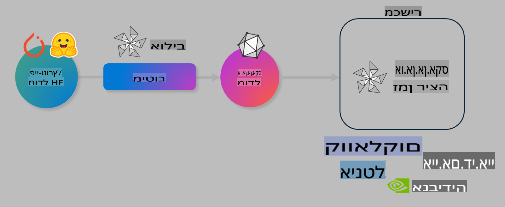

# מעבדה. אופטימיזציה של מודלים של AI עבור ביצוע במכשיר

## מבוא 

> [!IMPORTANT]
> מעבדה זו דורשת **Nvidia A10 או A100 GPU** עם מנהלי התקנים נלווים וכלי CUDA (גרסה 12+).

> [!NOTE]
> זוהי מעבדה של **35 דקות** שתעניק לך היכרות מעשית עם עקרונות הליבה של אופטימיזציית מודלים עבור ביצוע במכשיר באמצעות OLIVE.

## מטרות למידה

בסיום מעבדה זו, תוכל להשתמש ב-OLIVE כדי:

- לבצע כימות למודל AI באמצעות שיטת הכימות AWQ.
- לבצע התאמה מדויקת (Fine-tuning) למודל AI למשימה ספציפית.
- ליצור LoRA adapters (מודלים מותאמים) לביצוע יעיל במכשיר באמצעות ONNX Runtime.

### מה זה Olive

Olive (*O*NNX *live*) הוא כלי אופטימיזציה למודלים עם ממשק CLI שמאפשר לך לשחרר מודלים עבור ONNX runtime +++https://onnxruntime.ai+++ עם איכות וביצועים מיטביים.



הקלט ל-Olive הוא בדרך כלל מודל PyTorch או Hugging Face, והפלט הוא מודל ONNX מותאם שמבוצע במכשיר (יעד פריסה) עם ONNX runtime. Olive מבצע אופטימיזציה למודל עבור מאיץ ה-AI של יעד הפריסה (NPU, GPU, CPU) שמסופק על ידי יצרן חומרה כמו Qualcomm, AMD, Nvidia או Intel.

Olive מבצע *workflow*, שהוא רצף מסודר של משימות אופטימיזציה למודל שנקראות *passes* - דוגמאות ל-passes כוללות: דחיסת מודלים, לכידת גרפים, כימות, ואופטימיזציית גרפים. לכל pass יש סט פרמטרים שניתן לכוון כדי להשיג את המטריקות הטובות ביותר, כגון דיוק וזמן תגובה, שמוערכים על ידי המעריך המתאים. Olive משתמש באסטרטגיית חיפוש שמפעילה אלגוריתם חיפוש כדי לכוון באופן אוטומטי כל pass בנפרד או קבוצת passes יחד.

#### יתרונות של Olive

- **חיסכון בזמן ותסכול** של ניסוי וטעייה ידני עם טכניקות שונות של אופטימיזציית גרפים, דחיסה וכימות. הגדר את מגבלות האיכות והביצועים שלך ותן ל-Olive למצוא עבורך את המודל הטוב ביותר באופן אוטומטי.
- **יותר מ-40 רכיבי אופטימיזציה למודלים** שמכסים טכניקות מתקדמות בכימות, דחיסה, אופטימיזציית גרפים והתאמה מדויקת.
- **CLI קל לשימוש** למשימות אופטימיזציה נפוצות. לדוגמה, olive quantize, olive auto-opt, olive finetune.
- שילוב מובנה של אריזת מודלים ופריסה.
- תומך ביצירת מודלים עבור **Multi LoRA serving**.
- יצירת workflows באמצעות YAML/JSON לניהול משימות אופטימיזציה ופריסה.
- אינטגרציה עם **Hugging Face** ו-**Azure AI**.
- מנגנון **caching** מובנה כדי **לחסוך בעלויות**.

## הוראות מעבדה
> [!NOTE]
> ודא שהגדרת את Azure AI Hub והפרויקט שלך, והגדרת את המחשב A100 שלך כפי שתואר במעבדה 1.

### שלב 0: התחבר ל-Azure AI Compute שלך

תתחבר ל-Azure AI Compute באמצעות הפונקציה המרוחקת ב-**VS Code.** 

1. פתח את אפליקציית **VS Code** בשולחן העבודה שלך:
1. פתח את **command palette** באמצעות  **Shift+Ctrl+P**.
1. ב-command palette חפש **AzureML - remote: Connect to compute instance in New Window**.
1. עקוב אחרי ההוראות המופיעות על המסך כדי להתחבר ל-Compute. זה יכלול בחירה במנוי Azure שלך, קבוצת המשאבים, פרויקט ושם המחשב שהגדרת במעבדה 1.
1. לאחר שהתחברת ל-Azure ML Compute, זה יוצג **בתחתית השמאלית של Visual Code** `><Azure ML: Compute Name`.

### שלב 1: שיבוט המאגר הזה

ב-VS Code, תוכל לפתוח טרמינל חדש עם **Ctrl+J** ולשבט את המאגר הזה:

בטרמינל תראה את ההנחיה

```
azureuser@computername:~/cloudfiles/code$ 
```
שבט את הפתרון

```bash
cd ~/localfiles
git clone https://github.com/microsoft/phi-3cookbook.git
```

### שלב 2: פתח תיקייה ב-VS Code

כדי לפתוח את VS Code בתיקייה הרלוונטית, בצע את הפקודה הבאה בטרמינל, שתפתח חלון חדש:

```bash
code phi-3cookbook/code/04.Finetuning/Olive-lab
```

לחלופין, תוכל לפתוח את התיקייה על ידי בחירה ב-**File** > **Open Folder**. 

### שלב 3: תלות

פתח חלון טרמינל ב-VS Code ב-Azure AI Compute Instance שלך (טיפ: **Ctrl+J**) ובצע את הפקודות הבאות כדי להתקין את התלות:

```bash
conda create -n olive-ai python=3.11 -y
conda activate olive-ai
pip install -r requirements.txt
az extension remove -n azure-cli-ml
az extension add -n ml
```

> [!NOTE]
> התקנת כל התלות תיקח כ-5 דקות.

במעבדה זו תוריד ותעלה מודלים לקטלוג המודלים של Azure AI. כדי שתוכל לגשת לקטלוג המודלים, תצטרך להתחבר ל-Azure באמצעות:

```bash
az login
```

> [!NOTE]
> בזמן ההתחברות תתבקש לבחור את המנוי שלך. ודא שהמנוי מוגדר לזה שסופק למעבדה זו.

### שלב 4: הפעל פקודות Olive 

פתח חלון טרמינל ב-VS Code ב-Azure AI Compute Instance שלך (טיפ: **Ctrl+J**) וודא שסביבת `olive-ai` conda מופעלת:

```bash
conda activate olive-ai
```

לאחר מכן, הפעל את פקודות Olive הבאות בשורת הפקודה.

1. **בדוק את הנתונים:** בדוגמה זו, תבצע התאמה מדויקת למודל Phi-3.5-Mini כך שהוא יתמחה במענה על שאלות בנושא נסיעות. הקוד למטה מציג את הרשומות הראשונות של מערך הנתונים, שהן בפורמט JSON lines:

    ```bash
    head data/data_sample_travel.jsonl
    ```
1. **כימות המודל:** לפני אימון המודל, תחילה תבצע כימות באמצעות הפקודה הבאה שמשתמשת בטכניקה שנקראת Active Aware Quantization (AWQ) +++https://arxiv.org/abs/2306.00978+++. AWQ מכמת את המשקלים של מודל על ידי התחשבות באקטיבציות שנוצרות במהלך הביצוע. זה אומר שתהליך הכימות לוקח בחשבון את התפלגות הנתונים בפועל באקטיבציות, מה שמוביל לשימור טוב יותר של דיוק המודל בהשוואה לשיטות כימות מסורתיות.

    ```bash
    olive quantize \
       --model_name_or_path microsoft/Phi-3.5-mini-instruct \
       --trust_remote_code \
       --algorithm awq \
       --output_path models/phi/awq \
       --log_level 1
    ```
    
    התהליך לוקח כ-8 דקות להשלמת הכימות, מה שיקטין את גודל המודל מכ-7.5GB לכ-2.5GB.
   
   במעבדה זו, נציג לך כיצד להכניס מודלים מ-Hugging Face (לדוגמה: `microsoft/Phi-3.5-mini-instruct`). However, Olive also allows you to input models from the Azure AI catalog by updating the `model_name_or_path` argument to an Azure AI asset ID (for example:  `azureml://registries/azureml/models/Phi-3.5-mini-instruct/versions/4`). 

1. **Train the model:** Next, the `olive finetune` הפקודה מבצעת התאמה מדויקת למודל הכמותי. כימות המודל *לפני* התאמה מדויקת במקום לאחר מכן משפר את הדיוק, שכן תהליך ההתאמה המדויקת משחזר חלק מהאובדן שנגרם מהכימות.

    ```bash
    olive finetune \
        --method lora \
        --model_name_or_path models/phi/awq \
        --data_files "data/data_sample_travel.jsonl" \
        --data_name "json" \
        --text_template "<|user|>\n{prompt}<|end|>\n<|assistant|>\n{response}<|end|>" \
        --max_steps 100 \
        --output_path ./models/phi/ft \
        --log_level 1
    ```
    
    זה לוקח כ-6 דקות להשלים את ההתאמה המדויקת (עם 100 צעדים).

1. **אופטימיזציה:** לאחר שהמודל אומן, כעת תבצע אופטימיזציה למודל באמצעות הפקודה `auto-opt` command, which will capture the ONNX graph and automatically perform a number of optimizations to improve the model performance for CPU by compressing the model and doing fusions. It should be noted, that you can also optimize for other devices such as NPU or GPU by just updating the `--device` and `--provider` של Olive - אך למטרות מעבדה זו נשתמש ב-CPU.

    ```bash
    olive auto-opt \
       --model_name_or_path models/phi/ft/model \
       --adapter_path models/phi/ft/adapter \
       --device cpu \
       --provider CPUExecutionProvider \
       --use_ort_genai \
       --output_path models/phi/onnx-ao \
       --log_level 1
    ```
    
    זה לוקח כ-5 דקות להשלמת האופטימיזציה.

### שלב 5: בדיקה מהירה של ביצועי המודל

כדי לבדוק את ביצועי המודל, צור קובץ Python בתיקייה שלך בשם **app.py** והעתק-והדבק את הקוד הבא:

```python
import onnxruntime_genai as og
import numpy as np

print("loading model and adapters...", end="", flush=True)
model = og.Model("models/phi/onnx-ao/model")
adapters = og.Adapters(model)
adapters.load("models/phi/onnx-ao/model/adapter_weights.onnx_adapter", "travel")
print("DONE!")

tokenizer = og.Tokenizer(model)
tokenizer_stream = tokenizer.create_stream()

params = og.GeneratorParams(model)
params.set_search_options(max_length=100, past_present_share_buffer=False)
user_input = "what is the best thing to see in chicago"
params.input_ids = tokenizer.encode(f"<|user|>\n{user_input}<|end|>\n<|assistant|>\n")

generator = og.Generator(model, params)

generator.set_active_adapter(adapters, "travel")

print(f"{user_input}")

while not generator.is_done():
    generator.compute_logits()
    generator.generate_next_token()

    new_token = generator.get_next_tokens()[0]
    print(tokenizer_stream.decode(new_token), end='', flush=True)

print("\n")
```

הפעל את הקוד באמצעות:

```bash
python app.py
```

### שלב 6: העלאת מודל ל-Azure AI

העלאת המודל למאגר המודלים של Azure AI מאפשרת שיתוף המודל עם חברי צוות הפיתוח האחרים שלך וגם מטפלת בניהול גרסאות של המודל. כדי להעלות את המודל, הרץ את הפקודה הבאה:

> [!NOTE]
> עדכן את `{}`` placeholders with the name of your resource group and Azure AI Project Name. 

To find your resource group `המשתנים "resourceGroup" ושם פרויקט Azure AI, הרץ את הפקודה הבאה 

```
az ml workspace show
```

או על ידי מעבר ל-+++ai.azure.com+++ ובחירה ב-**management center** **project** **overview**.

עדכן את המקומות המסומנים `{}` עם שם קבוצת המשאבים שלך ושם פרויקט Azure AI.

```bash
az ml model create \
    --name ft-for-travel \
    --version 1 \
    --path ./models/phi/onnx-ao \
    --resource-group {RESOURCE_GROUP_NAME} \
    --workspace-name {PROJECT_NAME}
```
לאחר מכן תוכל לראות את המודל שהעלית ולפרוס אותו בכתובת https://ml.azure.com/model/list

**כתב ויתור**:  
מסמך זה תורגם באמצעות שירותי תרגום מבוססי בינה מלאכותית. למרות שאנו שואפים לדיוק, יש לקחת בחשבון שתרגומים אוטומטיים עשויים להכיל שגיאות או אי-דיוקים. המסמך המקורי בשפתו המקורית נחשב למקור הסמכותי. עבור מידע קריטי, מומלץ להשתמש בתרגום מקצועי על ידי אדם. איננו נושאים באחריות לכל אי-הבנות או פרשנויות שגויות הנובעות משימוש בתרגום זה.