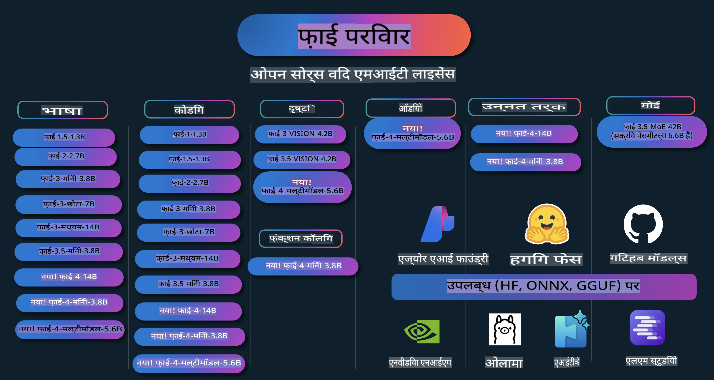

# Phi कुकबुक: Microsoft के Phi मॉडल्स के साथ व्यावहारिक उदाहरण

  

  
  
  
  

  
  
  

Phi माइक्रोसॉफ्ट द्वारा विकसित ओपन सोर्स AI मॉडल्स की एक श्रृंखला है।  

Phi वर्तमान में सबसे शक्तिशाली और किफायती छोटे भाषा मॉडल (SLM) में से एक है, जो बहु-भाषा, तर्क, टेक्स्ट/चैट जनरेशन, कोडिंग, इमेज, ऑडियो और अन्य परिदृश्यों में बेहतरीन प्रदर्शन करता है।  

आप Phi को क्लाउड या एज डिवाइस पर डिप्लॉय कर सकते हैं, और सीमित कंप्यूटिंग पावर के साथ आसानी से जनरेटिव AI एप्लिकेशन बना सकते हैं।  

इन संसाधनों का उपयोग शुरू करने के लिए इन चरणों का पालन करें:  
1. **रेपो को फोर्क करें**: क्लिक करें   
2. **रेपो को क्लोन करें**:   `git clone https://github.com/microsoft/PhiCookBook.git`  
3. [**Microsoft AI Discord Community से जुड़ें और विशेषज्ञों व अन्य डेवलपर्स से मिलें**](https://discord.com/invite/ByRwuEEgH4?WT.mc_id=aiml-137032-kinfeylo)  

## सामग्री की तालिका

- परिचय  
  - [Phi परिवार में आपका स्वागत है](./md/01.Introduction/01/01.PhiFamily.md)  
  - [अपने वातावरण की सेटिंग करना](./md/01.Introduction/01/01.EnvironmentSetup.md)  
  - [मुख्य तकनीकों को समझना](./md/01.Introduction/01/01.Understandingtech.md)  
  - [Phi मॉडल्स के लिए AI सुरक्षा](./md/01.Introduction/01/01.AISafety.md)  
  - [Phi हार्डवेयर समर्थन](./md/01.Introduction/01/01.Hardwaresupport.md)  
  - [Phi मॉडल्स और प्लेटफार्म्स पर उपलब्धता](./md/01.Introduction/01/01.Edgeandcloud.md)  
  - [Guidance-ai और Phi का उपयोग करना](./md/01.Introduction/01/01.Guidance.md)  
  - [GitHub मार्केटप्लेस मॉडल्स](https://github.com/marketplace/models)  
  - [Azure AI मॉडल कैटलॉग](https://ai.azure.com)  

- विभिन्न वातावरणों में Phi को इनफर करना  
    - [Hugging Face](./md/01.Introduction/02/01.HF.md)  
    - [GitHub मॉडल्स](./md/01.Introduction/02/02.GitHubModel.md)  
    - [Azure AI Foundry मॉडल कैटलॉग](./md/01.Introduction/02/03.AzureAIFoundry.md)  
    - [Ollama](./md/01.Introduction/02/04.Ollama.md)  
    - [AI Toolkit VSCode (AITK)](./md/01.Introduction/02/05.AITK.md)  
    - [NVIDIA NIM](./md/01.Introduction/02/06.NVIDIA.md)  

- Phi परिवार का इनफरेंस  
    - [iOS में Phi का इनफरेंस](./md/01.Introduction/03/iOS_Inference.md)  
    - [Android में Phi का इनफरेंस](./md/01.Introduction/03/Android_Inference.md)  
- [जेटसन में Phi का Inference](./md/01.Introduction/03/Jetson_Inference.md)
    - [AI PC में Phi का Inference](./md/01.Introduction/03/AIPC_Inference.md)
    - [Apple MLX Framework के साथ Phi का Inference](./md/01.Introduction/03/MLX_Inference.md)
    - [लोकल सर्वर में Phi का Inference](./md/01.Introduction/03/Local_Server_Inference.md)
    - [AI Toolkit का उपयोग कर रिमोट सर्वर में Phi का Inference](./md/01.Introduction/03/Remote_Interence.md)
    - [Rust के साथ Phi का Inference](./md/01.Introduction/03/Rust_Inference.md)
    - [लोकल में Phi--Vision का Inference](./md/01.Introduction/03/Vision_Inference.md)
    - [Kaito AKS, Azure Containers (आधिकारिक समर्थन) के साथ Phi का Inference](./md/01.Introduction/03/Kaito_Inference.md)
- [Phi परिवार को क्वांटिफाई करना](./md/01.Introduction/04/QuantifyingPhi.md)
    - [llama.cpp का उपयोग कर Phi-3.5 / 4 को क्वांटिफाई करना](./md/01.Introduction/04/UsingLlamacppQuantifyingPhi.md)
    - [onnxruntime के लिए जनरेटिव AI एक्सटेंशन्स का उपयोग कर Phi-3.5 / 4 को क्वांटिफाई करना](./md/01.Introduction/04/UsingORTGenAIQuantifyingPhi.md)
    - [Intel OpenVINO का उपयोग कर Phi-3.5 / 4 को क्वांटिफाई करना](./md/01.Introduction/04/UsingIntelOpenVINOQuantifyingPhi.md)
    - [Apple MLX Framework का उपयोग कर Phi-3.5 / 4 को क्वांटिफाई करना](./md/01.Introduction/04/UsingAppleMLXQuantifyingPhi.md)

- Phi का मूल्यांकन
    - [उत्तरदायी AI](./md/01.Introduction/05/ResponsibleAI.md)
    - [मूल्यांकन के लिए Azure AI Foundry](./md/01.Introduction/05/AIFoundry.md)
    - [मूल्यांकन के लिए Promptflow का उपयोग करना](./md/01.Introduction/05/Promptflow.md)
 
- Azure AI Search के साथ RAG
    - [Azure AI Search के साथ Phi-4-mini और Phi-4-multimodal (RAG) का उपयोग कैसे करें](https://github.com/microsoft/PhiCookBook/blob/main/code/06.E2E/E2E_Phi-4-RAG-Azure-AI-Search.ipynb)

- Phi एप्लिकेशन विकास के उदाहरण
  - टेक्स्ट और चैट एप्लिकेशन
    - Phi-4 उदाहरण 🆕
      - [📓] [Phi-4-mini ONNX मॉडल के साथ चैट करें](./md/02.Application/01.TextAndChat/Phi4/ChatWithPhi4ONNX/README.md)
      - [Phi-4 लोकल ONNX मॉडल .NET के साथ चैट करें](../../md/04.HOL/dotnet/src/LabsPhi4-Chat-01OnnxRuntime)
      - [Phi-4 ONNX के साथ .NET कंसोल ऐप चैट करें, Sementic Kernel का उपयोग करके](../../md/04.HOL/dotnet/src/LabsPhi4-Chat-02SK)
    - Phi-3 / 3.5 उदाहरण
      - [ब्राउज़र में लोकल चैटबॉट, Phi3, ONNX Runtime Web और WebGPU का उपयोग करते हुए](https://github.com/microsoft/onnxruntime-inference-examples/tree/main/js/chat)
      - [OpenVino चैट](./md/02.Application/01.TextAndChat/Phi3/E2E_OpenVino_Chat.md)
      - [मल्टी मॉडल - इंटरएक्टिव Phi-3-mini और OpenAI Whisper](./md/02.Application/01.TextAndChat/Phi3/E2E_Phi-3-mini_with_whisper.md)
      - [MLFlow - एक रैपर बनाना और MLFlow के साथ Phi-3 का उपयोग करना](./md//02.Application/01.TextAndChat/Phi3/E2E_Phi-3-MLflow.md)
      - [मॉडल ऑप्टिमाइजेशन - ONNX Runtime Web के लिए Olive का उपयोग कर Phi-3-min मॉडल को ऑप्टिमाइज कैसे करें](https://github.com/microsoft/Olive/tree/main/examples/phi3)
      - [WinUI3 ऐप के साथ Phi-3 mini-4k-instruct-onnx](https://github.com/microsoft/Phi3-Chat-WinUI3-Sample/)
      - [WinUI3 मल्टी मॉडल AI पावर्ड नोट्स ऐप उदाहरण](https://github.com/microsoft/ai-powered-notes-winui3-sample)
      - [कस्टम Phi-3 मॉडल को फाइन-ट्यून और Prompt flow के साथ इंटीग्रेट करें](./md/02.Application/01.TextAndChat/Phi3/E2E_Phi-3-FineTuning_PromptFlow_Integration.md)
      - [Azure AI Foundry में कस्टम Phi-3 मॉडल को फाइन-ट्यून और Prompt flow के साथ इंटीग्रेट करें](./md/02.Application/01.TextAndChat/Phi3/E2E_Phi-3-FineTuning_PromptFlow_Integration_AIFoundry.md)
      - [Microsoft के उत्तरदायी AI सिद्धांतों पर ध्यान केंद्रित करते हुए Azure AI Foundry में फाइन-ट्यून किए गए Phi-3 / Phi-3.5 मॉडल का मूल्यांकन करें](./md/02.Application/01.TextAndChat/Phi3/E2E_Phi-3-Evaluation_AIFoundry.md)
- [📓] [Phi-3.5-mini-instruct भाषा भविष्यवाणी नमूना (चीनी/अंग्रेज़ी)](../../md/02.Application/01.TextAndChat/Phi3/phi3-instruct-demo.ipynb)
      - [Phi-3.5-Instruct WebGPU RAG चैटबॉट](./md/02.Application/01.TextAndChat/Phi3/WebGPUWithPhi35Readme.md)
      - [Windows GPU का उपयोग करके Phi-3.5-Instruct ONNX के साथ प्रॉम्प्ट फ्लो समाधान बनाना](./md/02.Application/01.TextAndChat/Phi3/UsingPromptFlowWithONNX.md)
      - [Microsoft Phi-3.5 tflite का उपयोग करके Android ऐप बनाना](./md/02.Application/01.TextAndChat/Phi3/UsingPhi35TFLiteCreateAndroidApp.md)
      - [स्थानीय ONNX Phi-3 मॉडल का उपयोग करते हुए Microsoft.ML.OnnxRuntime के साथ Q&A .NET उदाहरण](../../md/04.HOL/dotnet/src/LabsPhi301)
      - [Semantic Kernel और Phi-3 के साथ कंसोल चैट .NET ऐप](../../md/04.HOL/dotnet/src/LabsPhi302)

  - Azure AI Inference SDK कोड आधारित नमूने 
    - Phi-4 नमूने 🆕
      - [📓] [Phi-4-multimodal का उपयोग करके प्रोजेक्ट कोड बनाएं](./md/02.Application/02.Code/Phi4/GenProjectCode/README.md)
    - Phi-3 / 3.5 नमूने
      - [Microsoft Phi-3 परिवार के साथ अपना खुद का Visual Studio Code GitHub Copilot चैट बनाएं](./md/02.Application/02.Code/Phi3/VSCodeExt/README.md)
      - [GitHub Models के साथ Phi-3.5 का उपयोग करके अपना खुद का Visual Studio Code चैट कोपायलट एजेंट बनाएं](/md/02.Application/02.Code/Phi3/CreateVSCodeChatAgentWithGitHubModels.md)

  - उन्नत तर्क नमूने
    - Phi-4 नमूने 🆕
      - [📓] [Phi-4-mini तर्क नमूने](./md/02.Application/03.AdvancedReasoning/Phi4/AdvancedResoningPhi4mini/README.md)
  
  - डेमो
      - [Hugging Face Spaces पर होस्ट किए गए Phi-4-mini डेमो](https://huggingface.co/spaces/microsoft/phi-4-mini?WT.mc_id=aiml-137032-kinfeylo)
      - [Hugging Face Spaces पर होस्ट किए गए Phi-4-multimodal डेमो](https://huggingface.co/spaces/microsoft/phi-4-multimodal?WT.mc_id=aiml-137032-kinfeylo)
  - विज़न नमूने
    - Phi-4 नमूने 🆕
      - [📓] [छवियों को पढ़ने और कोड उत्पन्न करने के लिए Phi-4-multimodal का उपयोग करें](./md/02.Application/04.Vision/Phi4/CreateFrontend/README.md) 
    - Phi-3 / 3.5 नमूने
      -  [📓][Phi-3-vision-छवि पाठ से पाठ](../../md/02.Application/04.Vision/Phi3/E2E_Phi-3-vision-image-text-to-text-online-endpoint.ipynb)
      - [Phi-3-vision-ONNX](https://onnxruntime.ai/docs/genai/tutorials/phi3-v.html)
      - [📓][Phi-3-vision CLIP एम्बेडिंग](../../md/02.Application/04.Vision/Phi3/E2E_Phi-3-vision-image-text-to-text-online-endpoint.ipynb)
      - [डेमो: Phi-3 रिसाइक्लिंग](https://github.com/jennifermarsman/PhiRecycling/)
      - [Phi-3-vision - विज़ुअल भाषा सहायक - Phi3-Vision और OpenVINO के साथ](https://docs.openvino.ai/nightly/notebooks/phi-3-vision-with-output.html)
      - [Phi-3 Vision Nvidia NIM](./md/02.Application/04.Vision/Phi3/E2E_Nvidia_NIM_Vision.md)
      - [Phi-3 Vision OpenVino](./md/02.Application/04.Vision/Phi3/E2E_OpenVino_Phi3Vision.md)
      - [📓][Phi-3.5 Vision मल्टी-फ्रेम या मल्टी-इमेज नमूना](../../md/02.Application/04.Vision/Phi3/phi3-vision-demo.ipynb)
      - [Microsoft.ML.OnnxRuntime .NET का उपयोग करते हुए Phi-3 Vision स्थानीय ONNX मॉडल](../../md/04.HOL/dotnet/src/LabsPhi303)
      - [Microsoft.ML.OnnxRuntime .NET का उपयोग करते हुए मेनू आधारित Phi-3 Vision स्थानीय ONNX मॉडल](../../md/04.HOL/dotnet/src/LabsPhi304)

  - ऑडियो नमूने
    - Phi-4 नमूने 🆕
      - [📓] [Phi-4-multimodal का उपयोग करके ऑडियो ट्रांसक्रिप्ट्स निकालना](./md/02.Application/05.Audio/Phi4/Transciption/README.md)
      - [📓] [Phi-4-multimodal ऑडियो नमूना](../../md/02.Application/05.Audio/Phi4/Siri/demo.ipynb)
      - [📓] [Phi-4-multimodal स्पीच ट्रांसलेशन नमूना](../../md/02.Application/05.Audio/Phi4/Translate/demo.ipynb)
      - [.NET कंसोल एप्लिकेशन का उपयोग करके Phi-4-multimodal ऑडियो से ऑडियो फ़ाइल का विश्लेषण करें और ट्रांसक्रिप्ट उत्पन्न करें](../../md/04.HOL/dotnet/src/LabsPhi4-MultiModal-02Audio)

  - MOE नमूने
    - Phi-3 / 3.5 नमूने
      - [📓] [Phi-3.5 मिश्रण विशेषज्ञ मॉडल (MoEs) सोशल मीडिया नमूना](../../md/02.Application/06.MoE/Phi3/phi3_moe_demo.ipynb)
      - [📓] [NVIDIA NIM Phi-3 MOE, Azure AI Search, और LlamaIndex के साथ Retrieval-Augmented Generation (RAG) पाइपलाइन बनाना](../../md/02.Application/06.MoE/Phi3/azure-ai-search-nvidia-rag.ipynb)
  - फ़ंक्शन कॉलिंग नमूने
    - Phi-4 नमूने 🆕
      -  [📓] [Phi-4-mini के साथ फ़ंक्शन कॉलिंग का उपयोग करना](./md/02.Application/07.FunctionCalling/Phi4/FunctionCallingBasic/README.md)
  - मल्टीमोडल मिक्सिंग नमूने
    - Phi-4 नमूने 🆕
- [📓] [Phi-4-मल्टीमोडल का उपयोग टेक्नोलॉजी पत्रकार के रूप में करना](../../md/02.Application/08.Multimodel/Phi4/TechJournalist/phi_4_mm_audio_text_publish_news.ipynb)  
  - [.NET कंसोल एप्लिकेशन का उपयोग करके Phi-4-मल्टीमोडल से इमेज का विश्लेषण करना](../../md/04.HOL/dotnet/src/LabsPhi4-MultiModal-01Images)

- Phi सैंपल्स का फाइन-ट्यूनिंग  
  - [फाइन-ट्यूनिंग परिदृश्य](./md/03.FineTuning/FineTuning_Scenarios.md)  
  - [फाइन-ट्यूनिंग बनाम RAG](./md/03.FineTuning/FineTuning_vs_RAG.md)  
  - [फाइन-ट्यूनिंग: Phi-3 को इंडस्ट्री विशेषज्ञ बनाना](./md/03.FineTuning/LetPhi3gotoIndustriy.md)  
  - [VS Code के लिए AI टूलकिट के साथ Phi-3 का फाइन-ट्यूनिंग](./md/03.FineTuning/Finetuning_VSCodeaitoolkit.md)  
  - [Azure Machine Learning Service के साथ Phi-3 का फाइन-ट्यूनिंग](./md/03.FineTuning/Introduce_AzureML.md)  
  - [Lora के साथ Phi-3 का फाइन-ट्यूनिंग](./md/03.FineTuning/FineTuning_Lora.md)  
  - [QLora के साथ Phi-3 का फाइन-ट्यूनिंग](./md/03.FineTuning/FineTuning_Qlora.md)  
  - [Azure AI Foundry के साथ Phi-3 का फाइन-ट्यूनिंग](./md/03.FineTuning/FineTuning_AIFoundry.md)  
  - [Azure ML CLI/SDK के साथ Phi-3 का फाइन-ट्यूनिंग](./md/03.FineTuning/FineTuning_MLSDK.md)  
  - [Microsoft Olive के साथ फाइन-ट्यूनिंग](./md/03.FineTuning/FineTuning_MicrosoftOlive.md)  
  - [Microsoft Olive हैंड्स-ऑन लैब के साथ फाइन-ट्यूनिंग](./md/03.FineTuning/olive-lab/readme.md)  
  - [Weights और Bias के साथ Phi-3-vision का फाइन-ट्यूनिंग](./md/03.FineTuning/FineTuning_Phi-3-visionWandB.md)  
  - [Apple MLX फ्रेमवर्क के साथ Phi-3 का फाइन-ट्यूनिंग](./md/03.FineTuning/FineTuning_MLX.md)  
  - [Phi-3-vision का फाइन-ट्यूनिंग (आधिकारिक समर्थन)](./md/03.FineTuning/FineTuning_Vision.md)  
  - [Kaito AKS और Azure Containers के साथ Phi-3 और 3.5 Vision का फाइन-ट्यूनिंग (आधिकारिक समर्थन)](./md/03.FineTuning/FineTuning_Kaito.md)  
  - [Phi-3 और 3.5 Vision का फाइन-ट्यूनिंग](https://github.com/2U1/Phi3-Vision-Finetune)  

- हैंड्स-ऑन लैब  
  - [अत्याधुनिक मॉडल्स की खोज: LLMs, SLMs, लोकल डेवलपमेंट और अधिक](https://github.com/microsoft/aitour-exploring-cutting-edge-models)  
  - [NLP की क्षमता को अनलॉक करना: Microsoft Olive के साथ फाइन-ट्यूनिंग](https://github.com/azure/Ignite_FineTuning_workshop)  

- शैक्षणिक शोध पत्र और प्रकाशन  
  - [Textbooks Are All You Need II: phi-1.5 तकनीकी रिपोर्ट](https://arxiv.org/abs/2309.05463)  
  - [Phi-3 तकनीकी रिपोर्ट: आपके फोन पर एक उच्च क्षमता वाला भाषा मॉडल](https://arxiv.org/abs/2404.14219)  
  - [Phi-4 तकनीकी रिपोर्ट](https://arxiv.org/abs/2412.08905)  
  - [इन-व्हीकल फंक्शन-कॉलिंग के लिए छोटे भाषा मॉडलों का अनुकूलन](https://arxiv.org/abs/2501.02342)  
  - [(WhyPHI) बहुविकल्पीय प्रश्न उत्तर के लिए PHI-3 का फाइन-ट्यूनिंग: पद्धति, परिणाम, और चुनौतियाँ](https://arxiv.org/abs/2501.01588)  

## Phi मॉडल्स का उपयोग  

### Azure AI Foundry पर Phi  

आप Microsoft Phi का उपयोग करना और इसे विभिन्न हार्डवेयर उपकरणों पर एंड-टू-एंड समाधानों के निर्माण के तरीके सीख सकते हैं। Phi को अनुभव करने के लिए, मॉडल्स के साथ खेलना शुरू करें और अपने परिदृश्यों के लिए Phi को कस्टमाइज़ करें [Azure AI Foundry Azure AI Model Catalog](https://aka.ms/phi3-azure-ai) का उपयोग करके। अधिक जानकारी के लिए [Azure AI Foundry](/md/02.QuickStart/AzureAIFoundry_QuickStart.md) पर शुरुआत करें।  

**Playground**  
प्रत्येक मॉडल का परीक्षण करने के लिए एक समर्पित प्लेग्राउंड है [Azure AI Playground](https://aka.ms/try-phi3)।  

### GitHub मॉडल्स पर Phi  

आप Microsoft Phi का उपयोग करना और इसे विभिन्न हार्डवेयर उपकरणों पर एंड-टू-एंड समाधानों के निर्माण के तरीके सीख सकते हैं। Phi को अनुभव करने के लिए, मॉडल्स के साथ खेलना शुरू करें और अपने परिदृश्यों के लिए Phi को कस्टमाइज़ करें [GitHub Model Catalog](https://github.com/marketplace/models?WT.mc_id=aiml-137032-kinfeylo) का उपयोग करके। अधिक जानकारी के लिए [GitHub Model Catalog](/md/02.QuickStart/GitHubModel_QuickStart.md) पर शुरुआत करें।  

**Playground**  
प्रत्येक मॉडल के लिए [मॉडल का परीक्षण करने के लिए एक समर्पित प्लेग्राउंड](/md/02.QuickStart/GitHubModel_QuickStart.md) उपलब्ध है।

### हगिंग फेस पर Phi

आप इस मॉडल को [हगिंग फेस](https://huggingface.co/microsoft) पर भी पा सकते हैं।

**प्लेग्राउंड**  
[हगिंग चैट प्लेग्राउंड](https://huggingface.co/chat/models/microsoft/Phi-3-mini-4k-instruct)

## जिम्मेदार एआई

Microsoft अपने ग्राहकों को हमारे AI उत्पादों का जिम्मेदारीपूर्वक उपयोग करने में मदद करने, अपने अनुभव साझा करने, और पारदर्शिता नोट्स और प्रभाव आकलन जैसे टूल्स के माध्यम से विश्वास-आधारित साझेदारी बनाने के लिए प्रतिबद्ध है। इन संसाधनों में से कई [https://aka.ms/RAI](https://aka.ms/RAI) पर उपलब्ध हैं।  
Microsoft का जिम्मेदार AI के प्रति दृष्टिकोण हमारे AI सिद्धांतों पर आधारित है: निष्पक्षता, विश्वसनीयता और सुरक्षा, गोपनीयता और सुरक्षा, समावेशिता, पारदर्शिता और उत्तरदायित्व।

बड़े पैमाने पर प्राकृतिक भाषा, छवि और भाषण मॉडल - जैसे कि इस उदाहरण में उपयोग किए गए हैं - संभावित रूप से ऐसे तरीके से कार्य कर सकते हैं जो अनुचित, अविश्वसनीय, या आपत्तिजनक हो सकते हैं, जिससे नुकसान हो सकता है। कृपया जोखिमों और सीमाओं के बारे में जानकारी प्राप्त करने के लिए [Azure OpenAI सेवा पारदर्शिता नोट](https://learn.microsoft.com/legal/cognitive-services/openai/transparency-note?tabs=text) पर परामर्श करें।

इन जोखिमों को कम करने के लिए अनुशंसित दृष्टिकोण यह है कि आपकी आर्किटेक्चर में एक सुरक्षा प्रणाली शामिल हो जो हानिकारक व्यवहार का पता लगा सके और उसे रोक सके। [Azure AI Content Safety](https://learn.microsoft.com/azure/ai-services/content-safety/overview) एक स्वतंत्र सुरक्षा परत प्रदान करता है, जो अनुप्रयोगों और सेवाओं में उपयोगकर्ता-जनित और AI-जनित हानिकारक सामग्री का पता लगाने में सक्षम है। Azure AI Content Safety में टेक्स्ट और इमेज API शामिल हैं जो हानिकारक सामग्री का पता लगाने की अनुमति देते हैं। Azure AI Foundry के भीतर, Content Safety सेवा आपको विभिन्न प्रारूपों में हानिकारक सामग्री का पता लगाने के लिए नमूना कोड देखने, खोजने और आज़माने की सुविधा देती है। यह [त्वरित प्रारंभ दस्तावेज़](https://learn.microsoft.com/azure/ai-services/content-safety/quickstart-text?tabs=visual-studio%2Clinux&pivots=programming-language-rest) आपको सेवा के लिए अनुरोध करने की प्रक्रिया में मार्गदर्शन करता है।

एक अन्य पहलू जो ध्यान में रखना चाहिए वह है समग्र अनुप्रयोग प्रदर्शन। मल्टी-मॉडल और मल्टी-मोडल अनुप्रयोगों के साथ, हम प्रदर्शन को इस रूप में परिभाषित करते हैं कि सिस्टम आपकी और आपके उपयोगकर्ताओं की अपेक्षाओं के अनुसार कार्य करता है, जिसमें हानिकारक आउटपुट उत्पन्न न करना शामिल है। यह महत्वपूर्ण है कि आप अपने समग्र अनुप्रयोग के प्रदर्शन का आकलन [प्रदर्शन और गुणवत्ता और जोखिम और सुरक्षा मूल्यांकनकर्ताओं](https://learn.microsoft.com/azure/ai-studio/concepts/evaluation-metrics-built-in) का उपयोग करके करें। आपके पास [कस्टम मूल्यांकनकर्ता](https://learn.microsoft.com/azure/ai-studio/how-to/develop/evaluate-sdk#custom-evaluators) बनाने और उनका मूल्यांकन करने की क्षमता भी है।

आप अपने विकास वातावरण में [Azure AI Evaluation SDK](https://microsoft.github.io/promptflow/index.html) का उपयोग करके अपने AI अनुप्रयोग का मूल्यांकन कर सकते हैं। चाहे वह एक परीक्षण डेटासेट हो या कोई लक्ष्य, आपके जनरेटिव AI अनुप्रयोग के आउटपुट को अंतर्निहित मूल्यांकनकर्ताओं या आपकी पसंद के कस्टम मूल्यांकनकर्ताओं के साथ मात्रात्मक रूप से मापा जाता है। अपने सिस्टम का मूल्यांकन करने के लिए Azure AI Evaluation SDK के साथ आरंभ करने के लिए आप [त्वरित प्रारंभ गाइड](https://learn.microsoft.com/azure/ai-studio/how-to/develop/flow-evaluate-sdk) का पालन कर सकते हैं। एक बार जब आप मूल्यांकन रन निष्पादित कर लेते हैं, तो आप [Azure AI Foundry में परिणाम देख सकते हैं](https://learn.microsoft.com/azure/ai-studio/how-to/evaluate-flow-results)।

## ट्रेडमार्क्स

इस प्रोजेक्ट में प्रोजेक्ट्स, उत्पादों, या सेवाओं के लिए ट्रेडमार्क या लोगो शामिल हो सकते हैं। Microsoft ट्रेडमार्क या लोगो के अधिकृत उपयोग को [Microsoft के ट्रेडमार्क और ब्रांड दिशानिर्देश](https://www.microsoft.com/legal/intellectualproperty/trademarks/usage/general) का पालन करना चाहिए।  
इस प्रोजेक्ट के संशोधित संस्करणों में Microsoft ट्रेडमार्क या लोगो का उपयोग भ्रम पैदा नहीं करना चाहिए या Microsoft प्रायोजन का संकेत नहीं देना चाहिए। किसी भी तृतीय-पक्ष ट्रेडमार्क या लोगो का उपयोग उन तृतीय-पक्ष की नीतियों के अधीन है।

**अस्वीकरण**:  
यह दस्तावेज़ मशीन-आधारित एआई अनुवाद सेवाओं का उपयोग करके अनुवादित किया गया है। जबकि हम सटीकता के लिए प्रयासरत हैं, कृपया ध्यान दें कि स्वचालित अनुवादों में त्रुटियां या अशुद्धियां हो सकती हैं। मूल दस्तावेज़ को उसकी मूल भाषा में प्रामाणिक स्रोत माना जाना चाहिए। महत्वपूर्ण जानकारी के लिए, पेशेवर मानव अनुवाद की सिफारिश की जाती है। इस अनुवाद के उपयोग से उत्पन्न किसी भी गलतफहमी या व्याख्या के लिए हम जिम्मेदार नहीं हैं।