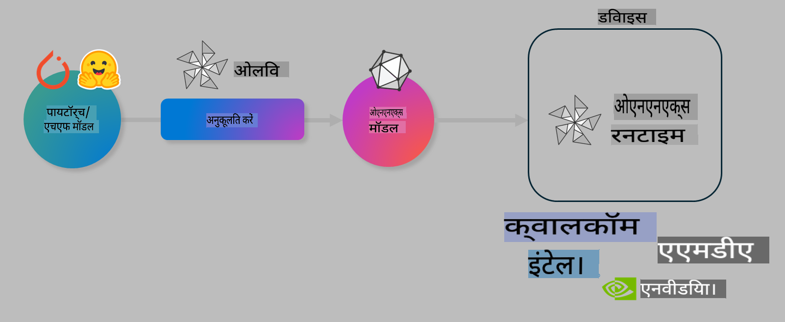

# लैब: ऑन-डिवाइस इन्फरेंस के लिए एआई मॉडल्स को ऑप्टिमाइज़ करें

## परिचय

> [!IMPORTANT]
> इस लैब के लिए **Nvidia A10 या A100 GPU** की आवश्यकता है, जिसमें संबंधित ड्राइवर्स और CUDA टूलकिट (संस्करण 12+) इंस्टॉल हो।

> [!NOTE]
> यह एक **35-मिनट** की लैब है, जो आपको OLIVE का उपयोग करके ऑन-डिवाइस इन्फरेंस के लिए मॉडल्स को ऑप्टिमाइज़ करने की मुख्य अवधारणाओं का व्यावहारिक परिचय देगी।

## सीखने के उद्देश्य

इस लैब के अंत तक, आप OLIVE का उपयोग करके निम्नलिखित कार्य कर सकेंगे:

- AWQ क्वांटाइज़ेशन विधि का उपयोग करके एआई मॉडल को क्वांटाइज़ करना।
- किसी विशिष्ट कार्य के लिए एआई मॉडल को फाइन-ट्यून करना।
- ONNX Runtime पर कुशल ऑन-डिवाइस इन्फरेंस के लिए LoRA एडेप्टर्स (फाइन-ट्यून मॉडल) उत्पन्न करना।

### Olive क्या है

Olive (*O*NNX *live*) एक मॉडल ऑप्टिमाइज़ेशन टूलकिट है, जिसमें CLI शामिल है, जो आपको ONNX Runtime +++https://onnxruntime.ai+++ के लिए मॉडल्स शिप करने में सक्षम बनाता है।



Olive का इनपुट आमतौर पर एक PyTorch या Hugging Face मॉडल होता है, और आउटपुट एक ऑप्टिमाइज़्ड ONNX मॉडल होता है, जिसे ONNX Runtime पर चलने वाले डिवाइस (डिप्लॉयमेंट टारगेट) पर निष्पादित किया जाता है। Olive डिप्लॉयमेंट टारगेट के AI एक्सेलेरेटर (NPU, GPU, CPU) के लिए मॉडल को ऑप्टिमाइज़ करता है, जो Qualcomm, AMD, Nvidia या Intel जैसे हार्डवेयर वेंडर द्वारा प्रदान किया जाता है।

Olive एक *वर्कफ़्लो* निष्पादित करता है, जो व्यक्तिगत मॉडल ऑप्टिमाइज़ेशन कार्यों की एक अनुक्रमित श्रृंखला (*पासेस*) है। उदाहरण: मॉडल कंप्रेशन, ग्राफ कैप्चर, क्वांटाइज़ेशन, ग्राफ ऑप्टिमाइज़ेशन। प्रत्येक पास के पास पैरामीटर होते हैं, जिन्हें सर्वोत्तम मेट्रिक्स (जैसे सटीकता और लेटेंसी) प्राप्त करने के लिए ट्यून किया जा सकता है। Olive एक सर्च एल्गोरिदम का उपयोग करके प्रत्येक पास को स्वचालित रूप से ट्यून करता है।

#### Olive के लाभ

- ग्राफ ऑप्टिमाइज़ेशन, कंप्रेशन और क्वांटाइज़ेशन की विभिन्न तकनीकों के साथ ट्रायल-एंड-एरर मैनुअल प्रयोगों से होने वाली **परेशानी और समय की बचत**।
- **40+ इन-बिल्ट मॉडल ऑप्टिमाइज़ेशन घटक**, जो क्वांटाइज़ेशन, कंप्रेशन, ग्राफ ऑप्टिमाइज़ेशन और फाइन-ट्यूनिंग में अत्याधुनिक तकनीकों को कवर करते हैं।
- **आसान CLI**, सामान्य मॉडल ऑप्टिमाइज़ेशन कार्यों के लिए। उदाहरण: `olive quantize`, `olive auto-opt`, `olive finetune`।
- मॉडल पैकेजिंग और डिप्लॉयमेंट अंतर्निहित।
- **मल्टी LoRA सर्विंग** के लिए मॉडल उत्पन्न करना।
- YAML/JSON का उपयोग करके वर्कफ़्लो को बनाने की क्षमता।
- **Hugging Face** और **Azure AI** के साथ एकीकरण।
- लागत बचाने के लिए अंतर्निहित **कैशिंग** तंत्र।

## लैब निर्देश
> [!NOTE]
> कृपया सुनिश्चित करें कि आपने Azure AI Hub और प्रोजेक्ट को प्रोविजन किया है और अपनी A100 कंप्यूट को Lab 1 के अनुसार सेटअप किया है।

### चरण 0: Azure AI Compute से कनेक्ट करें

आप **VS Code** में रिमोट फीचर का उपयोग करके Azure AI Compute से कनेक्ट करेंगे।

1. अपने **VS Code** डेस्कटॉप एप्लिकेशन को खोलें:
1. **Shift+Ctrl+P** का उपयोग करके **कमांड पैलेट** खोलें।
1. कमांड पैलेट में **AzureML - remote: Connect to compute instance in New Window** खोजें।
1. स्क्रीन पर दिए गए निर्देशों का पालन करें। इसमें Azure सब्सक्रिप्शन, रिसोर्स ग्रुप, प्रोजेक्ट और Compute नाम चुनना शामिल होगा, जिसे आपने Lab 1 में सेटअप किया था।
1. एक बार जब आप Azure ML Compute नोड से कनेक्ट हो जाते हैं, तो यह **Visual Code के निचले बाएँ कोने** में प्रदर्शित होगा `><Azure ML: Compute Name`

### चरण 1: इस रिपॉजिटरी को क्लोन करें

VS Code में, **Ctrl+J** का उपयोग करके एक नया टर्मिनल खोलें और इस रिपॉजिटरी को क्लोन करें:

टर्मिनल में आपको यह प्रॉम्प्ट दिखाई देगा:

```
azureuser@computername:~/cloudfiles/code$ 
```
सॉल्यूशन को क्लोन करें:

```bash
cd ~/localfiles
git clone https://github.com/microsoft/phi-3cookbook.git
```

### चरण 2: VS Code में फ़ोल्डर खोलें

संबंधित फ़ोल्डर में VS Code खोलने के लिए, टर्मिनल में निम्नलिखित कमांड निष्पादित करें, जो एक नई विंडो खोलेगा:

```bash
code phi-3cookbook/code/04.Finetuning/Olive-lab
```

वैकल्पिक रूप से, आप **File** > **Open Folder** का चयन करके फ़ोल्डर खोल सकते हैं।

### चरण 3: डिपेंडेंसीज़

VS Code में अपने Azure AI Compute Instance पर एक टर्मिनल विंडो खोलें (टिप: **Ctrl+J**) और डिपेंडेंसीज़ इंस्टॉल करने के लिए निम्नलिखित कमांड्स निष्पादित करें:

```bash
conda create -n olive-ai python=3.11 -y
conda activate olive-ai
pip install -r requirements.txt
az extension remove -n azure-cli-ml
az extension add -n ml
```

> [!NOTE]
> सभी डिपेंडेंसीज़ को इंस्टॉल करने में ~5 मिनट लगेंगे।

इस लैब में आप Azure AI Model कैटलॉग से मॉडल्स को डाउनलोड और अपलोड करेंगे। इसके लिए आपको Azure में लॉगिन करना होगा:

```bash
az login
```

> [!NOTE]
> लॉगिन करते समय आपसे सब्सक्रिप्शन चुनने के लिए कहा जाएगा। सुनिश्चित करें कि आप इस लैब के लिए प्रदान किए गए सब्सक्रिप्शन का चयन करें।

### चरण 4: Olive कमांड्स निष्पादित करें

VS Code में अपने Azure AI Compute Instance पर एक टर्मिनल विंडो खोलें (टिप: **Ctrl+J**) और सुनिश्चित करें कि `olive-ai` कॉन्डा एनवायरनमेंट सक्रिय है:

```bash
conda activate olive-ai
```

इसके बाद, निम्नलिखित Olive कमांड्स को कमांड लाइन में निष्पादित करें।

1. **डेटा का निरीक्षण करें:** इस उदाहरण में, आप Phi-3.5-Mini मॉडल को फाइन-ट्यून करेंगे ताकि यह यात्रा से संबंधित प्रश्नों का उत्तर देने में विशेषज्ञ हो। नीचे दिया गया कोड डेटा सेट के पहले कुछ रिकॉर्ड्स को प्रदर्शित करता है, जो JSON लाइन्स प्रारूप में हैं:

    ```bash
    head data/data_sample_travel.jsonl
    ```
1. **मॉडल को क्वांटाइज़ करें:** मॉडल को ट्रेन करने से पहले, आप इसे निम्नलिखित कमांड के साथ क्वांटाइज़ करते हैं, जो Active Aware Quantization (AWQ) +++https://arxiv.org/abs/2306.00978+++ नामक तकनीक का उपयोग करता है। AWQ मॉडल के वेट्स को क्वांटाइज़ करता है, जो इन्फरेंस के दौरान उत्पन्न होने वाले एक्टिवेशन को ध्यान में रखता है। इसका मतलब है कि क्वांटाइज़ेशन प्रक्रिया एक्टिवेशन में वास्तविक डेटा वितरण को ध्यान में रखती है, जिससे पारंपरिक वेट क्वांटाइज़ेशन विधियों की तुलना में मॉडल की सटीकता बेहतर बनी रहती है।

    ```bash
    olive quantize \
       --model_name_or_path microsoft/Phi-3.5-mini-instruct \
       --trust_remote_code \
       --algorithm awq \
       --output_path models/phi/awq \
       --log_level 1
    ```
    
    AWQ क्वांटाइज़ेशन को पूरा करने में **~8 मिनट** लगते हैं, जो **मॉडल का आकार ~7.5GB से ~2.5GB तक घटा देता है**।
   
    इस लैब में, हम आपको दिखा रहे हैं कि Hugging Face से मॉडल्स को कैसे इनपुट किया जाए (उदाहरण: `microsoft/Phi-3.5-mini-instruct`). However, Olive also allows you to input models from the Azure AI catalog by updating the `model_name_or_path` argument to an Azure AI asset ID (for example:  `azureml://registries/azureml/models/Phi-3.5-mini-instruct/versions/4`). 

1. **Train the model:** Next, the `olive finetune` कमांड क्वांटाइज़्ड मॉडल को फाइन-ट्यून करता है। फाइन-ट्यूनिंग से पहले मॉडल को क्वांटाइज़ करना, इसके बाद करने की तुलना में बेहतर सटीकता देता है, क्योंकि फाइन-ट्यूनिंग प्रक्रिया क्वांटाइज़ेशन से होने वाले नुकसान की भरपाई कर देती है।

    ```bash
    olive finetune \
        --method lora \
        --model_name_or_path models/phi/awq \
        --data_files "data/data_sample_travel.jsonl" \
        --data_name "json" \
        --text_template "<|user|>\n{prompt}<|end|>\n<|assistant|>\n{response}<|end|>" \
        --max_steps 100 \
        --output_path ./models/phi/ft \
        --log_level 1
    ```
    
    फाइन-ट्यूनिंग (100 स्टेप्स के साथ) को पूरा करने में **~6 मिनट** लगते हैं।

1. **ऑप्टिमाइज़ करें:** मॉडल को ट्रेन करने के बाद, आप अब Olive के `auto-opt` command, which will capture the ONNX graph and automatically perform a number of optimizations to improve the model performance for CPU by compressing the model and doing fusions. It should be noted, that you can also optimize for other devices such as NPU or GPU by just updating the `--device` and `--provider` आर्गुमेंट्स का उपयोग करके मॉडल को ऑप्टिमाइज़ करते हैं - लेकिन इस लैब के उद्देश्यों के लिए हम CPU का उपयोग करेंगे।

    ```bash
    olive auto-opt \
       --model_name_or_path models/phi/ft/model \
       --adapter_path models/phi/ft/adapter \
       --device cpu \
       --provider CPUExecutionProvider \
       --use_ort_genai \
       --output_path models/phi/onnx-ao \
       --log_level 1
    ```
    
    ऑप्टिमाइज़ेशन को पूरा करने में **~5 मिनट** लगते हैं।

### चरण 5: मॉडल इन्फरेंस का त्वरित परीक्षण

मॉडल का इन्फरेंस टेस्ट करने के लिए, अपने फ़ोल्डर में एक Python फ़ाइल **app.py** नाम से बनाएं और निम्नलिखित कोड को कॉपी-पेस्ट करें:

```python
import onnxruntime_genai as og
import numpy as np

print("loading model and adapters...", end="", flush=True)
model = og.Model("models/phi/onnx-ao/model")
adapters = og.Adapters(model)
adapters.load("models/phi/onnx-ao/model/adapter_weights.onnx_adapter", "travel")
print("DONE!")

tokenizer = og.Tokenizer(model)
tokenizer_stream = tokenizer.create_stream()

params = og.GeneratorParams(model)
params.set_search_options(max_length=100, past_present_share_buffer=False)
user_input = "what is the best thing to see in chicago"
params.input_ids = tokenizer.encode(f"<|user|>\n{user_input}<|end|>\n<|assistant|>\n")

generator = og.Generator(model, params)

generator.set_active_adapter(adapters, "travel")

print(f"{user_input}")

while not generator.is_done():
    generator.compute_logits()
    generator.generate_next_token()

    new_token = generator.get_next_tokens()[0]
    print(tokenizer_stream.decode(new_token), end='', flush=True)

print("\n")
```

कोड को निष्पादित करें:

```bash
python app.py
```

### चरण 6: मॉडल को Azure AI पर अपलोड करें

मॉडल को Azure AI मॉडल रिपॉजिटरी पर अपलोड करना इसे आपके विकास टीम के अन्य सदस्यों के साथ साझा करने योग्य बनाता है और मॉडल के वर्शन नियंत्रण को भी संभालता है। मॉडल को अपलोड करने के लिए निम्नलिखित कमांड चलाएं:

> [!NOTE]
> `{}` placeholders with the name of your resource group and Azure AI Project Name. 

To find your resource group `"resourceGroup" और Azure AI प्रोजेक्ट नाम को अपडेट करें और निम्नलिखित कमांड चलाएं:

```
az ml workspace show
```

या फिर +++ai.azure.com+++ पर जाकर **management center** > **project** > **overview** का चयन करें।

`{}` प्लेसहोल्डर्स को अपने रिसोर्स ग्रुप और Azure AI प्रोजेक्ट नाम से अपडेट करें।

```bash
az ml model create \
    --name ft-for-travel \
    --version 1 \
    --path ./models/phi/onnx-ao \
    --resource-group {RESOURCE_GROUP_NAME} \
    --workspace-name {PROJECT_NAME}
```
इसके बाद आप अपने अपलोड किए गए मॉडल को देख सकते हैं और इसे https://ml.azure.com/model/list पर डिप्लॉय कर सकते हैं।

**अस्वीकरण**:  
यह दस्तावेज़ मशीन-आधारित एआई अनुवाद सेवाओं का उपयोग करके अनुवादित किया गया है। जबकि हम सटीकता सुनिश्चित करने का प्रयास करते हैं, कृपया ध्यान दें कि स्वचालित अनुवादों में त्रुटियां या अशुद्धियां हो सकती हैं। मूल भाषा में उपलब्ध मूल दस्तावेज़ को प्रामाणिक स्रोत माना जाना चाहिए। महत्वपूर्ण जानकारी के लिए, पेशेवर मानव अनुवाद की सिफारिश की जाती है। इस अनुवाद के उपयोग से उत्पन्न किसी भी गलतफहमी या गलत व्याख्या के लिए हम उत्तरदायी नहीं हैं।