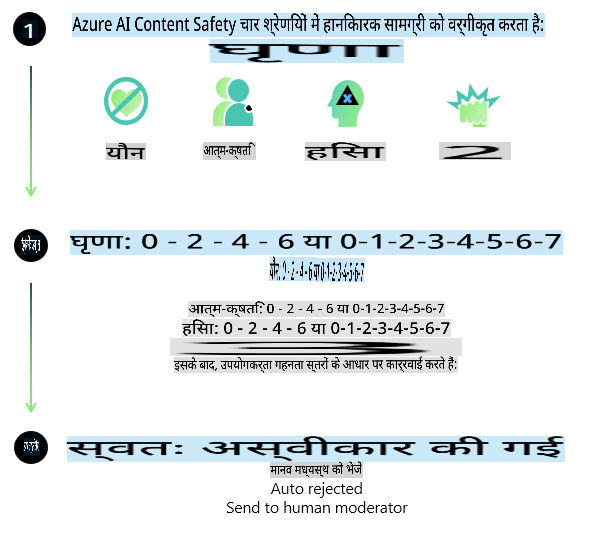
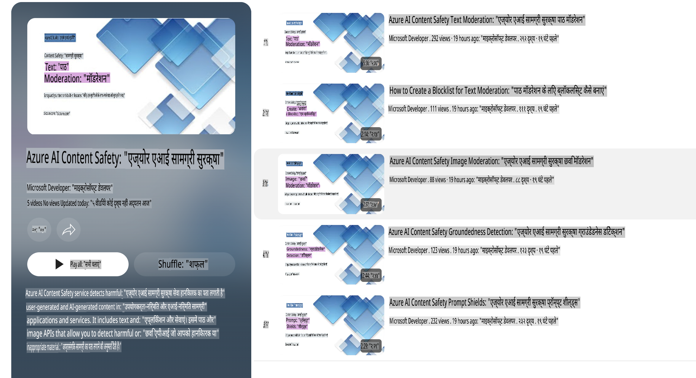

# Phi मॉडल्स के लिए AI सुरक्षा  
Phi मॉडल्स का परिवार [Microsoft Responsible AI Standard](https://query.prod.cms.rt.microsoft.com/cms/api/am/binary/RE5cmFl) के अनुसार विकसित किया गया है। यह एक कंपनी-व्यापी आवश्यकताओं का सेट है जो निम्नलिखित छह सिद्धांतों पर आधारित है: जवाबदेही, पारदर्शिता, निष्पक्षता, विश्वसनीयता और सुरक्षा, गोपनीयता और सुरक्षा, और समावेशन। ये [Microsoft के Responsible AI सिद्धांतों](https://www.microsoft.com/ai/responsible-ai) को परिभाषित करते हैं।  

पिछले Phi मॉडल्स की तरह, एक बहुआयामी सुरक्षा मूल्यांकन और सुरक्षा पोस्ट-ट्रेनिंग दृष्टिकोण अपनाया गया, जिसमें इस रिलीज़ की बहुभाषी क्षमताओं को ध्यान में रखते हुए अतिरिक्त उपाय किए गए। सुरक्षा प्रशिक्षण और मूल्यांकन के लिए हमारा दृष्टिकोण, जिसमें कई भाषाओं और जोखिम श्रेणियों में परीक्षण शामिल है, [Phi Safety Post-Training Paper](https://arxiv.org/abs/2407.13833) में बताया गया है। हालांकि Phi मॉडल्स इस दृष्टिकोण से लाभान्वित होते हैं, डेवलपर्स को जिम्मेदार AI के सर्वोत्तम अभ्यासों को लागू करना चाहिए, जिसमें उनके विशिष्ट उपयोग मामले और सांस्कृतिक और भाषाई संदर्भ से जुड़े जोखिमों की मैपिंग, माप और न्यूनीकरण शामिल है।  

## सर्वोत्तम अभ्यास  

अन्य मॉडल्स की तरह, Phi मॉडल्स का परिवार संभावित रूप से अनुचित, अविश्वसनीय या आपत्तिजनक तरीके से व्यवहार कर सकता है।  

SLM और LLM के कुछ सीमित व्यवहार, जिनसे आपको अवगत रहना चाहिए, निम्नलिखित हैं:  

- **सेवा की गुणवत्ता:** Phi मॉडल्स मुख्य रूप से अंग्रेजी पाठ पर प्रशिक्षित किए गए हैं। अंग्रेजी के अलावा अन्य भाषाओं में प्रदर्शन खराब हो सकता है। प्रशिक्षण डेटा में कम प्रतिनिधित्व वाली अंग्रेजी भाषाई विविधताओं का प्रदर्शन मानक अमेरिकी अंग्रेजी की तुलना में खराब हो सकता है।  
- **हानियों का प्रतिनिधित्व और रूढ़ियों का स्थायित्व:** ये मॉडल्स कुछ समूहों का अधिक या कम प्रतिनिधित्व कर सकते हैं, कुछ समूहों के प्रतिनिधित्व को मिटा सकते हैं, या अपमानजनक या नकारात्मक रूढ़ियों को मजबूत कर सकते हैं। सुरक्षा पोस्ट-ट्रेनिंग के बावजूद, ये सीमाएं अभी भी मौजूद हो सकती हैं, क्योंकि विभिन्न समूहों के विभिन्न स्तरों के प्रतिनिधित्व या प्रशिक्षण डेटा में नकारात्मक रूढ़ियों के उदाहरण वास्तविक दुनिया के पैटर्न और सामाजिक पूर्वाग्रहों को दर्शाते हैं।  
- **अनुचित या आपत्तिजनक सामग्री:** ये मॉडल्स अन्य प्रकार की अनुचित या आपत्तिजनक सामग्री उत्पन्न कर सकते हैं, जो इसे संवेदनशील संदर्भों में उपयोग के लिए अनुपयुक्त बना सकती है, जब तक कि उपयोग मामले के लिए विशिष्ट अतिरिक्त उपाय लागू न किए जाएं।  
- **सूचना की विश्वसनीयता:** भाषा मॉडल्स बेतुकी सामग्री उत्पन्न कर सकते हैं या ऐसी सामग्री बना सकते हैं जो तार्किक लग सकती है लेकिन गलत या पुरानी हो सकती है।  
- **कोड के लिए सीमित दायरा:** Phi-3 प्रशिक्षण डेटा का अधिकांश हिस्सा Python पर आधारित है और इसमें "typing, math, random, collections, datetime, itertools" जैसे सामान्य पैकेजों का उपयोग होता है। यदि मॉडल ऐसे Python स्क्रिप्ट उत्पन्न करता है जो अन्य पैकेजों का उपयोग करते हैं या अन्य भाषाओं में स्क्रिप्ट उत्पन्न करते हैं, तो हम उपयोगकर्ताओं को सभी API उपयोगों को मैन्युअल रूप से सत्यापित करने की सिफारिश करते हैं।  

डेवलपर्स को जिम्मेदार AI के सर्वोत्तम अभ्यासों को लागू करना चाहिए और यह सुनिश्चित करना चाहिए कि विशिष्ट उपयोग मामला प्रासंगिक कानूनों और विनियमों (जैसे गोपनीयता, व्यापार, आदि) का पालन करता हो।  

## जिम्मेदार AI विचार  

अन्य भाषा मॉडल्स की तरह, Phi श्रृंखला मॉडल्स संभावित रूप से अनुचित, अविश्वसनीय, या आपत्तिजनक तरीके से व्यवहार कर सकते हैं। कुछ सीमित व्यवहार, जिनसे आपको अवगत रहना चाहिए, निम्नलिखित हैं:  

**सेवा की गुणवत्ता:** Phi मॉडल्स मुख्य रूप से अंग्रेजी पाठ पर प्रशिक्षित किए गए हैं। अंग्रेजी के अलावा अन्य भाषाओं में प्रदर्शन खराब हो सकता है। प्रशिक्षण डेटा में कम प्रतिनिधित्व वाली अंग्रेजी भाषाई विविधताओं का प्रदर्शन मानक अमेरिकी अंग्रेजी की तुलना में खराब हो सकता है।  

**हानियों का प्रतिनिधित्व और रूढ़ियों का स्थायित्व:** ये मॉडल्स कुछ समूहों का अधिक या कम प्रतिनिधित्व कर सकते हैं, कुछ समूहों के प्रतिनिधित्व को मिटा सकते हैं, या अपमानजनक या नकारात्मक रूढ़ियों को मजबूत कर सकते हैं। सुरक्षा पोस्ट-ट्रेनिंग के बावजूद, ये सीमाएं अभी भी मौजूद हो सकती हैं, क्योंकि विभिन्न समूहों के विभिन्न स्तरों के प्रतिनिधित्व या प्रशिक्षण डेटा में नकारात्मक रूढ़ियों के उदाहरण वास्तविक दुनिया के पैटर्न और सामाजिक पूर्वाग्रहों को दर्शाते हैं।  

**अनुचित या आपत्तिजनक सामग्री:** ये मॉडल्स अन्य प्रकार की अनुचित या आपत्तिजनक सामग्री उत्पन्न कर सकते हैं, जो इसे संवेदनशील संदर्भों में उपयोग के लिए अनुपयुक्त बना सकती है, जब तक कि उपयोग मामले के लिए विशिष्ट अतिरिक्त उपाय लागू न किए जाएं।  
**सूचना की विश्वसनीयता:** भाषा मॉडल्स बेतुकी सामग्री उत्पन्न कर सकते हैं या ऐसी सामग्री बना सकते हैं जो तार्किक लग सकती है लेकिन गलत या पुरानी हो सकती है।  

**कोड के लिए सीमित दायरा:** Phi-3 प्रशिक्षण डेटा का अधिकांश हिस्सा Python पर आधारित है और इसमें "typing, math, random, collections, datetime, itertools" जैसे सामान्य पैकेजों का उपयोग होता है। यदि मॉडल ऐसे Python स्क्रिप्ट उत्पन्न करता है जो अन्य पैकेजों का उपयोग करते हैं या अन्य भाषाओं में स्क्रिप्ट उत्पन्न करते हैं, तो हम उपयोगकर्ताओं को सभी API उपयोगों को मैन्युअल रूप से सत्यापित करने की सिफारिश करते हैं।  

डेवलपर्स को जिम्मेदार AI के सर्वोत्तम अभ्यासों को लागू करना चाहिए और यह सुनिश्चित करना चाहिए कि विशिष्ट उपयोग मामला प्रासंगिक कानूनों और विनियमों (जैसे गोपनीयता, व्यापार, आदि) का पालन करता हो। विचार करने के लिए महत्वपूर्ण क्षेत्र निम्नलिखित हैं:  

**आवंटन:** मॉडल्स उन परिदृश्यों के लिए उपयुक्त नहीं हो सकते हैं जिनका कानूनी स्थिति या संसाधनों या जीवन के अवसरों के आवंटन पर प्रभाव पड़ सकता है (उदाहरण: आवास, रोजगार, क्रेडिट, आदि) जब तक कि आगे के आकलन और अतिरिक्त पूर्वाग्रह न्यूनीकरण तकनीकों का उपयोग न किया जाए।  

**उच्च-जोखिम परिदृश्य:** डेवलपर्स को उन उच्च-जोखिम परिदृश्यों में मॉडल्स का उपयोग करने की उपयुक्तता का आकलन करना चाहिए, जहां अनुचित, अविश्वसनीय, या आपत्तिजनक आउटपुट अत्यधिक महंगे या हानिकारक हो सकते हैं। इसमें संवेदनशील या विशेषज्ञ डोमेन में सलाह प्रदान करना शामिल है, जहां सटीकता और विश्वसनीयता महत्वपूर्ण हैं (उदाहरण: कानूनी या स्वास्थ्य सलाह)। परिनियोजन संदर्भ के अनुसार एप्लिकेशन स्तर पर अतिरिक्त सुरक्षा उपाय लागू किए जाने चाहिए।  

**भ्रामक जानकारी:** मॉडल्स गलत जानकारी उत्पन्न कर सकते हैं। डेवलपर्स को पारदर्शिता के सर्वोत्तम अभ्यासों का पालन करना चाहिए और अंतिम उपयोगकर्ताओं को सूचित करना चाहिए कि वे एक AI सिस्टम के साथ बातचीत कर रहे हैं। एप्लिकेशन स्तर पर, डेवलपर्स प्रतिक्रिया तंत्र और पाइपलाइनों का निर्माण कर सकते हैं ताकि प्रतिक्रियाओं को उपयोग-केस विशिष्ट, संदर्भगत जानकारी में ग्राउंड किया जा सके। इसे Retrieval Augmented Generation (RAG) के रूप में जाना जाता है।  

**हानिकारक सामग्री का उत्पादन:** डेवलपर्स को उनके संदर्भ के लिए आउटपुट का आकलन करना चाहिए और उनके उपयोग मामले के लिए उपयुक्त उपलब्ध सुरक्षा वर्गीकरण या कस्टम समाधानों का उपयोग करना चाहिए।  

**दुरुपयोग:** अन्य प्रकार के दुरुपयोग, जैसे धोखाधड़ी, स्पैम, या मैलवेयर उत्पादन संभव हो सकते हैं, और डेवलपर्स को यह सुनिश्चित करना चाहिए कि उनके एप्लिकेशन लागू कानूनों और विनियमों का उल्लंघन न करें।  

### फाइन-ट्यूनिंग और AI सामग्री सुरक्षा  

किसी मॉडल को फाइन-ट्यून करने के बाद, हम दृढ़ता से अनुशंसा करते हैं कि [Azure AI Content Safety](https://learn.microsoft.com/azure/ai-services/content-safety/overview) उपायों का उपयोग किया जाए ताकि मॉडल्स द्वारा उत्पन्न सामग्री की निगरानी की जा सके, संभावित जोखिमों, खतरों और गुणवत्ता समस्याओं की पहचान की जा सके और उन्हें ब्लॉक किया जा सके।  

  

[Azure AI Content Safety](https://learn.microsoft.com/azure/ai-services/content-safety/overview) पाठ और छवि सामग्री दोनों का समर्थन करता है। इसे क्लाउड, डिस्कनेक्टेड कंटेनरों, और एज/एम्बेडेड डिवाइसों पर परिनियोजित किया जा सकता है।  

## Azure AI सामग्री सुरक्षा का अवलोकन  

Azure AI Content Safety एक "वन-साइज़-फिट्स-ऑल" समाधान नहीं है; इसे व्यवसायों की विशिष्ट नीतियों के अनुरूप अनुकूलित किया जा सकता है। इसके अतिरिक्त, इसके बहुभाषी मॉडल इसे एक साथ कई भाषाओं को समझने में सक्षम बनाते हैं।  

  

- **Azure AI Content Safety**  
- **Microsoft Developer**  
- **5 वीडियो**  

Azure AI Content Safety सेवा अनुप्रयोगों और सेवाओं में उपयोगकर्ता-जनित और AI-जनित हानिकारक सामग्री का पता लगाती है। इसमें पाठ और छवि API शामिल हैं जो हानिकारक या अनुचित सामग्री का पता लगाने की अनुमति देते हैं।  

[AI Content Safety Playlist](https://www.youtube.com/playlist?list=PLlrxD0HtieHjaQ9bJjyp1T7FeCbmVcPkQ)  

**अस्वीकरण**:  
यह दस्तावेज़ मशीन-आधारित एआई अनुवाद सेवाओं का उपयोग करके अनुवादित किया गया है। जबकि हम सटीकता के लिए प्रयास करते हैं, कृपया ध्यान दें कि स्वचालित अनुवादों में त्रुटियाँ या गलतियाँ हो सकती हैं। मूल भाषा में दस्तावेज़ को प्रामाणिक स्रोत माना जाना चाहिए। महत्वपूर्ण जानकारी के लिए, पेशेवर मानव अनुवाद की सिफारिश की जाती है। इस अनुवाद के उपयोग से उत्पन्न किसी भी गलतफहमी या गलत व्याख्या के लिए हम उत्तरदायी नहीं हैं।