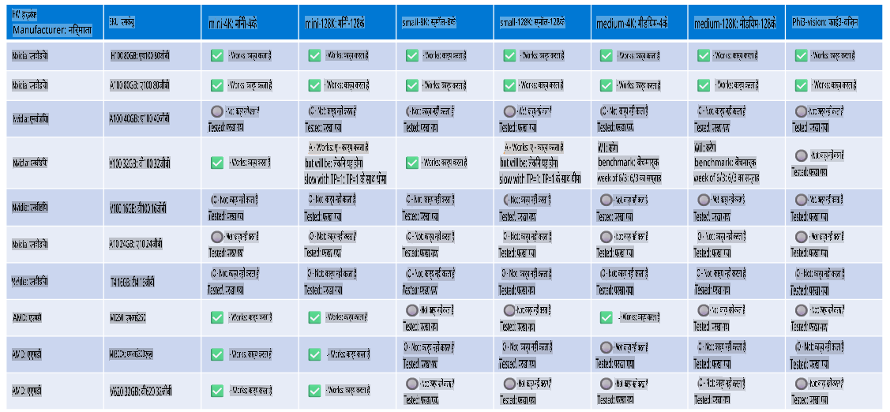

# Phi हार्डवेयर सपोर्ट

Microsoft Phi को ONNX Runtime के लिए ऑप्टिमाइज़ किया गया है और यह Windows DirectML को सपोर्ट करता है। यह विभिन्न प्रकार के हार्डवेयर पर अच्छी तरह से काम करता है, जिसमें GPU, CPU और यहां तक कि मोबाइल डिवाइस भी शामिल हैं।

## डिवाइस हार्डवेयर  
विशेष रूप से, समर्थित हार्डवेयर में शामिल हैं:

- GPU SKU: RTX 4090 (DirectML)  
- GPU SKU: 1 A100 80GB (CUDA)  
- CPU SKU: Standard F64s v2 (64 vCPUs, 128 GiB मेमोरी)  

## मोबाइल SKU

- एंड्रॉइड - सैमसंग गैलेक्सी S21  
- एप्पल iPhone 14 या उससे उच्च A16/A17 प्रोसेसर  

## Phi हार्डवेयर स्पेसिफिकेशन  

- न्यूनतम कॉन्फ़िगरेशन आवश्यक।  
- Windows: DirectX 12-सक्षम GPU और कम से कम 4GB की संयुक्त RAM  

CUDA: NVIDIA GPU जिसमें Compute Capability >= 7.02 हो  

  

## कई GPUs पर onnxruntime चलाना  

वर्तमान में उपलब्ध Phi ONNX मॉडल केवल 1 GPU के लिए हैं। Phi मॉडल के लिए मल्टी-GPU सपोर्ट संभव है, लेकिन 2 GPU के साथ ORT यह गारंटी नहीं देता कि यह ORT के 2 इंस्टेंस की तुलना में अधिक थ्रूपुट देगा। नवीनतम अपडेट के लिए कृपया [ONNX Runtime](https://onnxruntime.ai/) देखें।  

[Build 2024 पर GenAI ONNX टीम](https://youtu.be/WLW4SE8M9i8?si=EtG04UwDvcjunyfC) ने घोषणा की कि उन्होंने Phi मॉडल के लिए मल्टी-इंस्टेंस को सक्षम किया है, मल्टी-GPU के बजाय।  

वर्तमान में, यह आपको CUDA_VISIBLE_DEVICES पर्यावरण वेरिएबल का उपयोग करके एक onnxruntime या onnxruntime-genai इंस्टेंस चलाने की अनुमति देता है, जैसे:  

```Python
CUDA_VISIBLE_DEVICES=0 python infer.py
CUDA_VISIBLE_DEVICES=1 python infer.py
```  

Phi को और अधिक एक्सप्लोर करने के लिए [Azure AI Foundry](https://ai.azure.com) पर जाएं।  

**अस्वीकरण**:  
यह दस्तावेज़ मशीन-आधारित एआई अनुवाद सेवाओं का उपयोग करके अनुवादित किया गया है। जबकि हम सटीकता सुनिश्चित करने का प्रयास करते हैं, कृपया ध्यान दें कि स्वचालित अनुवाद में त्रुटियां या अशुद्धियां हो सकती हैं। मूल दस्तावेज़, जो इसकी मूल भाषा में है, को प्रामाणिक स्रोत माना जाना चाहिए। महत्वपूर्ण जानकारी के लिए, पेशेवर मानव अनुवाद की सिफारिश की जाती है। इस अनुवाद के उपयोग से उत्पन्न किसी भी गलतफहमी या गलत व्याख्या के लिए हम उत्तरदायी नहीं हैं।