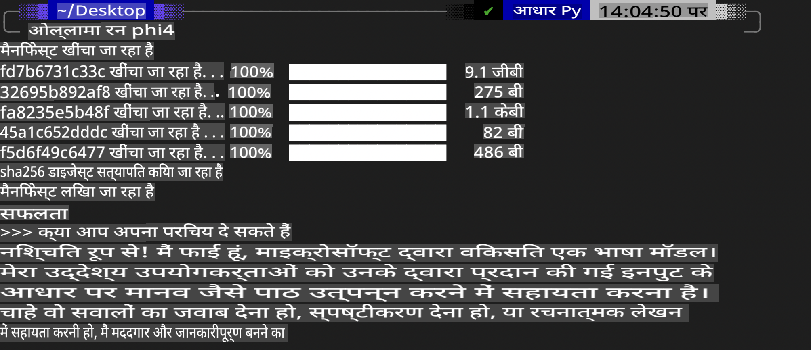
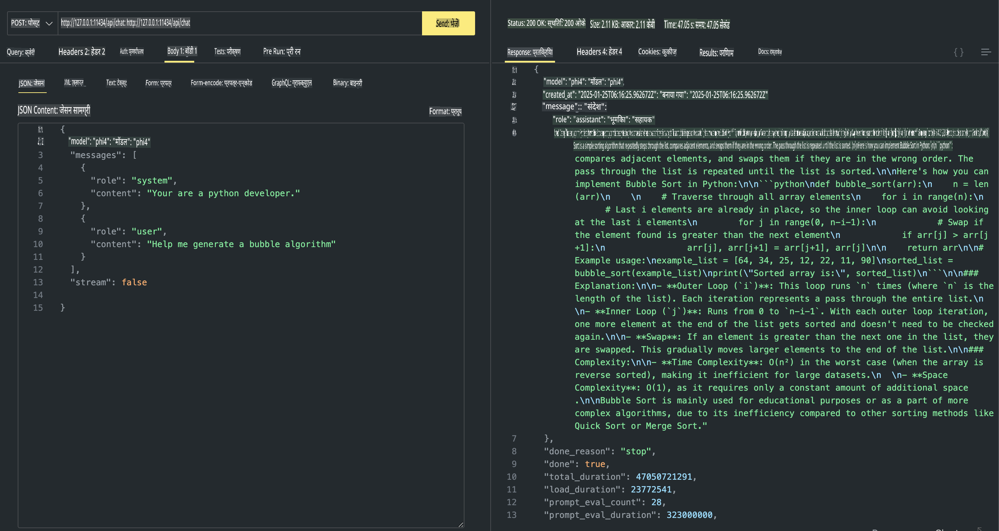

## Phi परिवार Ollama में

[Ollama](https://ollama.com) सरल स्क्रिप्ट्स के माध्यम से अधिक लोगों को सीधे ओपन सोर्स LLM या SLM डिप्लॉय करने की अनुमति देता है, और यह API बनाने में भी सक्षम है ताकि स्थानीय Copilot एप्लिकेशन परिदृश्यों में मदद मिल सके।

## **1. इंस्टॉलेशन**

Ollama Windows, macOS, और Linux पर चलाने का समर्थन करता है। आप इस लिंक ([https://ollama.com/download](https://ollama.com/download)) के माध्यम से Ollama को इंस्टॉल कर सकते हैं। सफलतापूर्वक इंस्टॉलेशन के बाद, आप टर्मिनल विंडो के माध्यम से Ollama स्क्रिप्ट का उपयोग करके सीधे Phi-3 को कॉल कर सकते हैं। आप Ollama में [उपलब्ध सभी लाइब्रेरीज़](https://ollama.com/library) देख सकते हैं। यदि आप इस रिपॉजिटरी को Codespace में खोलते हैं, तो उसमें पहले से ही Ollama इंस्टॉल होगा।

```bash

ollama run phi4

```

> [!NOTE]
> पहली बार चलाने पर मॉडल डाउनलोड किया जाएगा। बेशक, आप सीधे डाउनलोड किए गए Phi-4 मॉडल को भी निर्दिष्ट कर सकते हैं। हम WSL को उदाहरण के रूप में लेते हुए कमांड चलाने का तरीका दिखाते हैं। मॉडल सफलतापूर्वक डाउनलोड होने के बाद, आप टर्मिनल पर सीधे इंटरैक्ट कर सकते हैं।



## **2. Ollama से phi-4 API कॉल करें**

यदि आप Ollama द्वारा जनरेट किए गए Phi-4 API को कॉल करना चाहते हैं, तो आप इस कमांड का उपयोग करके टर्मिनल में Ollama सर्वर शुरू कर सकते हैं।

```bash

ollama serve

```

> [!NOTE]
> यदि आप macOS या Linux चला रहे हैं, तो कृपया ध्यान दें कि आपको निम्नलिखित त्रुटि का सामना करना पड़ सकता है **"Error: listen tcp 127.0.0.1:11434: bind: address already in use"**। यह त्रुटि कमांड चलाते समय आ सकती है। आप या तो इस त्रुटि को नज़रअंदाज़ कर सकते हैं, क्योंकि यह आमतौर पर सर्वर पहले से चलने का संकेत देती है, या आप Ollama को रोककर पुनः शुरू कर सकते हैं:

**macOS**

```bash

brew services restart ollama

```

**Linux**

```bash

sudo systemctl stop ollama

```

Ollama दो API का समर्थन करता है: generate और chat। आप अपनी आवश्यकता के अनुसार Ollama द्वारा प्रदान किए गए मॉडल API को कॉल कर सकते हैं, जो पोर्ट 11434 पर चलने वाली स्थानीय सेवा को अनुरोध भेजकर किया जा सकता है।

**Chat**

```bash

curl http://127.0.0.1:11434/api/chat -d '{
  "model": "phi3",
  "messages": [
    {
      "role": "system",
      "content": "Your are a python developer."
    },
    {
      "role": "user",
      "content": "Help me generate a bubble algorithm"
    }
  ],
  "stream": false
  
}'

This is the result in Postman



## Additional Resources

Check the list of available models in Ollama in [their library](https://ollama.com/library).

Pull your model from the Ollama server using this command

```bash
ollama pull phi4
```

Run the model using this command

```bash
ollama run phi4
```

***Note:*** Visit this link [https://github.com/ollama/ollama/blob/main/docs/api.md](https://github.com/ollama/ollama/blob/main/docs/api.md) to learn more

## Calling Ollama from Python

You can use `requests` or `urllib3` to make requests to the local server endpoints used above. However, a popular way to use Ollama in Python is via the [openai](https://pypi.org/project/openai/) SDK, since Ollama provides OpenAI-compatible server endpoints as well.

Here is an example for phi3-mini:

```python
import openai

client = openai.OpenAI(
    base_url="http://localhost:11434/v1",
    api_key="nokeyneeded",
)

response = client.chat.completions.create(
    model="phi4",
    temperature=0.7,
    n=1,
    messages=[
        {"role": "system", "content": "You are a helpful assistant."},
        {"role": "user", "content": "Write a haiku about a hungry cat"},
    ],
)

print("Response:")
print(response.choices[0].message.content)
```

## Calling Ollama from JavaScript 

```javascript
// Phi-4 के साथ एक फाइल का सारांश निकालने का उदाहरण
script({
    model: "ollama:phi4",
    title: "Phi-4 के साथ सारांश निकालें",
    system: ["system"],
})

// सारांश का उदाहरण
const file = def("FILE", env.files)
$`Summarize ${file} in a single paragraph.`
```

## Calling Ollama from C#

Create a new C# Console application and add the following NuGet package:

```bash
dotnet add package Microsoft.SemanticKernel --version 1.34.0
```

Then replace this code in the `Program.cs` file

```csharp
using Microsoft.SemanticKernel;
using Microsoft.SemanticKernel.ChatCompletion;

// स्थानीय Ollama सर्वर एंडपॉइंट का उपयोग करके चैट पूर्णता सेवा जोड़ें
#pragma warning disable SKEXP0001, SKEXP0003, SKEXP0010, SKEXP0011, SKEXP0050, SKEXP0052
builder.AddOpenAIChatCompletion(
    modelId: "phi4",
    endpoint: new Uri("http://localhost:11434/"),
    apiKey: "non required");

// चैट सेवा के लिए एक सरल प्रॉम्प्ट को कॉल करें
string prompt = "Write a joke about kittens";
var response = await kernel.InvokePromptAsync(prompt);
Console.WriteLine(response.GetValue<string>());
```

Run the app with the command:

```bash
dotnet run

**अस्वीकरण**:  
यह दस्तावेज़ मशीन-आधारित एआई अनुवाद सेवाओं का उपयोग करके अनुवादित किया गया है। जबकि हम सटीकता के लिए प्रयासरत हैं, कृपया ध्यान दें कि स्वचालित अनुवाद में त्रुटियां या अशुद्धियां हो सकती हैं। मूल दस्तावेज़, जो इसकी मूल भाषा में है, को आधिकारिक स्रोत माना जाना चाहिए। महत्वपूर्ण जानकारी के लिए, पेशेवर मानव अनुवाद की सिफारिश की जाती है। इस अनुवाद के उपयोग से उत्पन्न किसी भी गलतफहमी या गलत व्याख्या के लिए हम उत्तरदायी नहीं हैं।