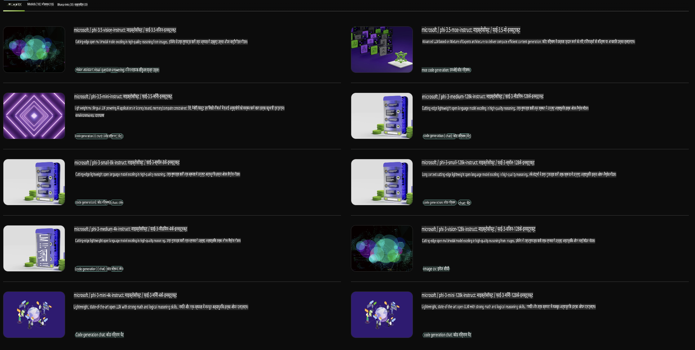

## NVIDIA NIM में फाई परिवार

NVIDIA NIM एक उपयोग में आसान माइक्रोसर्विसेस का सेट है, जिसे क्लाउड, डेटा सेंटर और वर्कस्टेशन पर जनरेटिव AI मॉडल्स की डिप्लॉयमेंट को तेज़ करने के लिए डिज़ाइन किया गया है। NIMs को मॉडल परिवार और प्रति मॉडल आधार पर वर्गीकृत किया गया है। उदाहरण के लिए, बड़े भाषा मॉडल्स (LLMs) के लिए NVIDIA NIM एंटरप्राइज़ एप्लिकेशन्स में अत्याधुनिक LLMs की शक्ति लाता है, जो unmatched प्राकृतिक भाषा प्रोसेसिंग और समझने की क्षमताएँ प्रदान करता है।

NIM IT और DevOps टीमों के लिए बड़े भाषा मॉडल्स (LLMs) को अपने प्रबंधित वातावरण में स्वयं होस्ट करना आसान बनाता है, जबकि डेवलपर्स को उद्योग मानक APIs प्रदान करता है जो उन्हें शक्तिशाली कोपायलट्स, चैटबॉट्स और AI असिस्टेंट्स बनाने की अनुमति देता है, जो उनके व्यवसाय को बदल सकते हैं। NVIDIA की अत्याधुनिक GPU एक्सेलेरेशन और स्केलेबल डिप्लॉयमेंट का लाभ उठाते हुए, NIM unmatched प्रदर्शन के साथ इनफरेंस का सबसे तेज़ रास्ता प्रदान करता है।

आप NVIDIA NIM का उपयोग करके फाई परिवार मॉडल्स का इनफरेंस कर सकते हैं।



### **उदाहरण - NVIDIA NIM में Phi-3-Vision**

कल्पना कीजिए कि आपके पास एक इमेज (`demo.png`) है और आप ऐसा Python कोड जनरेट करना चाहते हैं जो इस इमेज को प्रोसेस करे और इसका एक नया वर्ज़न सेव करे (`phi-3-vision.jpg`)।

ऊपर दिया गया कोड इस प्रक्रिया को स्वचालित करता है:

1. पर्यावरण और आवश्यक कॉन्फ़िगरेशन सेट करना।
2. एक प्रॉम्प्ट बनाना जो मॉडल को आवश्यक Python कोड जनरेट करने के लिए निर्देशित करता है।
3. प्रॉम्प्ट को मॉडल को भेजना और जनरेट किया गया कोड प्राप्त करना।
4. जनरेट किए गए कोड को निकालना और चलाना।
5. मूल और प्रोसेस्ड इमेजेस को दिखाना।

यह तरीका इमेज प्रोसेसिंग कार्यों को स्वचालित करने के लिए AI की शक्ति का उपयोग करता है, जिससे आपके लक्ष्य को प्राप्त करना आसान और तेज़ हो जाता है।

[नमूना कोड समाधान](../../../../../code/06.E2E/E2E_Nvidia_NIM_Phi3_Vision.ipynb)

आइए पूरे कोड को चरण-दर-चरण समझें:

1. **आवश्यक पैकेज इंस्टॉल करें**:
    ```python
    !pip install langchain_nvidia_ai_endpoints -U
    ```
    यह कमांड `langchain_nvidia_ai_endpoints` पैकेज को इंस्टॉल करता है, यह सुनिश्चित करते हुए कि यह नवीनतम संस्करण है।

2. **आवश्यक मॉड्यूल्स इम्पोर्ट करें**:
    ```python
    from langchain_nvidia_ai_endpoints import ChatNVIDIA
    import getpass
    import os
    import base64
    ```
    ये इम्पोर्ट्स NVIDIA AI एंडपॉइंट्स के साथ इंटरैक्ट करने, पासवर्ड को सुरक्षित रूप से हैंडल करने, ऑपरेटिंग सिस्टम के साथ इंटरैक्ट करने और डेटा को base64 फॉर्मेट में एन्कोड/डिकोड करने के लिए आवश्यक मॉड्यूल्स लाते हैं।

3. **API Key सेट करें**:
    ```python
    if not os.getenv("NVIDIA_API_KEY"):
        os.environ["NVIDIA_API_KEY"] = getpass.getpass("Enter your NVIDIA API key: ")
    ```
    यह कोड जांचता है कि क्या `NVIDIA_API_KEY` पर्यावरण वेरिएबल सेट है। यदि नहीं, तो यह उपयोगकर्ता को उनकी API कुंजी सुरक्षित रूप से दर्ज करने के लिए प्रेरित करता है।

4. **मॉडल और इमेज पथ परिभाषित करें**:
    ```python
    model = 'microsoft/phi-3-vision-128k-instruct'
    chat = ChatNVIDIA(model=model)
    img_path = './imgs/demo.png'
    ```
    यह उपयोग किए जाने वाले मॉडल को सेट करता है, निर्दिष्ट मॉडल के साथ `ChatNVIDIA` का एक इंस्टेंस बनाता है, और इमेज फाइल के पथ को परिभाषित करता है।

5. **टेक्स्ट प्रॉम्प्ट बनाएं**:
    ```python
    text = "Please create Python code for image, and use plt to save the new picture under imgs/ and name it phi-3-vision.jpg."
    ```
    यह एक टेक्स्ट प्रॉम्प्ट परिभाषित करता है जो मॉडल को इमेज को प्रोसेस करने के लिए Python कोड जनरेट करने का निर्देश देता है।

6. **इमेज को Base64 में एन्कोड करें**:
    ```python
    with open(img_path, "rb") as f:
        image_b64 = base64.b64encode(f.read()).decode()
    image = f''
    ```
    यह कोड इमेज फाइल को पढ़ता है, इसे base64 में एन्कोड करता है, और एन्कोडेड डेटा के साथ एक HTML इमेज टैग बनाता है।

7. **टेक्स्ट और इमेज को प्रॉम्प्ट में मिलाएं**:
    ```python
    prompt = f"{text} {image}"
    ```
    यह टेक्स्ट प्रॉम्प्ट और HTML इमेज टैग को एक सिंगल स्ट्रिंग में मिलाता है।

8. **ChatNVIDIA का उपयोग करके कोड जनरेट करें**:
    ```python
    code = ""
    for chunk in chat.stream(prompt):
        print(chunk.content, end="")
        code += chunk.content
    ```
    यह कोड प्रॉम्प्ट को `ChatNVIDIA` model and collects the generated code in chunks, printing and appending each chunk to the `code` स्ट्रिंग के रूप में भेजता है।

9. **जनरेटेड कंटेंट से Python कोड निकालें**:
    ```python
    begin = code.index('```python') + 9
    code = code[begin:]
    end = code.index('```')
    code = code[:end]
    ```
    यह जनरेटेड कंटेंट से वास्तविक Python कोड को निकालता है, markdown फॉर्मेटिंग को हटाकर।

10. **जनरेटेड कोड चलाएं**:
    ```python
    import subprocess
    result = subprocess.run(["python", "-c", code], capture_output=True)
    ```
    यह निकाले गए Python कोड को एक सबप्रोसेस के रूप में चलाता है और इसका आउटपुट कैप्चर करता है।

11. **इमेजेस दिखाएं**:
    ```python
    from IPython.display import Image, display
    display(Image(filename='./imgs/phi-3-vision.jpg'))
    display(Image(filename='./imgs/demo.png'))
    ```
    ये लाइनें `IPython.display` मॉड्यूल का उपयोग करके इमेजेस को दिखाती हैं।

**अस्वीकरण**:  
यह दस्तावेज़ मशीन-आधारित एआई अनुवाद सेवाओं का उपयोग करके अनुवादित किया गया है। जबकि हम सटीकता के लिए प्रयास करते हैं, कृपया ध्यान दें कि स्वचालित अनुवाद में त्रुटियाँ या अशुद्धियाँ हो सकती हैं। मूल दस्तावेज़ को उसकी मूल भाषा में प्रामाणिक स्रोत माना जाना चाहिए। महत्वपूर्ण जानकारी के लिए, पेशेवर मानव अनुवाद की सिफारिश की जाती है। इस अनुवाद के उपयोग से उत्पन्न किसी भी गलतफहमी या गलत व्याख्या के लिए हम जिम्मेदार नहीं हैं।