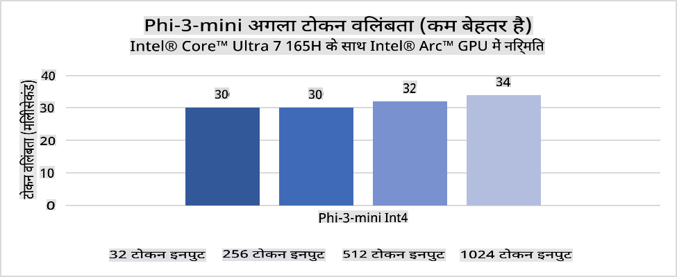
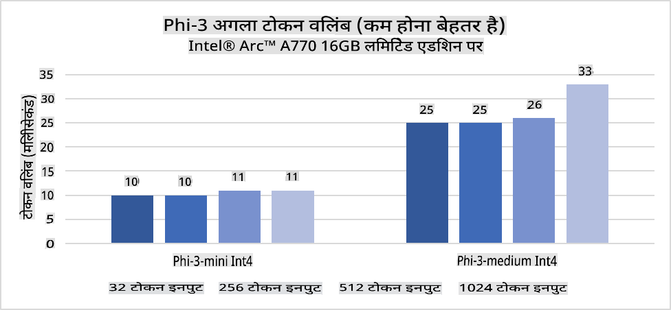
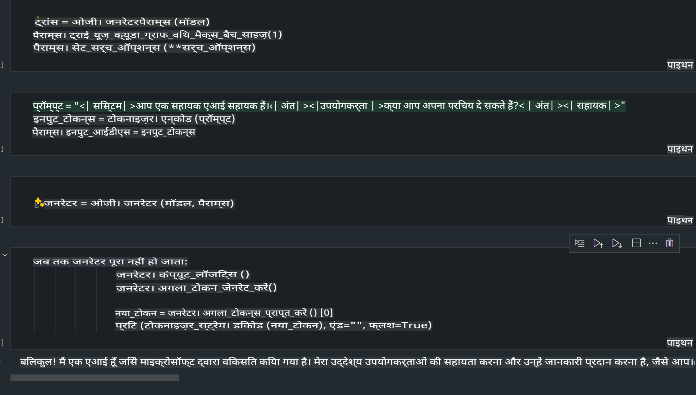
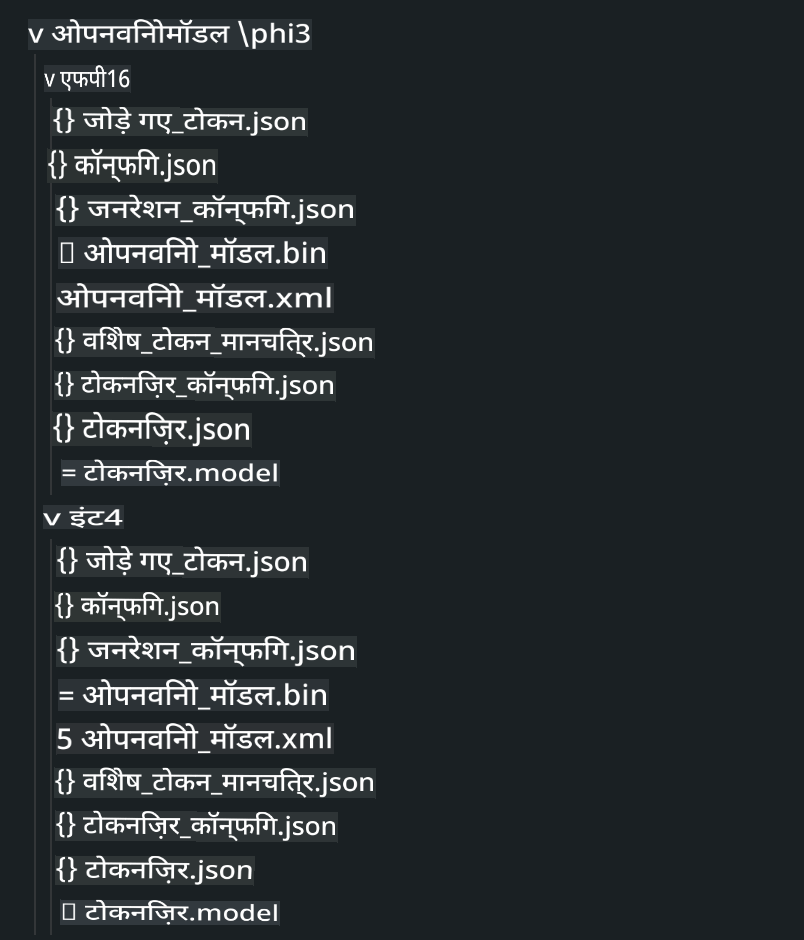
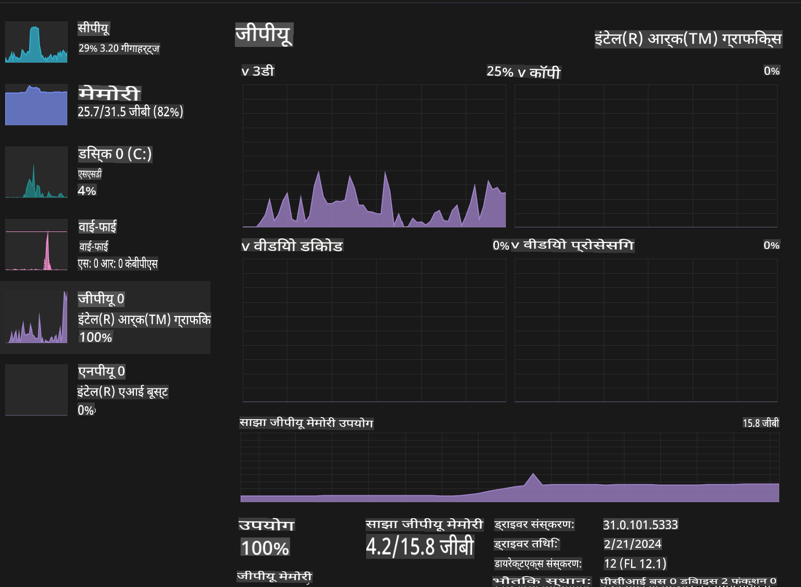

# **AI PC में Phi-3 मॉडल का इन्फरेंस**

जनरेटिव AI की प्रगति और एज डिवाइस हार्डवेयर क्षमताओं में सुधार के साथ, अब अधिक से अधिक जनरेटिव AI मॉडल को उपयोगकर्ताओं के "ब्रिंग योर ओन डिवाइस" (BYOD) डिवाइस में इंटीग्रेट किया जा सकता है। AI PCs इन्हीं मॉडलों में से एक हैं। 2024 से, Intel, AMD, और Qualcomm ने PC निर्माताओं के साथ मिलकर AI PCs पेश किए हैं, जो हार्डवेयर संशोधनों के माध्यम से लोकल जनरेटिव AI मॉडलों की तैनाती की सुविधा प्रदान करते हैं। इस चर्चा में, हम Intel AI PCs पर ध्यान केंद्रित करेंगे और देखेंगे कि Intel AI PC पर Phi-3 को कैसे तैनात किया जाए।

### NPU क्या है?

NPU (Neural Processing Unit) एक समर्पित प्रोसेसर या प्रोसेसिंग यूनिट है, जो बड़े SoC पर AI कार्यों और न्यूरल नेटवर्क ऑपरेशन्स को तेज़ करने के लिए विशेष रूप से डिज़ाइन की गई है। सामान्य CPU और GPU के विपरीत, NPUs डेटा-चालित समानांतर कंप्यूटिंग के लिए अनुकूलित होते हैं, जिससे वे वीडियो और इमेज जैसी बड़ी मल्टीमीडिया डेटा को प्रोसेस करने और न्यूरल नेटवर्क के लिए डेटा प्रोसेसिंग में अत्यधिक कुशल होते हैं। वे AI से संबंधित कार्यों, जैसे स्पीच रिकग्निशन, वीडियो कॉल्स में बैकग्राउंड ब्लरिंग, और फोटो या वीडियो एडिटिंग प्रक्रियाओं जैसे ऑब्जेक्ट डिटेक्शन को संभालने में विशेष रूप से सक्षम हैं।

## NPU बनाम GPU

हालांकि कई AI और मशीन लर्निंग वर्कलोड GPUs पर चलते हैं, GPUs और NPUs के बीच एक महत्वपूर्ण अंतर है।  
GPUs अपने समानांतर कंप्यूटिंग क्षमताओं के लिए जाने जाते हैं, लेकिन सभी GPUs ग्राफिक्स प्रोसेसिंग से परे समान रूप से कुशल नहीं होते। दूसरी ओर, NPUs न्यूरल नेटवर्क ऑपरेशन्स में शामिल जटिल गणनाओं के लिए विशेष रूप से बनाए गए हैं, जो उन्हें AI कार्यों के लिए अत्यधिक प्रभावी बनाते हैं।

सारांश में, NPUs गणितीय जीनियस हैं जो AI गणनाओं को तेज़ करते हैं, और वे AI PCs के उभरते युग में एक प्रमुख भूमिका निभाते हैं!

***यह उदाहरण Intel के नवीनतम Intel Core Ultra प्रोसेसर पर आधारित है।***

## **1. Phi-3 मॉडल चलाने के लिए NPU का उपयोग करें**

Intel® NPU डिवाइस एक AI इन्फरेंस एक्सेलेरेटर है जो Intel क्लाइंट CPUs के साथ इंटीग्रेट किया गया है, जो Intel® Core™ Ultra जेनरेशन (जिसे पहले Meteor Lake के नाम से जाना जाता था) से शुरू होता है। यह आर्टिफिशियल न्यूरल नेटवर्क कार्यों के ऊर्जा-कुशल निष्पादन को सक्षम बनाता है।





**Intel NPU एक्सेलेरेशन लाइब्रेरी**

Intel NPU एक्सेलेरेशन लाइब्रेरी [https://github.com/intel/intel-npu-acceleration-library](https://github.com/intel/intel-npu-acceleration-library) एक Python लाइब्रेरी है, जिसे Intel Neural Processing Unit (NPU) की शक्ति का उपयोग करके संगत हार्डवेयर पर उच्च गति की गणनाओं को करने के लिए आपके एप्लिकेशन की दक्षता बढ़ाने के लिए डिज़ाइन किया गया है।

Intel® Core™ Ultra प्रोसेसर द्वारा संचालित AI PC पर Phi-3-mini का उदाहरण।


पाइथन लाइब्रेरी को pip के साथ इंस्टॉल करें

```bash

   pip install intel-npu-acceleration-library

```

***ध्यान दें*** यह प्रोजेक्ट अभी विकासाधीन है, लेकिन रेफरेंस मॉडल पहले से ही बहुत पूर्ण है।

### **Intel NPU एक्सेलेरेशन लाइब्रेरी के साथ Phi-3 चलाना**

Intel NPU एक्सेलेरेशन का उपयोग करते समय, यह लाइब्रेरी पारंपरिक एनकोडिंग प्रक्रिया को प्रभावित नहीं करती है। आपको केवल इस लाइब्रेरी का उपयोग करके मूल Phi-3 मॉडल को क्वांटाइज़ करना होगा, जैसे FP16, INT8, INT4, आदि।

```python
from transformers import AutoTokenizer, pipeline,TextStreamer
from intel_npu_acceleration_library import NPUModelForCausalLM, int4
from intel_npu_acceleration_library.compiler import CompilerConfig
import warnings

model_id = "microsoft/Phi-3-mini-4k-instruct"

compiler_conf = CompilerConfig(dtype=int4)
model = NPUModelForCausalLM.from_pretrained(
    model_id, use_cache=True, config=compiler_conf, attn_implementation="sdpa"
).eval()

tokenizer = AutoTokenizer.from_pretrained(model_id)

text_streamer = TextStreamer(tokenizer, skip_prompt=True)
```

क्वांटाइज़ेशन सफल होने के बाद, NPU को कॉल करके Phi-3 मॉडल को चलाने के लिए निष्पादन जारी रखें।

```python
generation_args = {
   "max_new_tokens": 1024,
   "return_full_text": False,
   "temperature": 0.3,
   "do_sample": False,
   "streamer": text_streamer,
}

pipe = pipeline(
   "text-generation",
   model=model,
   tokenizer=tokenizer,
)

query = "<|system|>You are a helpful AI assistant.<|end|><|user|>Can you introduce yourself?<|end|><|assistant|>"

with warnings.catch_warnings():
    warnings.simplefilter("ignore")
    pipe(query, **generation_args)
```

कोड निष्पादित करते समय, हम टास्क मैनेजर के माध्यम से NPU की रनिंग स्थिति देख सकते हैं।


***उदाहरण*** : [AIPC_NPU_DEMO.ipynb](../../../../../code/03.Inference/AIPC/AIPC_NPU_DEMO.ipynb)

## **2. DirectML + ONNX Runtime का उपयोग करके Phi-3 मॉडल चलाएं**

### **DirectML क्या है**

[DirectML](https://github.com/microsoft/DirectML) एक उच्च-प्रदर्शन, हार्डवेयर-एक्सेलेरेटेड DirectX 12 लाइब्रेरी है, जो मशीन लर्निंग के लिए डिज़ाइन की गई है। DirectML सामान्य मशीन लर्निंग कार्यों के लिए GPU एक्सेलेरेशन प्रदान करता है और इसे AMD, Intel, NVIDIA, और Qualcomm जैसे विक्रेताओं के सभी DirectX 12-सक्षम GPUs पर सपोर्ट मिलता है।

जब स्टैंडअलोन उपयोग किया जाता है, DirectML API एक लो-लेवल DirectX 12 लाइब्रेरी है और इसे उच्च-प्रदर्शन, लो-लेटेंसी एप्लिकेशन जैसे फ्रेमवर्क, गेम्स और अन्य रियल-टाइम एप्लिकेशन के लिए उपयुक्त बनाया गया है। Direct3D 12 के साथ DirectML की सहज अंतःक्रियाशीलता, इसके कम ओवरहेड और हार्डवेयर के बीच सुसंगतता इसे मशीन लर्निंग को तेज़ करने के लिए आदर्श बनाती है, खासकर जब उच्च प्रदर्शन और हार्डवेयर के बीच परिणामों की विश्वसनीयता और पूर्वानुमेयता महत्वपूर्ण हो।

***ध्यान दें*** : नवीनतम DirectML पहले से ही NPU का समर्थन करता है (https://devblogs.microsoft.com/directx/introducing-neural-processor-unit-npu-support-in-directml-developer-preview/)

### DirectML और CUDA की क्षमताओं और प्रदर्शन की तुलना:

**DirectML** Microsoft द्वारा विकसित एक मशीन लर्निंग लाइब्रेरी है। यह Windows डिवाइसों, जैसे डेस्कटॉप, लैपटॉप, और एज डिवाइसों पर मशीन लर्निंग वर्कलोड को तेज़ करने के लिए डिज़ाइन की गई है।
- DX12-आधारित: DirectML DirectX 12 (DX12) पर आधारित है, जो NVIDIA और AMD दोनों GPUs सहित GPUs की एक विस्तृत श्रृंखला का समर्थन करता है।
- व्यापक समर्थन: DX12 का लाभ उठाने के कारण, DirectML किसी भी GPU के साथ काम कर सकता है जो DX12 को सपोर्ट करता है, यहां तक कि इंटीग्रेटेड GPUs भी।
- इमेज प्रोसेसिंग: DirectML इमेज और अन्य डेटा को न्यूरल नेटवर्क का उपयोग करके प्रोसेस करता है, जिससे यह इमेज रिकग्निशन, ऑब्जेक्ट डिटेक्शन, आदि कार्यों के लिए उपयुक्त बनता है।
- सेटअप में सरलता: DirectML को सेट करना आसान है और यह GPU निर्माताओं से विशिष्ट SDKs या लाइब्रेरीज़ की आवश्यकता नहीं करता।
- प्रदर्शन: कुछ मामलों में, DirectML अच्छा प्रदर्शन करता है और कुछ वर्कलोड्स के लिए CUDA से तेज़ हो सकता है।
- सीमाएं: हालांकि, कुछ मामलों में DirectML धीमा हो सकता है, विशेष रूप से float16 बड़े बैच साइज के लिए।

**CUDA** NVIDIA का समानांतर कंप्यूटिंग प्लेटफ़ॉर्म और प्रोग्रामिंग मॉडल है। यह डेवलपर्स को सामान्य-उद्देश्यीय कंप्यूटिंग के लिए NVIDIA GPUs की शक्ति का उपयोग करने की अनुमति देता है, जिसमें मशीन लर्निंग और वैज्ञानिक सिमुलेशन शामिल हैं।
- NVIDIA-विशिष्ट: CUDA NVIDIA GPUs के साथ सख्ती से इंटीग्रेटेड है और विशेष रूप से उनके लिए डिज़ाइन किया गया है।
- अत्यधिक अनुकूलित: यह GPU-एक्सेलेरेटेड कार्यों के लिए उत्कृष्ट प्रदर्शन प्रदान करता है, खासकर जब NVIDIA GPUs का उपयोग किया जाता है।
- व्यापक उपयोग: कई मशीन लर्निंग फ्रेमवर्क और लाइब्रेरीज़ (जैसे TensorFlow और PyTorch) में CUDA सपोर्ट है।
- अनुकूलन: डेवलपर्स विशिष्ट कार्यों के लिए CUDA सेटिंग्स को फाइन-ट्यून कर सकते हैं, जिससे इष्टतम प्रदर्शन प्राप्त किया जा सकता है।
- सीमाएं: हालांकि, CUDA की NVIDIA हार्डवेयर पर निर्भरता अन्य GPUs के बीच व्यापक संगतता को सीमित कर सकती है।

### DirectML और CUDA के बीच चयन

DirectML और CUDA के बीच चयन आपके विशिष्ट उपयोग मामले, हार्डवेयर उपलब्धता, और प्राथमिकताओं पर निर्भर करता है।  
यदि आप व्यापक संगतता और सेटअप में आसानी चाहते हैं, तो DirectML एक अच्छा विकल्प हो सकता है। हालांकि, यदि आपके पास NVIDIA GPUs हैं और आपको अत्यधिक अनुकूलित प्रदर्शन की आवश्यकता है, तो CUDA एक मजबूत विकल्प बना रहता है। संक्षेप में, DirectML और CUDA दोनों की अपनी ताकत और कमजोरियां हैं, इसलिए निर्णय लेते समय अपनी आवश्यकताओं और उपलब्ध हार्डवेयर पर विचार करें।

### **ONNX Runtime के साथ जनरेटिव AI**

AI के युग में, AI मॉडलों की पोर्टेबिलिटी बहुत महत्वपूर्ण है। ONNX Runtime प्रशिक्षित मॉडलों को आसानी से विभिन्न डिवाइसों पर तैनात कर सकता है। डेवलपर्स को इन्फरेंस फ्रेमवर्क पर ध्यान देने की आवश्यकता नहीं होती और वे एकीकृत API का उपयोग करके मॉडल इन्फरेंस पूरा कर सकते हैं। जनरेटिव AI के युग में, ONNX Runtime ने कोड ऑप्टिमाइज़ेशन (https://onnxruntime.ai/docs/genai/) भी किया है।  
ऑप्टिमाइज़्ड ONNX Runtime के माध्यम से, क्वांटाइज़्ड जनरेटिव AI मॉडल को विभिन्न टर्मिनलों पर इन्फरेंस किया जा सकता है। ONNX Runtime के साथ जनरेटिव AI में, आप Python, C#, C/C++ के माध्यम से AI मॉडल API का इन्फरेंस कर सकते हैं। बेशक, iPhone पर तैनाती C++ के जनरेटिव AI के साथ ONNX Runtime API का लाभ उठा सकती है।

[उदाहरण कोड](https://github.com/Azure-Samples/Phi-3MiniSamples/tree/main/onnx)

***ONNX Runtime लाइब्रेरी के साथ जनरेटिव AI को कम्पाइल करें***

```bash

winget install --id=Kitware.CMake  -e

git clone https://github.com/microsoft/onnxruntime.git

cd .\onnxruntime\

./build.bat --build_shared_lib --skip_tests --parallel --use_dml --config Release

cd ../

git clone https://github.com/microsoft/onnxruntime-genai.git

cd .\onnxruntime-genai\

mkdir ort

cd ort

mkdir include

mkdir lib

copy ..\onnxruntime\include\onnxruntime\core\providers\dml\dml_provider_factory.h ort\include

copy ..\onnxruntime\include\onnxruntime\core\session\onnxruntime_c_api.h ort\include

copy ..\onnxruntime\build\Windows\Release\Release\*.dll ort\lib

copy ..\onnxruntime\build\Windows\Release\Release\onnxruntime.lib ort\lib

python build.py --use_dml


```

**लाइब्रेरी इंस्टॉल करें**

```bash

pip install .\onnxruntime_genai_directml-0.3.0.dev0-cp310-cp310-win_amd64.whl

```

यह रनिंग परिणाम है



***उदाहरण*** : [AIPC_DirectML_DEMO.ipynb](../../../../../code/03.Inference/AIPC/AIPC_DirectML_DEMO.ipynb)

## **3. Intel OpenVINO का उपयोग करके Phi-3 मॉडल चलाएं**

### **OpenVINO क्या है**

[OpenVINO](https://github.com/openvinotoolkit/openvino) गहरे शिक्षण मॉडलों को अनुकूलित और तैनात करने के लिए एक ओपन-सोर्स टूलकिट है। यह TensorFlow, PyTorch, और अन्य जैसे लोकप्रिय फ्रेमवर्क से विज़न, ऑडियो, और भाषा मॉडलों के लिए गहन शिक्षण प्रदर्शन को बढ़ाता है। OpenVINO का उपयोग करके शुरू करें। OpenVINO का उपयोग CPU और GPU के साथ मिलकर Phi-3 मॉडल चलाने के लिए भी किया जा सकता है।

***ध्यान दें***: वर्तमान में, OpenVINO NPU का समर्थन नहीं करता है।

### **OpenVINO लाइब्रेरी इंस्टॉल करें**

```bash

 pip install git+https://github.com/huggingface/optimum-intel.git

 pip install git+https://github.com/openvinotoolkit/nncf.git

 pip install openvino-nightly

```

### **OpenVINO के साथ Phi-3 चलाना**

NPU की तरह, OpenVINO क्वांटाइज़्ड मॉडलों को चलाकर जनरेटिव AI मॉडलों को कॉल पूरा करता है। हमें पहले Phi-3 मॉडल को क्वांटाइज़ करना होगा और कमांड लाइन के माध्यम से optimum-cli का उपयोग करके मॉडल क्वांटाइज़ेशन पूरा करना होगा।

**INT4**

```bash

optimum-cli export openvino --model "microsoft/Phi-3-mini-4k-instruct" --task text-generation-with-past --weight-format int4 --group-size 128 --ratio 0.6  --sym  --trust-remote-code ./openvinomodel/phi3/int4

```

**FP16**

```bash

optimum-cli export openvino --model "microsoft/Phi-3-mini-4k-instruct" --task text-generation-with-past --weight-format fp16 --trust-remote-code ./openvinomodel/phi3/fp16

```

कनवर्टेड फॉर्मेट, इस प्रकार दिखता है:



OVModelForCausalLM के माध्यम से मॉडल पाथ्स (model_dir), संबंधित कॉन्फ़िगरेशन (ov_config = {"PERFORMANCE_HINT": "LATENCY", "NUM_STREAMS": "1", "CACHE_DIR": ""}), और हार्डवेयर-एक्सेलेरेटेड डिवाइस (GPU.0) लोड करें।

```python

ov_model = OVModelForCausalLM.from_pretrained(
     model_dir,
     device='GPU.0',
     ov_config=ov_config,
     config=AutoConfig.from_pretrained(model_dir, trust_remote_code=True),
     trust_remote_code=True,
)

```

कोड निष्पादित करते समय, हम टास्क मैनेजर के माध्यम से GPU की रनिंग स्थिति देख सकते हैं।



***उदाहरण*** : [AIPC_OpenVino_Demo.ipynb](../../../../../code/03.Inference/AIPC/AIPC_OpenVino_Demo.ipynb)

### ***ध्यान दें*** : ऊपर दिए गए तीनों तरीकों के अपने-अपने फायदे हैं, लेकिन AI PC इन्फरेंस के लिए NPU एक्सेलेरेशन का उपयोग करने की सिफारिश की जाती है।

**अस्वीकरण**:  
यह दस्तावेज़ मशीन-आधारित एआई अनुवाद सेवाओं का उपयोग करके अनुवादित किया गया है। जबकि हम सटीकता सुनिश्चित करने का प्रयास करते हैं, कृपया ध्यान दें कि स्वचालित अनुवाद में त्रुटियां या अशुद्धियां हो सकती हैं। मूल दस्तावेज़, जो इसकी मूल भाषा में है, को आधिकारिक स्रोत माना जाना चाहिए। महत्वपूर्ण जानकारी के लिए, पेशेवर मानव अनुवाद की सिफारिश की जाती है। इस अनुवाद के उपयोग से उत्पन्न किसी भी गलतफहमी या व्याख्या के लिए हम उत्तरदायी नहीं हैं।