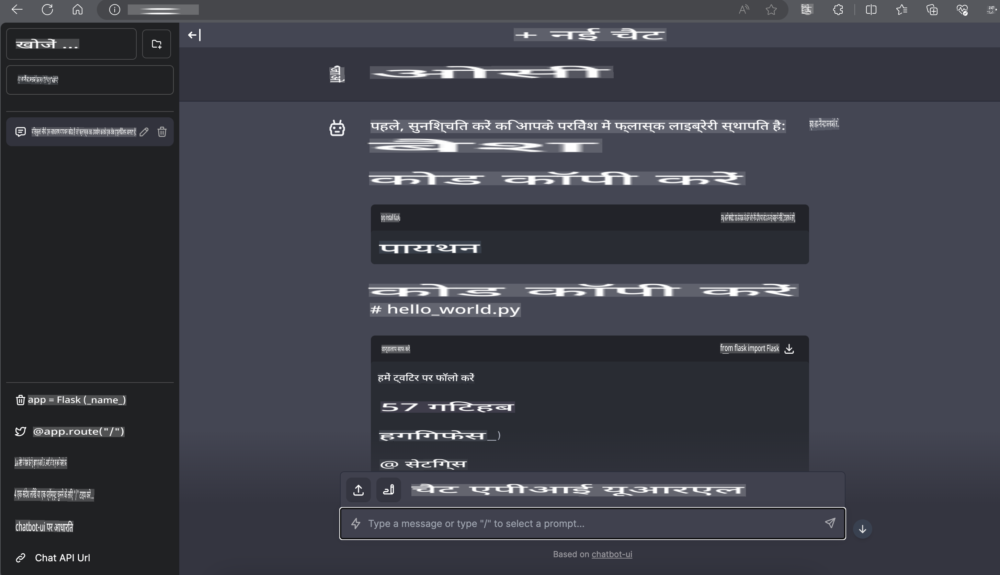

# **Nvidia Jetson में Phi-3 का इन्फरेंस**

Nvidia Jetson, Nvidia द्वारा निर्मित एम्बेडेड कंप्यूटिंग बोर्ड की एक श्रृंखला है। Jetson TK1, TX1 और TX2 मॉडल में Nvidia का Tegra प्रोसेसर (या SoC) होता है, जो एक ARM आर्किटेक्चर सेंट्रल प्रोसेसिंग यूनिट (CPU) को एकीकृत करता है। Jetson एक लो-पावर सिस्टम है और इसे मशीन लर्निंग एप्लिकेशन को तेज़ी से चलाने के लिए डिज़ाइन किया गया है। Nvidia Jetson का उपयोग पेशेवर डेवलपर्स द्वारा सभी उद्योगों में नई AI उत्पादों को बनाने के लिए किया जाता है, और छात्रों व उत्साही लोगों द्वारा व्यावहारिक AI सीखने और अद्भुत प्रोजेक्ट बनाने के लिए। SLM को Jetson जैसे एज डिवाइस में लागू किया जाता है, जो औद्योगिक जनरेटिव AI एप्लिकेशन परिदृश्यों के बेहतर कार्यान्वयन को सक्षम करेगा।

## NVIDIA Jetson पर डिप्लॉयमेंट:
स्वायत्त रोबोटिक्स और एम्बेडेड डिवाइसों पर काम करने वाले डेवलपर्स Phi-3 Mini का लाभ उठा सकते हैं। Phi-3 का अपेक्षाकृत छोटा आकार इसे एज डिप्लॉयमेंट के लिए आदर्श बनाता है। प्रशिक्षण के दौरान पैरामीटर को सावधानीपूर्वक ट्यून किया गया है, जो प्रतिक्रियाओं में उच्च सटीकता सुनिश्चित करता है।

### TensorRT-LLM ऑप्टिमाइज़ेशन:
NVIDIA की [TensorRT-LLM लाइब्रेरी](https://github.com/NVIDIA/TensorRT-LLM?WT.mc_id=aiml-138114-kinfeylo) बड़े भाषा मॉडल के इन्फरेंस को ऑप्टिमाइज़ करती है। यह Phi-3 Mini की लंबी संदर्भ विंडो का समर्थन करती है, जिससे थ्रूपुट और लेटेंसी दोनों में सुधार होता है। ऑप्टिमाइज़ेशन में LongRoPE, FP8, और इनफ्लाइट बैचिंग जैसी तकनीकें शामिल हैं।

### उपलब्धता और डिप्लॉयमेंट:
डेवलपर्स [NVIDIA के AI](https://www.nvidia.com/en-us/ai-data-science/generative-ai/) पर 128K संदर्भ विंडो के साथ Phi-3 Mini का पता लगा सकते हैं। इसे NVIDIA NIM के रूप में पैकेज किया गया है, जो एक मानक API के साथ एक माइक्रोसर्विस है जिसे कहीं भी डिप्लॉय किया जा सकता है। इसके अतिरिक्त, [GitHub पर TensorRT-LLM इम्प्लीमेंटेशन](https://github.com/NVIDIA/TensorRT-LLM) उपलब्ध हैं।

## **1. तैयारी**

a. Jetson Orin NX / Jetson NX

b. JetPack 5.1.2+

c. Cuda 11.8

d. Python 3.8+

## **2. Jetson में Phi-3 चलाना**

हम [Ollama](https://ollama.com) या [LlamaEdge](https://llamaedge.com) चुन सकते हैं।

यदि आप क्लाउड और एज डिवाइस दोनों पर gguf का उपयोग करना चाहते हैं, तो LlamaEdge को WasmEdge के रूप में समझा जा सकता है (WasmEdge एक हल्का, उच्च-प्रदर्शन, स्केलेबल WebAssembly रनटाइम है जो क्लाउड नेटिव, एज और विकेंद्रीकृत एप्लिकेशन के लिए उपयुक्त है। यह सर्वरलेस एप्लिकेशन, एम्बेडेड फंक्शन्स, माइक्रोसर्विसेज, स्मार्ट कॉन्ट्रैक्ट्स और IoT डिवाइसों का समर्थन करता है। आप LlamaEdge के माध्यम से gguf के क्वांटिटेटिव मॉडल को एज डिवाइस और क्लाउड पर डिप्लॉय कर सकते हैं।)


यहां उपयोग करने के चरण दिए गए हैं:

1. संबंधित लाइब्रेरी और फाइलें इंस्टॉल और डाउनलोड करें

```bash

curl -sSf https://raw.githubusercontent.com/WasmEdge/WasmEdge/master/utils/install.sh | bash -s -- --plugin wasi_nn-ggml

curl -LO https://github.com/LlamaEdge/LlamaEdge/releases/latest/download/llama-api-server.wasm

curl -LO https://github.com/LlamaEdge/chatbot-ui/releases/latest/download/chatbot-ui.tar.gz

tar xzf chatbot-ui.tar.gz

```

**नोट**: llama-api-server.wasm और chatbot-ui को एक ही डायरेक्टरी में होना चाहिए।

2. टर्मिनल में स्क्रिप्ट्स चलाएं

```bash

wasmedge --dir .:. --nn-preload default:GGML:AUTO:{Your gguf path} llama-api-server.wasm -p phi-3-chat

```

यहां रनिंग का परिणाम है:



***सैंपल कोड*** [Phi-3 Mini WASM Notebook Sample](https://github.com/Azure-Samples/Phi-3MiniSamples/tree/main/wasm)

सारांश में, Phi-3 Mini भाषा मॉडलिंग में एक बड़ा कदम है, जो दक्षता, संदर्भ जागरूकता और NVIDIA की ऑप्टिमाइज़ेशन क्षमता को जोड़ता है। चाहे आप रोबोट्स बना रहे हों या एज एप्लिकेशन, Phi-3 Mini एक शक्तिशाली टूल है जिसे आपको जानना चाहिए।

**अस्वीकरण**:  
यह दस्तावेज़ मशीन-आधारित एआई अनुवाद सेवाओं का उपयोग करके अनुवादित किया गया है। जबकि हम सटीकता के लिए प्रयासरत हैं, कृपया ध्यान दें कि स्वचालित अनुवादों में त्रुटियां या गलतियां हो सकती हैं। मूल दस्तावेज़ को उसकी मूल भाषा में प्रामाणिक स्रोत माना जाना चाहिए। महत्वपूर्ण जानकारी के लिए, पेशेवर मानव अनुवाद की सिफारिश की जाती है। इस अनुवाद के उपयोग से उत्पन्न किसी भी गलतफहमी या गलत व्याख्या के लिए हम जिम्मेदार नहीं हैं।